# BEFORE STARTING

Please do not use this software without informing @KiranLDA

# OVERVIEW AND BACKGROUND

Understanding group decision-making in mobile species is a complex challenge. The integration of both GPS and acoustic sensors into tags deployed on multiple individuals in groups can help us systematically quantify communication between individuals as well as their movement responses - based on who is calling, the context of the call, and how the group reacts. However, the resulting datasets are very large, and the manual identification and classification of calls is both time and labor consuming. 


This code interfaces with a supervised machine learning tool for detecting call presence and/or call type in field recordings. We train a convolutional neural network to extract features from spectrograms. Bidirectional gated recurrent units learned temporal structure from these features, and a final feed-forward network predicted call type. We also used data augmentation to increase the number of training examples for underrepresented call types. We illustrate the method on bio-logging data from meerkat groups, where all individuals in the group were equipped with acoustic loggers. 

# START CODING

The parameter {is_forked} below is used to determine whether or not the model produces only a calltype classification (when False) or a calltype and a call presence classification (when True).


```python
is_forked = True
```

## IMPORT LIBRARIES


```python
github_dir = "/home/kiran/Documents/github/CCAS_ML"

# add path to local functions
import os
os.chdir(github_dir)

# import all the params for this model
from example_params import *

# import own functions
import preprocess.preprocess_functions as pre
import postprocess.evaluation_metrics_functions as metrics
import postprocess.merge_predictions_functions as ppm
import model.specgen_batch_generator as bg
import model.network_class as rnn
# import postprocess.visualise_prediction_functions as pp
from model.callback_functions import LossHistory
import model.audiopool as audiopool

# import normal packages used in pre-processing
import numpy as np
import librosa
import warnings
import ntpath
import os
from itertools import compress  
from random import random, shuffle
from math import floor
import statistics
import glob

# plotting
import matplotlib.pyplot as plt

# ML section packages
import datetime
from keras.callbacks import EarlyStopping, ReduceLROnPlateau
from keras import optimizers
from keras.layers import Input, Flatten
from keras.models import Model
from keras.layers import Conv2D, MaxPooling2D, Activation, SeparableConv2D, concatenate
from keras.layers import Reshape, Permute
from keras.layers import TimeDistributed, Dense, Dropout, BatchNormalization
from keras.models import load_model
from keras.layers import GRU, Bidirectional, GlobalAveragePooling2D
from keras.callbacks import TensorBoard

# postprocessfrom decimal import Decimal
from decimal import Decimal
import pandas as pd
import pickle

# evaluate and plot 
import seaborn as sn
# import pandas as pd
# import matplotlib.pyplot as plt
from matplotlib.colors import LogNorm
import csv

```

----------------------------------------------------------------------
# PREPROCESSING / DATA WRANGLING

Currently, all the meerkat files are found on the server. The labels in particular are divided by year (currently 2017 and 2019) and all file labels are in a single document. This bit of code just takes these and puts them together


```python
# Compile all the synched label files together
labels_all = pd.DataFrame()
for directory in label_dirs:
    for group in group_IDs:
        temp = pd.read_csv(os.path.join(directory, group +"_ALL_CALLS_SYNCHED.csv"), sep=sep,
                       header=0, engine = engine, encoding = encoding) 
        temp["group"] = group
        labels_all = pd.concat([labels_all, temp]) 
        del temp

labels_all = labels_all[-labels_all.wavFileName.str.contains('SOUNDFOC')]
labels_all = labels_all.reset_index(drop = True)
```

## Look at summary data to understand meerkats


```python
labels_all.groupby(['ind','group']).size().reset_index().rename(columns={0:'count'})
```


<div>
<style scoped>
    .dataframe tbody tr th:only-of-type {
        vertical-align: middle;
    }

    .dataframe tbody tr th {
        vertical-align: top;
    }

    .dataframe thead th {
        text-align: right;
    }
</style>
<table border="1" class="dataframe">
  <thead>
    <tr style="text-align: right;">
      <th></th>
      <th>ind</th>
      <th>group</th>
      <th>count</th>
    </tr>
  </thead>
  <tbody>
    <tr>
      <th>0</th>
      <td>VCVM001</td>
      <td>HM2017</td>
      <td>1518</td>
    </tr>
    <tr>
      <th>1</th>
      <td>VHMF001</td>
      <td>HM2017</td>
      <td>3296</td>
    </tr>
    <tr>
      <th>2</th>
      <td>VHMF001</td>
      <td>HM2019</td>
      <td>5735</td>
    </tr>
    <tr>
      <th>3</th>
      <td>VHMF015</td>
      <td>HM2019</td>
      <td>5841</td>
    </tr>
    <tr>
      <th>4</th>
      <td>VHMF019</td>
      <td>HM2019</td>
      <td>2404</td>
    </tr>
    <tr>
      <th>5</th>
      <td>VHMF022</td>
      <td>HM2019</td>
      <td>2373</td>
    </tr>
    <tr>
      <th>6</th>
      <td>VHMF029</td>
      <td>HM2019</td>
      <td>749</td>
    </tr>
    <tr>
      <th>7</th>
      <td>VHMF030</td>
      <td>HM2019</td>
      <td>9744</td>
    </tr>
    <tr>
      <th>8</th>
      <td>VHMM002</td>
      <td>HM2017</td>
      <td>2426</td>
    </tr>
    <tr>
      <th>9</th>
      <td>VHMM003</td>
      <td>HM2017</td>
      <td>333</td>
    </tr>
    <tr>
      <th>10</th>
      <td>VHMM006</td>
      <td>HM2017</td>
      <td>2713</td>
    </tr>
    <tr>
      <th>11</th>
      <td>VHMM007</td>
      <td>HM2017</td>
      <td>5821</td>
    </tr>
    <tr>
      <th>12</th>
      <td>VHMM007</td>
      <td>HM2019</td>
      <td>3071</td>
    </tr>
    <tr>
      <th>13</th>
      <td>VHMM008</td>
      <td>HM2019</td>
      <td>2182</td>
    </tr>
    <tr>
      <th>14</th>
      <td>VHMM014</td>
      <td>HM2019</td>
      <td>2112</td>
    </tr>
    <tr>
      <th>15</th>
      <td>VHMM016</td>
      <td>HM2019</td>
      <td>2520</td>
    </tr>
    <tr>
      <th>16</th>
      <td>VHMM017</td>
      <td>HM2019</td>
      <td>3634</td>
    </tr>
    <tr>
      <th>17</th>
      <td>VHMM021</td>
      <td>HM2019</td>
      <td>2432</td>
    </tr>
    <tr>
      <th>18</th>
      <td>VHMM023</td>
      <td>HM2019</td>
      <td>2880</td>
    </tr>
    <tr>
      <th>19</th>
      <td>VHMM032</td>
      <td>HM2019</td>
      <td>9651</td>
    </tr>
    <tr>
      <th>20</th>
      <td>VLF235</td>
      <td>L2019</td>
      <td>2424</td>
    </tr>
    <tr>
      <th>21</th>
      <td>VLF241</td>
      <td>L2019</td>
      <td>999</td>
    </tr>
    <tr>
      <th>22</th>
      <td>VLF244</td>
      <td>L2019</td>
      <td>2132</td>
    </tr>
    <tr>
      <th>23</th>
      <td>VLF246</td>
      <td>L2019</td>
      <td>2867</td>
    </tr>
    <tr>
      <th>24</th>
      <td>VLM234</td>
      <td>L2019</td>
      <td>4703</td>
    </tr>
    <tr>
      <th>25</th>
      <td>VLM239</td>
      <td>L2019</td>
      <td>842</td>
    </tr>
    <tr>
      <th>26</th>
      <td>VLM245</td>
      <td>L2019</td>
      <td>1791</td>
    </tr>
    <tr>
      <th>27</th>
      <td>VLM248</td>
      <td>L2019</td>
      <td>2657</td>
    </tr>
  </tbody>
</table>
</div>


```python
labels_all.groupby(['ind','group', 'date']).size().reset_index().rename(columns={0:'count'})
```


<div>
<style scoped>
    .dataframe tbody tr th:only-of-type {
        vertical-align: middle;
    }

    .dataframe tbody tr th {
        vertical-align: top;
    }

    .dataframe thead th {
        text-align: right;
    }
</style>
<table border="1" class="dataframe">
  <thead>
    <tr style="text-align: right;">
      <th></th>
      <th>ind</th>
      <th>group</th>
      <th>date</th>
      <th>count</th>
    </tr>
  </thead>
  <tbody>
    <tr>
      <th>0</th>
      <td>VCVM001</td>
      <td>HM2017</td>
      <td>20170806</td>
      <td>194</td>
    </tr>
    <tr>
      <th>1</th>
      <td>VCVM001</td>
      <td>HM2017</td>
      <td>20170823</td>
      <td>219</td>
    </tr>
    <tr>
      <th>2</th>
      <td>VCVM001</td>
      <td>HM2017</td>
      <td>20170824</td>
      <td>207</td>
    </tr>
    <tr>
      <th>3</th>
      <td>VCVM001</td>
      <td>HM2017</td>
      <td>20170825</td>
      <td>224</td>
    </tr>
    <tr>
      <th>4</th>
      <td>VCVM001</td>
      <td>HM2017</td>
      <td>20170903</td>
      <td>376</td>
    </tr>
    <tr>
      <th>...</th>
      <td>...</td>
      <td>...</td>
      <td>...</td>
      <td>...</td>
    </tr>
    <tr>
      <th>162</th>
      <td>VLM248</td>
      <td>L2019</td>
      <td>20190805</td>
      <td>385</td>
    </tr>
    <tr>
      <th>163</th>
      <td>VLM248</td>
      <td>L2019</td>
      <td>20190806</td>
      <td>426</td>
    </tr>
    <tr>
      <th>164</th>
      <td>VLM248</td>
      <td>L2019</td>
      <td>20190807</td>
      <td>1129</td>
    </tr>
    <tr>
      <th>165</th>
      <td>VLM248</td>
      <td>L2019</td>
      <td>20190808</td>
      <td>287</td>
    </tr>
    <tr>
      <th>166</th>
      <td>VLM248</td>
      <td>L2019</td>
      <td>20190809</td>
      <td>430</td>
    </tr>
  </tbody>
</table>
<p>167 rows × 4 columns</p>
</div>


```python
labels_all.groupby(['ind', 'date']).size().reset_index().rename(columns={0:'count'})
```


<div>
<style scoped>
    .dataframe tbody tr th:only-of-type {
        vertical-align: middle;
    }

    .dataframe tbody tr th {
        vertical-align: top;
    }

    .dataframe thead th {
        text-align: right;
    }
</style>
<table border="1" class="dataframe">
  <thead>
    <tr style="text-align: right;">
      <th></th>
      <th>ind</th>
      <th>date</th>
      <th>count</th>
    </tr>
  </thead>
  <tbody>
    <tr>
      <th>0</th>
      <td>VCVM001</td>
      <td>20170806</td>
      <td>194</td>
    </tr>
    <tr>
      <th>1</th>
      <td>VCVM001</td>
      <td>20170823</td>
      <td>219</td>
    </tr>
    <tr>
      <th>2</th>
      <td>VCVM001</td>
      <td>20170824</td>
      <td>207</td>
    </tr>
    <tr>
      <th>3</th>
      <td>VCVM001</td>
      <td>20170825</td>
      <td>224</td>
    </tr>
    <tr>
      <th>4</th>
      <td>VCVM001</td>
      <td>20170903</td>
      <td>376</td>
    </tr>
    <tr>
      <th>...</th>
      <td>...</td>
      <td>...</td>
      <td>...</td>
    </tr>
    <tr>
      <th>162</th>
      <td>VLM248</td>
      <td>20190805</td>
      <td>385</td>
    </tr>
    <tr>
      <th>163</th>
      <td>VLM248</td>
      <td>20190806</td>
      <td>426</td>
    </tr>
    <tr>
      <th>164</th>
      <td>VLM248</td>
      <td>20190807</td>
      <td>1129</td>
    </tr>
    <tr>
      <th>165</th>
      <td>VLM248</td>
      <td>20190808</td>
      <td>287</td>
    </tr>
    <tr>
      <th>166</th>
      <td>VLM248</td>
      <td>20190809</td>
      <td>430</td>
    </tr>
  </tbody>
</table>
<p>167 rows × 3 columns</p>
</div>


Data also contain focal follows (someone walking around behind the meerkats) and the resultion of this data is different and therefore not anlysed with the collar data


```python
# subset all the audio files that we should use in the analysis (i.e. not focal follow data)
audio_files = list(set(labels_all["wavFileName"]))
audio_filenames = list(compress(audio_files, ["SOUNDFOC" not in filei for filei in audio_files]))

# subset all the audio files that we should use in the analysis (i.e. not focal follow data)
label_files = list(set(labels_all["csvFileName"]))
label_filenames = list(compress(label_files, ["SOUNDFOC" not in filei for filei in label_files]))

# get the file IDS without all the extentions (used later for naming)
all_filenames = [audio_filenames[i].split(".")[0] for i in range(0,len(audio_filenames))]
```

Then we locate all the paths to the files


```python
# find all the labels
EXT = "*.csv"
label_filepaths = []
for PATH in acoustic_data_path :
      label_filepaths.extend( [file for path, subdir, files in os.walk(PATH) for file in glob.glob(os.path.join(path, EXT))])
EXT = "*.CSV"
for PATH in acoustic_data_path :
      label_filepaths.extend( [file for path, subdir, files in os.walk(PATH) for file in glob.glob(os.path.join(path, EXT))])

# find all audio paths (will be longer than label path as not everything is labelled)
audio_filepaths = []
EXT = "*.wav"
for PATH in audio_dirs:
      audio_filepaths.extend( [file for path, subdir, files in os.walk(PATH) for file in glob.glob(os.path.join(path, EXT))])
```

### Create a label table

Currently, the labels are stored in a file generated by audition for the meerkats. We want to these manual labels and put them into a more meaningful categories for for the machine learning. To set categories, I use a pre-defined dictionary called call_types that is defined in the parameters file and which specifies what the different classes are for the call types. Anything strange gets put into a category "oth" for other.


```python
# Create the label table
label_table = pre.create_meerkat_table(labels_all, call_types, sep,
                                       start_column, duration_column, columns_to_keep,
                                       label_column, convert_to_seconds, 
                                       label_for_other, label_for_noise, engine,
                                       multiclass_forbidden)
```

    This label 'c' on line 5909 will be classed as 'oth'
    This label 'c' on line 7266 will be classed as 'oth'
    This label 'cn' on line 7921 will be classed as 'oth'
    This label 'chew' on line 8385 will be classed as 'oth'
    This label 'sb' on line 8504 will be classed as 'oth'
    This label 'chew' on line 8782 will be classed as 'oth'
    This label 'chew' on line 8862 will be classed as 'oth'
    This label 'chew' on line 8886 will be classed as 'oth'
    This label 'chew' on line 8887 will be classed as 'oth'
    This label 'chew' on line 8890 will be classed as 'oth'
    This label 'chew' on line 8914 will be classed as 'oth'
    This label 'chew' on line 8933 will be classed as 'oth'
    This label 'chew' on line 8962 will be classed as 'oth'
    This label 'chew' on line 9008 will be classed as 'oth'
    This label 'chew' on line 9011 will be classed as 'oth'
    This label 'chew' on line 9045 will be classed as 'oth'
    This label 'chew' on line 9046 will be classed as 'oth'
    This label 'chew' on line 9243 will be classed as 'oth'
    This label 'chew' on line 9249 will be classed as 'oth'
    This label 'chew' on line 9268 will be classed as 'oth'
    This label 'chew' on line 9697 will be classed as 'oth'
    This label 'chew' on line 9842 will be classed as 'oth'
    This label 'chew' on line 9861 will be classed as 'oth'
    This label 'chew' on line 10115 will be classed as 'oth'
    This label 'chew' on line 10139 will be classed as 'oth'
    This label 'chew' on line 10141 will be classed as 'oth'
    This label '01:48:00' on line 11666 will be classed as 'oth'
    This label 'c' on line 13384 will be classed as 'oth'
    This label 'nan' on line 13961 will be classed as 'oth'
    This label 'sx' on line 18196 will be classed as 'oth'
    This label 'pause' on line 18848 will be classed as 'oth'
    This label 'sc f' on line 19787 will be classed as 'oth'
    This label 'eating' on line 20297 will be classed as 'oth'
    This label 'eating' on line 20298 will be classed as 'oth'
    This label 'eating' on line 20312 will be classed as 'oth'
    This label 'eating' on line 20330 will be classed as 'oth'
    This label 'x' on line 20426 will be classed as 'oth'
    This label 'x' on line 20509 will be classed as 'oth'
    This label 'x' on line 21496 will be classed as 'oth'
    This label 'eating' on line 21500 will be classed as 'oth'
    This label 'eating' on line 21507 will be classed as 'oth'
    This label 'x' on line 21510 will be classed as 'oth'
    This label 'x' on line 21541 will be classed as 'oth'
    This label 'c nf' on line 22004 will be classed as 'oth'
    This label 'x' on line 22292 will be classed as 'oth'
    This label 'x' on line 22294 will be classed as 'oth'
    This label 'x' on line 22297 will be classed as 'oth'
    This label 'x' on line 22311 will be classed as 'oth'
    This label 'x nf' on line 22318 will be classed as 'oth'
    This label 'x' on line 22323 will be classed as 'oth'
    This label 'x' on line 22331 will be classed as 'oth'
    This label 'x nf' on line 22340 will be classed as 'oth'
    This label 'x nf' on line 22356 will be classed as 'oth'
    This label 'x' on line 22362 will be classed as 'oth'
    This label 'x' on line 22381 will be classed as 'oth'
    This label 'x nf' on line 22385 will be classed as 'oth'
    This label 'x nf' on line 22405 will be classed as 'oth'
    This label 'x nf' on line 22436 will be classed as 'oth'
    This label 'x' on line 22438 will be classed as 'oth'
    This label 'x nf' on line 22445 will be classed as 'oth'
    This label 'x nf' on line 22448 will be classed as 'oth'
    This label '01:25:30' on line 22510 will be classed as 'oth'
    This label 'na' on line 23324 will be classed as 'oth'
    This label 'na' on line 23331 will be classed as 'oth'
    This label 'na' on line 23344 will be classed as 'oth'
    This label 'na' on line 23353 will be classed as 'oth'
    This label 'na' on line 23551 will be classed as 'oth'
    This label 'na' on line 23553 will be classed as 'oth'
    This label 'na' on line 23561 will be classed as 'oth'
    This label 'na' on line 23626 will be classed as 'oth'
    This label 'na' on line 23632 will be classed as 'oth'
    This label 'na' on line 23674 will be classed as 'oth'
    This label 'na' on line 23755 will be classed as 'oth'
    This label 'na' on line 23821 will be classed as 'oth'
    This label 'na' on line 23856 will be classed as 'oth'
    This label 'na' on line 23877 will be classed as 'oth'
    This label 'x' on line 24344 will be classed as 'oth'
    This label 'x' on line 24386 will be classed as 'oth'
    This label 'x' on line 24664 will be classed as 'oth'
    This label 'x' on line 24693 will be classed as 'oth'
    This label 'x' on line 24709 will be classed as 'oth'
    This label 'x' on line 24710 will be classed as 'oth'
    This label 'x' on line 24712 will be classed as 'oth'
    This label 'x' on line 24754 will be classed as 'oth'
    This label 'x' on line 24770 will be classed as 'oth'
    This label 'x' on line 24771 will be classed as 'oth'
    This label 'x' on line 24813 will be classed as 'oth'
    This label 'x' on line 24840 will be classed as 'oth'
    This label 'x' on line 24841 will be classed as 'oth'
    This label 'x' on line 24842 will be classed as 'oth'
    This label 'x' on line 24907 will be classed as 'oth'
    This label 'x' on line 24908 will be classed as 'oth'
    This label 'x' on line 27182 will be classed as 'oth'
    This label 'x' on line 27396 will be classed as 'oth'
    This label 'x' on line 27457 will be classed as 'oth'
    This label 'x' on line 27568 will be classed as 'oth'
    This label 'x' on line 27580 will be classed as 'oth'
    This label 'x' on line 29274 will be classed as 'oth'
    This label 'x' on line 29531 will be classed as 'oth'
    This label 'x' on line 29688 will be classed as 'oth'
    This label 'x' on line 29690 will be classed as 'oth'
    This label 'c nf' on line 29839 will be classed as 'oth'
    This label 'x' on line 30166 will be classed as 'oth'
    This label 's%' on line 32036 will be classed as 'oth'
    This label 'chuck' on line 32167 will be classed as 'oth'
    This label 'x' on line 32340 will be classed as 'oth'
    This label 'x' on line 32407 will be classed as 'oth'
    This label 'synh 01:30:00' on line 32910 will be classed as 'oth'
    This label 'sych 01:51:00' on line 33314 will be classed as 'oth'
    This label 'x' on line 34057 will be classed as 'oth'
    This label 'digging' on line 34282 will be classed as 'oth'
    This label 'digging' on line 34285 will be classed as 'oth'
    This label 'chew' on line 34373 will be classed as 'oth'
    This label 'chew' on line 34374 will be classed as 'oth'
    This label 'chew' on line 34375 will be classed as 'oth'
    This label 'x' on line 34592 will be classed as 'oth'
    This label 'x' on line 34622 will be classed as 'oth'
    This label 'x' on line 34665 will be classed as 'oth'
    This label 'x' on line 34753 will be classed as 'oth'
    This label 'x' on line 34836 will be classed as 'oth'
    This label 'x' on line 34951 will be classed as 'oth'
    This label '//' on line 35075 will be classed as 'oth'
    This label 'x' on line 36573 will be classed as 'oth'
    This label 'x' on line 37322 will be classed as 'oth'
    This label 'x' on line 38818 will be classed as 'oth'
    This label 'sycnh 01:54:00' on line 40080 will be classed as 'oth'
    This label 'aynxh 01:28:30' on line 40931 will be classed as 'oth'
    This label 'x' on line 41786 will be classed as 'oth'
    This label 'x' on line 44978 will be classed as 'oth'
    This label 'x' on line 45052 will be classed as 'oth'
    This label 'x' on line 45095 will be classed as 'oth'
    This label 'x' on line 45109 will be classed as 'oth'
    This label 'x' on line 45135 will be classed as 'oth'
    This label 'x' on line 45474 will be classed as 'oth'
    This label 'x' on line 45758 will be classed as 'oth'
    This label 'x' on line 46865 will be classed as 'oth'
    This label 'x' on line 47160 will be classed as 'oth'
    This label 'x' on line 47324 will be classed as 'oth'
    This label 'x' on line 48199 will be classed as 'oth'
    This label 'ññ' on line 48424 will be classed as 'oth'
    This label 'ññ x' on line 48490 will be classed as 'oth'
    This label 'בב' on line 48615 will be classed as 'oth'
    This label 'x' on line 49340 will be classed as 'oth'
    This label 'x' on line 49664 will be classed as 'oth'
    This label 'x' on line 49745 will be classed as 'oth'
    This label 'x' on line 49887 will be classed as 'oth'
    This label 'x' on line 49888 will be classed as 'oth'
    This label 'x' on line 49889 will be classed as 'oth'
    This label 'x' on line 49890 will be classed as 'oth'
    This label 'x' on line 49891 will be classed as 'oth'
    This label 'x' on line 50849 will be classed as 'oth'
    This label 'x' on line 52248 will be classed as 'oth'
    This label 'x' on line 52382 will be classed as 'oth'
    This label 'x' on line 52419 will be classed as 'oth'
    This label 'eating' on line 52620 will be classed as 'oth'
    This label 'x' on line 52896 will be classed as 'oth'
    This label 'x' on line 52984 will be classed as 'oth'
    This label 'x' on line 53082 will be classed as 'oth'
    This label 'x' on line 55858 will be classed as 'oth'
    This label 'x' on line 56061 will be classed as 'oth'
    This label 'x' on line 56162 will be classed as 'oth'
    This label 'eating' on line 56190 will be classed as 'oth'
    This label 'x' on line 56385 will be classed as 'oth'
    This label 'x' on line 57233 will be classed as 'oth'
    This label 'x' on line 57814 will be classed as 'oth'
    This label 'x' on line 57886 will be classed as 'oth'
    This label 'x' on line 58020 will be classed as 'oth'
    This label 'm nf' on line 58263 will be classed as 'oth'
    This label 'x' on line 58372 will be classed as 'oth'
    This label 'sc x nf' on line 58510 will be classed as 'oth'
    This label 'x' on line 58736 will be classed as 'oth'
    This label 'x' on line 58812 will be classed as 'oth'
    This label 'x' on line 59226 will be classed as 'oth'
    This label 'x' on line 59634 will be classed as 'oth'
    This label 'x' on line 59762 will be classed as 'oth'
    This label 'x' on line 59879 will be classed as 'oth'
    This label 'x' on line 60509 will be classed as 'oth'
    This label 'x' on line 60626 will be classed as 'oth'
    This label 'x' on line 62005 will be classed as 'oth'
    This label 'x' on line 62584 will be classed as 'oth'
    This label 'x' on line 62686 will be classed as 'oth'
    This label 'x' on line 64059 will be classed as 'oth'
    This label 'x' on line 64060 will be classed as 'oth'
    This label 'x' on line 64510 will be classed as 'oth'
    This label 'x' on line 66199 will be classed as 'oth'
    This label 'x' on line 67409 will be classed as 'oth'
    This label 'eating' on line 67465 will be classed as 'oth'
    This label 'eating' on line 67469 will be classed as 'oth'
    This label 'eating' on line 67571 will be classed as 'oth'
    This label 'x' on line 67768 will be classed as 'oth'
    This label 'eating' on line 67786 will be classed as 'oth'
    This label 'x' on line 69049 will be classed as 'oth'
    This label 'x' on line 70355 will be classed as 'oth'
    This label 'x' on line 70434 will be classed as 'oth'
    This label 'x' on line 70466 will be classed as 'oth'
    This label 'x' on line 71220 will be classed as 'oth'
    This label 'ññ' on line 71488 will be classed as 'oth'
    This label 'x' on line 71884 will be classed as 'oth'
    This label 'x' on line 71885 will be classed as 'oth'
    This label 'sycnh 01:36:00' on line 71940 will be classed as 'oth'
    This label 'ññ nf' on line 72092 will be classed as 'oth'
    This label 'ññ nf' on line 72093 will be classed as 'oth'
    This label 'x' on line 72798 will be classed as 'oth'
    This label 'beg nf' on line 72839 will be classed as 'oth'
    This label 'beg nf' on line 72840 will be classed as 'oth'
    This label 'beg nf' on line 72841 will be classed as 'oth'
    This label 'beg nf' on line 72842 will be classed as 'oth'
    This label 'beg nf' on line 72843 will be classed as 'oth'
    This label 'beg nf' on line 72844 will be classed as 'oth'
    This label 'beg nf' on line 72845 will be classed as 'oth'
    This label 'x' on line 73059 will be classed as 'oth'
    This label 'x' on line 73090 will be classed as 'oth'
    This label 'x' on line 73151 will be classed as 'oth'
    This label 'x' on line 73224 will be classed as 'oth'
    This label 'x' on line 73281 will be classed as 'oth'
    This label 'x' on line 73340 will be classed as 'oth'
    This label 'x' on line 73390 will be classed as 'oth'
    This label 'x' on line 73397 will be classed as 'oth'
    This label 'x' on line 73406 will be classed as 'oth'
    This label 'x' on line 73407 will be classed as 'oth'
    This label 'x' on line 73491 will be classed as 'oth'
    This label 'x' on line 73492 will be classed as 'oth'
    This label 'x' on line 73626 will be classed as 'oth'
    This label 'x' on line 73695 will be classed as 'oth'
    This label 'zz' on line 73715 will be classed as 'oth'
    This label 'x' on line 73801 will be classed as 'oth'
    This label 'x' on line 73814 will be classed as 'oth'
    This label 'x' on line 73875 will be classed as 'oth'
    This label 'x' on line 73881 will be classed as 'oth'
    This label 'x' on line 74035 will be classed as 'oth'
    This label 'x' on line 74571 will be classed as 'oth'
    This label 'x' on line 74710 will be classed as 'oth'
    This label 'cñ *' on line 75074 will be classed as 'oth'
    This label 'cñ nf' on line 75076 will be classed as 'oth'
    This label 'ññ nf' on line 75095 will be classed as 'oth'
    This label 'ññ nf' on line 75096 will be classed as 'oth'
    This label 'ññ nf' on line 75097 will be classed as 'oth'
    This label 'x' on line 75412 will be classed as 'oth'
    This label 'x' on line 75436 will be classed as 'oth'
    This label 'x' on line 75463 will be classed as 'oth'
    This label 'x' on line 75487 will be classed as 'oth'
    This label 'x' on line 75497 will be classed as 'oth'
    This label 'x' on line 75509 will be classed as 'oth'
    This label 'x' on line 75539 will be classed as 'oth'
    This label 'x' on line 75611 will be classed as 'oth'
    This label 'x' on line 75616 will be classed as 'oth'
    This label 'x' on line 75629 will be classed as 'oth'
    This label 'x' on line 75643 will be classed as 'oth'
    This label 'x' on line 75657 will be classed as 'oth'
    This label 'x' on line 75680 will be classed as 'oth'
    This label 'synhch 01:37:30' on line 75905 will be classed as 'oth'
    This label 'x' on line 76043 will be classed as 'oth'
    This label 'x' on line 76046 will be classed as 'oth'
    This label 'x' on line 76053 will be classed as 'oth'
    This label 'x' on line 76054 will be classed as 'oth'
    This label 'x' on line 76055 will be classed as 'oth'
    This label 'x' on line 76058 will be classed as 'oth'
    This label 'x' on line 76059 will be classed as 'oth'
    This label 'x' on line 76060 will be classed as 'oth'
    This label 'x' on line 76061 will be classed as 'oth'
    This label 'x' on line 76143 will be classed as 'oth'
    This label 'x' on line 76179 will be classed as 'oth'
    This label 'x' on line 76180 will be classed as 'oth'
    This label 'x' on line 76188 will be classed as 'oth'
    This label 'x' on line 76193 will be classed as 'oth'
    This label 'x' on line 76208 will be classed as 'oth'
    This label 'x' on line 76226 will be classed as 'oth'
    This label 'x' on line 76227 will be classed as 'oth'
    This label 'x' on line 76229 will be classed as 'oth'
    This label 'x' on line 76231 will be classed as 'oth'
    This label 'x' on line 76232 will be classed as 'oth'
    This label 'x' on line 76280 will be classed as 'oth'
    This label 'x' on line 76347 will be classed as 'oth'
    This label '*' on line 76459 will be classed as 'oth'
    This label 'a %' on line 76529 will be classed as 'oth'
    This label 'x' on line 76644 will be classed as 'oth'
    This label 'sic nf %' on line 76887 will be classed as 'oth'
    This label 'x' on line 77498 will be classed as 'oth'
    This label 'x' on line 77911 will be classed as 'oth'
    This label 'x' on line 77930 will be classed as 'oth'
    This label 'x' on line 77936 will be classed as 'oth'
    This label 'x' on line 77970 will be classed as 'oth'
    This label 'x' on line 77985 will be classed as 'oth'
    This label 'x' on line 77989 will be classed as 'oth'
    This label 'sic nf' on line 78061 will be classed as 'oth'
    This label 'x' on line 78274 will be classed as 'oth'
    This label 'x' on line 78506 will be classed as 'oth'
    This label 'x' on line 78518 will be classed as 'oth'
    This label 'x' on line 78541 will be classed as 'oth'
    This label 'x' on line 78583 will be classed as 'oth'
    This label 'x' on line 78624 will be classed as 'oth'
    This label 'x' on line 78667 will be classed as 'oth'
    This label 'bark' on line 78678 will be classed as 'oth'
    This label 'x' on line 79102 will be classed as 'oth'
    This label 'x' on line 79126 will be classed as 'oth'
    This label 'syn 01:30:30 x' on line 79198 will be classed as 'oth'
    This label 'x' on line 79417 will be classed as 'oth'
    This label 'x' on line 79479 will be classed as 'oth'
    This label 'x' on line 79593 will be classed as 'oth'
    This label 'x' on line 79596 will be classed as 'oth'
    This label 'x' on line 79720 will be classed as 'oth'
    This label 'ñ‡' on line 80212 will be classed as 'oth'
    This label 'x' on line 80246 will be classed as 'oth'
    This label 'x' on line 80690 will be classed as 'oth'
    This label 'x' on line 81585 will be classed as 'oth'
    This label 'x' on line 81712 will be classed as 'oth'
    This label 'x' on line 81741 will be classed as 'oth'
    This label 'x' on line 81745 will be classed as 'oth'
    This label 'x' on line 81748 will be classed as 'oth'
    This label 'x' on line 81958 will be classed as 'oth'
    This label 'x' on line 82014 will be classed as 'oth'
    This label 'x' on line 82074 will be classed as 'oth'
    This label 'x' on line 82696 will be classed as 'oth'
    This label 'x' on line 82767 will be classed as 'oth'
    This label 'x' on line 82998 will be classed as 'oth'
    This label 'x' on line 83034 will be classed as 'oth'
    This label 'x' on line 83062 will be classed as 'oth'
    This label 'x' on line 83063 will be classed as 'oth'
    This label 'x' on line 83067 will be classed as 'oth'
    This label 'x' on line 83073 will be classed as 'oth'
    This label 'x' on line 83074 will be classed as 'oth'
    This label 'x' on line 83092 will be classed as 'oth'
    This label 'x' on line 83134 will be classed as 'oth'
    This label 'x' on line 83143 will be classed as 'oth'
    This label 'x' on line 83151 will be classed as 'oth'
    This label 'x' on line 83152 will be classed as 'oth'
    This label 'x' on line 83164 will be classed as 'oth'
    This label 'x' on line 83168 will be classed as 'oth'
    This label 'x' on line 83178 will be classed as 'oth'
    This label '01:57:00' on line 83415 will be classed as 'oth'
    This label 'x' on line 84489 will be classed as 'oth'
    This label 'x' on line 85025 will be classed as 'oth'
    This label 'x' on line 85031 will be classed as 'oth'
    This label 'x' on line 85056 will be classed as 'oth'
    This label 'x' on line 85341 will be classed as 'oth'
    This label 'x' on line 85600 will be classed as 'oth'
    This label 'ññ *' on line 85689 will be classed as 'oth'
    This label 'ññ *' on line 85691 will be classed as 'oth'
    This label 'x' on line 85936 will be classed as 'oth'
    This label 'x' on line 86742 will be classed as 'oth'
    This label 'x' on line 86743 will be classed as 'oth'
    This label 'x' on line 86744 will be classed as 'oth'
    This label 'x' on line 87515 will be classed as 'oth'
    This label 'x' on line 87516 will be classed as 'oth'
    This label 'x' on line 87558 will be classed as 'oth'
    This label 'x' on line 87559 will be classed as 'oth'
    This label 'x' on line 87835 will be classed as 'oth'
    This label 'x' on line 87950 will be classed as 'oth'
    This label 'x' on line 87951 will be classed as 'oth'
    This label 'x' on line 87967 will be classed as 'oth'
    This label 'x' on line 87972 will be classed as 'oth'
    This label 'x' on line 87982 will be classed as 'oth'
    This label 'x' on line 87986 will be classed as 'oth'
    This label 'x' on line 87993 will be classed as 'oth'
    This label 'x' on line 88002 will be classed as 'oth'
    This label 'x' on line 88003 will be classed as 'oth'
    This label 'x' on line 88747 will be classed as 'oth'
    This label 'x' on line 89164 will be classed as 'oth'
    This label 'x' on line 89431 will be classed as 'oth'
    This label 'x' on line 89432 will be classed as 'oth'
    This label 'x' on line 89564 will be classed as 'oth'
    This label 'x' on line 89565 will be classed as 'oth'
    This label 'x' on line 89650 will be classed as 'oth'
    This label 'x' on line 89728 will be classed as 'oth'
    This label 'x' on line 89805 will be classed as 'oth'
    This label 'x' on line 89818 will be classed as 'oth'
    This label 'x' on line 89822 will be classed as 'oth'
    This label 'x' on line 89841 will be classed as 'oth'
    This label 'x' on line 89842 will be classed as 'oth'
    This label 'x' on line 89843 will be classed as 'oth'


```python
# estimate the average beep length because many of them are not annotated in the data
avg_beep = round(statistics.mean(label_table.loc[label_table["beep"],"Duration"].loc[label_table.loc[label_table["beep"],"Duration"]>0]),3)
label_table.loc[(label_table["beep"].bool and label_table["Duration"] == 0.) ==True, "Duration"] = avg_beep
label_table.loc[(label_table["beep"].bool and label_table["Duration"] == avg_beep) ==True, "End"] += avg_beep
print(avg_beep)
```

    0.068


```python
label_table.isnull().any()


# label_table['wav_path'] = ''
#for idx,item in enumerate(label_table['wavFileName']):
    #print(row)
    #print(idx)
    #label_table.loc[idx, 'wav_path'] = [pathi for pathi in audio_filepaths if item in pathi][0]
    #label_table.loc[idx,'wavFileName']
#1981
label_table.loc[1981,]
#label_table['wav_path']
# add wav and audio paths
#f = lambda x: [pathi for pathi in audio_filepaths if x in pathi][0]
#label_table["wav_path"] = 
#label_table['wavFileName'].apply(f)
#label_table.apply(lambda x: [pathi for pathi in audio_filepaths if x in pathi][0], axis=0, raw=False, result_type=None, args=(), **kwds)
```


    index                                                       1981
    Label                                                      start
    Start                                                       3600
    Duration                                                   0.068
    End                                                      3600.07
    cc                                                         False
    sn                                                         False
    mo                                                         False
    agg                                                        False
    ld                                                         False
    soc                                                        False
    al                                                         False
    beep                                                       False
    synch                                                      False
    oth                                                        False
    noise                                                       True
    wavFileName    HM_VCVM001_HMB_R11_20170821-20170825_file_4_(2...
    csvFileName    HM_VCVM001_HMB_R11_20170821-20170825_file_4_(2...
    date                                                    20170823
    ind                                                      VCVM001
    group                                                     HM2017
    callType                                                   start
    isCall                                                         0
    focalType                                                      F
    hybrid                                                         0
    noisy                                                          0
    unsureType                                                     0
    Name: 1981, dtype: object


```python
# add wav and audio paths
label_table["wav_path"] = label_table['wavFileName'].apply(lambda x: [pathi for pathi in audio_filepaths if x in pathi][0])
label_table["label_path"] = label_table['csvFileName'].apply(lambda x: [pathi for pathi in label_filepaths if x in pathi][0])
```


```python
# make sure these paths are added to the noise table too
columns_to_keep.append("wav_path")
columns_to_keep.append("label_path")

# create the matching noise table
noise_table = pre.create_noise_table(label_table, call_types, label_for_noise, label_for_startstop, columns_to_keep)#, '\$'])

# remove rows where the annotated noise is smaller than the window size otherwise the spectrogram we generate will inclue a call
noise_table = noise_table.drop(noise_table[noise_table["Duration"] < spec_window_size].index)
```

# SPLIT DATA INTO TRAINING/VALIDATION AND TEST SETS

Here we split the training and test set based on files (rather than spectrograms). 


```python
# If the training and testing files exists then load them, otherwise create them
if os.path.exists(os.path.join(save_model_path, "training_files_used.txt")):
    # load the saved file
    with open(os.path.join(save_model_path, "training_files_used.txt")) as f:
        content = f.readlines()    
    training_filenames = [x.strip() for x in content] # remove whitespace characters like `\n` at the end of each line
    with open(os.path.join(save_model_path, "testing_files_used.txt")) as f:
        content = f.readlines()    
    testing_filenames = [x.strip() for x in content] # remove whitespace characters like `\n` at the end of each line
    with open(os.path.join(save_model_path, "validation_files_used.txt")) as f:
        content = f.readlines()    
    validation_filenames = [x.strip() for x in content] # remove whitespace characters like `\n` at the end of each line

# otherwiss create the training and testing files
else: 
    # randomise the order of the files
    file_list = audio_filenames #all_filenames
    shuffle(file_list)
    
    # randomly divide the files into those in the training and test datasets
    split_index = floor(len(file_list) * train_test_split)
    training_files = file_list[:split_index]
    testing_filenames = file_list[split_index:]
    
    split_index = floor(len(training_files) * train_val_split )
    training_filenames = training_files[:split_index]
    validation_filenames = training_files[split_index:]

    # save a copy of the training and testing diles
    with open(os.path.join(save_model_path, "training_files_used.txt"), "w") as f:
        for s in training_filenames:
            f.write(str(s) +"\n")
    with open(os.path.join(save_model_path, "testing_files_used.txt"), "w") as f:
        for s in testing_filenames:
            f.write(str(s) +"\n")
    with open(os.path.join(save_model_path, "validation_files_used.txt"), "w") as f:
        for s in validation_filenames:
            f.write(str(s) +"\n")
```

Then we create a dictionary that will be used in the datagenerator. Each key is a calltype and contains the start/stop/duration/filename where that call occurs. This allows the data generator to shuffle them during the training.


```python
# separate out the training and test sets for analysis
training_label_table = label_table[label_table['wavFileName'].isin(training_filenames)]
testing_label_table = label_table[label_table['wavFileName'].isin(testing_filenames)]
validation_label_table = label_table[label_table['wavFileName'].isin(validation_filenames)]

# do the same for the noise
training_noise_table = noise_table[noise_table['wavFileName'].isin(training_filenames)]
testing_noise_table = noise_table[noise_table['wavFileName'].isin(testing_filenames)]
validation_noise_table = noise_table[noise_table['wavFileName'].isin(validation_filenames)]

# Compile training data into a format that the data generator can use
training_label_dict = dict()
for label in call_types: 
    training_label_dict[label] = training_label_table.loc[training_label_table[label] == True, ["Label", "Start", "Duration","End","wav_path","label_path"]]
training_label_dict[label_for_noise] = training_noise_table[["Label", "Start", "Duration","End","wav_path","label_path"]]

# Compile test data into a format that the data generator can use
testing_label_dict = dict()
for label in call_types: 
    testing_label_dict[label] = testing_label_table.loc[testing_label_table[label] == True, ["Label", "Start", "Duration","End","wav_path","label_path"]]
testing_label_dict[label_for_noise] = testing_noise_table[["Label", "Start", "Duration","End","wav_path","label_path"]]

# Compile validation data into a format that the data generator can use
validation_label_dict = dict()
for label in call_types: 
    validation_label_dict[label] = validation_label_table.loc[validation_label_table[label] == True, ["Label", "Start", "Duration","End","wav_path","label_path"]]
validation_label_dict[label_for_noise] = validation_label_table[["Label", "Start", "Duration","End","wav_path","label_path"]]
```

---------------------------------------------------------------
# Plot some of the data to see what the output will be like

### Initialise a data generator to create a sample to plot


```python
if is_forked == True:
    # initiate the data generator
    train_generator = bg.ForkedDataGenerator(training_label_dict,
                                             training_label_table, 
                                             spec_window_size,
                                             n_mels, 
                                             window, 
                                             fft_win , 
                                             fft_hop , 
                                             normalise,
                                             label_for_noise,
                                             label_for_other,
                                             min_scaling_factor,
                                             max_scaling_factor,
                                             n_per_call,
                                             other_ignored_in_training,
                                             mask_value,
                                             mask_vector)
    
        
    # generate an example spectrogram and label  
    spec, label, callmat, mask = train_generator.generate_example("sn", 0, True)
else:
    # initiate the data generator
    train_generator = bg.DataGenerator(training_label_dict,
                                             training_label_table, 
                                             spec_window_size,
                                             n_mels, 
                                             window, 
                                             fft_win , 
                                             fft_hop , 
                                             normalise,
                                             label_for_noise,
                                             label_for_other,
                                             min_scaling_factor,
                                             max_scaling_factor,
                                             n_per_call,
                                             other_ignored_in_training,
                                             mask_value,
                                             mask_vector)
    
        
    # generate an example spectrogram and label  
    spec, label, mask = train_generator.generate_example("sn", 0, True)
```

### Plot the lot


```python
# set the labels
label_list = list(call_types.keys())
if other_ignored_in_training:
    label_list.remove(label_for_other)

if is_forked == True:
    # plot spectrogram
    plt.figure(figsize=(10, 10))
    plt.subplot(411)
    yaxis = range(0, np.flipud(spec).shape[0]+1)
    xaxis = range(0, np.flipud(spec).shape[1]+1)
    librosa.display.specshow(spec,  y_axis='mel', x_coords = label.columns)#, x_axis= "time",sr=sr, x_coords = label.columns)
    plt.ylabel('Frequency (Hz)')
    plt.clim(-35, 35)
    plt.colorbar(format='%+2.0f dB')
    
    # plot LABEL
    plt.subplot(412)
    xaxis = range(0, np.flipud(label).shape[1]+1)
    yaxis = range(0, np.flipud(label).shape[0]+1)
    plt.yticks(np.arange(0.5, len(label_list)+0.5 ,1 ),reversed(label_list))
    plt.xticks(np.arange(0, np.flipud(label).shape[1]+1,50),
               list(label.columns[np.arange(0, np.flipud(label).shape[1]+1,50)]))
    plt.pcolormesh(xaxis, yaxis, np.flipud(label))
    plt.xlabel('Time (s)')
    plt.ylabel('Calltype')
    plt.colorbar(label="Label")
    
    
    # plot call matrix
    plt.subplot(413)
    xaxis = range(0, np.flipud(label).shape[1]+1)
    yaxis = range(0, np.flipud(callmat).shape[0]+1)
    plt.yticks(np.arange(0.5, callmat.shape[0]+0.5 ,1 ), reversed(callmat.index.values))
    plt.xticks(np.arange(0, np.flipud(label).shape[1]+1,50),
               list(label.columns[np.arange(0, np.flipud(label).shape[1]+1,50)]))
    plt.pcolormesh(xaxis, yaxis, np.flipud(callmat))
    plt.xlabel('Time (s)')
    plt.ylabel('Call / No Call')
    plt.colorbar(label="Label")
    # 
    
    plt.subplot(414)
    # plot the mask
    if mask_vector == True:
        test = np.asarray([int(x == True) for x in mask])
        # test = np.hstack(test)
        test = test[np.newaxis, ...]
        # plt.imshow(mask, aspect='auto', cmap=plt.cm.gray)
        xaxis = range(0, np.flipud(label).shape[1]+1)
        yaxis = range(0, np.flipud(test).shape[0]+1)
        # yaxis = range(0, 1)
        # plt.yticks(np.arange(0.5, 1 ,1 ), "oth")
        plt.yticks(np.arange(0.5, test.shape[0]+0.5 ,1 ), reversed(["oth"]))
        plt.xticks(np.arange(0, np.flipud(label).shape[1]+1,50),
                   list(label.columns[np.arange(0, np.flipud(label).shape[1]+1,50)]))
        plt.pcolormesh(xaxis, yaxis, np.flipud(test))
        plt.xlabel('Time (s)')
        plt.ylabel('True/False')
        plt.colorbar(label="Label")
        plt.clim(0, 1)
        plt.show()
    else:
    
        xaxis = range(0, np.flipud(mask).shape[1]+1)
        yaxis = range(0, np.flipud(mask).shape[0]+1)
        # plt.yticks(np.arange(0.5, np.flipud(mask).shape[0]+0.5 ,1 ),reversed(label_list))
        plt.xticks(np.arange(0, np.flipud(mask).shape[1]+1,50),
                   list(label.columns[np.arange(0, np.flipud(mask).shape[1]+1,50)]))
        plt.pcolormesh(xaxis, yaxis, np.flipud(mask))
        plt.xlabel('Time (s)')
        plt.ylabel('Spectrogram Channels')
        plt.colorbar(label="Other or not")
        plt.show()
else:
    # plot spectrogram
    plt.figure(figsize=(10, 10))
    plt.subplot(311)
    yaxis = range(0, np.flipud(spec).shape[0]+1)
    xaxis = range(0, np.flipud(spec).shape[1]+1)
    librosa.display.specshow(spec,  y_axis='mel', x_coords = label.columns)#, x_axis= "time",sr=sr, x_coords = label.columns)
    plt.ylabel('Frequency (Hz)')
    plt.clim(-35, 35)
    plt.colorbar(format='%+2.0f dB')
    
    # plot LABEL
    plt.subplot(312)
    xaxis = range(0, np.flipud(label).shape[1]+1)
    yaxis = range(0, np.flipud(label).shape[0]+1)
    plt.yticks(np.arange(0.5, len(label_list)+0.5 ,1 ),reversed(label_list))
    plt.xticks(np.arange(0, np.flipud(label).shape[1]+1,50),
               list(label.columns[np.arange(0, np.flipud(label).shape[1]+1,50)]))
    plt.pcolormesh(xaxis, yaxis, np.flipud(label))
    plt.xlabel('Time (s)')
    plt.ylabel('Calltype')
    plt.colorbar(label="Label")
    
    
    plt.subplot(313)
    # plot the mask
    if mask_vector == True:
        test = np.asarray([int(x == True) for x in mask])
        # test = np.hstack(test)
        test = test[np.newaxis, ...]
        # plt.imshow(mask, aspect='auto', cmap=plt.cm.gray)
        xaxis = range(0, np.flipud(label).shape[1]+1)
        yaxis = range(0, np.flipud(test).shape[0]+1)
        # yaxis = range(0, 1)
        # plt.yticks(np.arange(0.5, 1 ,1 ), "oth")
        plt.yticks(np.arange(0.5, test.shape[0]+0.5 ,1 ), reversed(["oth"]))
        plt.xticks(np.arange(0, np.flipud(label).shape[1]+1,50),
                   list(label.columns[np.arange(0, np.flipud(label).shape[1]+1,50)]))
        plt.pcolormesh(xaxis, yaxis, np.flipud(test))
        plt.xlabel('Time (s)')
        plt.ylabel('True/False')
        plt.colorbar(label="Label")
        plt.clim(0, 1)
        plt.show()
    else:
        xaxis = range(0, np.flipud(mask).shape[1]+1)
        yaxis = range(0, np.flipud(mask).shape[0]+1)
        # plt.yticks(np.arange(0.5, np.flipud(mask).shape[0]+0.5 ,1 ),reversed(label_list))
        plt.xticks(np.arange(0, np.flipud(mask).shape[1]+1,50),
                   list(label.columns[np.arange(0, np.flipud(mask).shape[1]+1,50)]))
        plt.pcolormesh(xaxis, yaxis, np.flipud(mask))
        plt.xlabel('Time (s)')
        plt.ylabel('Spectrogram Channels')
        plt.colorbar(label="Other or not")
        plt.show()


```


-----------------------------------------
# TRAINING 

## Build the training and validation data generators (for real this time)


```python
if is_forked == True:
    # get a batch to estimate rnn parameters
    x_train, y_train = train_generator.__next__()#__getitem__(0)
    
    # initial parameters
    num_calltypes = y_train[0].shape[2]
    gru_units = y_train[0].shape[1] 


    # initialise the training data generator and validation data generator
    train_generator = bg.ForkedDataGenerator(training_label_dict,
                                             training_label_table, 
                                             spec_window_size,
                                             n_mels, 
                                             window, 
                                             fft_win , 
                                             fft_hop , 
                                             normalise,
                                             label_for_noise,
                                             label_for_other,
                                             min_scaling_factor,
                                             max_scaling_factor,
                                             n_per_call,
                                             other_ignored_in_training,
                                             mask_value,
                                             mask_vector)
    
    val_generator = bg.ForkedDataGenerator(validation_label_dict,
                                           validation_label_table, 
                                           spec_window_size,
                                           n_mels, 
                                           window, 
                                           fft_win , 
                                           fft_hop , 
                                           normalise,
                                           label_for_noise,
                                           label_for_other,
                                           min_scaling_factor,
                                           max_scaling_factor,
                                           n_per_call,
                                           other_ignored_in_training,
                                           mask_value,
                                           mask_vector)
    
else:
    x_train, y_train = train_generator.__next__()#__getitem__(0)
    
    # initial parameters
    num_calltypes = y_train[0].shape[2]
    gru_units = y_train[0].shape[1] 
    
    train_generator = bg.DataGenerator(training_label_dict,
                                             training_label_table, 
                                             spec_window_size,
                                             n_mels, 
                                             window, 
                                             fft_win , 
                                             fft_hop , 
                                             normalise,
                                             label_for_noise,
                                             label_for_other,
                                             min_scaling_factor,
                                             max_scaling_factor,
                                             n_per_call,
                                             other_ignored_in_training,
                                             mask_value,
                                             mask_vector)
    
    val_generator = bg.DataGenerator(validation_label_dict,
                                           validation_label_table, 
                                           spec_window_size,
                                           n_mels, 
                                           window, 
                                           fft_win , 
                                           fft_hop , 
                                           normalise,
                                           label_for_noise,
                                           label_for_other,
                                           min_scaling_factor,
                                           max_scaling_factor,
                                           n_per_call,
                                           other_ignored_in_training,
                                           mask_value,
                                           mask_vector)    


```

## Construct the RNN


```python
# initialise the model class
model = rnn.BuildNetwork(x_train, num_calltypes, filters, gru_units, dense_neurons, dropout, mask_value)

# build the model
if is_forked == True:
    RNN_model = model.build_forked_masked_rnn()
else:
    RNN_model = model.build_masked_rnn()
    
# Adam optimiser
adam = optimizers.Adam(lr=0.0001, beta_1=0.9, beta_2=0.999, epsilon=None, decay=0.0, amsgrad=False)

# Compile the model
RNN_model.compile(optimizer=adam, loss='binary_crossentropy', metrics=['binary_accuracy'])

# Setup callbycks: learning rate / loss /tensorboard
early_stopping = EarlyStopping(monitor='val_loss', patience=40, restore_best_weights=True, verbose=1)
reduce_lr_plat = ReduceLROnPlateau(monitor='val_loss', factor=0.5, patience=25, verbose=1,
                                   mode='auto', min_delta=0.0001, cooldown=0, min_lr=0.000001)
loss = LossHistory()

# setup a path with a timestamp
date_time = datetime.datetime.now()
date_now = str(date_time.date())
time_now = str(date_time.time())
save_tensorboard_path = os.path.join(save_model_path, "tensorboard_logs_" + date_now + "_" + time_now)
if not os.path.isdir(save_tensorboard_path):
    os.makedirs(save_tensorboard_path)   

# tensorboard
tensorboard = TensorBoard(log_dir = save_tensorboard_path,
                          histogram_freq=0,
                          write_graph=True,  # Show the network
                          write_grads=True   # Show gradients
                          )  
# fit model
RNN_model.fit_generator(train_generator, 
                        steps_per_epoch = train_generator.__len__(),
                        epochs = epochs,
                        callbacks = [early_stopping, reduce_lr_plat, loss, tensorboard],
                        validation_data = val_generator,
                        validation_steps = val_generator.__len__())
```

    WARNING:tensorflow:From /home/kiran/anaconda3/envs/ML1_env/lib/python3.7/site-packages/keras/backend/tensorflow_backend.py:74: The name tf.get_default_graph is deprecated. Please use tf.compat.v1.get_default_graph instead.
    
    WARNING:tensorflow:From /home/kiran/anaconda3/envs/ML1_env/lib/python3.7/site-packages/keras/backend/tensorflow_backend.py:517: The name tf.placeholder is deprecated. Please use tf.compat.v1.placeholder instead.
    
    WARNING:tensorflow:From /home/kiran/anaconda3/envs/ML1_env/lib/python3.7/site-packages/keras/backend/tensorflow_backend.py:4138: The name tf.random_uniform is deprecated. Please use tf.random.uniform instead.
    
    WARNING:tensorflow:From /home/kiran/anaconda3/envs/ML1_env/lib/python3.7/site-packages/keras/backend/tensorflow_backend.py:3976: The name tf.nn.max_pool is deprecated. Please use tf.nn.max_pool2d instead.
    
    WARNING:tensorflow:From /home/kiran/anaconda3/envs/ML1_env/lib/python3.7/site-packages/keras/backend/tensorflow_backend.py:133: The name tf.placeholder_with_default is deprecated. Please use tf.compat.v1.placeholder_with_default instead.
    
    WARNING:tensorflow:From /home/kiran/anaconda3/envs/ML1_env/lib/python3.7/site-packages/keras/backend/tensorflow_backend.py:3445: calling dropout (from tensorflow.python.ops.nn_ops) with keep_prob is deprecated and will be removed in a future version.
    Instructions for updating:
    Please use `rate` instead of `keep_prob`. Rate should be set to `rate = 1 - keep_prob`.
    WARNING:tensorflow:From /home/kiran/anaconda3/envs/ML1_env/lib/python3.7/site-packages/keras/backend/tensorflow_backend.py:2974: where (from tensorflow.python.ops.array_ops) is deprecated and will be removed in a future version.
    Instructions for updating:
    Use tf.where in 2.0, which has the same broadcast rule as np.where
    WARNING:tensorflow:From /home/kiran/anaconda3/envs/ML1_env/lib/python3.7/site-packages/keras/optimizers.py:790: The name tf.train.Optimizer is deprecated. Please use tf.compat.v1.train.Optimizer instead.
    
    WARNING:tensorflow:From /home/kiran/anaconda3/envs/ML1_env/lib/python3.7/site-packages/keras/backend/tensorflow_backend.py:3376: The name tf.log is deprecated. Please use tf.math.log instead.
    
    WARNING:tensorflow:From /home/kiran/anaconda3/envs/ML1_env/lib/python3.7/site-packages/keras/backend/tensorflow_backend.py:986: The name tf.assign_add is deprecated. Please use tf.compat.v1.assign_add instead.
    
    WARNING:tensorflow:From /home/kiran/anaconda3/envs/ML1_env/lib/python3.7/site-packages/keras/backend/tensorflow_backend.py:973: The name tf.assign is deprecated. Please use tf.compat.v1.assign instead.
    
    WARNING:tensorflow:From /home/kiran/anaconda3/envs/ML1_env/lib/python3.7/site-packages/keras/backend/tensorflow_backend.py:174: The name tf.get_default_session is deprecated. Please use tf.compat.v1.get_default_session instead.
    
    WARNING:tensorflow:From /home/kiran/anaconda3/envs/ML1_env/lib/python3.7/site-packages/keras/backend/tensorflow_backend.py:190: The name tf.global_variables is deprecated. Please use tf.compat.v1.global_variables instead.
    
    WARNING:tensorflow:From /home/kiran/anaconda3/envs/ML1_env/lib/python3.7/site-packages/keras/backend/tensorflow_backend.py:199: The name tf.is_variable_initialized is deprecated. Please use tf.compat.v1.is_variable_initialized instead.
    
    WARNING:tensorflow:From /home/kiran/anaconda3/envs/ML1_env/lib/python3.7/site-packages/keras/backend/tensorflow_backend.py:206: The name tf.variables_initializer is deprecated. Please use tf.compat.v1.variables_initializer instead.
    
    WARNING:tensorflow:From /home/kiran/anaconda3/envs/ML1_env/lib/python3.7/site-packages/keras/callbacks.py:850: The name tf.summary.merge_all is deprecated. Please use tf.compat.v1.summary.merge_all instead.
    
    WARNING:tensorflow:From /home/kiran/anaconda3/envs/ML1_env/lib/python3.7/site-packages/keras/callbacks.py:853: The name tf.summary.FileWriter is deprecated. Please use tf.compat.v1.summary.FileWriter instead.
    
    Epoch 1/200
    153/153 [==============================] - 378s 2s/step - loss: 0.8333 - output_calltype_loss: 0.2386 - output_callpresence_loss: 0.5946 - output_calltype_binary_accuracy: 0.9301 - output_callpresence_binary_accuracy: 0.7179 - val_loss: 0.8902 - val_output_calltype_loss: 0.2083 - val_output_callpresence_loss: 0.6819 - val_output_calltype_binary_accuracy: 0.9488 - val_output_callpresence_binary_accuracy: 0.7913
    WARNING:tensorflow:From /home/kiran/anaconda3/envs/ML1_env/lib/python3.7/site-packages/keras/callbacks.py:995: The name tf.Summary is deprecated. Please use tf.compat.v1.Summary instead.
    
    Epoch 2/200
    153/153 [==============================] - 268s 2s/step - loss: 0.6165 - output_calltype_loss: 0.1625 - output_callpresence_loss: 0.4540 - output_calltype_binary_accuracy: 0.9530 - output_callpresence_binary_accuracy: 0.8189 - val_loss: 0.7192 - val_output_calltype_loss: 0.1833 - val_output_callpresence_loss: 0.5358 - val_output_calltype_binary_accuracy: 0.9511 - val_output_callpresence_binary_accuracy: 0.8104
    Epoch 3/200
    153/153 [==============================] - 268s 2s/step - loss: 0.5708 - output_calltype_loss: 0.1554 - output_callpresence_loss: 0.4154 - output_calltype_binary_accuracy: 0.9546 - output_callpresence_binary_accuracy: 0.8352 - val_loss: 0.6890 - val_output_calltype_loss: 0.1785 - val_output_callpresence_loss: 0.5106 - val_output_calltype_binary_accuracy: 0.9524 - val_output_callpresence_binary_accuracy: 0.8170
    Epoch 4/200
    153/153 [==============================] - 233s 2s/step - loss: 0.5429 - output_calltype_loss: 0.1499 - output_callpresence_loss: 0.3931 - output_calltype_binary_accuracy: 0.9555 - output_callpresence_binary_accuracy: 0.8432 - val_loss: 0.6943 - val_output_calltype_loss: 0.1835 - val_output_callpresence_loss: 0.5109 - val_output_calltype_binary_accuracy: 0.9450 - val_output_callpresence_binary_accuracy: 0.8267
    Epoch 5/200
    153/153 [==============================] - 227s 1s/step - loss: 0.5293 - output_calltype_loss: 0.1469 - output_callpresence_loss: 0.3825 - output_calltype_binary_accuracy: 0.9559 - output_callpresence_binary_accuracy: 0.8490 - val_loss: 0.7044 - val_output_calltype_loss: 0.1881 - val_output_callpresence_loss: 0.5163 - val_output_calltype_binary_accuracy: 0.9336 - val_output_callpresence_binary_accuracy: 0.8220
    Epoch 6/200
    153/153 [==============================] - 214s 1s/step - loss: 0.5232 - output_calltype_loss: 0.1445 - output_callpresence_loss: 0.3786 - output_calltype_binary_accuracy: 0.9561 - output_callpresence_binary_accuracy: 0.8506 - val_loss: 0.6859 - val_output_calltype_loss: 0.1784 - val_output_callpresence_loss: 0.5075 - val_output_calltype_binary_accuracy: 0.9380 - val_output_callpresence_binary_accuracy: 0.8199
    Epoch 7/200
    153/153 [==============================] - 205s 1s/step - loss: 0.5133 - output_calltype_loss: 0.1402 - output_callpresence_loss: 0.3732 - output_calltype_binary_accuracy: 0.9568 - output_callpresence_binary_accuracy: 0.8518 - val_loss: 0.6749 - val_output_calltype_loss: 0.1785 - val_output_callpresence_loss: 0.4964 - val_output_calltype_binary_accuracy: 0.9351 - val_output_callpresence_binary_accuracy: 0.8180
    Epoch 8/200
    153/153 [==============================] - 201s 1s/step - loss: 0.4970 - output_calltype_loss: 0.1376 - output_callpresence_loss: 0.3594 - output_calltype_binary_accuracy: 0.9574 - output_callpresence_binary_accuracy: 0.8593 - val_loss: 0.6310 - val_output_calltype_loss: 0.1664 - val_output_callpresence_loss: 0.4646 - val_output_calltype_binary_accuracy: 0.9425 - val_output_callpresence_binary_accuracy: 0.8197
    Epoch 9/200
    153/153 [==============================] - 202s 1s/step - loss: 0.4924 - output_calltype_loss: 0.1356 - output_callpresence_loss: 0.3567 - output_calltype_binary_accuracy: 0.9574 - output_callpresence_binary_accuracy: 0.8592 - val_loss: 0.6328 - val_output_calltype_loss: 0.1666 - val_output_callpresence_loss: 0.4662 - val_output_calltype_binary_accuracy: 0.9435 - val_output_callpresence_binary_accuracy: 0.8285
    Epoch 10/200
    153/153 [==============================] - 198s 1s/step - loss: 0.4834 - output_calltype_loss: 0.1333 - output_callpresence_loss: 0.3501 - output_calltype_binary_accuracy: 0.9573 - output_callpresence_binary_accuracy: 0.8595 - val_loss: 0.5972 - val_output_calltype_loss: 0.1620 - val_output_callpresence_loss: 0.4351 - val_output_calltype_binary_accuracy: 0.9456 - val_output_callpresence_binary_accuracy: 0.8237
    Epoch 11/200
    153/153 [==============================] - 199s 1s/step - loss: 0.4711 - output_calltype_loss: 0.1301 - output_callpresence_loss: 0.3410 - output_calltype_binary_accuracy: 0.9579 - output_callpresence_binary_accuracy: 0.8624 - val_loss: 0.5974 - val_output_calltype_loss: 0.1533 - val_output_callpresence_loss: 0.4441 - val_output_calltype_binary_accuracy: 0.9545 - val_output_callpresence_binary_accuracy: 0.8309
    Epoch 12/200
    153/153 [==============================] - 196s 1s/step - loss: 0.4512 - output_calltype_loss: 0.1254 - output_callpresence_loss: 0.3258 - output_calltype_binary_accuracy: 0.9588 - output_callpresence_binary_accuracy: 0.8677 - val_loss: 0.5946 - val_output_calltype_loss: 0.1501 - val_output_callpresence_loss: 0.4444 - val_output_calltype_binary_accuracy: 0.9494 - val_output_callpresence_binary_accuracy: 0.8201
    Epoch 13/200
    153/153 [==============================] - 197s 1s/step - loss: 0.4331 - output_calltype_loss: 0.1198 - output_callpresence_loss: 0.3133 - output_calltype_binary_accuracy: 0.9605 - output_callpresence_binary_accuracy: 0.8731 - val_loss: 0.5421 - val_output_calltype_loss: 0.1387 - val_output_callpresence_loss: 0.4034 - val_output_calltype_binary_accuracy: 0.9520 - val_output_callpresence_binary_accuracy: 0.8342
    Epoch 14/200
    153/153 [==============================] - 196s 1s/step - loss: 0.4219 - output_calltype_loss: 0.1168 - output_callpresence_loss: 0.3051 - output_calltype_binary_accuracy: 0.9608 - output_callpresence_binary_accuracy: 0.8755 - val_loss: 0.5403 - val_output_calltype_loss: 0.1345 - val_output_callpresence_loss: 0.4058 - val_output_calltype_binary_accuracy: 0.9540 - val_output_callpresence_binary_accuracy: 0.8375
    Epoch 15/200
    153/153 [==============================] - 198s 1s/step - loss: 0.4223 - output_calltype_loss: 0.1156 - output_callpresence_loss: 0.3067 - output_calltype_binary_accuracy: 0.9610 - output_callpresence_binary_accuracy: 0.8756 - val_loss: 0.5588 - val_output_calltype_loss: 0.1399 - val_output_callpresence_loss: 0.4188 - val_output_calltype_binary_accuracy: 0.9525 - val_output_callpresence_binary_accuracy: 0.8332
    Epoch 16/200
    153/153 [==============================] - 195s 1s/step - loss: 0.4229 - output_calltype_loss: 0.1157 - output_callpresence_loss: 0.3072 - output_calltype_binary_accuracy: 0.9603 - output_callpresence_binary_accuracy: 0.8726 - val_loss: 0.5710 - val_output_calltype_loss: 0.1396 - val_output_callpresence_loss: 0.4314 - val_output_calltype_binary_accuracy: 0.9505 - val_output_callpresence_binary_accuracy: 0.8359
    Epoch 17/200
    153/153 [==============================] - 195s 1s/step - loss: 0.4154 - output_calltype_loss: 0.1134 - output_callpresence_loss: 0.3021 - output_calltype_binary_accuracy: 0.9610 - output_callpresence_binary_accuracy: 0.8750 - val_loss: 0.5726 - val_output_calltype_loss: 0.1401 - val_output_callpresence_loss: 0.4325 - val_output_calltype_binary_accuracy: 0.9498 - val_output_callpresence_binary_accuracy: 0.8242
    Epoch 18/200
    153/153 [==============================] - 189s 1s/step - loss: 0.4011 - output_calltype_loss: 0.1091 - output_callpresence_loss: 0.2920 - output_calltype_binary_accuracy: 0.9626 - output_callpresence_binary_accuracy: 0.8809 - val_loss: 0.5603 - val_output_calltype_loss: 0.1393 - val_output_callpresence_loss: 0.4210 - val_output_calltype_binary_accuracy: 0.9519 - val_output_callpresence_binary_accuracy: 0.8405
    Epoch 19/200
    153/153 [==============================] - 192s 1s/step - loss: 0.3974 - output_calltype_loss: 0.1089 - output_callpresence_loss: 0.2885 - output_calltype_binary_accuracy: 0.9622 - output_callpresence_binary_accuracy: 0.8821 - val_loss: 0.5524 - val_output_calltype_loss: 0.1372 - val_output_callpresence_loss: 0.4153 - val_output_calltype_binary_accuracy: 0.9527 - val_output_callpresence_binary_accuracy: 0.8400
    Epoch 20/200
    153/153 [==============================] - 190s 1s/step - loss: 0.3929 - output_calltype_loss: 0.1074 - output_callpresence_loss: 0.2855 - output_calltype_binary_accuracy: 0.9626 - output_callpresence_binary_accuracy: 0.8827 - val_loss: 0.5350 - val_output_calltype_loss: 0.1317 - val_output_callpresence_loss: 0.4033 - val_output_calltype_binary_accuracy: 0.9515 - val_output_callpresence_binary_accuracy: 0.8440
    Epoch 21/200
    153/153 [==============================] - 190s 1s/step - loss: 0.3950 - output_calltype_loss: 0.1076 - output_callpresence_loss: 0.2874 - output_calltype_binary_accuracy: 0.9632 - output_callpresence_binary_accuracy: 0.8854 - val_loss: 0.5485 - val_output_calltype_loss: 0.1347 - val_output_callpresence_loss: 0.4138 - val_output_calltype_binary_accuracy: 0.9523 - val_output_callpresence_binary_accuracy: 0.8355
    Epoch 22/200
    153/153 [==============================] - 189s 1s/step - loss: 0.3873 - output_calltype_loss: 0.1049 - output_callpresence_loss: 0.2824 - output_calltype_binary_accuracy: 0.9633 - output_callpresence_binary_accuracy: 0.8841 - val_loss: 0.5084 - val_output_calltype_loss: 0.1289 - val_output_callpresence_loss: 0.3795 - val_output_calltype_binary_accuracy: 0.9536 - val_output_callpresence_binary_accuracy: 0.8459
    Epoch 23/200
    153/153 [==============================] - 187s 1s/step - loss: 0.3901 - output_calltype_loss: 0.1053 - output_callpresence_loss: 0.2848 - output_calltype_binary_accuracy: 0.9629 - output_callpresence_binary_accuracy: 0.8822 - val_loss: 0.5441 - val_output_calltype_loss: 0.1301 - val_output_callpresence_loss: 0.4141 - val_output_calltype_binary_accuracy: 0.9530 - val_output_callpresence_binary_accuracy: 0.8438
    Epoch 24/200
    153/153 [==============================] - 189s 1s/step - loss: 0.3866 - output_calltype_loss: 0.1041 - output_callpresence_loss: 0.2825 - output_calltype_binary_accuracy: 0.9632 - output_callpresence_binary_accuracy: 0.8838 - val_loss: 0.5416 - val_output_calltype_loss: 0.1314 - val_output_callpresence_loss: 0.4101 - val_output_calltype_binary_accuracy: 0.9532 - val_output_callpresence_binary_accuracy: 0.8419
    Epoch 25/200
    153/153 [==============================] - 188s 1s/step - loss: 0.3893 - output_calltype_loss: 0.1045 - output_callpresence_loss: 0.2848 - output_calltype_binary_accuracy: 0.9632 - output_callpresence_binary_accuracy: 0.8829 - val_loss: 0.5394 - val_output_calltype_loss: 0.1325 - val_output_callpresence_loss: 0.4070 - val_output_calltype_binary_accuracy: 0.9521 - val_output_callpresence_binary_accuracy: 0.8417
    Epoch 26/200
    153/153 [==============================] - 191s 1s/step - loss: 0.3829 - output_calltype_loss: 0.1030 - output_callpresence_loss: 0.2799 - output_calltype_binary_accuracy: 0.9640 - output_callpresence_binary_accuracy: 0.8869 - val_loss: 0.5246 - val_output_calltype_loss: 0.1277 - val_output_callpresence_loss: 0.3969 - val_output_calltype_binary_accuracy: 0.9554 - val_output_callpresence_binary_accuracy: 0.8494
    Epoch 27/200
    153/153 [==============================] - 187s 1s/step - loss: 0.3742 - output_calltype_loss: 0.1006 - output_callpresence_loss: 0.2736 - output_calltype_binary_accuracy: 0.9643 - output_callpresence_binary_accuracy: 0.8871 - val_loss: 0.5680 - val_output_calltype_loss: 0.1328 - val_output_callpresence_loss: 0.4352 - val_output_calltype_binary_accuracy: 0.9518 - val_output_callpresence_binary_accuracy: 0.8354
    Epoch 28/200
    153/153 [==============================] - 188s 1s/step - loss: 0.3790 - output_calltype_loss: 0.1011 - output_callpresence_loss: 0.2778 - output_calltype_binary_accuracy: 0.9640 - output_callpresence_binary_accuracy: 0.8853 - val_loss: 0.5275 - val_output_calltype_loss: 0.1247 - val_output_callpresence_loss: 0.4028 - val_output_calltype_binary_accuracy: 0.9543 - val_output_callpresence_binary_accuracy: 0.8376
    Epoch 29/200
    153/153 [==============================] - 188s 1s/step - loss: 0.3731 - output_calltype_loss: 0.1001 - output_callpresence_loss: 0.2730 - output_calltype_binary_accuracy: 0.9642 - output_callpresence_binary_accuracy: 0.8878 - val_loss: 0.4903 - val_output_calltype_loss: 0.1201 - val_output_callpresence_loss: 0.3702 - val_output_calltype_binary_accuracy: 0.9564 - val_output_callpresence_binary_accuracy: 0.8555
    Epoch 30/200
    153/153 [==============================] - 188s 1s/step - loss: 0.3765 - output_calltype_loss: 0.1004 - output_callpresence_loss: 0.2761 - output_calltype_binary_accuracy: 0.9645 - output_callpresence_binary_accuracy: 0.8871 - val_loss: 0.5078 - val_output_calltype_loss: 0.1215 - val_output_callpresence_loss: 0.3862 - val_output_calltype_binary_accuracy: 0.9559 - val_output_callpresence_binary_accuracy: 0.8405
    Epoch 31/200
    153/153 [==============================] - 188s 1s/step - loss: 0.3722 - output_calltype_loss: 0.0988 - output_callpresence_loss: 0.2734 - output_calltype_binary_accuracy: 0.9645 - output_callpresence_binary_accuracy: 0.8872 - val_loss: 0.5056 - val_output_calltype_loss: 0.1177 - val_output_callpresence_loss: 0.3880 - val_output_calltype_binary_accuracy: 0.9580 - val_output_callpresence_binary_accuracy: 0.8521
    Epoch 32/200
    153/153 [==============================] - 187s 1s/step - loss: 0.3656 - output_calltype_loss: 0.0973 - output_callpresence_loss: 0.2683 - output_calltype_binary_accuracy: 0.9649 - output_callpresence_binary_accuracy: 0.8897 - val_loss: 0.5484 - val_output_calltype_loss: 0.1260 - val_output_callpresence_loss: 0.4224 - val_output_calltype_binary_accuracy: 0.9554 - val_output_callpresence_binary_accuracy: 0.8426
    Epoch 33/200
    153/153 [==============================] - 188s 1s/step - loss: 0.3656 - output_calltype_loss: 0.0965 - output_callpresence_loss: 0.2691 - output_calltype_binary_accuracy: 0.9653 - output_callpresence_binary_accuracy: 0.8899 - val_loss: 0.5451 - val_output_calltype_loss: 0.1277 - val_output_callpresence_loss: 0.4174 - val_output_calltype_binary_accuracy: 0.9545 - val_output_callpresence_binary_accuracy: 0.8431
    Epoch 34/200
    153/153 [==============================] - 189s 1s/step - loss: 0.3791 - output_calltype_loss: 0.0990 - output_callpresence_loss: 0.2801 - output_calltype_binary_accuracy: 0.9647 - output_callpresence_binary_accuracy: 0.8860 - val_loss: 0.5022 - val_output_calltype_loss: 0.1180 - val_output_callpresence_loss: 0.3841 - val_output_calltype_binary_accuracy: 0.9573 - val_output_callpresence_binary_accuracy: 0.8443
    Epoch 35/200
    153/153 [==============================] - 188s 1s/step - loss: 0.3656 - output_calltype_loss: 0.0958 - output_callpresence_loss: 0.2698 - output_calltype_binary_accuracy: 0.9657 - output_callpresence_binary_accuracy: 0.8898 - val_loss: 0.5023 - val_output_calltype_loss: 0.1220 - val_output_callpresence_loss: 0.3804 - val_output_calltype_binary_accuracy: 0.9557 - val_output_callpresence_binary_accuracy: 0.8446
    Epoch 36/200
    153/153 [==============================] - 188s 1s/step - loss: 0.3706 - output_calltype_loss: 0.0969 - output_callpresence_loss: 0.2737 - output_calltype_binary_accuracy: 0.9650 - output_callpresence_binary_accuracy: 0.8869 - val_loss: 0.5297 - val_output_calltype_loss: 0.1219 - val_output_callpresence_loss: 0.4078 - val_output_calltype_binary_accuracy: 0.9560 - val_output_callpresence_binary_accuracy: 0.8477
    Epoch 37/200
    153/153 [==============================] - 188s 1s/step - loss: 0.3589 - output_calltype_loss: 0.0943 - output_callpresence_loss: 0.2647 - output_calltype_binary_accuracy: 0.9659 - output_callpresence_binary_accuracy: 0.8912 - val_loss: 0.5428 - val_output_calltype_loss: 0.1287 - val_output_callpresence_loss: 0.4140 - val_output_calltype_binary_accuracy: 0.9557 - val_output_callpresence_binary_accuracy: 0.8474
    Epoch 38/200
    153/153 [==============================] - 184s 1s/step - loss: 0.3561 - output_calltype_loss: 0.0937 - output_callpresence_loss: 0.2624 - output_calltype_binary_accuracy: 0.9660 - output_callpresence_binary_accuracy: 0.8924 - val_loss: 0.4889 - val_output_calltype_loss: 0.1144 - val_output_callpresence_loss: 0.3745 - val_output_calltype_binary_accuracy: 0.9585 - val_output_callpresence_binary_accuracy: 0.8488
    Epoch 39/200
    153/153 [==============================] - 186s 1s/step - loss: 0.3632 - output_calltype_loss: 0.0940 - output_callpresence_loss: 0.2692 - output_calltype_binary_accuracy: 0.9656 - output_callpresence_binary_accuracy: 0.8880 - val_loss: 0.5337 - val_output_calltype_loss: 0.1237 - val_output_callpresence_loss: 0.4100 - val_output_calltype_binary_accuracy: 0.9571 - val_output_callpresence_binary_accuracy: 0.8447
    Epoch 40/200
    153/153 [==============================] - 186s 1s/step - loss: 0.3591 - output_calltype_loss: 0.0941 - output_callpresence_loss: 0.2650 - output_calltype_binary_accuracy: 0.9659 - output_callpresence_binary_accuracy: 0.8920 - val_loss: 0.5518 - val_output_calltype_loss: 0.1257 - val_output_callpresence_loss: 0.4261 - val_output_calltype_binary_accuracy: 0.9554 - val_output_callpresence_binary_accuracy: 0.8398
    Epoch 41/200
    153/153 [==============================] - 190s 1s/step - loss: 0.3523 - output_calltype_loss: 0.0915 - output_callpresence_loss: 0.2607 - output_calltype_binary_accuracy: 0.9665 - output_callpresence_binary_accuracy: 0.8925 - val_loss: 0.5281 - val_output_calltype_loss: 0.1191 - val_output_callpresence_loss: 0.4089 - val_output_calltype_binary_accuracy: 0.9571 - val_output_callpresence_binary_accuracy: 0.8486
    Epoch 42/200
    153/153 [==============================] - 186s 1s/step - loss: 0.3515 - output_calltype_loss: 0.0911 - output_callpresence_loss: 0.2604 - output_calltype_binary_accuracy: 0.9667 - output_callpresence_binary_accuracy: 0.8922 - val_loss: 0.5018 - val_output_calltype_loss: 0.1205 - val_output_callpresence_loss: 0.3813 - val_output_calltype_binary_accuracy: 0.9561 - val_output_callpresence_binary_accuracy: 0.8424
    Epoch 43/200
    153/153 [==============================] - 187s 1s/step - loss: 0.3583 - output_calltype_loss: 0.0931 - output_callpresence_loss: 0.2652 - output_calltype_binary_accuracy: 0.9664 - output_callpresence_binary_accuracy: 0.8922 - val_loss: 0.5200 - val_output_calltype_loss: 0.1193 - val_output_callpresence_loss: 0.4008 - val_output_calltype_binary_accuracy: 0.9574 - val_output_callpresence_binary_accuracy: 0.8453
    Epoch 44/200
    153/153 [==============================] - 186s 1s/step - loss: 0.3546 - output_calltype_loss: 0.0920 - output_callpresence_loss: 0.2626 - output_calltype_binary_accuracy: 0.9662 - output_callpresence_binary_accuracy: 0.8896 - val_loss: 0.5252 - val_output_calltype_loss: 0.1198 - val_output_callpresence_loss: 0.4053 - val_output_calltype_binary_accuracy: 0.9570 - val_output_callpresence_binary_accuracy: 0.8451
    Epoch 45/200
    153/153 [==============================] - 188s 1s/step - loss: 0.3581 - output_calltype_loss: 0.0918 - output_callpresence_loss: 0.2663 - output_calltype_binary_accuracy: 0.9662 - output_callpresence_binary_accuracy: 0.8887 - val_loss: 0.4972 - val_output_calltype_loss: 0.1135 - val_output_callpresence_loss: 0.3837 - val_output_calltype_binary_accuracy: 0.9594 - val_output_callpresence_binary_accuracy: 0.8514
    Epoch 46/200
    153/153 [==============================] - 189s 1s/step - loss: 0.3520 - output_calltype_loss: 0.0905 - output_callpresence_loss: 0.2615 - output_calltype_binary_accuracy: 0.9672 - output_callpresence_binary_accuracy: 0.8938 - val_loss: 0.5177 - val_output_calltype_loss: 0.1182 - val_output_callpresence_loss: 0.3995 - val_output_calltype_binary_accuracy: 0.9575 - val_output_callpresence_binary_accuracy: 0.8458
    Epoch 47/200
    153/153 [==============================] - 186s 1s/step - loss: 0.3439 - output_calltype_loss: 0.0883 - output_callpresence_loss: 0.2557 - output_calltype_binary_accuracy: 0.9677 - output_callpresence_binary_accuracy: 0.8947 - val_loss: 0.5320 - val_output_calltype_loss: 0.1192 - val_output_callpresence_loss: 0.4128 - val_output_calltype_binary_accuracy: 0.9577 - val_output_callpresence_binary_accuracy: 0.8418
    Epoch 48/200
    153/153 [==============================] - 184s 1s/step - loss: 0.3412 - output_calltype_loss: 0.0880 - output_callpresence_loss: 0.2532 - output_calltype_binary_accuracy: 0.9678 - output_callpresence_binary_accuracy: 0.8960 - val_loss: 0.5579 - val_output_calltype_loss: 0.1231 - val_output_callpresence_loss: 0.4349 - val_output_calltype_binary_accuracy: 0.9566 - val_output_callpresence_binary_accuracy: 0.8444
    Epoch 49/200
    153/153 [==============================] - 185s 1s/step - loss: 0.3469 - output_calltype_loss: 0.0890 - output_callpresence_loss: 0.2579 - output_calltype_binary_accuracy: 0.9676 - output_callpresence_binary_accuracy: 0.8938 - val_loss: 0.4999 - val_output_calltype_loss: 0.1124 - val_output_callpresence_loss: 0.3875 - val_output_calltype_binary_accuracy: 0.9589 - val_output_callpresence_binary_accuracy: 0.8520
    Epoch 50/200
    153/153 [==============================] - 185s 1s/step - loss: 0.3506 - output_calltype_loss: 0.0896 - output_callpresence_loss: 0.2610 - output_calltype_binary_accuracy: 0.9669 - output_callpresence_binary_accuracy: 0.8912 - val_loss: 0.5370 - val_output_calltype_loss: 0.1191 - val_output_callpresence_loss: 0.4180 - val_output_calltype_binary_accuracy: 0.9569 - val_output_callpresence_binary_accuracy: 0.8426
    Epoch 51/200
    153/153 [==============================] - 186s 1s/step - loss: 0.3469 - output_calltype_loss: 0.0884 - output_callpresence_loss: 0.2586 - output_calltype_binary_accuracy: 0.9674 - output_callpresence_binary_accuracy: 0.8931 - val_loss: 0.4973 - val_output_calltype_loss: 0.1131 - val_output_callpresence_loss: 0.3842 - val_output_calltype_binary_accuracy: 0.9605 - val_output_callpresence_binary_accuracy: 0.8508
    Epoch 52/200
    153/153 [==============================] - 185s 1s/step - loss: 0.3423 - output_calltype_loss: 0.0879 - output_callpresence_loss: 0.2544 - output_calltype_binary_accuracy: 0.9679 - output_callpresence_binary_accuracy: 0.8946 - val_loss: 0.5650 - val_output_calltype_loss: 0.1219 - val_output_callpresence_loss: 0.4431 - val_output_calltype_binary_accuracy: 0.9551 - val_output_callpresence_binary_accuracy: 0.8372
    Epoch 53/200
    153/153 [==============================] - 186s 1s/step - loss: 0.3430 - output_calltype_loss: 0.0875 - output_callpresence_loss: 0.2555 - output_calltype_binary_accuracy: 0.9679 - output_callpresence_binary_accuracy: 0.8937 - val_loss: 0.5041 - val_output_calltype_loss: 0.1128 - val_output_callpresence_loss: 0.3913 - val_output_calltype_binary_accuracy: 0.9594 - val_output_callpresence_binary_accuracy: 0.8508
    Epoch 54/200
    153/153 [==============================] - 184s 1s/step - loss: 0.3349 - output_calltype_loss: 0.0852 - output_callpresence_loss: 0.2498 - output_calltype_binary_accuracy: 0.9692 - output_callpresence_binary_accuracy: 0.8985 - val_loss: 0.5517 - val_output_calltype_loss: 0.1221 - val_output_callpresence_loss: 0.4296 - val_output_calltype_binary_accuracy: 0.9583 - val_output_callpresence_binary_accuracy: 0.8521
    Epoch 55/200
    153/153 [==============================] - 184s 1s/step - loss: 0.3304 - output_calltype_loss: 0.0844 - output_callpresence_loss: 0.2459 - output_calltype_binary_accuracy: 0.9687 - output_callpresence_binary_accuracy: 0.8957 - val_loss: 0.4822 - val_output_calltype_loss: 0.1081 - val_output_callpresence_loss: 0.3741 - val_output_calltype_binary_accuracy: 0.9602 - val_output_callpresence_binary_accuracy: 0.8561
    Epoch 56/200
    153/153 [==============================] - 186s 1s/step - loss: 0.3344 - output_calltype_loss: 0.0859 - output_callpresence_loss: 0.2484 - output_calltype_binary_accuracy: 0.9686 - output_callpresence_binary_accuracy: 0.8976 - val_loss: 0.4877 - val_output_calltype_loss: 0.1083 - val_output_callpresence_loss: 0.3794 - val_output_calltype_binary_accuracy: 0.9606 - val_output_callpresence_binary_accuracy: 0.8502
    Epoch 57/200
    153/153 [==============================] - 186s 1s/step - loss: 0.3252 - output_calltype_loss: 0.0836 - output_callpresence_loss: 0.2416 - output_calltype_binary_accuracy: 0.9691 - output_callpresence_binary_accuracy: 0.8987 - val_loss: 0.5207 - val_output_calltype_loss: 0.1144 - val_output_callpresence_loss: 0.4063 - val_output_calltype_binary_accuracy: 0.9591 - val_output_callpresence_binary_accuracy: 0.8522
    Epoch 58/200
    153/153 [==============================] - 189s 1s/step - loss: 0.3327 - output_calltype_loss: 0.0846 - output_callpresence_loss: 0.2481 - output_calltype_binary_accuracy: 0.9690 - output_callpresence_binary_accuracy: 0.8965 - val_loss: 0.4679 - val_output_calltype_loss: 0.1060 - val_output_callpresence_loss: 0.3619 - val_output_calltype_binary_accuracy: 0.9620 - val_output_callpresence_binary_accuracy: 0.8576
    Epoch 59/200
    153/153 [==============================] - 186s 1s/step - loss: 0.3306 - output_calltype_loss: 0.0842 - output_callpresence_loss: 0.2464 - output_calltype_binary_accuracy: 0.9692 - output_callpresence_binary_accuracy: 0.8979 - val_loss: 0.4774 - val_output_calltype_loss: 0.1071 - val_output_callpresence_loss: 0.3703 - val_output_calltype_binary_accuracy: 0.9629 - val_output_callpresence_binary_accuracy: 0.8626
    Epoch 60/200
    153/153 [==============================] - 186s 1s/step - loss: 0.3248 - output_calltype_loss: 0.0826 - output_callpresence_loss: 0.2423 - output_calltype_binary_accuracy: 0.9695 - output_callpresence_binary_accuracy: 0.8995 - val_loss: 0.4863 - val_output_calltype_loss: 0.1088 - val_output_callpresence_loss: 0.3775 - val_output_calltype_binary_accuracy: 0.9620 - val_output_callpresence_binary_accuracy: 0.8593
    Epoch 61/200
    153/153 [==============================] - 186s 1s/step - loss: 0.3204 - output_calltype_loss: 0.0816 - output_callpresence_loss: 0.2388 - output_calltype_binary_accuracy: 0.9703 - output_callpresence_binary_accuracy: 0.9008 - val_loss: 0.5177 - val_output_calltype_loss: 0.1151 - val_output_callpresence_loss: 0.4026 - val_output_calltype_binary_accuracy: 0.9610 - val_output_callpresence_binary_accuracy: 0.8600
    Epoch 62/200
    153/153 [==============================] - 187s 1s/step - loss: 0.3195 - output_calltype_loss: 0.0823 - output_callpresence_loss: 0.2372 - output_calltype_binary_accuracy: 0.9698 - output_callpresence_binary_accuracy: 0.9014 - val_loss: 0.5440 - val_output_calltype_loss: 0.1202 - val_output_callpresence_loss: 0.4237 - val_output_calltype_binary_accuracy: 0.9599 - val_output_callpresence_binary_accuracy: 0.8553
    Epoch 63/200
    153/153 [==============================] - 184s 1s/step - loss: 0.3181 - output_calltype_loss: 0.0809 - output_callpresence_loss: 0.2372 - output_calltype_binary_accuracy: 0.9703 - output_callpresence_binary_accuracy: 0.9019 - val_loss: 0.4989 - val_output_calltype_loss: 0.1149 - val_output_callpresence_loss: 0.3840 - val_output_calltype_binary_accuracy: 0.9594 - val_output_callpresence_binary_accuracy: 0.8488
    Epoch 64/200
    153/153 [==============================] - 185s 1s/step - loss: 0.3177 - output_calltype_loss: 0.0806 - output_callpresence_loss: 0.2371 - output_calltype_binary_accuracy: 0.9710 - output_callpresence_binary_accuracy: 0.9037 - val_loss: 0.4717 - val_output_calltype_loss: 0.1071 - val_output_callpresence_loss: 0.3647 - val_output_calltype_binary_accuracy: 0.9619 - val_output_callpresence_binary_accuracy: 0.8580
    Epoch 65/200
    153/153 [==============================] - 186s 1s/step - loss: 0.3134 - output_calltype_loss: 0.0795 - output_callpresence_loss: 0.2339 - output_calltype_binary_accuracy: 0.9709 - output_callpresence_binary_accuracy: 0.9033 - val_loss: 0.4937 - val_output_calltype_loss: 0.1088 - val_output_callpresence_loss: 0.3849 - val_output_calltype_binary_accuracy: 0.9622 - val_output_callpresence_binary_accuracy: 0.8593
    Epoch 66/200
    153/153 [==============================] - 185s 1s/step - loss: 0.3277 - output_calltype_loss: 0.0823 - output_callpresence_loss: 0.2454 - output_calltype_binary_accuracy: 0.9701 - output_callpresence_binary_accuracy: 0.8999 - val_loss: 0.4965 - val_output_calltype_loss: 0.1107 - val_output_callpresence_loss: 0.3857 - val_output_calltype_binary_accuracy: 0.9618 - val_output_callpresence_binary_accuracy: 0.8560
    Epoch 67/200
    153/153 [==============================] - 184s 1s/step - loss: 0.3228 - output_calltype_loss: 0.0811 - output_callpresence_loss: 0.2416 - output_calltype_binary_accuracy: 0.9706 - output_callpresence_binary_accuracy: 0.9016 - val_loss: 0.4834 - val_output_calltype_loss: 0.1100 - val_output_callpresence_loss: 0.3734 - val_output_calltype_binary_accuracy: 0.9606 - val_output_callpresence_binary_accuracy: 0.8581
    Epoch 68/200
    153/153 [==============================] - 187s 1s/step - loss: 0.3211 - output_calltype_loss: 0.0810 - output_callpresence_loss: 0.2401 - output_calltype_binary_accuracy: 0.9706 - output_callpresence_binary_accuracy: 0.9004 - val_loss: 0.4842 - val_output_calltype_loss: 0.1093 - val_output_callpresence_loss: 0.3750 - val_output_calltype_binary_accuracy: 0.9620 - val_output_callpresence_binary_accuracy: 0.8601
    Epoch 69/200
    153/153 [==============================] - 184s 1s/step - loss: 0.3177 - output_calltype_loss: 0.0804 - output_callpresence_loss: 0.2373 - output_calltype_binary_accuracy: 0.9712 - output_callpresence_binary_accuracy: 0.9044 - val_loss: 0.4955 - val_output_calltype_loss: 0.1090 - val_output_callpresence_loss: 0.3866 - val_output_calltype_binary_accuracy: 0.9629 - val_output_callpresence_binary_accuracy: 0.8574
    Epoch 70/200
    153/153 [==============================] - 185s 1s/step - loss: 0.3162 - output_calltype_loss: 0.0797 - output_callpresence_loss: 0.2365 - output_calltype_binary_accuracy: 0.9709 - output_callpresence_binary_accuracy: 0.9019 - val_loss: 0.5187 - val_output_calltype_loss: 0.1163 - val_output_callpresence_loss: 0.4025 - val_output_calltype_binary_accuracy: 0.9588 - val_output_callpresence_binary_accuracy: 0.8506
    Epoch 71/200
    153/153 [==============================] - 185s 1s/step - loss: 0.3195 - output_calltype_loss: 0.0803 - output_callpresence_loss: 0.2392 - output_calltype_binary_accuracy: 0.9708 - output_callpresence_binary_accuracy: 0.9011 - val_loss: 0.4772 - val_output_calltype_loss: 0.1036 - val_output_callpresence_loss: 0.3737 - val_output_calltype_binary_accuracy: 0.9639 - val_output_callpresence_binary_accuracy: 0.8647
    Epoch 72/200
    153/153 [==============================] - 186s 1s/step - loss: 0.3139 - output_calltype_loss: 0.0786 - output_callpresence_loss: 0.2352 - output_calltype_binary_accuracy: 0.9717 - output_callpresence_binary_accuracy: 0.9039 - val_loss: 0.4647 - val_output_calltype_loss: 0.1019 - val_output_callpresence_loss: 0.3629 - val_output_calltype_binary_accuracy: 0.9645 - val_output_callpresence_binary_accuracy: 0.8651
    Epoch 73/200
    153/153 [==============================] - 184s 1s/step - loss: 0.3157 - output_calltype_loss: 0.0797 - output_callpresence_loss: 0.2361 - output_calltype_binary_accuracy: 0.9709 - output_callpresence_binary_accuracy: 0.9030 - val_loss: 0.4531 - val_output_calltype_loss: 0.1025 - val_output_callpresence_loss: 0.3506 - val_output_calltype_binary_accuracy: 0.9655 - val_output_callpresence_binary_accuracy: 0.8730
    Epoch 74/200
    153/153 [==============================] - 182s 1s/step - loss: 0.3188 - output_calltype_loss: 0.0800 - output_callpresence_loss: 0.2388 - output_calltype_binary_accuracy: 0.9713 - output_callpresence_binary_accuracy: 0.9033 - val_loss: 0.4525 - val_output_calltype_loss: 0.1013 - val_output_callpresence_loss: 0.3512 - val_output_calltype_binary_accuracy: 0.9646 - val_output_callpresence_binary_accuracy: 0.8669
    Epoch 75/200
    153/153 [==============================] - 185s 1s/step - loss: 0.3138 - output_calltype_loss: 0.0789 - output_callpresence_loss: 0.2349 - output_calltype_binary_accuracy: 0.9715 - output_callpresence_binary_accuracy: 0.9036 - val_loss: 0.5031 - val_output_calltype_loss: 0.1112 - val_output_callpresence_loss: 0.3919 - val_output_calltype_binary_accuracy: 0.9622 - val_output_callpresence_binary_accuracy: 0.8580
    Epoch 76/200
    153/153 [==============================] - 182s 1s/step - loss: 0.3072 - output_calltype_loss: 0.0775 - output_callpresence_loss: 0.2297 - output_calltype_binary_accuracy: 0.9725 - output_callpresence_binary_accuracy: 0.9089 - val_loss: 0.4982 - val_output_calltype_loss: 0.1075 - val_output_callpresence_loss: 0.3907 - val_output_calltype_binary_accuracy: 0.9640 - val_output_callpresence_binary_accuracy: 0.8640
    Epoch 77/200
    153/153 [==============================] - 185s 1s/step - loss: 0.3091 - output_calltype_loss: 0.0775 - output_callpresence_loss: 0.2316 - output_calltype_binary_accuracy: 0.9717 - output_callpresence_binary_accuracy: 0.9047 - val_loss: 0.4714 - val_output_calltype_loss: 0.1040 - val_output_callpresence_loss: 0.3674 - val_output_calltype_binary_accuracy: 0.9635 - val_output_callpresence_binary_accuracy: 0.8668
    Epoch 78/200
    153/153 [==============================] - 186s 1s/step - loss: 0.3078 - output_calltype_loss: 0.0768 - output_callpresence_loss: 0.2310 - output_calltype_binary_accuracy: 0.9724 - output_callpresence_binary_accuracy: 0.9066 - val_loss: 0.4841 - val_output_calltype_loss: 0.1087 - val_output_callpresence_loss: 0.3754 - val_output_calltype_binary_accuracy: 0.9642 - val_output_callpresence_binary_accuracy: 0.8680
    Epoch 79/200
    153/153 [==============================] - 187s 1s/step - loss: 0.3084 - output_calltype_loss: 0.0771 - output_callpresence_loss: 0.2313 - output_calltype_binary_accuracy: 0.9726 - output_callpresence_binary_accuracy: 0.9077 - val_loss: 0.4991 - val_output_calltype_loss: 0.1110 - val_output_callpresence_loss: 0.3882 - val_output_calltype_binary_accuracy: 0.9627 - val_output_callpresence_binary_accuracy: 0.8612
    Epoch 80/200
    153/153 [==============================] - 183s 1s/step - loss: 0.3101 - output_calltype_loss: 0.0772 - output_callpresence_loss: 0.2329 - output_calltype_binary_accuracy: 0.9722 - output_callpresence_binary_accuracy: 0.9050 - val_loss: 0.4912 - val_output_calltype_loss: 0.1070 - val_output_callpresence_loss: 0.3843 - val_output_calltype_binary_accuracy: 0.9638 - val_output_callpresence_binary_accuracy: 0.8642
    Epoch 81/200
    153/153 [==============================] - 182s 1s/step - loss: 0.3031 - output_calltype_loss: 0.0757 - output_callpresence_loss: 0.2274 - output_calltype_binary_accuracy: 0.9726 - output_callpresence_binary_accuracy: 0.9075 - val_loss: 0.5222 - val_output_calltype_loss: 0.1157 - val_output_callpresence_loss: 0.4065 - val_output_calltype_binary_accuracy: 0.9616 - val_output_callpresence_binary_accuracy: 0.8583
    Epoch 82/200
    153/153 [==============================] - 183s 1s/step - loss: 0.3073 - output_calltype_loss: 0.0774 - output_callpresence_loss: 0.2299 - output_calltype_binary_accuracy: 0.9726 - output_callpresence_binary_accuracy: 0.9086 - val_loss: 0.4720 - val_output_calltype_loss: 0.1018 - val_output_callpresence_loss: 0.3702 - val_output_calltype_binary_accuracy: 0.9656 - val_output_callpresence_binary_accuracy: 0.8714
    Epoch 83/200
    153/153 [==============================] - 191s 1s/step - loss: 0.3050 - output_calltype_loss: 0.0765 - output_callpresence_loss: 0.2285 - output_calltype_binary_accuracy: 0.9727 - output_callpresence_binary_accuracy: 0.9079 - val_loss: 0.5015 - val_output_calltype_loss: 0.1085 - val_output_callpresence_loss: 0.3931 - val_output_calltype_binary_accuracy: 0.9635 - val_output_callpresence_binary_accuracy: 0.8602
    Epoch 84/200
    153/153 [==============================] - 183s 1s/step - loss: 0.3014 - output_calltype_loss: 0.0751 - output_callpresence_loss: 0.2263 - output_calltype_binary_accuracy: 0.9728 - output_callpresence_binary_accuracy: 0.9077 - val_loss: 0.4778 - val_output_calltype_loss: 0.1055 - val_output_callpresence_loss: 0.3723 - val_output_calltype_binary_accuracy: 0.9641 - val_output_callpresence_binary_accuracy: 0.8681
    Epoch 85/200
    153/153 [==============================] - 185s 1s/step - loss: 0.2991 - output_calltype_loss: 0.0746 - output_callpresence_loss: 0.2244 - output_calltype_binary_accuracy: 0.9733 - output_callpresence_binary_accuracy: 0.9090 - val_loss: 0.4797 - val_output_calltype_loss: 0.1068 - val_output_callpresence_loss: 0.3729 - val_output_calltype_binary_accuracy: 0.9620 - val_output_callpresence_binary_accuracy: 0.8548
    Epoch 86/200
    153/153 [==============================] - 182s 1s/step - loss: 0.2979 - output_calltype_loss: 0.0749 - output_callpresence_loss: 0.2229 - output_calltype_binary_accuracy: 0.9731 - output_callpresence_binary_accuracy: 0.9091 - val_loss: 0.5156 - val_output_calltype_loss: 0.1156 - val_output_callpresence_loss: 0.4001 - val_output_calltype_binary_accuracy: 0.9617 - val_output_callpresence_binary_accuracy: 0.8596
    Epoch 87/200
    153/153 [==============================] - 184s 1s/step - loss: 0.2959 - output_calltype_loss: 0.0740 - output_callpresence_loss: 0.2219 - output_calltype_binary_accuracy: 0.9733 - output_callpresence_binary_accuracy: 0.9094 - val_loss: 0.5329 - val_output_calltype_loss: 0.1141 - val_output_callpresence_loss: 0.4187 - val_output_calltype_binary_accuracy: 0.9619 - val_output_callpresence_binary_accuracy: 0.8589
    Epoch 88/200
    153/153 [==============================] - 181s 1s/step - loss: 0.3070 - output_calltype_loss: 0.0766 - output_callpresence_loss: 0.2304 - output_calltype_binary_accuracy: 0.9726 - output_callpresence_binary_accuracy: 0.9066 - val_loss: 0.4872 - val_output_calltype_loss: 0.1048 - val_output_callpresence_loss: 0.3825 - val_output_calltype_binary_accuracy: 0.9651 - val_output_callpresence_binary_accuracy: 0.8693
    Epoch 89/200
    153/153 [==============================] - 182s 1s/step - loss: 0.3079 - output_calltype_loss: 0.0762 - output_callpresence_loss: 0.2317 - output_calltype_binary_accuracy: 0.9727 - output_callpresence_binary_accuracy: 0.9070 - val_loss: 0.4457 - val_output_calltype_loss: 0.0985 - val_output_callpresence_loss: 0.3472 - val_output_calltype_binary_accuracy: 0.9656 - val_output_callpresence_binary_accuracy: 0.8687
    Epoch 90/200
    153/153 [==============================] - 183s 1s/step - loss: 0.3003 - output_calltype_loss: 0.0746 - output_callpresence_loss: 0.2257 - output_calltype_binary_accuracy: 0.9734 - output_callpresence_binary_accuracy: 0.9109 - val_loss: 0.4587 - val_output_calltype_loss: 0.1015 - val_output_callpresence_loss: 0.3572 - val_output_calltype_binary_accuracy: 0.9657 - val_output_callpresence_binary_accuracy: 0.8701
    Epoch 91/200
    153/153 [==============================] - 185s 1s/step - loss: 0.2941 - output_calltype_loss: 0.0736 - output_callpresence_loss: 0.2205 - output_calltype_binary_accuracy: 0.9736 - output_callpresence_binary_accuracy: 0.9110 - val_loss: 0.4764 - val_output_calltype_loss: 0.1068 - val_output_callpresence_loss: 0.3697 - val_output_calltype_binary_accuracy: 0.9642 - val_output_callpresence_binary_accuracy: 0.8646
    Epoch 92/200
    153/153 [==============================] - 186s 1s/step - loss: 0.3020 - output_calltype_loss: 0.0755 - output_callpresence_loss: 0.2265 - output_calltype_binary_accuracy: 0.9730 - output_callpresence_binary_accuracy: 0.9078 - val_loss: 0.4746 - val_output_calltype_loss: 0.1035 - val_output_callpresence_loss: 0.3711 - val_output_calltype_binary_accuracy: 0.9646 - val_output_callpresence_binary_accuracy: 0.8629
    Epoch 93/200
    153/153 [==============================] - 183s 1s/step - loss: 0.3064 - output_calltype_loss: 0.0754 - output_callpresence_loss: 0.2310 - output_calltype_binary_accuracy: 0.9733 - output_callpresence_binary_accuracy: 0.9079 - val_loss: 0.4443 - val_output_calltype_loss: 0.0984 - val_output_callpresence_loss: 0.3460 - val_output_calltype_binary_accuracy: 0.9664 - val_output_callpresence_binary_accuracy: 0.8731
    Epoch 94/200
    153/153 [==============================] - 182s 1s/step - loss: 0.3007 - output_calltype_loss: 0.0743 - output_callpresence_loss: 0.2263 - output_calltype_binary_accuracy: 0.9737 - output_callpresence_binary_accuracy: 0.9096 - val_loss: 0.4685 - val_output_calltype_loss: 0.1031 - val_output_callpresence_loss: 0.3654 - val_output_calltype_binary_accuracy: 0.9651 - val_output_callpresence_binary_accuracy: 0.8694
    Epoch 95/200
    153/153 [==============================] - 182s 1s/step - loss: 0.2960 - output_calltype_loss: 0.0742 - output_callpresence_loss: 0.2218 - output_calltype_binary_accuracy: 0.9732 - output_callpresence_binary_accuracy: 0.9095 - val_loss: 0.4955 - val_output_calltype_loss: 0.1072 - val_output_callpresence_loss: 0.3883 - val_output_calltype_binary_accuracy: 0.9641 - val_output_callpresence_binary_accuracy: 0.8648
    Epoch 96/200
    153/153 [==============================] - 184s 1s/step - loss: 0.2926 - output_calltype_loss: 0.0724 - output_callpresence_loss: 0.2202 - output_calltype_binary_accuracy: 0.9743 - output_callpresence_binary_accuracy: 0.9119 - val_loss: 0.4771 - val_output_calltype_loss: 0.1053 - val_output_callpresence_loss: 0.3718 - val_output_calltype_binary_accuracy: 0.9645 - val_output_callpresence_binary_accuracy: 0.8646
    Epoch 97/200
    153/153 [==============================] - 184s 1s/step - loss: 0.3019 - output_calltype_loss: 0.0741 - output_callpresence_loss: 0.2279 - output_calltype_binary_accuracy: 0.9736 - output_callpresence_binary_accuracy: 0.9090 - val_loss: 0.4828 - val_output_calltype_loss: 0.1080 - val_output_callpresence_loss: 0.3748 - val_output_calltype_binary_accuracy: 0.9644 - val_output_callpresence_binary_accuracy: 0.8701
    Epoch 98/200
    153/153 [==============================] - 182s 1s/step - loss: 0.2973 - output_calltype_loss: 0.0737 - output_callpresence_loss: 0.2236 - output_calltype_binary_accuracy: 0.9734 - output_callpresence_binary_accuracy: 0.9089 - val_loss: 0.5129 - val_output_calltype_loss: 0.1112 - val_output_callpresence_loss: 0.4017 - val_output_calltype_binary_accuracy: 0.9619 - val_output_callpresence_binary_accuracy: 0.8522
    Epoch 99/200
    153/153 [==============================] - 183s 1s/step - loss: 0.2977 - output_calltype_loss: 0.0738 - output_callpresence_loss: 0.2239 - output_calltype_binary_accuracy: 0.9740 - output_callpresence_binary_accuracy: 0.9116 - val_loss: 0.4860 - val_output_calltype_loss: 0.1072 - val_output_callpresence_loss: 0.3788 - val_output_calltype_binary_accuracy: 0.9630 - val_output_callpresence_binary_accuracy: 0.8625
    Epoch 100/200
    153/153 [==============================] - 183s 1s/step - loss: 0.2880 - output_calltype_loss: 0.0717 - output_callpresence_loss: 0.2163 - output_calltype_binary_accuracy: 0.9748 - output_callpresence_binary_accuracy: 0.9143 - val_loss: 0.5019 - val_output_calltype_loss: 0.1077 - val_output_callpresence_loss: 0.3942 - val_output_calltype_binary_accuracy: 0.9665 - val_output_callpresence_binary_accuracy: 0.8754
    Epoch 101/200
    153/153 [==============================] - 184s 1s/step - loss: 0.2899 - output_calltype_loss: 0.0717 - output_callpresence_loss: 0.2183 - output_calltype_binary_accuracy: 0.9744 - output_callpresence_binary_accuracy: 0.9127 - val_loss: 0.4843 - val_output_calltype_loss: 0.1061 - val_output_callpresence_loss: 0.3782 - val_output_calltype_binary_accuracy: 0.9651 - val_output_callpresence_binary_accuracy: 0.8725
    Epoch 102/200
    153/153 [==============================] - 183s 1s/step - loss: 0.2941 - output_calltype_loss: 0.0731 - output_callpresence_loss: 0.2210 - output_calltype_binary_accuracy: 0.9738 - output_callpresence_binary_accuracy: 0.9112 - val_loss: 0.4510 - val_output_calltype_loss: 0.1006 - val_output_callpresence_loss: 0.3503 - val_output_calltype_binary_accuracy: 0.9663 - val_output_callpresence_binary_accuracy: 0.8741
    Epoch 103/200
    153/153 [==============================] - 182s 1s/step - loss: 0.2892 - output_calltype_loss: 0.0714 - output_callpresence_loss: 0.2178 - output_calltype_binary_accuracy: 0.9745 - output_callpresence_binary_accuracy: 0.9128 - val_loss: 0.4944 - val_output_calltype_loss: 0.1094 - val_output_callpresence_loss: 0.3850 - val_output_calltype_binary_accuracy: 0.9629 - val_output_callpresence_binary_accuracy: 0.8620
    Epoch 104/200
    153/153 [==============================] - 184s 1s/step - loss: 0.2951 - output_calltype_loss: 0.0733 - output_callpresence_loss: 0.2218 - output_calltype_binary_accuracy: 0.9735 - output_callpresence_binary_accuracy: 0.9098 - val_loss: 0.4612 - val_output_calltype_loss: 0.0993 - val_output_callpresence_loss: 0.3619 - val_output_calltype_binary_accuracy: 0.9661 - val_output_callpresence_binary_accuracy: 0.8731
    Epoch 105/200
    153/153 [==============================] - 182s 1s/step - loss: 0.2967 - output_calltype_loss: 0.0727 - output_callpresence_loss: 0.2241 - output_calltype_binary_accuracy: 0.9740 - output_callpresence_binary_accuracy: 0.9099 - val_loss: 0.5201 - val_output_calltype_loss: 0.1125 - val_output_callpresence_loss: 0.4076 - val_output_calltype_binary_accuracy: 0.9638 - val_output_callpresence_binary_accuracy: 0.8688
    Epoch 106/200
    153/153 [==============================] - 183s 1s/step - loss: 0.2900 - output_calltype_loss: 0.0716 - output_callpresence_loss: 0.2184 - output_calltype_binary_accuracy: 0.9744 - output_callpresence_binary_accuracy: 0.9123 - val_loss: 0.4942 - val_output_calltype_loss: 0.1082 - val_output_callpresence_loss: 0.3860 - val_output_calltype_binary_accuracy: 0.9628 - val_output_callpresence_binary_accuracy: 0.8602
    Epoch 107/200
    153/153 [==============================] - 185s 1s/step - loss: 0.2952 - output_calltype_loss: 0.0726 - output_callpresence_loss: 0.2226 - output_calltype_binary_accuracy: 0.9740 - output_callpresence_binary_accuracy: 0.9108 - val_loss: 0.5275 - val_output_calltype_loss: 0.1115 - val_output_callpresence_loss: 0.4160 - val_output_calltype_binary_accuracy: 0.9633 - val_output_callpresence_binary_accuracy: 0.8623
    Epoch 108/200
    153/153 [==============================] - 182s 1s/step - loss: 0.2938 - output_calltype_loss: 0.0726 - output_callpresence_loss: 0.2212 - output_calltype_binary_accuracy: 0.9741 - output_callpresence_binary_accuracy: 0.9116 - val_loss: 0.4550 - val_output_calltype_loss: 0.0989 - val_output_callpresence_loss: 0.3560 - val_output_calltype_binary_accuracy: 0.9671 - val_output_callpresence_binary_accuracy: 0.8826
    Epoch 109/200
    153/153 [==============================] - 183s 1s/step - loss: 0.2872 - output_calltype_loss: 0.0713 - output_callpresence_loss: 0.2159 - output_calltype_binary_accuracy: 0.9746 - output_callpresence_binary_accuracy: 0.9141 - val_loss: 0.4511 - val_output_calltype_loss: 0.0997 - val_output_callpresence_loss: 0.3514 - val_output_calltype_binary_accuracy: 0.9659 - val_output_callpresence_binary_accuracy: 0.8696
    Epoch 110/200
    153/153 [==============================] - 182s 1s/step - loss: 0.2879 - output_calltype_loss: 0.0716 - output_callpresence_loss: 0.2163 - output_calltype_binary_accuracy: 0.9748 - output_callpresence_binary_accuracy: 0.9145 - val_loss: 0.4639 - val_output_calltype_loss: 0.1042 - val_output_callpresence_loss: 0.3597 - val_output_calltype_binary_accuracy: 0.9646 - val_output_callpresence_binary_accuracy: 0.8654
    Epoch 111/200
    153/153 [==============================] - 182s 1s/step - loss: 0.2930 - output_calltype_loss: 0.0723 - output_callpresence_loss: 0.2207 - output_calltype_binary_accuracy: 0.9742 - output_callpresence_binary_accuracy: 0.9116 - val_loss: 0.5199 - val_output_calltype_loss: 0.1109 - val_output_callpresence_loss: 0.4090 - val_output_calltype_binary_accuracy: 0.9633 - val_output_callpresence_binary_accuracy: 0.8596
    Epoch 112/200
    153/153 [==============================] - 184s 1s/step - loss: 0.2886 - output_calltype_loss: 0.0708 - output_callpresence_loss: 0.2178 - output_calltype_binary_accuracy: 0.9748 - output_callpresence_binary_accuracy: 0.9136 - val_loss: 0.4653 - val_output_calltype_loss: 0.1003 - val_output_callpresence_loss: 0.3650 - val_output_calltype_binary_accuracy: 0.9668 - val_output_callpresence_binary_accuracy: 0.8746
    Epoch 113/200
    153/153 [==============================] - 180s 1s/step - loss: 0.2858 - output_calltype_loss: 0.0709 - output_callpresence_loss: 0.2148 - output_calltype_binary_accuracy: 0.9746 - output_callpresence_binary_accuracy: 0.9135 - val_loss: 0.4945 - val_output_calltype_loss: 0.1126 - val_output_callpresence_loss: 0.3818 - val_output_calltype_binary_accuracy: 0.9619 - val_output_callpresence_binary_accuracy: 0.8625
    Epoch 114/200
    153/153 [==============================] - 183s 1s/step - loss: 0.2839 - output_calltype_loss: 0.0700 - output_callpresence_loss: 0.2139 - output_calltype_binary_accuracy: 0.9751 - output_callpresence_binary_accuracy: 0.9152 - val_loss: 0.4913 - val_output_calltype_loss: 0.1079 - val_output_callpresence_loss: 0.3834 - val_output_calltype_binary_accuracy: 0.9653 - val_output_callpresence_binary_accuracy: 0.8677
    Epoch 115/200
    153/153 [==============================] - 184s 1s/step - loss: 0.2893 - output_calltype_loss: 0.0715 - output_callpresence_loss: 0.2178 - output_calltype_binary_accuracy: 0.9749 - output_callpresence_binary_accuracy: 0.9135 - val_loss: 0.4649 - val_output_calltype_loss: 0.1024 - val_output_callpresence_loss: 0.3625 - val_output_calltype_binary_accuracy: 0.9653 - val_output_callpresence_binary_accuracy: 0.8701
    Epoch 116/200
    153/153 [==============================] - 183s 1s/step - loss: 0.2933 - output_calltype_loss: 0.0719 - output_callpresence_loss: 0.2214 - output_calltype_binary_accuracy: 0.9745 - output_callpresence_binary_accuracy: 0.9119 - val_loss: 0.5202 - val_output_calltype_loss: 0.1102 - val_output_callpresence_loss: 0.4101 - val_output_calltype_binary_accuracy: 0.9632 - val_output_callpresence_binary_accuracy: 0.8585
    Epoch 117/200
    153/153 [==============================] - 183s 1s/step - loss: 0.2861 - output_calltype_loss: 0.0698 - output_callpresence_loss: 0.2163 - output_calltype_binary_accuracy: 0.9749 - output_callpresence_binary_accuracy: 0.9129 - val_loss: 0.4729 - val_output_calltype_loss: 0.1067 - val_output_callpresence_loss: 0.3662 - val_output_calltype_binary_accuracy: 0.9638 - val_output_callpresence_binary_accuracy: 0.8648
    Epoch 118/200
    153/153 [==============================] - 182s 1s/step - loss: 0.2950 - output_calltype_loss: 0.0717 - output_callpresence_loss: 0.2233 - output_calltype_binary_accuracy: 0.9744 - output_callpresence_binary_accuracy: 0.9112 - val_loss: 0.4912 - val_output_calltype_loss: 0.1081 - val_output_callpresence_loss: 0.3831 - val_output_calltype_binary_accuracy: 0.9625 - val_output_callpresence_binary_accuracy: 0.8566
    
    Epoch 00118: ReduceLROnPlateau reducing learning rate to 4.999999873689376e-05.
    Epoch 119/200
    153/153 [==============================] - 183s 1s/step - loss: 0.2836 - output_calltype_loss: 0.0697 - output_callpresence_loss: 0.2139 - output_calltype_binary_accuracy: 0.9752 - output_callpresence_binary_accuracy: 0.9154 - val_loss: 0.4792 - val_output_calltype_loss: 0.1033 - val_output_callpresence_loss: 0.3759 - val_output_calltype_binary_accuracy: 0.9649 - val_output_callpresence_binary_accuracy: 0.8648
    Epoch 120/200
    153/153 [==============================] - 180s 1s/step - loss: 0.2776 - output_calltype_loss: 0.0678 - output_callpresence_loss: 0.2097 - output_calltype_binary_accuracy: 0.9757 - output_callpresence_binary_accuracy: 0.9155 - val_loss: 0.4862 - val_output_calltype_loss: 0.1091 - val_output_callpresence_loss: 0.3771 - val_output_calltype_binary_accuracy: 0.9641 - val_output_callpresence_binary_accuracy: 0.8682
    Epoch 121/200
    153/153 [==============================] - 183s 1s/step - loss: 0.2674 - output_calltype_loss: 0.0668 - output_callpresence_loss: 0.2006 - output_calltype_binary_accuracy: 0.9763 - output_callpresence_binary_accuracy: 0.9202 - val_loss: 0.4611 - val_output_calltype_loss: 0.1002 - val_output_callpresence_loss: 0.3609 - val_output_calltype_binary_accuracy: 0.9672 - val_output_callpresence_binary_accuracy: 0.8774
    Epoch 122/200
    153/153 [==============================] - 184s 1s/step - loss: 0.2789 - output_calltype_loss: 0.0685 - output_callpresence_loss: 0.2104 - output_calltype_binary_accuracy: 0.9755 - output_callpresence_binary_accuracy: 0.9156 - val_loss: 0.4682 - val_output_calltype_loss: 0.1042 - val_output_callpresence_loss: 0.3640 - val_output_calltype_binary_accuracy: 0.9659 - val_output_callpresence_binary_accuracy: 0.8738
    Epoch 123/200
    153/153 [==============================] - 184s 1s/step - loss: 0.2752 - output_calltype_loss: 0.0675 - output_callpresence_loss: 0.2077 - output_calltype_binary_accuracy: 0.9760 - output_callpresence_binary_accuracy: 0.9175 - val_loss: 0.4428 - val_output_calltype_loss: 0.0961 - val_output_callpresence_loss: 0.3468 - val_output_calltype_binary_accuracy: 0.9672 - val_output_callpresence_binary_accuracy: 0.8717
    Epoch 124/200
    153/153 [==============================] - 181s 1s/step - loss: 0.2813 - output_calltype_loss: 0.0697 - output_callpresence_loss: 0.2116 - output_calltype_binary_accuracy: 0.9751 - output_callpresence_binary_accuracy: 0.9146 - val_loss: 0.5019 - val_output_calltype_loss: 0.1048 - val_output_callpresence_loss: 0.3971 - val_output_calltype_binary_accuracy: 0.9649 - val_output_callpresence_binary_accuracy: 0.8661
    Epoch 125/200
    153/153 [==============================] - 182s 1s/step - loss: 0.2781 - output_calltype_loss: 0.0682 - output_callpresence_loss: 0.2099 - output_calltype_binary_accuracy: 0.9756 - output_callpresence_binary_accuracy: 0.9165 - val_loss: 0.4455 - val_output_calltype_loss: 0.0961 - val_output_callpresence_loss: 0.3494 - val_output_calltype_binary_accuracy: 0.9676 - val_output_callpresence_binary_accuracy: 0.8762
    Epoch 126/200
    153/153 [==============================] - 181s 1s/step - loss: 0.2814 - output_calltype_loss: 0.0691 - output_callpresence_loss: 0.2123 - output_calltype_binary_accuracy: 0.9753 - output_callpresence_binary_accuracy: 0.9153 - val_loss: 0.4654 - val_output_calltype_loss: 0.1008 - val_output_callpresence_loss: 0.3646 - val_output_calltype_binary_accuracy: 0.9661 - val_output_callpresence_binary_accuracy: 0.8701
    Epoch 127/200
    153/153 [==============================] - 185s 1s/step - loss: 0.2755 - output_calltype_loss: 0.0684 - output_callpresence_loss: 0.2071 - output_calltype_binary_accuracy: 0.9759 - output_callpresence_binary_accuracy: 0.9172 - val_loss: 0.4749 - val_output_calltype_loss: 0.1029 - val_output_callpresence_loss: 0.3721 - val_output_calltype_binary_accuracy: 0.9648 - val_output_callpresence_binary_accuracy: 0.8627
    Epoch 128/200
    153/153 [==============================] - 181s 1s/step - loss: 0.2778 - output_calltype_loss: 0.0675 - output_callpresence_loss: 0.2103 - output_calltype_binary_accuracy: 0.9760 - output_callpresence_binary_accuracy: 0.9167 - val_loss: 0.4748 - val_output_calltype_loss: 0.1029 - val_output_callpresence_loss: 0.3719 - val_output_calltype_binary_accuracy: 0.9657 - val_output_callpresence_binary_accuracy: 0.8688
    Epoch 129/200
    153/153 [==============================] - 182s 1s/step - loss: 0.2796 - output_calltype_loss: 0.0677 - output_callpresence_loss: 0.2118 - output_calltype_binary_accuracy: 0.9762 - output_callpresence_binary_accuracy: 0.9169 - val_loss: 0.4221 - val_output_calltype_loss: 0.0926 - val_output_callpresence_loss: 0.3296 - val_output_calltype_binary_accuracy: 0.9676 - val_output_callpresence_binary_accuracy: 0.8781
    Epoch 130/200
    153/153 [==============================] - 181s 1s/step - loss: 0.2809 - output_calltype_loss: 0.0689 - output_callpresence_loss: 0.2120 - output_calltype_binary_accuracy: 0.9755 - output_callpresence_binary_accuracy: 0.9148 - val_loss: 0.4644 - val_output_calltype_loss: 0.1034 - val_output_callpresence_loss: 0.3610 - val_output_calltype_binary_accuracy: 0.9658 - val_output_callpresence_binary_accuracy: 0.8699
    Epoch 131/200
    153/153 [==============================] - 182s 1s/step - loss: 0.2745 - output_calltype_loss: 0.0682 - output_callpresence_loss: 0.2063 - output_calltype_binary_accuracy: 0.9755 - output_callpresence_binary_accuracy: 0.9170 - val_loss: 0.4645 - val_output_calltype_loss: 0.1015 - val_output_callpresence_loss: 0.3630 - val_output_calltype_binary_accuracy: 0.9656 - val_output_callpresence_binary_accuracy: 0.8700
    Epoch 132/200
    153/153 [==============================] - 184s 1s/step - loss: 0.2700 - output_calltype_loss: 0.0669 - output_callpresence_loss: 0.2031 - output_calltype_binary_accuracy: 0.9764 - output_callpresence_binary_accuracy: 0.9193 - val_loss: 0.4853 - val_output_calltype_loss: 0.1052 - val_output_callpresence_loss: 0.3801 - val_output_calltype_binary_accuracy: 0.9655 - val_output_callpresence_binary_accuracy: 0.8718
    Epoch 133/200
    153/153 [==============================] - 182s 1s/step - loss: 0.2805 - output_calltype_loss: 0.0690 - output_callpresence_loss: 0.2116 - output_calltype_binary_accuracy: 0.9756 - output_callpresence_binary_accuracy: 0.9167 - val_loss: 0.4850 - val_output_calltype_loss: 0.1042 - val_output_callpresence_loss: 0.3808 - val_output_calltype_binary_accuracy: 0.9652 - val_output_callpresence_binary_accuracy: 0.8654
    Epoch 134/200
    153/153 [==============================] - 181s 1s/step - loss: 0.2772 - output_calltype_loss: 0.0679 - output_callpresence_loss: 0.2094 - output_calltype_binary_accuracy: 0.9758 - output_callpresence_binary_accuracy: 0.9173 - val_loss: 0.4678 - val_output_calltype_loss: 0.1010 - val_output_callpresence_loss: 0.3669 - val_output_calltype_binary_accuracy: 0.9664 - val_output_callpresence_binary_accuracy: 0.8711
    Epoch 135/200
    153/153 [==============================] - 182s 1s/step - loss: 0.2833 - output_calltype_loss: 0.0691 - output_callpresence_loss: 0.2141 - output_calltype_binary_accuracy: 0.9756 - output_callpresence_binary_accuracy: 0.9151 - val_loss: 0.4526 - val_output_calltype_loss: 0.0974 - val_output_callpresence_loss: 0.3552 - val_output_calltype_binary_accuracy: 0.9667 - val_output_callpresence_binary_accuracy: 0.8741
    Epoch 136/200
    153/153 [==============================] - 185s 1s/step - loss: 0.2764 - output_calltype_loss: 0.0674 - output_callpresence_loss: 0.2090 - output_calltype_binary_accuracy: 0.9760 - output_callpresence_binary_accuracy: 0.9169 - val_loss: 0.4704 - val_output_calltype_loss: 0.1018 - val_output_callpresence_loss: 0.3686 - val_output_calltype_binary_accuracy: 0.9651 - val_output_callpresence_binary_accuracy: 0.8650
    Epoch 137/200
    153/153 [==============================] - 180s 1s/step - loss: 0.2727 - output_calltype_loss: 0.0675 - output_callpresence_loss: 0.2052 - output_calltype_binary_accuracy: 0.9760 - output_callpresence_binary_accuracy: 0.9180 - val_loss: 0.4705 - val_output_calltype_loss: 0.1024 - val_output_callpresence_loss: 0.3681 - val_output_calltype_binary_accuracy: 0.9658 - val_output_callpresence_binary_accuracy: 0.8704
    Epoch 138/200
    153/153 [==============================] - 183s 1s/step - loss: 0.2842 - output_calltype_loss: 0.0690 - output_callpresence_loss: 0.2153 - output_calltype_binary_accuracy: 0.9755 - output_callpresence_binary_accuracy: 0.9148 - val_loss: 0.4560 - val_output_calltype_loss: 0.0991 - val_output_callpresence_loss: 0.3569 - val_output_calltype_binary_accuracy: 0.9675 - val_output_callpresence_binary_accuracy: 0.8799
    Epoch 139/200
    153/153 [==============================] - 182s 1s/step - loss: 0.2682 - output_calltype_loss: 0.0663 - output_callpresence_loss: 0.2018 - output_calltype_binary_accuracy: 0.9762 - output_callpresence_binary_accuracy: 0.9186 - val_loss: 0.4737 - val_output_calltype_loss: 0.1028 - val_output_callpresence_loss: 0.3709 - val_output_calltype_binary_accuracy: 0.9658 - val_output_callpresence_binary_accuracy: 0.8690
    Epoch 140/200
    153/153 [==============================] - 184s 1s/step - loss: 0.2773 - output_calltype_loss: 0.0678 - output_callpresence_loss: 0.2095 - output_calltype_binary_accuracy: 0.9760 - output_callpresence_binary_accuracy: 0.9164 - val_loss: 0.4872 - val_output_calltype_loss: 0.1047 - val_output_callpresence_loss: 0.3825 - val_output_calltype_binary_accuracy: 0.9651 - val_output_callpresence_binary_accuracy: 0.8669
    Epoch 141/200
    153/153 [==============================] - 184s 1s/step - loss: 0.2787 - output_calltype_loss: 0.0679 - output_callpresence_loss: 0.2108 - output_calltype_binary_accuracy: 0.9758 - output_callpresence_binary_accuracy: 0.9162 - val_loss: 0.4484 - val_output_calltype_loss: 0.0989 - val_output_callpresence_loss: 0.3495 - val_output_calltype_binary_accuracy: 0.9676 - val_output_callpresence_binary_accuracy: 0.8772
    Epoch 142/200
    153/153 [==============================] - 183s 1s/step - loss: 0.2679 - output_calltype_loss: 0.0652 - output_callpresence_loss: 0.2027 - output_calltype_binary_accuracy: 0.9769 - output_callpresence_binary_accuracy: 0.9206 - val_loss: 0.4987 - val_output_calltype_loss: 0.1092 - val_output_callpresence_loss: 0.3895 - val_output_calltype_binary_accuracy: 0.9643 - val_output_callpresence_binary_accuracy: 0.8632
    Epoch 143/200
    153/153 [==============================] - 182s 1s/step - loss: 0.2737 - output_calltype_loss: 0.0669 - output_callpresence_loss: 0.2068 - output_calltype_binary_accuracy: 0.9768 - output_callpresence_binary_accuracy: 0.9201 - val_loss: 0.4720 - val_output_calltype_loss: 0.1047 - val_output_callpresence_loss: 0.3673 - val_output_calltype_binary_accuracy: 0.9659 - val_output_callpresence_binary_accuracy: 0.8743
    Epoch 144/200
    153/153 [==============================] - 182s 1s/step - loss: 0.2746 - output_calltype_loss: 0.0675 - output_callpresence_loss: 0.2071 - output_calltype_binary_accuracy: 0.9759 - output_callpresence_binary_accuracy: 0.9175 - val_loss: 0.4447 - val_output_calltype_loss: 0.0974 - val_output_callpresence_loss: 0.3473 - val_output_calltype_binary_accuracy: 0.9679 - val_output_callpresence_binary_accuracy: 0.8807
    Epoch 145/200
    153/153 [==============================] - 183s 1s/step - loss: 0.2782 - output_calltype_loss: 0.0679 - output_callpresence_loss: 0.2103 - output_calltype_binary_accuracy: 0.9759 - output_callpresence_binary_accuracy: 0.9163 - val_loss: 0.4977 - val_output_calltype_loss: 0.1078 - val_output_callpresence_loss: 0.3899 - val_output_calltype_binary_accuracy: 0.9639 - val_output_callpresence_binary_accuracy: 0.8597
    Epoch 146/200
    153/153 [==============================] - 182s 1s/step - loss: 0.2719 - output_calltype_loss: 0.0660 - output_callpresence_loss: 0.2059 - output_calltype_binary_accuracy: 0.9764 - output_callpresence_binary_accuracy: 0.9175 - val_loss: 0.4528 - val_output_calltype_loss: 0.1003 - val_output_callpresence_loss: 0.3525 - val_output_calltype_binary_accuracy: 0.9662 - val_output_callpresence_binary_accuracy: 0.8713
    Epoch 147/200
    153/153 [==============================] - 185s 1s/step - loss: 0.2681 - output_calltype_loss: 0.0664 - output_callpresence_loss: 0.2017 - output_calltype_binary_accuracy: 0.9762 - output_callpresence_binary_accuracy: 0.9190 - val_loss: 0.5162 - val_output_calltype_loss: 0.1120 - val_output_callpresence_loss: 0.4042 - val_output_calltype_binary_accuracy: 0.9634 - val_output_callpresence_binary_accuracy: 0.8604
    Epoch 148/200
    153/153 [==============================] - 181s 1s/step - loss: 0.2789 - output_calltype_loss: 0.0686 - output_callpresence_loss: 0.2103 - output_calltype_binary_accuracy: 0.9755 - output_callpresence_binary_accuracy: 0.9158 - val_loss: 0.4962 - val_output_calltype_loss: 0.1079 - val_output_callpresence_loss: 0.3883 - val_output_calltype_binary_accuracy: 0.9649 - val_output_callpresence_binary_accuracy: 0.8671
    Epoch 149/200
    153/153 [==============================] - 185s 1s/step - loss: 0.2761 - output_calltype_loss: 0.0675 - output_callpresence_loss: 0.2087 - output_calltype_binary_accuracy: 0.9760 - output_callpresence_binary_accuracy: 0.9177 - val_loss: 0.4717 - val_output_calltype_loss: 0.1028 - val_output_callpresence_loss: 0.3689 - val_output_calltype_binary_accuracy: 0.9651 - val_output_callpresence_binary_accuracy: 0.8684
    Epoch 150/200
    153/153 [==============================] - 183s 1s/step - loss: 0.2639 - output_calltype_loss: 0.0649 - output_callpresence_loss: 0.1991 - output_calltype_binary_accuracy: 0.9769 - output_callpresence_binary_accuracy: 0.9207 - val_loss: 0.4804 - val_output_calltype_loss: 0.1036 - val_output_callpresence_loss: 0.3768 - val_output_calltype_binary_accuracy: 0.9662 - val_output_callpresence_binary_accuracy: 0.8710
    Epoch 151/200
    153/153 [==============================] - 181s 1s/step - loss: 0.2703 - output_calltype_loss: 0.0658 - output_callpresence_loss: 0.2045 - output_calltype_binary_accuracy: 0.9767 - output_callpresence_binary_accuracy: 0.9190 - val_loss: 0.4681 - val_output_calltype_loss: 0.1038 - val_output_callpresence_loss: 0.3643 - val_output_calltype_binary_accuracy: 0.9656 - val_output_callpresence_binary_accuracy: 0.8713
    Epoch 152/200
    153/153 [==============================] - 178s 1s/step - loss: 0.2681 - output_calltype_loss: 0.0650 - output_callpresence_loss: 0.2031 - output_calltype_binary_accuracy: 0.9770 - output_callpresence_binary_accuracy: 0.9202 - val_loss: 0.4655 - val_output_calltype_loss: 0.1030 - val_output_callpresence_loss: 0.3624 - val_output_calltype_binary_accuracy: 0.9660 - val_output_callpresence_binary_accuracy: 0.8712
    Epoch 153/200
    153/153 [==============================] - 182s 1s/step - loss: 0.2726 - output_calltype_loss: 0.0663 - output_callpresence_loss: 0.2063 - output_calltype_binary_accuracy: 0.9763 - output_callpresence_binary_accuracy: 0.9176 - val_loss: 0.4571 - val_output_calltype_loss: 0.1018 - val_output_callpresence_loss: 0.3553 - val_output_calltype_binary_accuracy: 0.9654 - val_output_callpresence_binary_accuracy: 0.8693
    Epoch 154/200
    153/153 [==============================] - 182s 1s/step - loss: 0.2804 - output_calltype_loss: 0.0681 - output_callpresence_loss: 0.2123 - output_calltype_binary_accuracy: 0.9759 - output_callpresence_binary_accuracy: 0.9163 - val_loss: 0.4763 - val_output_calltype_loss: 0.1043 - val_output_callpresence_loss: 0.3720 - val_output_calltype_binary_accuracy: 0.9648 - val_output_callpresence_binary_accuracy: 0.8648
    
    Epoch 00154: ReduceLROnPlateau reducing learning rate to 2.499999936844688e-05.
    Epoch 155/200
    153/153 [==============================] - 183s 1s/step - loss: 0.2663 - output_calltype_loss: 0.0653 - output_callpresence_loss: 0.2011 - output_calltype_binary_accuracy: 0.9769 - output_callpresence_binary_accuracy: 0.9202 - val_loss: 0.4590 - val_output_calltype_loss: 0.0995 - val_output_callpresence_loss: 0.3594 - val_output_calltype_binary_accuracy: 0.9674 - val_output_callpresence_binary_accuracy: 0.8774
    Epoch 156/200
    153/153 [==============================] - 183s 1s/step - loss: 0.2681 - output_calltype_loss: 0.0655 - output_callpresence_loss: 0.2025 - output_calltype_binary_accuracy: 0.9766 - output_callpresence_binary_accuracy: 0.9192 - val_loss: 0.4825 - val_output_calltype_loss: 0.1042 - val_output_callpresence_loss: 0.3783 - val_output_calltype_binary_accuracy: 0.9660 - val_output_callpresence_binary_accuracy: 0.8688
    Epoch 157/200
    153/153 [==============================] - 182s 1s/step - loss: 0.2637 - output_calltype_loss: 0.0652 - output_callpresence_loss: 0.1985 - output_calltype_binary_accuracy: 0.9768 - output_callpresence_binary_accuracy: 0.9216 - val_loss: 0.4439 - val_output_calltype_loss: 0.0985 - val_output_callpresence_loss: 0.3455 - val_output_calltype_binary_accuracy: 0.9662 - val_output_callpresence_binary_accuracy: 0.8754
    Epoch 158/200
    153/153 [==============================] - 185s 1s/step - loss: 0.2759 - output_calltype_loss: 0.0668 - output_callpresence_loss: 0.2091 - output_calltype_binary_accuracy: 0.9763 - output_callpresence_binary_accuracy: 0.9172 - val_loss: 0.4586 - val_output_calltype_loss: 0.1012 - val_output_callpresence_loss: 0.3574 - val_output_calltype_binary_accuracy: 0.9662 - val_output_callpresence_binary_accuracy: 0.8735
    Epoch 159/200
    153/153 [==============================] - 185s 1s/step - loss: 0.2803 - output_calltype_loss: 0.0682 - output_callpresence_loss: 0.2121 - output_calltype_binary_accuracy: 0.9758 - output_callpresence_binary_accuracy: 0.9156 - val_loss: 0.4535 - val_output_calltype_loss: 0.1012 - val_output_callpresence_loss: 0.3523 - val_output_calltype_binary_accuracy: 0.9663 - val_output_callpresence_binary_accuracy: 0.8758
    Epoch 160/200
    153/153 [==============================] - 183s 1s/step - loss: 0.2683 - output_calltype_loss: 0.0653 - output_callpresence_loss: 0.2031 - output_calltype_binary_accuracy: 0.9768 - output_callpresence_binary_accuracy: 0.9198 - val_loss: 0.4440 - val_output_calltype_loss: 0.0992 - val_output_callpresence_loss: 0.3448 - val_output_calltype_binary_accuracy: 0.9656 - val_output_callpresence_binary_accuracy: 0.8720
    Epoch 161/200
    153/153 [==============================] - 183s 1s/step - loss: 0.2649 - output_calltype_loss: 0.0646 - output_callpresence_loss: 0.2004 - output_calltype_binary_accuracy: 0.9772 - output_callpresence_binary_accuracy: 0.9210 - val_loss: 0.4742 - val_output_calltype_loss: 0.1043 - val_output_callpresence_loss: 0.3698 - val_output_calltype_binary_accuracy: 0.9655 - val_output_callpresence_binary_accuracy: 0.8679
    Epoch 162/200
    153/153 [==============================] - 182s 1s/step - loss: 0.2599 - output_calltype_loss: 0.0641 - output_callpresence_loss: 0.1958 - output_calltype_binary_accuracy: 0.9769 - output_callpresence_binary_accuracy: 0.9215 - val_loss: 0.4641 - val_output_calltype_loss: 0.1001 - val_output_callpresence_loss: 0.3640 - val_output_calltype_binary_accuracy: 0.9670 - val_output_callpresence_binary_accuracy: 0.8741
    Epoch 163/200
    153/153 [==============================] - 184s 1s/step - loss: 0.2725 - output_calltype_loss: 0.0662 - output_callpresence_loss: 0.2063 - output_calltype_binary_accuracy: 0.9767 - output_callpresence_binary_accuracy: 0.9194 - val_loss: 0.4767 - val_output_calltype_loss: 0.1036 - val_output_callpresence_loss: 0.3731 - val_output_calltype_binary_accuracy: 0.9655 - val_output_callpresence_binary_accuracy: 0.8680
    Epoch 164/200
    153/153 [==============================] - 182s 1s/step - loss: 0.2669 - output_calltype_loss: 0.0653 - output_callpresence_loss: 0.2016 - output_calltype_binary_accuracy: 0.9767 - output_callpresence_binary_accuracy: 0.9192 - val_loss: 0.4601 - val_output_calltype_loss: 0.0992 - val_output_callpresence_loss: 0.3610 - val_output_calltype_binary_accuracy: 0.9666 - val_output_callpresence_binary_accuracy: 0.8746
    Epoch 165/200
    153/153 [==============================] - 181s 1s/step - loss: 0.2681 - output_calltype_loss: 0.0655 - output_callpresence_loss: 0.2026 - output_calltype_binary_accuracy: 0.9768 - output_callpresence_binary_accuracy: 0.9197 - val_loss: 0.4493 - val_output_calltype_loss: 0.0987 - val_output_callpresence_loss: 0.3506 - val_output_calltype_binary_accuracy: 0.9680 - val_output_callpresence_binary_accuracy: 0.8805
    Epoch 166/200
    153/153 [==============================] - 182s 1s/step - loss: 0.2585 - output_calltype_loss: 0.0634 - output_callpresence_loss: 0.1951 - output_calltype_binary_accuracy: 0.9773 - output_callpresence_binary_accuracy: 0.9230 - val_loss: 0.4669 - val_output_calltype_loss: 0.1013 - val_output_callpresence_loss: 0.3656 - val_output_calltype_binary_accuracy: 0.9657 - val_output_callpresence_binary_accuracy: 0.8690
    Epoch 167/200
    153/153 [==============================] - 185s 1s/step - loss: 0.2656 - output_calltype_loss: 0.0650 - output_callpresence_loss: 0.2006 - output_calltype_binary_accuracy: 0.9771 - output_callpresence_binary_accuracy: 0.9212 - val_loss: 0.4576 - val_output_calltype_loss: 0.0985 - val_output_callpresence_loss: 0.3591 - val_output_calltype_binary_accuracy: 0.9671 - val_output_callpresence_binary_accuracy: 0.8737
    Epoch 168/200
    153/153 [==============================] - 181s 1s/step - loss: 0.2678 - output_calltype_loss: 0.0656 - output_callpresence_loss: 0.2022 - output_calltype_binary_accuracy: 0.9766 - output_callpresence_binary_accuracy: 0.9199 - val_loss: 0.4486 - val_output_calltype_loss: 0.0964 - val_output_callpresence_loss: 0.3522 - val_output_calltype_binary_accuracy: 0.9681 - val_output_callpresence_binary_accuracy: 0.8805
    Epoch 169/200
    153/153 [==============================] - 185s 1s/step - loss: 0.2587 - output_calltype_loss: 0.0633 - output_callpresence_loss: 0.1954 - output_calltype_binary_accuracy: 0.9773 - output_callpresence_binary_accuracy: 0.9220 - val_loss: 0.4488 - val_output_calltype_loss: 0.0993 - val_output_callpresence_loss: 0.3495 - val_output_calltype_binary_accuracy: 0.9666 - val_output_callpresence_binary_accuracy: 0.8760
    Restoring model weights from the end of the best epoch
    Epoch 00169: early stopping


    <keras.callbacks.History at 0x7eff6f4d58d0>


## View the model


```python
from keras.utils import plot_model
plot_model(RNN_model, run_name + ".png", show_shapes=True)
```


    ---------------------------------------------------------------------------

    ImportError                               Traceback (most recent call last)

    <ipython-input-25-4de5aa1e3ef6> in <module>
          1 from keras.utils import plot_model
    ----> 2 plot_model(RNN_model, run_name + ".png", show_shapes=True)
    

    ~/anaconda3/envs/ML1_env/lib/python3.7/site-packages/keras/utils/vis_utils.py in plot_model(model, to_file, show_shapes, show_layer_names, rankdir)
        130             'LR' creates a horizontal plot.
        131     """
    --> 132     dot = model_to_dot(model, show_shapes, show_layer_names, rankdir)
        133     _, extension = os.path.splitext(to_file)
        134     if not extension:


    ~/anaconda3/envs/ML1_env/lib/python3.7/site-packages/keras/utils/vis_utils.py in model_to_dot(model, show_shapes, show_layer_names, rankdir)
         53     from ..models import Sequential
         54 
    ---> 55     _check_pydot()
         56     dot = pydot.Dot()
         57     dot.set('rankdir', rankdir)


    ~/anaconda3/envs/ML1_env/lib/python3.7/site-packages/keras/utils/vis_utils.py in _check_pydot()
         18     if pydot is None:
         19         raise ImportError(
    ---> 20             'Failed to import `pydot`. '
         21             'Please install `pydot`. '
         22             'For example with `pip install pydot`.')


    ImportError: Failed to import `pydot`. Please install `pydot`. For example with `pip install pydot`.


## Save the model


```python
# save the model
date_time = datetime.datetime.now()
date_now = str(date_time.date())
time_now = str(date_time.time())
sf = os.path.join(save_model_path, run_name+ "_" + date_now + "_" + time_now)
if not os.path.isdir(sf):
    os.makedirs(sf)

RNN_model.save(sf + '/savedmodel' + '.h5')

print(sf)
```

    Layer bidirectional_1 was passed non-serializable keyword arguments: {'mask': <tf.Tensor 'input_2:0' shape=(?, 201) dtype=float32>}. They will not be included in the serialized model (and thus will be missing at deserialization time).


    /media/kiran/D0-P1/animal_data/meerkat/EXAMPLE_NoiseAugmented_0.3_0.8_NotWeighted_MaskedOther_Forked/trained_model/EXAMPLE_NoiseAugmented_0.3_0.8_NotWeighted_MaskedOther_Forked_2021-05-12_00:19:17.080719


-------------------------------------------
# TESTING

This is probably the longest part of the code. We are finding the test files and finding the start and end of the labelling in that file and generating a spectrogram and predicting call types and shifting the window 30s and generating the next spectrogram. Once these predictions are created, they are then thresholded, and these thresholds used to decide whether there is a call or not.

## Predict over the test files


```python
file_ID = testing_filenames[0]
# subset the label table to only use that one file
label_table = testing_label_table[testing_label_table['wavFileName'].isin([file_ID])].reset_index()

# Find the file ID name i.e. remove the extention
file_ID = file_ID.split(".")[0] 

# find the matching audio for the label data
audio_path = label_table["wav_path"][0]  
```


```python
skipped_files = []

# we only do one file in this example to avoid it running too long
for file_ID in testing_filenames:
    # file_ID = testing_filenames[0] # for testing purposes only
    
    # subset the label table to only use that one file
    label_table = testing_label_table[testing_label_table['wavFileName'].isin([file_ID])].reset_index()
    # Find the file ID name i.e. remove the extention
    file_ID = file_ID.split(".")[0] 
    # find the matching audio for the label data
    audio_path = label_table["wav_path"][0]   
    
    print("*****************************************************************")   
    print("*****************************************************************") 
    print ("File being processed : " + audio_path)    
    
    # find the start and stop  of the labelling periods (also using skipon/skipoff)
    loop_table = label_table.loc[label_table["Label"].str.contains('|'.join(label_for_startstop), regex=True, case = False), ["Label","Start"]]
    loop_times = list(loop_table["Start"])
    
    # Make sure that the file contains the right number of start and stops, otherwise go to the next file
    if len(loop_times)%2 != 0:
        print("!!!!!!!!!!!!!!!!")
        warnings.warn("There is a missing start or stop in this file and it has been skipped: " + audio_path)
        skipped_files.append(file_ID)
        continue 
    
    if len(loop_times) == 0:
        print("!!!!!!!!!!!!!!!!")
        warnings.warn("There is a missing start or stop in this file and it has been skipped: " + audio_path)
        skipped_files.append(file_ID)
        continue 
    
    # save the label_table
    save_label_table_filename = file_ID + "_LABEL_TABLE.txt"
    label_table.to_csv(os.path.join(save_label_table_test_path, save_label_table_filename), 
                        header=True, index=None, sep=';')
    
    # load the audio data
    y, sr = librosa.load(audio_path, sr=None, mono=False)
    
    # # Reshaping the Audio file (mono) to deal with all wav files similarly
    # if y.ndim == 1:
    #     y = y.reshape(1, -1)
    
    # # Implement this for acc data
    # for ch in range(y.shape[0]):
    # ch=0
    # y_sub = y[:,ch]
    y_sub = y
    
    # loop through every labelling start based on skipon/off within this loop_table
    for loopi in range(0, int(len(loop_times)), 2):
        # loopi = 0
        fromi =  loop_times[loopi]
        #toi = fromi + 5
        toi = loop_times[int(loopi + 1)] # define the end of the labelling periods
        
        # if the file exists, load it
        if os.path.exists(os.path.join(save_pred_stack_test_path, file_ID + '_CALLTYPE_PRED_STACK_' + str(fromi) + '-' + str(toi) + '.npy')): 
            calltype_pred_list = np.load( os.path.join(save_pred_stack_test_path, file_ID + '_CALLTYPE_PRED_STACK_' + str(fromi) + '-' + str(toi) + '.npy')) 
            callpresence_pred_list = np.load( os.path.join(save_pred_stack_test_path, file_ID + '_CALLPRESENCE_PRED_STACK_' + str(fromi) + '-' + str(toi) + '.npy'))
       
        # if not, generate it
        else:
        
            calltype_pred_list = []
            callpresence_pred_list = []
    
            for spectro_slide in np.arange(fromi, toi, slide):
                
                # spectro_slide = fromi
                start = round(spectro_slide,3)
                stop = round(spectro_slide + spec_window_size, 3)
                
                # ignore cases where the window is larger than what is labelled (e.g. at the end)
                if stop <= toi:
                    
                    #generate the spectrogram
                    spectro = pre.generate_mel_spectrogram(y=y_sub, sr=sr, start=start, stop=stop, 
                                                            n_mels = n_mels, window='hann', 
                                                            fft_win= fft_win, fft_hop = fft_hop, 
                                                            normalise = True)
                    
                    # transpose it and put it in a format that works with the NN
                    spec = spectro.T
                    spec = spec[np.newaxis, ..., np.newaxis]  
                    
                    # generate a mask (as a placeholder) but don't mask anything as we are predicting and want to include other
                    mask = np.asarray([True for i in range(spectro.shape[1])])
                    mask = mask[np.newaxis,...]
                    
                    # generate the prediction
                    pred = RNN_model.predict([spec,mask])
                                       
                    # add this prediction to the stack that will be used to generate the predictions table
                    if is_forked:
                        calltype_pred_list.append(np.squeeze(pred[0]))
                        callpresence_pred_list.append(np.squeeze(pred[1]))
                    else:
                        calltype_pred_list.append(np.squeeze(pred))
                    
            # save the prediction stacks
            np.save( os.path.join(save_pred_stack_test_path, file_ID + '_CALLTYPE_PRED_STACK_' + str(fromi) + '-' + str(toi) + '.npy'), calltype_pred_list)
            with open(os.path.join(save_pred_stack_test_path, file_ID + '_CALLTYPE_PRED_STACK_' + str(fromi) + '-' + str(toi) + '.txt'), "w") as f:
                for row in calltype_pred_list:
                    f.write(str(row) +"\n")
            if is_forked:      
                np.save( os.path.join(save_pred_stack_test_path, file_ID + '_CALLPRESENCE_PRED_STACK_' + str(fromi) + '-' + str(toi) + '.npy'), callpresence_pred_list)
                with open(os.path.join(save_pred_stack_test_path, file_ID + '_CALLPRESENCE_PRED_STACK_' + str(fromi) + '-' + str(toi) + '.txt'), "w") as f:
                    for row in callpresence_pred_list:
                        f.write(str(row) +"\n")
                
        # Loop through different sets of thresholds
        for low_thr in [0.1,0.2, 0.3]:
            for high_thr in [0.3,0.4,0.5,0.6,0.5,0.7,0.8,0.9,0.95]: 
                
                # make sure it doesnt generate a 0.00098982374957839486 type number
                low_thr = round(low_thr,2)                               
                high_thr = round(high_thr,2)
                
                # stop the loop if the low threshold is bigger than the high threshold
                if low_thr >= high_thr:
                    continue

                save_pred_table_filename = file_ID + "_CALLTYPE_PRED_TABLE_thr_" + str(low_thr) + "-" + str(high_thr) + ".txt"
                
                # if the file exists, pass to the next iteration of the loop
                #if os.path.exists(os.path.join(save_pred_table_test_path, save_pred_table_filename)):
                #    continue
                
                print("*****************************************************************") 
                print ("Low Threshold: " + str(low_thr))    
                print ("High Threshold: " + str(high_thr))  
                
                #----------------------------------------------------------------------------
                # Compile the predictions for each on/off labelling chunk
                detections = ppm.merge_p(probabilities = calltype_pred_list, 
                                          labels=list(call_types.keys()),
                                          starttime = 0, 
                                          frameadv_s = fft_hop, 
                                          specadv_s = slide,
                                          low_thr=low_thr, 
                                          high_thr=high_thr, 
                                          debug=1)
                
                #in case the dataset was just noise, still create an empty placeholder to merge
                if len(detections) == 0:  
                    detections = pd.DataFrame(columns = ['category', 'start', 'end', 'scores'])
                
                # create an empty dataset
                pred_table = pd.DataFrame() 
                
                #convert these detections to a predictions table                
                table = pd.DataFrame(detections)
                table["Label"] = table["category"]
                table["Start"] = round(table["start"]*fft_hop + fromi, 3) #table["start"].apply(Decimal)*Decimal(fft_hop) + Decimal(fromi)
                table["Duration"] = round( (table["end"]-table["start"])*fft_hop, 3) #(table["end"].apply(Decimal)-table["start"].apply(Decimal))*Decimal(fft_hop)
                table["End"] = round(table["end"]*fft_hop + fromi, 3) #table["Start"].apply(Decimal) + table["Duration"].apply(Decimal)
                
                # keep only the useful columns    
                table = table[["Label","Start","Duration", "End", "scores"]]  
                
                # Add a row which stores the start of the labelling period
                row_start = pd.DataFrame()
                row_start.loc[0,'Label'] = list(loop_table["Label"])[loopi]
                row_start.loc[0,'Start'] = fromi
                row_start.loc[0,'Duration'] = 0
                row_start.loc[0,'End'] = fromi 
                row_start.loc[0,'scores'] = None
                
                # Add a row which stores the end of the labelling period
                row_stop = pd.DataFrame()
                row_stop.loc[0,'Label'] = list(loop_table["Label"])[int(loopi + 1)]
                row_stop.loc[0,'Start'] = toi
                row_stop.loc[0,'Duration'] = 0
                row_stop.loc[0,'End'] = toi 
                row_start.loc[0,'scores'] = None
                
                # put these rows to the label table
                table = pd.concat([row_start, table, row_stop]) 
                
                # add the true false columns based on the call types dictionary
                for true_label in call_types:
                    table[true_label] = False
                    for old_label in call_types[true_label]:
                        table.loc[table["Label"].str.contains(old_label, regex=True, case = False), true_label] = True
                
                # add this table to the overall predictions table for that collar
                pred_table = pd.concat([pred_table, table ])
                
                # for each on/off labelling chunk, we can save the prediction and append it to the previous chunk
                if loopi == 0:                    
                    # for the first chunck keep the header, but not when appending later
                    pred_table.to_csv(os.path.join(save_pred_table_test_path, save_pred_table_filename), 
                                      header=True, index=None, sep=';', mode = 'a')
                else:
                    pred_table.to_csv(os.path.join(save_pred_table_test_path, save_pred_table_filename), 
                                      header=None, index=None, sep=';', mode = 'a')
 
'''
# # load the saved file
# with open(os.path.join(save_pred_stack_test_path, file_ID + '_PRED_STACK.txt')) as f:
#     content = f.readlines()
# # remove whitespace characters like `\n` at the end of each line
# pred_list = [x.strip() for x in content] 


# #or
# pred_list = np.load( os.path.join(save_pred_stack_test_path, file_ID + '_PRED_STACK.npy'))
# '''
        
# save the files that were skipped
print(skipped_files)

# save a copy of the training and testing diles
with open(os.path.join(save_model_path, "skipped_testing_files.txt"), "w") as f:
    for s in skipped_files:
        f.write(str(s) +"\n")
       
##############################################################################################
# Loop through tables and remove duplicates of rows (bevause files are created through appending)

pred_tables = glob.glob(save_pred_table_test_path + "/*CALLTYPE_PRED_TABLE*.txt")
for file in pred_tables:
    df = pd.read_csv(file, delimiter=';') 
    # df = df.drop_duplicates(keep=False)
    df = df.loc[df['Label'] != 'Label']
    df.to_csv(file, header=True, index=None, sep=';', mode = 'w')
     
```

    *****************************************************************
    *****************************************************************
    File being processed : /home/kiran/Documents/MPI-Server/EAS_shared/meerkat/archive/rawdata/MEERKAT_RAW_DATA/2019/HM_2019_2/COLLAR/AUDIO/HM_VHMM021_MBLT_R01_20190707-20190719/HM_VHMM021_MBLT_R01_20190707-20190719_file_12_(2019_07_18-11_44_59)_185944.wav
    *****************************************************************
    Low Threshold: 0.1
    High Threshold: 0.3
    Detecting calls in probability streams:  0 / 1021
    Detecting calls in probability streams:  1000 / 1021
    *****************************************************************
    Low Threshold: 0.1
    High Threshold: 0.4
    Detecting calls in probability streams:  0 / 1021
    Detecting calls in probability streams:  1000 / 1021
    *****************************************************************
    Low Threshold: 0.1
    High Threshold: 0.5
    Detecting calls in probability streams:  0 / 1021
    Detecting calls in probability streams:  1000 / 1021
    *****************************************************************
    Low Threshold: 0.1
    High Threshold: 0.6
    Detecting calls in probability streams:  0 / 1021
    Detecting calls in probability streams:  1000 / 1021
    *****************************************************************
    Low Threshold: 0.1
    High Threshold: 0.5
    Detecting calls in probability streams:  0 / 1021
    Detecting calls in probability streams:  1000 / 1021
    *****************************************************************
    Low Threshold: 0.1
    High Threshold: 0.7
    Detecting calls in probability streams:  0 / 1021
    Detecting calls in probability streams:  1000 / 1021
    *****************************************************************
    Low Threshold: 0.1
    High Threshold: 0.8
    Detecting calls in probability streams:  0 / 1021
    Detecting calls in probability streams:  1000 / 1021
    *****************************************************************
    Low Threshold: 0.1
    High Threshold: 0.9
    Detecting calls in probability streams:  0 / 1021
    Detecting calls in probability streams:  1000 / 1021
    *****************************************************************
    Low Threshold: 0.1
    High Threshold: 0.95
    Detecting calls in probability streams:  0 / 1021
    Detecting calls in probability streams:  1000 / 1021
    *****************************************************************
    Low Threshold: 0.2
    High Threshold: 0.3
    Detecting calls in probability streams:  0 / 1021
    Detecting calls in probability streams:  1000 / 1021
    *****************************************************************
    Low Threshold: 0.2
    High Threshold: 0.4
    Detecting calls in probability streams:  0 / 1021
    Detecting calls in probability streams:  1000 / 1021
    *****************************************************************
    Low Threshold: 0.2
    High Threshold: 0.5
    Detecting calls in probability streams:  0 / 1021
    Detecting calls in probability streams:  1000 / 1021
    *****************************************************************
    Low Threshold: 0.2
    High Threshold: 0.6
    Detecting calls in probability streams:  0 / 1021
    Detecting calls in probability streams:  1000 / 1021
    *****************************************************************
    Low Threshold: 0.2
    High Threshold: 0.5
    Detecting calls in probability streams:  0 / 1021
    Detecting calls in probability streams:  1000 / 1021
    *****************************************************************
    Low Threshold: 0.2
    High Threshold: 0.7
    Detecting calls in probability streams:  0 / 1021
    Detecting calls in probability streams:  1000 / 1021
    *****************************************************************
    Low Threshold: 0.2
    High Threshold: 0.8
    Detecting calls in probability streams:  0 / 1021
    Detecting calls in probability streams:  1000 / 1021
    *****************************************************************
    Low Threshold: 0.2
    High Threshold: 0.9
    Detecting calls in probability streams:  0 / 1021
    Detecting calls in probability streams:  1000 / 1021
    *****************************************************************
    Low Threshold: 0.2
    High Threshold: 0.95
    Detecting calls in probability streams:  0 / 1021
    Detecting calls in probability streams:  1000 / 1021
    *****************************************************************
    Low Threshold: 0.3
    High Threshold: 0.4
    Detecting calls in probability streams:  0 / 1021
    Detecting calls in probability streams:  1000 / 1021
    *****************************************************************
    Low Threshold: 0.3
    High Threshold: 0.5
    Detecting calls in probability streams:  0 / 1021
    Detecting calls in probability streams:  1000 / 1021
    *****************************************************************
    Low Threshold: 0.3
    High Threshold: 0.6
    Detecting calls in probability streams:  0 / 1021
    Detecting calls in probability streams:  1000 / 1021
    *****************************************************************
    Low Threshold: 0.3
    High Threshold: 0.5
    Detecting calls in probability streams:  0 / 1021
    Detecting calls in probability streams:  1000 / 1021
    *****************************************************************
    Low Threshold: 0.3
    High Threshold: 0.7
    Detecting calls in probability streams:  0 / 1021
    Detecting calls in probability streams:  1000 / 1021
    *****************************************************************
    Low Threshold: 0.3
    High Threshold: 0.8
    Detecting calls in probability streams:  0 / 1021
    Detecting calls in probability streams:  1000 / 1021
    *****************************************************************
    Low Threshold: 0.3
    High Threshold: 0.9
    Detecting calls in probability streams:  0 / 1021
    Detecting calls in probability streams:  1000 / 1021
    *****************************************************************
    Low Threshold: 0.3
    High Threshold: 0.95
    Detecting calls in probability streams:  0 / 1021
    Detecting calls in probability streams:  1000 / 1021
    *****************************************************************
    Low Threshold: 0.1
    High Threshold: 0.3
    Detecting calls in probability streams:  0 / 33
    *****************************************************************
    Low Threshold: 0.1
    High Threshold: 0.4
    Detecting calls in probability streams:  0 / 33
    *****************************************************************
    Low Threshold: 0.1
    High Threshold: 0.5
    Detecting calls in probability streams:  0 / 33
    *****************************************************************
    Low Threshold: 0.1
    High Threshold: 0.6
    Detecting calls in probability streams:  0 / 33
    *****************************************************************
    Low Threshold: 0.1
    High Threshold: 0.5
    Detecting calls in probability streams:  0 / 33
    *****************************************************************
    Low Threshold: 0.1
    High Threshold: 0.7
    Detecting calls in probability streams:  0 / 33
    *****************************************************************
    Low Threshold: 0.1
    High Threshold: 0.8
    Detecting calls in probability streams:  0 / 33
    *****************************************************************
    Low Threshold: 0.1
    High Threshold: 0.9
    Detecting calls in probability streams:  0 / 33
    *****************************************************************
    Low Threshold: 0.1
    High Threshold: 0.95
    Detecting calls in probability streams:  0 / 33
    *****************************************************************
    Low Threshold: 0.2
    High Threshold: 0.3
    Detecting calls in probability streams:  0 / 33
    *****************************************************************
    Low Threshold: 0.2
    High Threshold: 0.4
    Detecting calls in probability streams:  0 / 33
    *****************************************************************
    Low Threshold: 0.2
    High Threshold: 0.5
    Detecting calls in probability streams:  0 / 33
    *****************************************************************
    Low Threshold: 0.2
    High Threshold: 0.6
    Detecting calls in probability streams:  0 / 33
    *****************************************************************
    Low Threshold: 0.2
    High Threshold: 0.5
    Detecting calls in probability streams:  0 / 33
    *****************************************************************
    Low Threshold: 0.2
    High Threshold: 0.7
    Detecting calls in probability streams:  0 / 33
    *****************************************************************
    Low Threshold: 0.2
    High Threshold: 0.8
    Detecting calls in probability streams:  0 / 33
    *****************************************************************
    Low Threshold: 0.2
    High Threshold: 0.9
    Detecting calls in probability streams:  0 / 33
    *****************************************************************
    Low Threshold: 0.2
    High Threshold: 0.95
    Detecting calls in probability streams:  0 / 33
    *****************************************************************
    Low Threshold: 0.3
    High Threshold: 0.4
    Detecting calls in probability streams:  0 / 33
    *****************************************************************
    Low Threshold: 0.3
    High Threshold: 0.5
    Detecting calls in probability streams:  0 / 33
    *****************************************************************
    Low Threshold: 0.3
    High Threshold: 0.6
    Detecting calls in probability streams:  0 / 33
    *****************************************************************
    Low Threshold: 0.3
    High Threshold: 0.5
    Detecting calls in probability streams:  0 / 33
    *****************************************************************
    Low Threshold: 0.3
    High Threshold: 0.7
    Detecting calls in probability streams:  0 / 33
    *****************************************************************
    Low Threshold: 0.3
    High Threshold: 0.8
    Detecting calls in probability streams:  0 / 33
    *****************************************************************
    Low Threshold: 0.3
    High Threshold: 0.9
    Detecting calls in probability streams:  0 / 33
    *****************************************************************
    Low Threshold: 0.3
    High Threshold: 0.95
    Detecting calls in probability streams:  0 / 33
    *****************************************************************
    Low Threshold: 0.1
    High Threshold: 0.3
    Detecting calls in probability streams:  0 / 6128
    Detecting calls in probability streams:  1000 / 6128
    Detecting calls in probability streams:  2000 / 6128
    Detecting calls in probability streams:  3000 / 6128
    Detecting calls in probability streams:  4000 / 6128
    Detecting calls in probability streams:  5000 / 6128
    Detecting calls in probability streams:  6000 / 6128
    *****************************************************************
    Low Threshold: 0.1
    High Threshold: 0.4
    Detecting calls in probability streams:  0 / 6128
    Detecting calls in probability streams:  1000 / 6128
    Detecting calls in probability streams:  2000 / 6128
    Detecting calls in probability streams:  3000 / 6128
    Detecting calls in probability streams:  4000 / 6128
    Detecting calls in probability streams:  5000 / 6128
    Detecting calls in probability streams:  6000 / 6128
    *****************************************************************
    Low Threshold: 0.1
    High Threshold: 0.5
    Detecting calls in probability streams:  0 / 6128
    Detecting calls in probability streams:  1000 / 6128
    Detecting calls in probability streams:  2000 / 6128
    Detecting calls in probability streams:  3000 / 6128
    Detecting calls in probability streams:  4000 / 6128
    Detecting calls in probability streams:  5000 / 6128
    Detecting calls in probability streams:  6000 / 6128
    *****************************************************************
    Low Threshold: 0.1
    High Threshold: 0.6
    Detecting calls in probability streams:  0 / 6128
    Detecting calls in probability streams:  1000 / 6128
    Detecting calls in probability streams:  2000 / 6128
    Detecting calls in probability streams:  3000 / 6128
    Detecting calls in probability streams:  4000 / 6128
    Detecting calls in probability streams:  5000 / 6128
    Detecting calls in probability streams:  6000 / 6128
    *****************************************************************
    Low Threshold: 0.1
    High Threshold: 0.5
    Detecting calls in probability streams:  0 / 6128
    Detecting calls in probability streams:  1000 / 6128
    Detecting calls in probability streams:  2000 / 6128
    Detecting calls in probability streams:  3000 / 6128
    Detecting calls in probability streams:  4000 / 6128
    Detecting calls in probability streams:  5000 / 6128
    Detecting calls in probability streams:  6000 / 6128
    *****************************************************************
    Low Threshold: 0.1
    High Threshold: 0.7
    Detecting calls in probability streams:  0 / 6128
    Detecting calls in probability streams:  1000 / 6128
    Detecting calls in probability streams:  2000 / 6128
    Detecting calls in probability streams:  3000 / 6128
    Detecting calls in probability streams:  4000 / 6128
    Detecting calls in probability streams:  5000 / 6128
    Detecting calls in probability streams:  6000 / 6128
    *****************************************************************
    Low Threshold: 0.1
    High Threshold: 0.8
    Detecting calls in probability streams:  0 / 6128
    Detecting calls in probability streams:  1000 / 6128
    Detecting calls in probability streams:  2000 / 6128
    Detecting calls in probability streams:  3000 / 6128
    Detecting calls in probability streams:  4000 / 6128
    Detecting calls in probability streams:  5000 / 6128
    Detecting calls in probability streams:  6000 / 6128
    *****************************************************************
    Low Threshold: 0.1
    High Threshold: 0.9
    Detecting calls in probability streams:  0 / 6128
    Detecting calls in probability streams:  1000 / 6128
    Detecting calls in probability streams:  2000 / 6128
    Detecting calls in probability streams:  3000 / 6128
    Detecting calls in probability streams:  4000 / 6128
    Detecting calls in probability streams:  5000 / 6128
    Detecting calls in probability streams:  6000 / 6128
    *****************************************************************
    Low Threshold: 0.1
    High Threshold: 0.95
    Detecting calls in probability streams:  0 / 6128
    Detecting calls in probability streams:  1000 / 6128
    Detecting calls in probability streams:  2000 / 6128
    Detecting calls in probability streams:  3000 / 6128
    Detecting calls in probability streams:  4000 / 6128
    Detecting calls in probability streams:  5000 / 6128
    Detecting calls in probability streams:  6000 / 6128
    *****************************************************************
    Low Threshold: 0.2
    High Threshold: 0.3
    Detecting calls in probability streams:  0 / 6128
    Detecting calls in probability streams:  1000 / 6128
    Detecting calls in probability streams:  2000 / 6128
    Detecting calls in probability streams:  3000 / 6128
    Detecting calls in probability streams:  4000 / 6128
    Detecting calls in probability streams:  5000 / 6128
    Detecting calls in probability streams:  6000 / 6128
    *****************************************************************
    Low Threshold: 0.2
    High Threshold: 0.4
    Detecting calls in probability streams:  0 / 6128
    Detecting calls in probability streams:  1000 / 6128
    Detecting calls in probability streams:  2000 / 6128
    Detecting calls in probability streams:  3000 / 6128
    Detecting calls in probability streams:  4000 / 6128
    Detecting calls in probability streams:  5000 / 6128
    Detecting calls in probability streams:  6000 / 6128
    *****************************************************************
    Low Threshold: 0.2
    High Threshold: 0.5
    Detecting calls in probability streams:  0 / 6128
    Detecting calls in probability streams:  1000 / 6128
    Detecting calls in probability streams:  2000 / 6128
    Detecting calls in probability streams:  3000 / 6128
    Detecting calls in probability streams:  4000 / 6128
    Detecting calls in probability streams:  5000 / 6128
    Detecting calls in probability streams:  6000 / 6128
    *****************************************************************
    Low Threshold: 0.2
    High Threshold: 0.6
    Detecting calls in probability streams:  0 / 6128
    Detecting calls in probability streams:  1000 / 6128
    Detecting calls in probability streams:  2000 / 6128
    Detecting calls in probability streams:  3000 / 6128
    Detecting calls in probability streams:  4000 / 6128
    Detecting calls in probability streams:  5000 / 6128
    Detecting calls in probability streams:  6000 / 6128
    *****************************************************************
    Low Threshold: 0.2
    High Threshold: 0.5
    Detecting calls in probability streams:  0 / 6128
    Detecting calls in probability streams:  1000 / 6128
    Detecting calls in probability streams:  2000 / 6128
    Detecting calls in probability streams:  3000 / 6128
    Detecting calls in probability streams:  4000 / 6128
    Detecting calls in probability streams:  5000 / 6128
    Detecting calls in probability streams:  6000 / 6128
    *****************************************************************
    Low Threshold: 0.2
    High Threshold: 0.7
    Detecting calls in probability streams:  0 / 6128
    Detecting calls in probability streams:  1000 / 6128
    Detecting calls in probability streams:  2000 / 6128
    Detecting calls in probability streams:  3000 / 6128
    Detecting calls in probability streams:  4000 / 6128
    Detecting calls in probability streams:  5000 / 6128
    Detecting calls in probability streams:  6000 / 6128
    *****************************************************************
    Low Threshold: 0.2
    High Threshold: 0.8
    Detecting calls in probability streams:  0 / 6128
    Detecting calls in probability streams:  1000 / 6128
    Detecting calls in probability streams:  2000 / 6128
    Detecting calls in probability streams:  3000 / 6128
    Detecting calls in probability streams:  4000 / 6128
    Detecting calls in probability streams:  5000 / 6128
    Detecting calls in probability streams:  6000 / 6128
    *****************************************************************
    Low Threshold: 0.2
    High Threshold: 0.9
    Detecting calls in probability streams:  0 / 6128
    Detecting calls in probability streams:  1000 / 6128
    Detecting calls in probability streams:  2000 / 6128
    Detecting calls in probability streams:  3000 / 6128
    Detecting calls in probability streams:  4000 / 6128
    Detecting calls in probability streams:  5000 / 6128
    Detecting calls in probability streams:  6000 / 6128
    *****************************************************************
    Low Threshold: 0.2
    High Threshold: 0.95
    Detecting calls in probability streams:  0 / 6128
    Detecting calls in probability streams:  1000 / 6128
    Detecting calls in probability streams:  2000 / 6128
    Detecting calls in probability streams:  3000 / 6128
    Detecting calls in probability streams:  4000 / 6128
    Detecting calls in probability streams:  5000 / 6128
    Detecting calls in probability streams:  6000 / 6128
    *****************************************************************
    Low Threshold: 0.3
    High Threshold: 0.4
    Detecting calls in probability streams:  0 / 6128
    Detecting calls in probability streams:  1000 / 6128
    Detecting calls in probability streams:  2000 / 6128
    Detecting calls in probability streams:  3000 / 6128
    Detecting calls in probability streams:  4000 / 6128
    Detecting calls in probability streams:  5000 / 6128
    Detecting calls in probability streams:  6000 / 6128
    *****************************************************************
    Low Threshold: 0.3
    High Threshold: 0.5
    Detecting calls in probability streams:  0 / 6128
    Detecting calls in probability streams:  1000 / 6128
    Detecting calls in probability streams:  2000 / 6128
    Detecting calls in probability streams:  3000 / 6128
    Detecting calls in probability streams:  4000 / 6128
    Detecting calls in probability streams:  5000 / 6128
    Detecting calls in probability streams:  6000 / 6128
    *****************************************************************
    Low Threshold: 0.3
    High Threshold: 0.6
    Detecting calls in probability streams:  0 / 6128
    Detecting calls in probability streams:  1000 / 6128
    Detecting calls in probability streams:  2000 / 6128
    Detecting calls in probability streams:  3000 / 6128
    Detecting calls in probability streams:  4000 / 6128
    Detecting calls in probability streams:  5000 / 6128
    Detecting calls in probability streams:  6000 / 6128
    *****************************************************************
    Low Threshold: 0.3
    High Threshold: 0.5
    Detecting calls in probability streams:  0 / 6128
    Detecting calls in probability streams:  1000 / 6128
    Detecting calls in probability streams:  2000 / 6128
    Detecting calls in probability streams:  3000 / 6128
    Detecting calls in probability streams:  4000 / 6128
    Detecting calls in probability streams:  5000 / 6128
    Detecting calls in probability streams:  6000 / 6128
    *****************************************************************
    Low Threshold: 0.3
    High Threshold: 0.7
    Detecting calls in probability streams:  0 / 6128
    Detecting calls in probability streams:  1000 / 6128
    Detecting calls in probability streams:  2000 / 6128
    Detecting calls in probability streams:  3000 / 6128
    Detecting calls in probability streams:  4000 / 6128
    Detecting calls in probability streams:  5000 / 6128
    Detecting calls in probability streams:  6000 / 6128
    *****************************************************************
    Low Threshold: 0.3
    High Threshold: 0.8
    Detecting calls in probability streams:  0 / 6128
    Detecting calls in probability streams:  1000 / 6128
    Detecting calls in probability streams:  2000 / 6128
    Detecting calls in probability streams:  3000 / 6128
    Detecting calls in probability streams:  4000 / 6128
    Detecting calls in probability streams:  5000 / 6128
    Detecting calls in probability streams:  6000 / 6128
    *****************************************************************
    Low Threshold: 0.3
    High Threshold: 0.9
    Detecting calls in probability streams:  0 / 6128
    Detecting calls in probability streams:  1000 / 6128
    Detecting calls in probability streams:  2000 / 6128
    Detecting calls in probability streams:  3000 / 6128
    Detecting calls in probability streams:  4000 / 6128
    Detecting calls in probability streams:  5000 / 6128
    Detecting calls in probability streams:  6000 / 6128
    *****************************************************************
    Low Threshold: 0.3
    High Threshold: 0.95
    Detecting calls in probability streams:  0 / 6128
    Detecting calls in probability streams:  1000 / 6128
    Detecting calls in probability streams:  2000 / 6128
    Detecting calls in probability streams:  3000 / 6128
    Detecting calls in probability streams:  4000 / 6128
    Detecting calls in probability streams:  5000 / 6128
    Detecting calls in probability streams:  6000 / 6128
    *****************************************************************
    *****************************************************************
    File being processed : /home/kiran/Documents/MPI-Server/EAS_shared/meerkat/archive/rawdata/MEERKAT_RAW_DATA/2019/HM_2019_2/COLLAR/AUDIO/HM_VHMF022_MBRS_R22_20190707-20190719/HM_VHMF022_MBRS_R22_20190707-20190719_file_8_(2019_07_14-11_44_59)_145944.wav
    *****************************************************************
    Low Threshold: 0.1
    High Threshold: 0.3
    Detecting calls in probability streams:  0 / 7199
    Detecting calls in probability streams:  1000 / 7199
    Detecting calls in probability streams:  2000 / 7199
    Detecting calls in probability streams:  3000 / 7199
    Detecting calls in probability streams:  4000 / 7199
    Detecting calls in probability streams:  5000 / 7199
    Detecting calls in probability streams:  6000 / 7199
    Detecting calls in probability streams:  7000 / 7199
    *****************************************************************
    Low Threshold: 0.1
    High Threshold: 0.4
    Detecting calls in probability streams:  0 / 7199
    Detecting calls in probability streams:  1000 / 7199
    Detecting calls in probability streams:  2000 / 7199
    Detecting calls in probability streams:  3000 / 7199
    Detecting calls in probability streams:  4000 / 7199
    Detecting calls in probability streams:  5000 / 7199
    Detecting calls in probability streams:  6000 / 7199
    Detecting calls in probability streams:  7000 / 7199
    *****************************************************************
    Low Threshold: 0.1
    High Threshold: 0.5
    Detecting calls in probability streams:  0 / 7199
    Detecting calls in probability streams:  1000 / 7199
    Detecting calls in probability streams:  2000 / 7199
    Detecting calls in probability streams:  3000 / 7199
    Detecting calls in probability streams:  4000 / 7199
    Detecting calls in probability streams:  5000 / 7199
    Detecting calls in probability streams:  6000 / 7199
    Detecting calls in probability streams:  7000 / 7199
    *****************************************************************
    Low Threshold: 0.1
    High Threshold: 0.6
    Detecting calls in probability streams:  0 / 7199
    Detecting calls in probability streams:  1000 / 7199
    Detecting calls in probability streams:  2000 / 7199
    Detecting calls in probability streams:  3000 / 7199
    Detecting calls in probability streams:  4000 / 7199
    Detecting calls in probability streams:  5000 / 7199
    Detecting calls in probability streams:  6000 / 7199
    Detecting calls in probability streams:  7000 / 7199
    *****************************************************************
    Low Threshold: 0.1
    High Threshold: 0.5
    Detecting calls in probability streams:  0 / 7199
    Detecting calls in probability streams:  1000 / 7199
    Detecting calls in probability streams:  2000 / 7199
    Detecting calls in probability streams:  3000 / 7199
    Detecting calls in probability streams:  4000 / 7199
    Detecting calls in probability streams:  5000 / 7199
    Detecting calls in probability streams:  6000 / 7199
    Detecting calls in probability streams:  7000 / 7199
    *****************************************************************
    Low Threshold: 0.1
    High Threshold: 0.7
    Detecting calls in probability streams:  0 / 7199
    Detecting calls in probability streams:  1000 / 7199
    Detecting calls in probability streams:  2000 / 7199
    Detecting calls in probability streams:  3000 / 7199
    Detecting calls in probability streams:  4000 / 7199
    Detecting calls in probability streams:  5000 / 7199
    Detecting calls in probability streams:  6000 / 7199
    Detecting calls in probability streams:  7000 / 7199
    *****************************************************************
    Low Threshold: 0.1
    High Threshold: 0.8
    Detecting calls in probability streams:  0 / 7199
    Detecting calls in probability streams:  1000 / 7199
    Detecting calls in probability streams:  2000 / 7199
    Detecting calls in probability streams:  3000 / 7199
    Detecting calls in probability streams:  4000 / 7199
    Detecting calls in probability streams:  5000 / 7199
    Detecting calls in probability streams:  6000 / 7199
    Detecting calls in probability streams:  7000 / 7199
    *****************************************************************
    Low Threshold: 0.1
    High Threshold: 0.9
    Detecting calls in probability streams:  0 / 7199
    Detecting calls in probability streams:  1000 / 7199
    Detecting calls in probability streams:  2000 / 7199
    Detecting calls in probability streams:  3000 / 7199
    Detecting calls in probability streams:  4000 / 7199
    Detecting calls in probability streams:  5000 / 7199
    Detecting calls in probability streams:  6000 / 7199
    Detecting calls in probability streams:  7000 / 7199
    *****************************************************************
    Low Threshold: 0.1
    High Threshold: 0.95
    Detecting calls in probability streams:  0 / 7199
    Detecting calls in probability streams:  1000 / 7199
    Detecting calls in probability streams:  2000 / 7199
    Detecting calls in probability streams:  3000 / 7199
    Detecting calls in probability streams:  4000 / 7199
    Detecting calls in probability streams:  5000 / 7199
    Detecting calls in probability streams:  6000 / 7199
    Detecting calls in probability streams:  7000 / 7199
    *****************************************************************
    Low Threshold: 0.2
    High Threshold: 0.3
    Detecting calls in probability streams:  0 / 7199
    Detecting calls in probability streams:  1000 / 7199
    Detecting calls in probability streams:  2000 / 7199
    Detecting calls in probability streams:  3000 / 7199
    Detecting calls in probability streams:  4000 / 7199
    Detecting calls in probability streams:  5000 / 7199
    Detecting calls in probability streams:  6000 / 7199
    Detecting calls in probability streams:  7000 / 7199
    *****************************************************************
    Low Threshold: 0.2
    High Threshold: 0.4
    Detecting calls in probability streams:  0 / 7199
    Detecting calls in probability streams:  1000 / 7199
    Detecting calls in probability streams:  2000 / 7199
    Detecting calls in probability streams:  3000 / 7199
    Detecting calls in probability streams:  4000 / 7199
    Detecting calls in probability streams:  5000 / 7199
    Detecting calls in probability streams:  6000 / 7199
    Detecting calls in probability streams:  7000 / 7199
    *****************************************************************
    Low Threshold: 0.2
    High Threshold: 0.5
    Detecting calls in probability streams:  0 / 7199
    Detecting calls in probability streams:  1000 / 7199
    Detecting calls in probability streams:  2000 / 7199
    Detecting calls in probability streams:  3000 / 7199
    Detecting calls in probability streams:  4000 / 7199
    Detecting calls in probability streams:  5000 / 7199
    Detecting calls in probability streams:  6000 / 7199
    Detecting calls in probability streams:  7000 / 7199
    *****************************************************************
    Low Threshold: 0.2
    High Threshold: 0.6
    Detecting calls in probability streams:  0 / 7199
    Detecting calls in probability streams:  1000 / 7199
    Detecting calls in probability streams:  2000 / 7199
    Detecting calls in probability streams:  3000 / 7199
    Detecting calls in probability streams:  4000 / 7199
    Detecting calls in probability streams:  5000 / 7199
    Detecting calls in probability streams:  6000 / 7199
    Detecting calls in probability streams:  7000 / 7199
    *****************************************************************
    Low Threshold: 0.2
    High Threshold: 0.5
    Detecting calls in probability streams:  0 / 7199
    Detecting calls in probability streams:  1000 / 7199
    Detecting calls in probability streams:  2000 / 7199
    Detecting calls in probability streams:  3000 / 7199
    Detecting calls in probability streams:  4000 / 7199
    Detecting calls in probability streams:  5000 / 7199
    Detecting calls in probability streams:  6000 / 7199
    Detecting calls in probability streams:  7000 / 7199
    *****************************************************************
    Low Threshold: 0.2
    High Threshold: 0.7
    Detecting calls in probability streams:  0 / 7199
    Detecting calls in probability streams:  1000 / 7199
    Detecting calls in probability streams:  2000 / 7199
    Detecting calls in probability streams:  3000 / 7199
    Detecting calls in probability streams:  4000 / 7199
    Detecting calls in probability streams:  5000 / 7199
    Detecting calls in probability streams:  6000 / 7199
    Detecting calls in probability streams:  7000 / 7199
    *****************************************************************
    Low Threshold: 0.2
    High Threshold: 0.8
    Detecting calls in probability streams:  0 / 7199
    Detecting calls in probability streams:  1000 / 7199
    Detecting calls in probability streams:  2000 / 7199
    Detecting calls in probability streams:  3000 / 7199
    Detecting calls in probability streams:  4000 / 7199
    Detecting calls in probability streams:  5000 / 7199
    Detecting calls in probability streams:  6000 / 7199
    Detecting calls in probability streams:  7000 / 7199
    *****************************************************************
    Low Threshold: 0.2
    High Threshold: 0.9
    Detecting calls in probability streams:  0 / 7199
    Detecting calls in probability streams:  1000 / 7199
    Detecting calls in probability streams:  2000 / 7199
    Detecting calls in probability streams:  3000 / 7199
    Detecting calls in probability streams:  4000 / 7199
    Detecting calls in probability streams:  5000 / 7199
    Detecting calls in probability streams:  6000 / 7199
    Detecting calls in probability streams:  7000 / 7199
    *****************************************************************
    Low Threshold: 0.2
    High Threshold: 0.95
    Detecting calls in probability streams:  0 / 7199
    Detecting calls in probability streams:  1000 / 7199
    Detecting calls in probability streams:  2000 / 7199
    Detecting calls in probability streams:  3000 / 7199
    Detecting calls in probability streams:  4000 / 7199
    Detecting calls in probability streams:  5000 / 7199
    Detecting calls in probability streams:  6000 / 7199
    Detecting calls in probability streams:  7000 / 7199
    *****************************************************************
    Low Threshold: 0.3
    High Threshold: 0.4
    Detecting calls in probability streams:  0 / 7199
    Detecting calls in probability streams:  1000 / 7199
    Detecting calls in probability streams:  2000 / 7199
    Detecting calls in probability streams:  3000 / 7199
    Detecting calls in probability streams:  4000 / 7199
    Detecting calls in probability streams:  5000 / 7199
    Detecting calls in probability streams:  6000 / 7199
    Detecting calls in probability streams:  7000 / 7199
    *****************************************************************
    Low Threshold: 0.3
    High Threshold: 0.5
    Detecting calls in probability streams:  0 / 7199
    Detecting calls in probability streams:  1000 / 7199
    Detecting calls in probability streams:  2000 / 7199
    Detecting calls in probability streams:  3000 / 7199
    Detecting calls in probability streams:  4000 / 7199
    Detecting calls in probability streams:  5000 / 7199
    Detecting calls in probability streams:  6000 / 7199
    Detecting calls in probability streams:  7000 / 7199
    *****************************************************************
    Low Threshold: 0.3
    High Threshold: 0.6
    Detecting calls in probability streams:  0 / 7199
    Detecting calls in probability streams:  1000 / 7199
    Detecting calls in probability streams:  2000 / 7199
    Detecting calls in probability streams:  3000 / 7199
    Detecting calls in probability streams:  4000 / 7199
    Detecting calls in probability streams:  5000 / 7199
    Detecting calls in probability streams:  6000 / 7199
    Detecting calls in probability streams:  7000 / 7199
    *****************************************************************
    Low Threshold: 0.3
    High Threshold: 0.5
    Detecting calls in probability streams:  0 / 7199
    Detecting calls in probability streams:  1000 / 7199
    Detecting calls in probability streams:  2000 / 7199
    Detecting calls in probability streams:  3000 / 7199
    Detecting calls in probability streams:  4000 / 7199
    Detecting calls in probability streams:  5000 / 7199
    Detecting calls in probability streams:  6000 / 7199
    Detecting calls in probability streams:  7000 / 7199
    *****************************************************************
    Low Threshold: 0.3
    High Threshold: 0.7
    Detecting calls in probability streams:  0 / 7199
    Detecting calls in probability streams:  1000 / 7199
    Detecting calls in probability streams:  2000 / 7199
    Detecting calls in probability streams:  3000 / 7199
    Detecting calls in probability streams:  4000 / 7199
    Detecting calls in probability streams:  5000 / 7199
    Detecting calls in probability streams:  6000 / 7199
    Detecting calls in probability streams:  7000 / 7199
    *****************************************************************
    Low Threshold: 0.3
    High Threshold: 0.8
    Detecting calls in probability streams:  0 / 7199
    Detecting calls in probability streams:  1000 / 7199
    Detecting calls in probability streams:  2000 / 7199
    Detecting calls in probability streams:  3000 / 7199
    Detecting calls in probability streams:  4000 / 7199
    Detecting calls in probability streams:  5000 / 7199
    Detecting calls in probability streams:  6000 / 7199
    Detecting calls in probability streams:  7000 / 7199
    *****************************************************************
    Low Threshold: 0.3
    High Threshold: 0.9
    Detecting calls in probability streams:  0 / 7199
    Detecting calls in probability streams:  1000 / 7199
    Detecting calls in probability streams:  2000 / 7199
    Detecting calls in probability streams:  3000 / 7199
    Detecting calls in probability streams:  4000 / 7199
    Detecting calls in probability streams:  5000 / 7199
    Detecting calls in probability streams:  6000 / 7199
    Detecting calls in probability streams:  7000 / 7199
    *****************************************************************
    Low Threshold: 0.3
    High Threshold: 0.95
    Detecting calls in probability streams:  0 / 7199
    Detecting calls in probability streams:  1000 / 7199
    Detecting calls in probability streams:  2000 / 7199
    Detecting calls in probability streams:  3000 / 7199
    Detecting calls in probability streams:  4000 / 7199
    Detecting calls in probability streams:  5000 / 7199
    Detecting calls in probability streams:  6000 / 7199
    Detecting calls in probability streams:  7000 / 7199
    *****************************************************************
    *****************************************************************
    File being processed : /home/kiran/Documents/MPI-Server/EAS_shared/meerkat/archive/rawdata/MEERKAT_RAW_DATA/2019/HM_2019_2/COLLAR/AUDIO/HM_VHMM008_SHTB_R14_20190707-20190719/HM_VHMM008_SHTB_R14_20190707-20190719_file_7_(2019_07_13-11_44_59)_135944.wav
    *****************************************************************
    Low Threshold: 0.1
    High Threshold: 0.3
    Detecting calls in probability streams:  0 / 763
    *****************************************************************
    Low Threshold: 0.1
    High Threshold: 0.4
    Detecting calls in probability streams:  0 / 763
    *****************************************************************
    Low Threshold: 0.1
    High Threshold: 0.5
    Detecting calls in probability streams:  0 / 763
    *****************************************************************
    Low Threshold: 0.1
    High Threshold: 0.6
    Detecting calls in probability streams:  0 / 763
    *****************************************************************
    Low Threshold: 0.1
    High Threshold: 0.5
    Detecting calls in probability streams:  0 / 763
    *****************************************************************
    Low Threshold: 0.1
    High Threshold: 0.7
    Detecting calls in probability streams:  0 / 763
    *****************************************************************
    Low Threshold: 0.1
    High Threshold: 0.8
    Detecting calls in probability streams:  0 / 763
    *****************************************************************
    Low Threshold: 0.1
    High Threshold: 0.9
    Detecting calls in probability streams:  0 / 763
    *****************************************************************
    Low Threshold: 0.1
    High Threshold: 0.95
    Detecting calls in probability streams:  0 / 763
    *****************************************************************
    Low Threshold: 0.2
    High Threshold: 0.3
    Detecting calls in probability streams:  0 / 763
    *****************************************************************
    Low Threshold: 0.2
    High Threshold: 0.4
    Detecting calls in probability streams:  0 / 763
    *****************************************************************
    Low Threshold: 0.2
    High Threshold: 0.5
    Detecting calls in probability streams:  0 / 763
    *****************************************************************
    Low Threshold: 0.2
    High Threshold: 0.6
    Detecting calls in probability streams:  0 / 763
    *****************************************************************
    Low Threshold: 0.2
    High Threshold: 0.5
    Detecting calls in probability streams:  0 / 763
    *****************************************************************
    Low Threshold: 0.2
    High Threshold: 0.7
    Detecting calls in probability streams:  0 / 763
    *****************************************************************
    Low Threshold: 0.2
    High Threshold: 0.8
    Detecting calls in probability streams:  0 / 763
    *****************************************************************
    Low Threshold: 0.2
    High Threshold: 0.9
    Detecting calls in probability streams:  0 / 763
    *****************************************************************
    Low Threshold: 0.2
    High Threshold: 0.95
    Detecting calls in probability streams:  0 / 763
    *****************************************************************
    Low Threshold: 0.3
    High Threshold: 0.4
    Detecting calls in probability streams:  0 / 763
    *****************************************************************
    Low Threshold: 0.3
    High Threshold: 0.5
    Detecting calls in probability streams:  0 / 763
    *****************************************************************
    Low Threshold: 0.3
    High Threshold: 0.6
    Detecting calls in probability streams:  0 / 763
    *****************************************************************
    Low Threshold: 0.3
    High Threshold: 0.5
    Detecting calls in probability streams:  0 / 763
    *****************************************************************
    Low Threshold: 0.3
    High Threshold: 0.7
    Detecting calls in probability streams:  0 / 763
    *****************************************************************
    Low Threshold: 0.3
    High Threshold: 0.8
    Detecting calls in probability streams:  0 / 763
    *****************************************************************
    Low Threshold: 0.3
    High Threshold: 0.9
    Detecting calls in probability streams:  0 / 763
    *****************************************************************
    Low Threshold: 0.3
    High Threshold: 0.95
    Detecting calls in probability streams:  0 / 763
    *****************************************************************
    Low Threshold: 0.1
    High Threshold: 0.3
    Detecting calls in probability streams:  0 / 1131
    Detecting calls in probability streams:  1000 / 1131
    *****************************************************************
    Low Threshold: 0.1
    High Threshold: 0.4
    Detecting calls in probability streams:  0 / 1131
    Detecting calls in probability streams:  1000 / 1131
    *****************************************************************
    Low Threshold: 0.1
    High Threshold: 0.5
    Detecting calls in probability streams:  0 / 1131
    Detecting calls in probability streams:  1000 / 1131
    *****************************************************************
    Low Threshold: 0.1
    High Threshold: 0.6
    Detecting calls in probability streams:  0 / 1131
    Detecting calls in probability streams:  1000 / 1131
    *****************************************************************
    Low Threshold: 0.1
    High Threshold: 0.5
    Detecting calls in probability streams:  0 / 1131
    Detecting calls in probability streams:  1000 / 1131
    *****************************************************************
    Low Threshold: 0.1
    High Threshold: 0.7
    Detecting calls in probability streams:  0 / 1131
    Detecting calls in probability streams:  1000 / 1131
    *****************************************************************
    Low Threshold: 0.1
    High Threshold: 0.8
    Detecting calls in probability streams:  0 / 1131
    Detecting calls in probability streams:  1000 / 1131
    *****************************************************************
    Low Threshold: 0.1
    High Threshold: 0.9
    Detecting calls in probability streams:  0 / 1131
    Detecting calls in probability streams:  1000 / 1131
    *****************************************************************
    Low Threshold: 0.1
    High Threshold: 0.95
    Detecting calls in probability streams:  0 / 1131
    Detecting calls in probability streams:  1000 / 1131
    *****************************************************************
    Low Threshold: 0.2
    High Threshold: 0.3
    Detecting calls in probability streams:  0 / 1131
    Detecting calls in probability streams:  1000 / 1131
    *****************************************************************
    Low Threshold: 0.2
    High Threshold: 0.4
    Detecting calls in probability streams:  0 / 1131
    Detecting calls in probability streams:  1000 / 1131
    *****************************************************************
    Low Threshold: 0.2
    High Threshold: 0.5
    Detecting calls in probability streams:  0 / 1131
    Detecting calls in probability streams:  1000 / 1131
    *****************************************************************
    Low Threshold: 0.2
    High Threshold: 0.6
    Detecting calls in probability streams:  0 / 1131
    Detecting calls in probability streams:  1000 / 1131
    *****************************************************************
    Low Threshold: 0.2
    High Threshold: 0.5
    Detecting calls in probability streams:  0 / 1131
    Detecting calls in probability streams:  1000 / 1131
    *****************************************************************
    Low Threshold: 0.2
    High Threshold: 0.7
    Detecting calls in probability streams:  0 / 1131
    Detecting calls in probability streams:  1000 / 1131
    *****************************************************************
    Low Threshold: 0.2
    High Threshold: 0.8
    Detecting calls in probability streams:  0 / 1131
    Detecting calls in probability streams:  1000 / 1131
    *****************************************************************
    Low Threshold: 0.2
    High Threshold: 0.9
    Detecting calls in probability streams:  0 / 1131
    Detecting calls in probability streams:  1000 / 1131
    *****************************************************************
    Low Threshold: 0.2
    High Threshold: 0.95
    Detecting calls in probability streams:  0 / 1131
    Detecting calls in probability streams:  1000 / 1131
    *****************************************************************
    Low Threshold: 0.3
    High Threshold: 0.4
    Detecting calls in probability streams:  0 / 1131
    Detecting calls in probability streams:  1000 / 1131
    *****************************************************************
    Low Threshold: 0.3
    High Threshold: 0.5
    Detecting calls in probability streams:  0 / 1131
    Detecting calls in probability streams:  1000 / 1131
    *****************************************************************
    Low Threshold: 0.3
    High Threshold: 0.6
    Detecting calls in probability streams:  0 / 1131
    Detecting calls in probability streams:  1000 / 1131
    *****************************************************************
    Low Threshold: 0.3
    High Threshold: 0.5
    Detecting calls in probability streams:  0 / 1131
    Detecting calls in probability streams:  1000 / 1131
    *****************************************************************
    Low Threshold: 0.3
    High Threshold: 0.7
    Detecting calls in probability streams:  0 / 1131
    Detecting calls in probability streams:  1000 / 1131
    *****************************************************************
    Low Threshold: 0.3
    High Threshold: 0.8
    Detecting calls in probability streams:  0 / 1131
    Detecting calls in probability streams:  1000 / 1131
    *****************************************************************
    Low Threshold: 0.3
    High Threshold: 0.9
    Detecting calls in probability streams:  0 / 1131
    Detecting calls in probability streams:  1000 / 1131
    *****************************************************************
    Low Threshold: 0.3
    High Threshold: 0.95
    Detecting calls in probability streams:  0 / 1131
    Detecting calls in probability streams:  1000 / 1131
    *****************************************************************
    Low Threshold: 0.1
    High Threshold: 0.3
    Detecting calls in probability streams:  0 / 5292
    Detecting calls in probability streams:  1000 / 5292
    Detecting calls in probability streams:  2000 / 5292
    Detecting calls in probability streams:  3000 / 5292
    Detecting calls in probability streams:  4000 / 5292
    Detecting calls in probability streams:  5000 / 5292
    *****************************************************************
    Low Threshold: 0.1
    High Threshold: 0.4
    Detecting calls in probability streams:  0 / 5292
    Detecting calls in probability streams:  1000 / 5292
    Detecting calls in probability streams:  2000 / 5292
    Detecting calls in probability streams:  3000 / 5292
    Detecting calls in probability streams:  4000 / 5292
    Detecting calls in probability streams:  5000 / 5292
    *****************************************************************
    Low Threshold: 0.1
    High Threshold: 0.5
    Detecting calls in probability streams:  0 / 5292
    Detecting calls in probability streams:  1000 / 5292
    Detecting calls in probability streams:  2000 / 5292
    Detecting calls in probability streams:  3000 / 5292
    Detecting calls in probability streams:  4000 / 5292
    Detecting calls in probability streams:  5000 / 5292
    *****************************************************************
    Low Threshold: 0.1
    High Threshold: 0.6
    Detecting calls in probability streams:  0 / 5292
    Detecting calls in probability streams:  1000 / 5292
    Detecting calls in probability streams:  2000 / 5292
    Detecting calls in probability streams:  3000 / 5292
    Detecting calls in probability streams:  4000 / 5292
    Detecting calls in probability streams:  5000 / 5292
    *****************************************************************
    Low Threshold: 0.1
    High Threshold: 0.5
    Detecting calls in probability streams:  0 / 5292
    Detecting calls in probability streams:  1000 / 5292
    Detecting calls in probability streams:  2000 / 5292
    Detecting calls in probability streams:  3000 / 5292
    Detecting calls in probability streams:  4000 / 5292
    Detecting calls in probability streams:  5000 / 5292
    *****************************************************************
    Low Threshold: 0.1
    High Threshold: 0.7
    Detecting calls in probability streams:  0 / 5292
    Detecting calls in probability streams:  1000 / 5292
    Detecting calls in probability streams:  2000 / 5292
    Detecting calls in probability streams:  3000 / 5292
    Detecting calls in probability streams:  4000 / 5292
    Detecting calls in probability streams:  5000 / 5292
    *****************************************************************
    Low Threshold: 0.1
    High Threshold: 0.8
    Detecting calls in probability streams:  0 / 5292
    Detecting calls in probability streams:  1000 / 5292
    Detecting calls in probability streams:  2000 / 5292
    Detecting calls in probability streams:  3000 / 5292
    Detecting calls in probability streams:  4000 / 5292
    Detecting calls in probability streams:  5000 / 5292
    *****************************************************************
    Low Threshold: 0.1
    High Threshold: 0.9
    Detecting calls in probability streams:  0 / 5292
    Detecting calls in probability streams:  1000 / 5292
    Detecting calls in probability streams:  2000 / 5292
    Detecting calls in probability streams:  3000 / 5292
    Detecting calls in probability streams:  4000 / 5292
    Detecting calls in probability streams:  5000 / 5292
    *****************************************************************
    Low Threshold: 0.1
    High Threshold: 0.95
    Detecting calls in probability streams:  0 / 5292
    Detecting calls in probability streams:  1000 / 5292
    Detecting calls in probability streams:  2000 / 5292
    Detecting calls in probability streams:  3000 / 5292
    Detecting calls in probability streams:  4000 / 5292
    Detecting calls in probability streams:  5000 / 5292
    *****************************************************************
    Low Threshold: 0.2
    High Threshold: 0.3
    Detecting calls in probability streams:  0 / 5292
    Detecting calls in probability streams:  1000 / 5292
    Detecting calls in probability streams:  2000 / 5292
    Detecting calls in probability streams:  3000 / 5292
    Detecting calls in probability streams:  4000 / 5292
    Detecting calls in probability streams:  5000 / 5292
    *****************************************************************
    Low Threshold: 0.2
    High Threshold: 0.4
    Detecting calls in probability streams:  0 / 5292
    Detecting calls in probability streams:  1000 / 5292
    Detecting calls in probability streams:  2000 / 5292
    Detecting calls in probability streams:  3000 / 5292
    Detecting calls in probability streams:  4000 / 5292
    Detecting calls in probability streams:  5000 / 5292
    *****************************************************************
    Low Threshold: 0.2
    High Threshold: 0.5
    Detecting calls in probability streams:  0 / 5292
    Detecting calls in probability streams:  1000 / 5292
    Detecting calls in probability streams:  2000 / 5292
    Detecting calls in probability streams:  3000 / 5292
    Detecting calls in probability streams:  4000 / 5292
    Detecting calls in probability streams:  5000 / 5292
    *****************************************************************
    Low Threshold: 0.2
    High Threshold: 0.6
    Detecting calls in probability streams:  0 / 5292
    Detecting calls in probability streams:  1000 / 5292
    Detecting calls in probability streams:  2000 / 5292
    Detecting calls in probability streams:  3000 / 5292
    Detecting calls in probability streams:  4000 / 5292
    Detecting calls in probability streams:  5000 / 5292
    *****************************************************************
    Low Threshold: 0.2
    High Threshold: 0.5
    Detecting calls in probability streams:  0 / 5292
    Detecting calls in probability streams:  1000 / 5292
    Detecting calls in probability streams:  2000 / 5292
    Detecting calls in probability streams:  3000 / 5292
    Detecting calls in probability streams:  4000 / 5292
    Detecting calls in probability streams:  5000 / 5292
    *****************************************************************
    Low Threshold: 0.2
    High Threshold: 0.7
    Detecting calls in probability streams:  0 / 5292
    Detecting calls in probability streams:  1000 / 5292
    Detecting calls in probability streams:  2000 / 5292
    Detecting calls in probability streams:  3000 / 5292
    Detecting calls in probability streams:  4000 / 5292
    Detecting calls in probability streams:  5000 / 5292
    *****************************************************************
    Low Threshold: 0.2
    High Threshold: 0.8
    Detecting calls in probability streams:  0 / 5292
    Detecting calls in probability streams:  1000 / 5292
    Detecting calls in probability streams:  2000 / 5292
    Detecting calls in probability streams:  3000 / 5292
    Detecting calls in probability streams:  4000 / 5292
    Detecting calls in probability streams:  5000 / 5292
    *****************************************************************
    Low Threshold: 0.2
    High Threshold: 0.9
    Detecting calls in probability streams:  0 / 5292
    Detecting calls in probability streams:  1000 / 5292
    Detecting calls in probability streams:  2000 / 5292
    Detecting calls in probability streams:  3000 / 5292
    Detecting calls in probability streams:  4000 / 5292
    Detecting calls in probability streams:  5000 / 5292
    *****************************************************************
    Low Threshold: 0.2
    High Threshold: 0.95
    Detecting calls in probability streams:  0 / 5292
    Detecting calls in probability streams:  1000 / 5292
    Detecting calls in probability streams:  2000 / 5292
    Detecting calls in probability streams:  3000 / 5292
    Detecting calls in probability streams:  4000 / 5292
    Detecting calls in probability streams:  5000 / 5292
    *****************************************************************
    Low Threshold: 0.3
    High Threshold: 0.4
    Detecting calls in probability streams:  0 / 5292
    Detecting calls in probability streams:  1000 / 5292
    Detecting calls in probability streams:  2000 / 5292
    Detecting calls in probability streams:  3000 / 5292
    Detecting calls in probability streams:  4000 / 5292
    Detecting calls in probability streams:  5000 / 5292
    *****************************************************************
    Low Threshold: 0.3
    High Threshold: 0.5
    Detecting calls in probability streams:  0 / 5292
    Detecting calls in probability streams:  1000 / 5292
    Detecting calls in probability streams:  2000 / 5292
    Detecting calls in probability streams:  3000 / 5292
    Detecting calls in probability streams:  4000 / 5292
    Detecting calls in probability streams:  5000 / 5292
    *****************************************************************
    Low Threshold: 0.3
    High Threshold: 0.6
    Detecting calls in probability streams:  0 / 5292
    Detecting calls in probability streams:  1000 / 5292
    Detecting calls in probability streams:  2000 / 5292
    Detecting calls in probability streams:  3000 / 5292
    Detecting calls in probability streams:  4000 / 5292
    Detecting calls in probability streams:  5000 / 5292
    *****************************************************************
    Low Threshold: 0.3
    High Threshold: 0.5
    Detecting calls in probability streams:  0 / 5292
    Detecting calls in probability streams:  1000 / 5292
    Detecting calls in probability streams:  2000 / 5292
    Detecting calls in probability streams:  3000 / 5292
    Detecting calls in probability streams:  4000 / 5292
    Detecting calls in probability streams:  5000 / 5292
    *****************************************************************
    Low Threshold: 0.3
    High Threshold: 0.7
    Detecting calls in probability streams:  0 / 5292
    Detecting calls in probability streams:  1000 / 5292
    Detecting calls in probability streams:  2000 / 5292
    Detecting calls in probability streams:  3000 / 5292
    Detecting calls in probability streams:  4000 / 5292
    Detecting calls in probability streams:  5000 / 5292
    *****************************************************************
    Low Threshold: 0.3
    High Threshold: 0.8
    Detecting calls in probability streams:  0 / 5292
    Detecting calls in probability streams:  1000 / 5292
    Detecting calls in probability streams:  2000 / 5292
    Detecting calls in probability streams:  3000 / 5292
    Detecting calls in probability streams:  4000 / 5292
    Detecting calls in probability streams:  5000 / 5292
    *****************************************************************
    Low Threshold: 0.3
    High Threshold: 0.9
    Detecting calls in probability streams:  0 / 5292
    Detecting calls in probability streams:  1000 / 5292
    Detecting calls in probability streams:  2000 / 5292
    Detecting calls in probability streams:  3000 / 5292
    Detecting calls in probability streams:  4000 / 5292
    Detecting calls in probability streams:  5000 / 5292
    *****************************************************************
    Low Threshold: 0.3
    High Threshold: 0.95
    Detecting calls in probability streams:  0 / 5292
    Detecting calls in probability streams:  1000 / 5292
    Detecting calls in probability streams:  2000 / 5292
    Detecting calls in probability streams:  3000 / 5292
    Detecting calls in probability streams:  4000 / 5292
    Detecting calls in probability streams:  5000 / 5292
    *****************************************************************
    *****************************************************************
    File being processed : /home/kiran/Documents/MPI-Server/EAS_shared/meerkat/archive/rawdata/MEERKAT_RAW_DATA/2019/L_2019_1/COLLAR/AUDIO/L_VLM239_HTB_R10_20190805-20190812/L_VLM239_HTB_R10_20190805-20190812_file_8_(2019_08_07-07_44_59)_75944.wav
    *****************************************************************
    Low Threshold: 0.1
    High Threshold: 0.3
    Detecting calls in probability streams:  0 / 7199
    Detecting calls in probability streams:  1000 / 7199
    Detecting calls in probability streams:  2000 / 7199
    Detecting calls in probability streams:  3000 / 7199
    Detecting calls in probability streams:  4000 / 7199
    Detecting calls in probability streams:  5000 / 7199
    Detecting calls in probability streams:  6000 / 7199
    Detecting calls in probability streams:  7000 / 7199
    *****************************************************************
    Low Threshold: 0.1
    High Threshold: 0.4
    Detecting calls in probability streams:  0 / 7199
    Detecting calls in probability streams:  1000 / 7199
    Detecting calls in probability streams:  2000 / 7199
    Detecting calls in probability streams:  3000 / 7199
    Detecting calls in probability streams:  4000 / 7199
    Detecting calls in probability streams:  5000 / 7199
    Detecting calls in probability streams:  6000 / 7199
    Detecting calls in probability streams:  7000 / 7199
    *****************************************************************
    Low Threshold: 0.1
    High Threshold: 0.5
    Detecting calls in probability streams:  0 / 7199
    Detecting calls in probability streams:  1000 / 7199
    Detecting calls in probability streams:  2000 / 7199
    Detecting calls in probability streams:  3000 / 7199
    Detecting calls in probability streams:  4000 / 7199
    Detecting calls in probability streams:  5000 / 7199
    Detecting calls in probability streams:  6000 / 7199
    Detecting calls in probability streams:  7000 / 7199
    *****************************************************************
    Low Threshold: 0.1
    High Threshold: 0.6
    Detecting calls in probability streams:  0 / 7199
    Detecting calls in probability streams:  1000 / 7199
    Detecting calls in probability streams:  2000 / 7199
    Detecting calls in probability streams:  3000 / 7199
    Detecting calls in probability streams:  4000 / 7199
    Detecting calls in probability streams:  5000 / 7199
    Detecting calls in probability streams:  6000 / 7199
    Detecting calls in probability streams:  7000 / 7199
    *****************************************************************
    Low Threshold: 0.1
    High Threshold: 0.5
    Detecting calls in probability streams:  0 / 7199
    Detecting calls in probability streams:  1000 / 7199
    Detecting calls in probability streams:  2000 / 7199
    Detecting calls in probability streams:  3000 / 7199
    Detecting calls in probability streams:  4000 / 7199
    Detecting calls in probability streams:  5000 / 7199
    Detecting calls in probability streams:  6000 / 7199
    Detecting calls in probability streams:  7000 / 7199
    *****************************************************************
    Low Threshold: 0.1
    High Threshold: 0.7
    Detecting calls in probability streams:  0 / 7199
    Detecting calls in probability streams:  1000 / 7199
    Detecting calls in probability streams:  2000 / 7199
    Detecting calls in probability streams:  3000 / 7199
    Detecting calls in probability streams:  4000 / 7199
    Detecting calls in probability streams:  5000 / 7199
    Detecting calls in probability streams:  6000 / 7199
    Detecting calls in probability streams:  7000 / 7199
    *****************************************************************
    Low Threshold: 0.1
    High Threshold: 0.8
    Detecting calls in probability streams:  0 / 7199
    Detecting calls in probability streams:  1000 / 7199
    Detecting calls in probability streams:  2000 / 7199
    Detecting calls in probability streams:  3000 / 7199
    Detecting calls in probability streams:  4000 / 7199
    Detecting calls in probability streams:  5000 / 7199
    Detecting calls in probability streams:  6000 / 7199
    Detecting calls in probability streams:  7000 / 7199
    *****************************************************************
    Low Threshold: 0.1
    High Threshold: 0.9
    Detecting calls in probability streams:  0 / 7199
    Detecting calls in probability streams:  1000 / 7199
    Detecting calls in probability streams:  2000 / 7199
    Detecting calls in probability streams:  3000 / 7199
    Detecting calls in probability streams:  4000 / 7199
    Detecting calls in probability streams:  5000 / 7199
    Detecting calls in probability streams:  6000 / 7199
    Detecting calls in probability streams:  7000 / 7199
    *****************************************************************
    Low Threshold: 0.1
    High Threshold: 0.95
    Detecting calls in probability streams:  0 / 7199
    Detecting calls in probability streams:  1000 / 7199
    Detecting calls in probability streams:  2000 / 7199
    Detecting calls in probability streams:  3000 / 7199
    Detecting calls in probability streams:  4000 / 7199
    Detecting calls in probability streams:  5000 / 7199
    Detecting calls in probability streams:  6000 / 7199
    Detecting calls in probability streams:  7000 / 7199
    *****************************************************************
    Low Threshold: 0.2
    High Threshold: 0.3
    Detecting calls in probability streams:  0 / 7199
    Detecting calls in probability streams:  1000 / 7199
    Detecting calls in probability streams:  2000 / 7199
    Detecting calls in probability streams:  3000 / 7199
    Detecting calls in probability streams:  4000 / 7199
    Detecting calls in probability streams:  5000 / 7199
    Detecting calls in probability streams:  6000 / 7199
    Detecting calls in probability streams:  7000 / 7199
    *****************************************************************
    Low Threshold: 0.2
    High Threshold: 0.4
    Detecting calls in probability streams:  0 / 7199
    Detecting calls in probability streams:  1000 / 7199
    Detecting calls in probability streams:  2000 / 7199
    Detecting calls in probability streams:  3000 / 7199
    Detecting calls in probability streams:  4000 / 7199
    Detecting calls in probability streams:  5000 / 7199
    Detecting calls in probability streams:  6000 / 7199
    Detecting calls in probability streams:  7000 / 7199
    *****************************************************************
    Low Threshold: 0.2
    High Threshold: 0.5
    Detecting calls in probability streams:  0 / 7199
    Detecting calls in probability streams:  1000 / 7199
    Detecting calls in probability streams:  2000 / 7199
    Detecting calls in probability streams:  3000 / 7199
    Detecting calls in probability streams:  4000 / 7199
    Detecting calls in probability streams:  5000 / 7199
    Detecting calls in probability streams:  6000 / 7199
    Detecting calls in probability streams:  7000 / 7199
    *****************************************************************
    Low Threshold: 0.2
    High Threshold: 0.6
    Detecting calls in probability streams:  0 / 7199
    Detecting calls in probability streams:  1000 / 7199
    Detecting calls in probability streams:  2000 / 7199
    Detecting calls in probability streams:  3000 / 7199
    Detecting calls in probability streams:  4000 / 7199
    Detecting calls in probability streams:  5000 / 7199
    Detecting calls in probability streams:  6000 / 7199
    Detecting calls in probability streams:  7000 / 7199
    *****************************************************************
    Low Threshold: 0.2
    High Threshold: 0.5
    Detecting calls in probability streams:  0 / 7199
    Detecting calls in probability streams:  1000 / 7199
    Detecting calls in probability streams:  2000 / 7199
    Detecting calls in probability streams:  3000 / 7199
    Detecting calls in probability streams:  4000 / 7199
    Detecting calls in probability streams:  5000 / 7199
    Detecting calls in probability streams:  6000 / 7199
    Detecting calls in probability streams:  7000 / 7199
    *****************************************************************
    Low Threshold: 0.2
    High Threshold: 0.7
    Detecting calls in probability streams:  0 / 7199
    Detecting calls in probability streams:  1000 / 7199
    Detecting calls in probability streams:  2000 / 7199
    Detecting calls in probability streams:  3000 / 7199
    Detecting calls in probability streams:  4000 / 7199
    Detecting calls in probability streams:  5000 / 7199
    Detecting calls in probability streams:  6000 / 7199
    Detecting calls in probability streams:  7000 / 7199
    *****************************************************************
    Low Threshold: 0.2
    High Threshold: 0.8
    Detecting calls in probability streams:  0 / 7199
    Detecting calls in probability streams:  1000 / 7199
    Detecting calls in probability streams:  2000 / 7199
    Detecting calls in probability streams:  3000 / 7199
    Detecting calls in probability streams:  4000 / 7199
    Detecting calls in probability streams:  5000 / 7199
    Detecting calls in probability streams:  6000 / 7199
    Detecting calls in probability streams:  7000 / 7199
    *****************************************************************
    Low Threshold: 0.2
    High Threshold: 0.9
    Detecting calls in probability streams:  0 / 7199
    Detecting calls in probability streams:  1000 / 7199
    Detecting calls in probability streams:  2000 / 7199
    Detecting calls in probability streams:  3000 / 7199
    Detecting calls in probability streams:  4000 / 7199
    Detecting calls in probability streams:  5000 / 7199
    Detecting calls in probability streams:  6000 / 7199
    Detecting calls in probability streams:  7000 / 7199
    *****************************************************************
    Low Threshold: 0.2
    High Threshold: 0.95
    Detecting calls in probability streams:  0 / 7199
    Detecting calls in probability streams:  1000 / 7199
    Detecting calls in probability streams:  2000 / 7199
    Detecting calls in probability streams:  3000 / 7199
    Detecting calls in probability streams:  4000 / 7199
    Detecting calls in probability streams:  5000 / 7199
    Detecting calls in probability streams:  6000 / 7199
    Detecting calls in probability streams:  7000 / 7199
    *****************************************************************
    Low Threshold: 0.3
    High Threshold: 0.4
    Detecting calls in probability streams:  0 / 7199
    Detecting calls in probability streams:  1000 / 7199
    Detecting calls in probability streams:  2000 / 7199
    Detecting calls in probability streams:  3000 / 7199
    Detecting calls in probability streams:  4000 / 7199
    Detecting calls in probability streams:  5000 / 7199
    Detecting calls in probability streams:  6000 / 7199
    Detecting calls in probability streams:  7000 / 7199
    *****************************************************************
    Low Threshold: 0.3
    High Threshold: 0.5
    Detecting calls in probability streams:  0 / 7199
    Detecting calls in probability streams:  1000 / 7199
    Detecting calls in probability streams:  2000 / 7199
    Detecting calls in probability streams:  3000 / 7199
    Detecting calls in probability streams:  4000 / 7199
    Detecting calls in probability streams:  5000 / 7199
    Detecting calls in probability streams:  6000 / 7199
    Detecting calls in probability streams:  7000 / 7199
    *****************************************************************
    Low Threshold: 0.3
    High Threshold: 0.6
    Detecting calls in probability streams:  0 / 7199
    Detecting calls in probability streams:  1000 / 7199
    Detecting calls in probability streams:  2000 / 7199
    Detecting calls in probability streams:  3000 / 7199
    Detecting calls in probability streams:  4000 / 7199
    Detecting calls in probability streams:  5000 / 7199
    Detecting calls in probability streams:  6000 / 7199
    Detecting calls in probability streams:  7000 / 7199
    *****************************************************************
    Low Threshold: 0.3
    High Threshold: 0.5
    Detecting calls in probability streams:  0 / 7199
    Detecting calls in probability streams:  1000 / 7199
    Detecting calls in probability streams:  2000 / 7199
    Detecting calls in probability streams:  3000 / 7199
    Detecting calls in probability streams:  4000 / 7199
    Detecting calls in probability streams:  5000 / 7199
    Detecting calls in probability streams:  6000 / 7199
    Detecting calls in probability streams:  7000 / 7199
    *****************************************************************
    Low Threshold: 0.3
    High Threshold: 0.7
    Detecting calls in probability streams:  0 / 7199
    Detecting calls in probability streams:  1000 / 7199
    Detecting calls in probability streams:  2000 / 7199
    Detecting calls in probability streams:  3000 / 7199
    Detecting calls in probability streams:  4000 / 7199
    Detecting calls in probability streams:  5000 / 7199
    Detecting calls in probability streams:  6000 / 7199
    Detecting calls in probability streams:  7000 / 7199
    *****************************************************************
    Low Threshold: 0.3
    High Threshold: 0.8
    Detecting calls in probability streams:  0 / 7199
    Detecting calls in probability streams:  1000 / 7199
    Detecting calls in probability streams:  2000 / 7199
    Detecting calls in probability streams:  3000 / 7199
    Detecting calls in probability streams:  4000 / 7199
    Detecting calls in probability streams:  5000 / 7199
    Detecting calls in probability streams:  6000 / 7199
    Detecting calls in probability streams:  7000 / 7199
    *****************************************************************
    Low Threshold: 0.3
    High Threshold: 0.9
    Detecting calls in probability streams:  0 / 7199
    Detecting calls in probability streams:  1000 / 7199
    Detecting calls in probability streams:  2000 / 7199
    Detecting calls in probability streams:  3000 / 7199
    Detecting calls in probability streams:  4000 / 7199
    Detecting calls in probability streams:  5000 / 7199
    Detecting calls in probability streams:  6000 / 7199
    Detecting calls in probability streams:  7000 / 7199
    *****************************************************************
    Low Threshold: 0.3
    High Threshold: 0.95
    Detecting calls in probability streams:  0 / 7199
    Detecting calls in probability streams:  1000 / 7199
    Detecting calls in probability streams:  2000 / 7199
    Detecting calls in probability streams:  3000 / 7199
    Detecting calls in probability streams:  4000 / 7199
    Detecting calls in probability streams:  5000 / 7199
    Detecting calls in probability streams:  6000 / 7199
    Detecting calls in probability streams:  7000 / 7199
    *****************************************************************
    *****************************************************************
    File being processed : /home/kiran/Documents/MPI-Server/EAS_shared/meerkat/archive/rawdata/MEERKAT_RAW_DATA/2019/HM_2019_2/COLLAR/AUDIO/HM_VHMM021_MBLT_R01_20190707-20190719/HM_VHMM021_MBLT_R01_20190707-20190719_file_8_(2019_07_14-11_44_59)_145944.wav
    *****************************************************************
    Low Threshold: 0.1
    High Threshold: 0.3
    Detecting calls in probability streams:  0 / 7199
    Detecting calls in probability streams:  1000 / 7199
    Detecting calls in probability streams:  2000 / 7199
    Detecting calls in probability streams:  3000 / 7199
    Detecting calls in probability streams:  4000 / 7199
    Detecting calls in probability streams:  5000 / 7199
    Detecting calls in probability streams:  6000 / 7199
    Detecting calls in probability streams:  7000 / 7199
    *****************************************************************
    Low Threshold: 0.1
    High Threshold: 0.4
    Detecting calls in probability streams:  0 / 7199
    Detecting calls in probability streams:  1000 / 7199
    Detecting calls in probability streams:  2000 / 7199
    Detecting calls in probability streams:  3000 / 7199
    Detecting calls in probability streams:  4000 / 7199
    Detecting calls in probability streams:  5000 / 7199
    Detecting calls in probability streams:  6000 / 7199
    Detecting calls in probability streams:  7000 / 7199
    *****************************************************************
    Low Threshold: 0.1
    High Threshold: 0.5
    Detecting calls in probability streams:  0 / 7199
    Detecting calls in probability streams:  1000 / 7199
    Detecting calls in probability streams:  2000 / 7199
    Detecting calls in probability streams:  3000 / 7199
    Detecting calls in probability streams:  4000 / 7199
    Detecting calls in probability streams:  5000 / 7199
    Detecting calls in probability streams:  6000 / 7199
    Detecting calls in probability streams:  7000 / 7199
    *****************************************************************
    Low Threshold: 0.1
    High Threshold: 0.6
    Detecting calls in probability streams:  0 / 7199
    Detecting calls in probability streams:  1000 / 7199
    Detecting calls in probability streams:  2000 / 7199
    Detecting calls in probability streams:  3000 / 7199
    Detecting calls in probability streams:  4000 / 7199
    Detecting calls in probability streams:  5000 / 7199
    Detecting calls in probability streams:  6000 / 7199
    Detecting calls in probability streams:  7000 / 7199
    *****************************************************************
    Low Threshold: 0.1
    High Threshold: 0.5
    Detecting calls in probability streams:  0 / 7199
    Detecting calls in probability streams:  1000 / 7199
    Detecting calls in probability streams:  2000 / 7199
    Detecting calls in probability streams:  3000 / 7199
    Detecting calls in probability streams:  4000 / 7199
    Detecting calls in probability streams:  5000 / 7199
    Detecting calls in probability streams:  6000 / 7199
    Detecting calls in probability streams:  7000 / 7199
    *****************************************************************
    Low Threshold: 0.1
    High Threshold: 0.7
    Detecting calls in probability streams:  0 / 7199
    Detecting calls in probability streams:  1000 / 7199
    Detecting calls in probability streams:  2000 / 7199
    Detecting calls in probability streams:  3000 / 7199
    Detecting calls in probability streams:  4000 / 7199
    Detecting calls in probability streams:  5000 / 7199
    Detecting calls in probability streams:  6000 / 7199
    Detecting calls in probability streams:  7000 / 7199
    *****************************************************************
    Low Threshold: 0.1
    High Threshold: 0.8
    Detecting calls in probability streams:  0 / 7199
    Detecting calls in probability streams:  1000 / 7199
    Detecting calls in probability streams:  2000 / 7199
    Detecting calls in probability streams:  3000 / 7199
    Detecting calls in probability streams:  4000 / 7199
    Detecting calls in probability streams:  5000 / 7199
    Detecting calls in probability streams:  6000 / 7199
    Detecting calls in probability streams:  7000 / 7199
    *****************************************************************
    Low Threshold: 0.1
    High Threshold: 0.9
    Detecting calls in probability streams:  0 / 7199
    Detecting calls in probability streams:  1000 / 7199
    Detecting calls in probability streams:  2000 / 7199
    Detecting calls in probability streams:  3000 / 7199
    Detecting calls in probability streams:  4000 / 7199
    Detecting calls in probability streams:  5000 / 7199
    Detecting calls in probability streams:  6000 / 7199
    Detecting calls in probability streams:  7000 / 7199
    *****************************************************************
    Low Threshold: 0.1
    High Threshold: 0.95
    Detecting calls in probability streams:  0 / 7199
    Detecting calls in probability streams:  1000 / 7199
    Detecting calls in probability streams:  2000 / 7199
    Detecting calls in probability streams:  3000 / 7199
    Detecting calls in probability streams:  4000 / 7199
    Detecting calls in probability streams:  5000 / 7199
    Detecting calls in probability streams:  6000 / 7199
    Detecting calls in probability streams:  7000 / 7199
    *****************************************************************
    Low Threshold: 0.2
    High Threshold: 0.3
    Detecting calls in probability streams:  0 / 7199
    Detecting calls in probability streams:  1000 / 7199
    Detecting calls in probability streams:  2000 / 7199
    Detecting calls in probability streams:  3000 / 7199
    Detecting calls in probability streams:  4000 / 7199
    Detecting calls in probability streams:  5000 / 7199
    Detecting calls in probability streams:  6000 / 7199
    Detecting calls in probability streams:  7000 / 7199
    *****************************************************************
    Low Threshold: 0.2
    High Threshold: 0.4
    Detecting calls in probability streams:  0 / 7199
    Detecting calls in probability streams:  1000 / 7199
    Detecting calls in probability streams:  2000 / 7199
    Detecting calls in probability streams:  3000 / 7199
    Detecting calls in probability streams:  4000 / 7199
    Detecting calls in probability streams:  5000 / 7199
    Detecting calls in probability streams:  6000 / 7199
    Detecting calls in probability streams:  7000 / 7199
    *****************************************************************
    Low Threshold: 0.2
    High Threshold: 0.5
    Detecting calls in probability streams:  0 / 7199
    Detecting calls in probability streams:  1000 / 7199
    Detecting calls in probability streams:  2000 / 7199
    Detecting calls in probability streams:  3000 / 7199
    Detecting calls in probability streams:  4000 / 7199
    Detecting calls in probability streams:  5000 / 7199
    Detecting calls in probability streams:  6000 / 7199
    Detecting calls in probability streams:  7000 / 7199
    *****************************************************************
    Low Threshold: 0.2
    High Threshold: 0.6
    Detecting calls in probability streams:  0 / 7199
    Detecting calls in probability streams:  1000 / 7199
    Detecting calls in probability streams:  2000 / 7199
    Detecting calls in probability streams:  3000 / 7199
    Detecting calls in probability streams:  4000 / 7199
    Detecting calls in probability streams:  5000 / 7199
    Detecting calls in probability streams:  6000 / 7199
    Detecting calls in probability streams:  7000 / 7199
    *****************************************************************
    Low Threshold: 0.2
    High Threshold: 0.5
    Detecting calls in probability streams:  0 / 7199
    Detecting calls in probability streams:  1000 / 7199
    Detecting calls in probability streams:  2000 / 7199
    Detecting calls in probability streams:  3000 / 7199
    Detecting calls in probability streams:  4000 / 7199
    Detecting calls in probability streams:  5000 / 7199
    Detecting calls in probability streams:  6000 / 7199
    Detecting calls in probability streams:  7000 / 7199
    *****************************************************************
    Low Threshold: 0.2
    High Threshold: 0.7
    Detecting calls in probability streams:  0 / 7199
    Detecting calls in probability streams:  1000 / 7199
    Detecting calls in probability streams:  2000 / 7199
    Detecting calls in probability streams:  3000 / 7199
    Detecting calls in probability streams:  4000 / 7199
    Detecting calls in probability streams:  5000 / 7199
    Detecting calls in probability streams:  6000 / 7199
    Detecting calls in probability streams:  7000 / 7199
    *****************************************************************
    Low Threshold: 0.2
    High Threshold: 0.8
    Detecting calls in probability streams:  0 / 7199
    Detecting calls in probability streams:  1000 / 7199
    Detecting calls in probability streams:  2000 / 7199
    Detecting calls in probability streams:  3000 / 7199
    Detecting calls in probability streams:  4000 / 7199
    Detecting calls in probability streams:  5000 / 7199
    Detecting calls in probability streams:  6000 / 7199
    Detecting calls in probability streams:  7000 / 7199
    *****************************************************************
    Low Threshold: 0.2
    High Threshold: 0.9
    Detecting calls in probability streams:  0 / 7199
    Detecting calls in probability streams:  1000 / 7199
    Detecting calls in probability streams:  2000 / 7199
    Detecting calls in probability streams:  3000 / 7199
    Detecting calls in probability streams:  4000 / 7199
    Detecting calls in probability streams:  5000 / 7199
    Detecting calls in probability streams:  6000 / 7199
    Detecting calls in probability streams:  7000 / 7199
    *****************************************************************
    Low Threshold: 0.2
    High Threshold: 0.95
    Detecting calls in probability streams:  0 / 7199
    Detecting calls in probability streams:  1000 / 7199
    Detecting calls in probability streams:  2000 / 7199
    Detecting calls in probability streams:  3000 / 7199
    Detecting calls in probability streams:  4000 / 7199
    Detecting calls in probability streams:  5000 / 7199
    Detecting calls in probability streams:  6000 / 7199
    Detecting calls in probability streams:  7000 / 7199
    *****************************************************************
    Low Threshold: 0.3
    High Threshold: 0.4
    Detecting calls in probability streams:  0 / 7199
    Detecting calls in probability streams:  1000 / 7199
    Detecting calls in probability streams:  2000 / 7199
    Detecting calls in probability streams:  3000 / 7199
    Detecting calls in probability streams:  4000 / 7199
    Detecting calls in probability streams:  5000 / 7199
    Detecting calls in probability streams:  6000 / 7199
    Detecting calls in probability streams:  7000 / 7199
    *****************************************************************
    Low Threshold: 0.3
    High Threshold: 0.5
    Detecting calls in probability streams:  0 / 7199
    Detecting calls in probability streams:  1000 / 7199
    Detecting calls in probability streams:  2000 / 7199
    Detecting calls in probability streams:  3000 / 7199
    Detecting calls in probability streams:  4000 / 7199
    Detecting calls in probability streams:  5000 / 7199
    Detecting calls in probability streams:  6000 / 7199
    Detecting calls in probability streams:  7000 / 7199
    *****************************************************************
    Low Threshold: 0.3
    High Threshold: 0.6
    Detecting calls in probability streams:  0 / 7199
    Detecting calls in probability streams:  1000 / 7199
    Detecting calls in probability streams:  2000 / 7199
    Detecting calls in probability streams:  3000 / 7199
    Detecting calls in probability streams:  4000 / 7199
    Detecting calls in probability streams:  5000 / 7199
    Detecting calls in probability streams:  6000 / 7199
    Detecting calls in probability streams:  7000 / 7199
    *****************************************************************
    Low Threshold: 0.3
    High Threshold: 0.5
    Detecting calls in probability streams:  0 / 7199
    Detecting calls in probability streams:  1000 / 7199
    Detecting calls in probability streams:  2000 / 7199
    Detecting calls in probability streams:  3000 / 7199
    Detecting calls in probability streams:  4000 / 7199
    Detecting calls in probability streams:  5000 / 7199
    Detecting calls in probability streams:  6000 / 7199
    Detecting calls in probability streams:  7000 / 7199
    *****************************************************************
    Low Threshold: 0.3
    High Threshold: 0.7
    Detecting calls in probability streams:  0 / 7199
    Detecting calls in probability streams:  1000 / 7199
    Detecting calls in probability streams:  2000 / 7199
    Detecting calls in probability streams:  3000 / 7199
    Detecting calls in probability streams:  4000 / 7199
    Detecting calls in probability streams:  5000 / 7199
    Detecting calls in probability streams:  6000 / 7199
    Detecting calls in probability streams:  7000 / 7199
    *****************************************************************
    Low Threshold: 0.3
    High Threshold: 0.8
    Detecting calls in probability streams:  0 / 7199
    Detecting calls in probability streams:  1000 / 7199
    Detecting calls in probability streams:  2000 / 7199
    Detecting calls in probability streams:  3000 / 7199
    Detecting calls in probability streams:  4000 / 7199
    Detecting calls in probability streams:  5000 / 7199
    Detecting calls in probability streams:  6000 / 7199
    Detecting calls in probability streams:  7000 / 7199
    *****************************************************************
    Low Threshold: 0.3
    High Threshold: 0.9
    Detecting calls in probability streams:  0 / 7199
    Detecting calls in probability streams:  1000 / 7199
    Detecting calls in probability streams:  2000 / 7199
    Detecting calls in probability streams:  3000 / 7199
    Detecting calls in probability streams:  4000 / 7199
    Detecting calls in probability streams:  5000 / 7199
    Detecting calls in probability streams:  6000 / 7199
    Detecting calls in probability streams:  7000 / 7199
    *****************************************************************
    Low Threshold: 0.3
    High Threshold: 0.95
    Detecting calls in probability streams:  0 / 7199
    Detecting calls in probability streams:  1000 / 7199
    Detecting calls in probability streams:  2000 / 7199
    Detecting calls in probability streams:  3000 / 7199
    Detecting calls in probability streams:  4000 / 7199
    Detecting calls in probability streams:  5000 / 7199
    Detecting calls in probability streams:  6000 / 7199
    Detecting calls in probability streams:  7000 / 7199
    *****************************************************************
    *****************************************************************
    File being processed : /home/kiran/Documents/MPI-Server/EAS_shared/meerkat/archive/rawdata/MEERKAT_RAW_DATA/2019/L_2019_1/COLLAR/AUDIO/L_VLM234_SHMBTBL_R11_20190805-20190812/L_VLM234_SHMBTBL_R11_20190805-20190812_file_10_(2019_08_09-07_44_59)_95944.wav
    *****************************************************************
    Low Threshold: 0.1
    High Threshold: 0.3
    Detecting calls in probability streams:  0 / 7199
    Detecting calls in probability streams:  1000 / 7199
    Detecting calls in probability streams:  2000 / 7199
    Detecting calls in probability streams:  3000 / 7199
    Detecting calls in probability streams:  4000 / 7199
    Detecting calls in probability streams:  5000 / 7199
    Detecting calls in probability streams:  6000 / 7199
    Detecting calls in probability streams:  7000 / 7199
    *****************************************************************
    Low Threshold: 0.1
    High Threshold: 0.4
    Detecting calls in probability streams:  0 / 7199
    Detecting calls in probability streams:  1000 / 7199
    Detecting calls in probability streams:  2000 / 7199
    Detecting calls in probability streams:  3000 / 7199
    Detecting calls in probability streams:  4000 / 7199
    Detecting calls in probability streams:  5000 / 7199
    Detecting calls in probability streams:  6000 / 7199
    Detecting calls in probability streams:  7000 / 7199
    *****************************************************************
    Low Threshold: 0.1
    High Threshold: 0.5
    Detecting calls in probability streams:  0 / 7199
    Detecting calls in probability streams:  1000 / 7199
    Detecting calls in probability streams:  2000 / 7199
    Detecting calls in probability streams:  3000 / 7199
    Detecting calls in probability streams:  4000 / 7199
    Detecting calls in probability streams:  5000 / 7199
    Detecting calls in probability streams:  6000 / 7199
    Detecting calls in probability streams:  7000 / 7199
    *****************************************************************
    Low Threshold: 0.1
    High Threshold: 0.6
    Detecting calls in probability streams:  0 / 7199
    Detecting calls in probability streams:  1000 / 7199
    Detecting calls in probability streams:  2000 / 7199
    Detecting calls in probability streams:  3000 / 7199
    Detecting calls in probability streams:  4000 / 7199
    Detecting calls in probability streams:  5000 / 7199
    Detecting calls in probability streams:  6000 / 7199
    Detecting calls in probability streams:  7000 / 7199
    *****************************************************************
    Low Threshold: 0.1
    High Threshold: 0.5
    Detecting calls in probability streams:  0 / 7199
    Detecting calls in probability streams:  1000 / 7199
    Detecting calls in probability streams:  2000 / 7199
    Detecting calls in probability streams:  3000 / 7199
    Detecting calls in probability streams:  4000 / 7199
    Detecting calls in probability streams:  5000 / 7199
    Detecting calls in probability streams:  6000 / 7199
    Detecting calls in probability streams:  7000 / 7199
    *****************************************************************
    Low Threshold: 0.1
    High Threshold: 0.7
    Detecting calls in probability streams:  0 / 7199
    Detecting calls in probability streams:  1000 / 7199
    Detecting calls in probability streams:  2000 / 7199
    Detecting calls in probability streams:  3000 / 7199
    Detecting calls in probability streams:  4000 / 7199
    Detecting calls in probability streams:  5000 / 7199
    Detecting calls in probability streams:  6000 / 7199
    Detecting calls in probability streams:  7000 / 7199
    *****************************************************************
    Low Threshold: 0.1
    High Threshold: 0.8
    Detecting calls in probability streams:  0 / 7199
    Detecting calls in probability streams:  1000 / 7199
    Detecting calls in probability streams:  2000 / 7199
    Detecting calls in probability streams:  3000 / 7199
    Detecting calls in probability streams:  4000 / 7199
    Detecting calls in probability streams:  5000 / 7199
    Detecting calls in probability streams:  6000 / 7199
    Detecting calls in probability streams:  7000 / 7199
    *****************************************************************
    Low Threshold: 0.1
    High Threshold: 0.9
    Detecting calls in probability streams:  0 / 7199
    Detecting calls in probability streams:  1000 / 7199
    Detecting calls in probability streams:  2000 / 7199
    Detecting calls in probability streams:  3000 / 7199
    Detecting calls in probability streams:  4000 / 7199
    Detecting calls in probability streams:  5000 / 7199
    Detecting calls in probability streams:  6000 / 7199
    Detecting calls in probability streams:  7000 / 7199
    *****************************************************************
    Low Threshold: 0.1
    High Threshold: 0.95
    Detecting calls in probability streams:  0 / 7199
    Detecting calls in probability streams:  1000 / 7199
    Detecting calls in probability streams:  2000 / 7199
    Detecting calls in probability streams:  3000 / 7199
    Detecting calls in probability streams:  4000 / 7199
    Detecting calls in probability streams:  5000 / 7199
    Detecting calls in probability streams:  6000 / 7199
    Detecting calls in probability streams:  7000 / 7199
    *****************************************************************
    Low Threshold: 0.2
    High Threshold: 0.3
    Detecting calls in probability streams:  0 / 7199
    Detecting calls in probability streams:  1000 / 7199
    Detecting calls in probability streams:  2000 / 7199
    Detecting calls in probability streams:  3000 / 7199
    Detecting calls in probability streams:  4000 / 7199
    Detecting calls in probability streams:  5000 / 7199
    Detecting calls in probability streams:  6000 / 7199
    Detecting calls in probability streams:  7000 / 7199
    *****************************************************************
    Low Threshold: 0.2
    High Threshold: 0.4
    Detecting calls in probability streams:  0 / 7199
    Detecting calls in probability streams:  1000 / 7199
    Detecting calls in probability streams:  2000 / 7199
    Detecting calls in probability streams:  3000 / 7199
    Detecting calls in probability streams:  4000 / 7199
    Detecting calls in probability streams:  5000 / 7199
    Detecting calls in probability streams:  6000 / 7199
    Detecting calls in probability streams:  7000 / 7199
    *****************************************************************
    Low Threshold: 0.2
    High Threshold: 0.5
    Detecting calls in probability streams:  0 / 7199
    Detecting calls in probability streams:  1000 / 7199
    Detecting calls in probability streams:  2000 / 7199
    Detecting calls in probability streams:  3000 / 7199
    Detecting calls in probability streams:  4000 / 7199
    Detecting calls in probability streams:  5000 / 7199
    Detecting calls in probability streams:  6000 / 7199
    Detecting calls in probability streams:  7000 / 7199
    *****************************************************************
    Low Threshold: 0.2
    High Threshold: 0.6
    Detecting calls in probability streams:  0 / 7199
    Detecting calls in probability streams:  1000 / 7199
    Detecting calls in probability streams:  2000 / 7199
    Detecting calls in probability streams:  3000 / 7199
    Detecting calls in probability streams:  4000 / 7199
    Detecting calls in probability streams:  5000 / 7199
    Detecting calls in probability streams:  6000 / 7199
    Detecting calls in probability streams:  7000 / 7199
    *****************************************************************
    Low Threshold: 0.2
    High Threshold: 0.5
    Detecting calls in probability streams:  0 / 7199
    Detecting calls in probability streams:  1000 / 7199
    Detecting calls in probability streams:  2000 / 7199
    Detecting calls in probability streams:  3000 / 7199
    Detecting calls in probability streams:  4000 / 7199
    Detecting calls in probability streams:  5000 / 7199
    Detecting calls in probability streams:  6000 / 7199
    Detecting calls in probability streams:  7000 / 7199
    *****************************************************************
    Low Threshold: 0.2
    High Threshold: 0.7
    Detecting calls in probability streams:  0 / 7199
    Detecting calls in probability streams:  1000 / 7199
    Detecting calls in probability streams:  2000 / 7199
    Detecting calls in probability streams:  3000 / 7199
    Detecting calls in probability streams:  4000 / 7199
    Detecting calls in probability streams:  5000 / 7199
    Detecting calls in probability streams:  6000 / 7199
    Detecting calls in probability streams:  7000 / 7199
    *****************************************************************
    Low Threshold: 0.2
    High Threshold: 0.8
    Detecting calls in probability streams:  0 / 7199
    Detecting calls in probability streams:  1000 / 7199
    Detecting calls in probability streams:  2000 / 7199
    Detecting calls in probability streams:  3000 / 7199
    Detecting calls in probability streams:  4000 / 7199
    Detecting calls in probability streams:  5000 / 7199
    Detecting calls in probability streams:  6000 / 7199
    Detecting calls in probability streams:  7000 / 7199
    *****************************************************************
    Low Threshold: 0.2
    High Threshold: 0.9
    Detecting calls in probability streams:  0 / 7199
    Detecting calls in probability streams:  1000 / 7199
    Detecting calls in probability streams:  2000 / 7199
    Detecting calls in probability streams:  3000 / 7199
    Detecting calls in probability streams:  4000 / 7199
    Detecting calls in probability streams:  5000 / 7199
    Detecting calls in probability streams:  6000 / 7199
    Detecting calls in probability streams:  7000 / 7199
    *****************************************************************
    Low Threshold: 0.2
    High Threshold: 0.95
    Detecting calls in probability streams:  0 / 7199
    Detecting calls in probability streams:  1000 / 7199
    Detecting calls in probability streams:  2000 / 7199
    Detecting calls in probability streams:  3000 / 7199
    Detecting calls in probability streams:  4000 / 7199
    Detecting calls in probability streams:  5000 / 7199
    Detecting calls in probability streams:  6000 / 7199
    Detecting calls in probability streams:  7000 / 7199
    *****************************************************************
    Low Threshold: 0.3
    High Threshold: 0.4
    Detecting calls in probability streams:  0 / 7199
    Detecting calls in probability streams:  1000 / 7199
    Detecting calls in probability streams:  2000 / 7199
    Detecting calls in probability streams:  3000 / 7199
    Detecting calls in probability streams:  4000 / 7199
    Detecting calls in probability streams:  5000 / 7199
    Detecting calls in probability streams:  6000 / 7199
    Detecting calls in probability streams:  7000 / 7199
    *****************************************************************
    Low Threshold: 0.3
    High Threshold: 0.5
    Detecting calls in probability streams:  0 / 7199
    Detecting calls in probability streams:  1000 / 7199
    Detecting calls in probability streams:  2000 / 7199
    Detecting calls in probability streams:  3000 / 7199
    Detecting calls in probability streams:  4000 / 7199
    Detecting calls in probability streams:  5000 / 7199
    Detecting calls in probability streams:  6000 / 7199
    Detecting calls in probability streams:  7000 / 7199
    *****************************************************************
    Low Threshold: 0.3
    High Threshold: 0.6
    Detecting calls in probability streams:  0 / 7199
    Detecting calls in probability streams:  1000 / 7199
    Detecting calls in probability streams:  2000 / 7199
    Detecting calls in probability streams:  3000 / 7199
    Detecting calls in probability streams:  4000 / 7199
    Detecting calls in probability streams:  5000 / 7199
    Detecting calls in probability streams:  6000 / 7199
    Detecting calls in probability streams:  7000 / 7199
    *****************************************************************
    Low Threshold: 0.3
    High Threshold: 0.5
    Detecting calls in probability streams:  0 / 7199
    Detecting calls in probability streams:  1000 / 7199
    Detecting calls in probability streams:  2000 / 7199
    Detecting calls in probability streams:  3000 / 7199
    Detecting calls in probability streams:  4000 / 7199
    Detecting calls in probability streams:  5000 / 7199
    Detecting calls in probability streams:  6000 / 7199
    Detecting calls in probability streams:  7000 / 7199
    *****************************************************************
    Low Threshold: 0.3
    High Threshold: 0.7
    Detecting calls in probability streams:  0 / 7199
    Detecting calls in probability streams:  1000 / 7199
    Detecting calls in probability streams:  2000 / 7199
    Detecting calls in probability streams:  3000 / 7199
    Detecting calls in probability streams:  4000 / 7199
    Detecting calls in probability streams:  5000 / 7199
    Detecting calls in probability streams:  6000 / 7199
    Detecting calls in probability streams:  7000 / 7199
    *****************************************************************
    Low Threshold: 0.3
    High Threshold: 0.8
    Detecting calls in probability streams:  0 / 7199
    Detecting calls in probability streams:  1000 / 7199
    Detecting calls in probability streams:  2000 / 7199
    Detecting calls in probability streams:  3000 / 7199
    Detecting calls in probability streams:  4000 / 7199
    Detecting calls in probability streams:  5000 / 7199
    Detecting calls in probability streams:  6000 / 7199
    Detecting calls in probability streams:  7000 / 7199
    *****************************************************************
    Low Threshold: 0.3
    High Threshold: 0.9
    Detecting calls in probability streams:  0 / 7199
    Detecting calls in probability streams:  1000 / 7199
    Detecting calls in probability streams:  2000 / 7199
    Detecting calls in probability streams:  3000 / 7199
    Detecting calls in probability streams:  4000 / 7199
    Detecting calls in probability streams:  5000 / 7199
    Detecting calls in probability streams:  6000 / 7199
    Detecting calls in probability streams:  7000 / 7199
    *****************************************************************
    Low Threshold: 0.3
    High Threshold: 0.95
    Detecting calls in probability streams:  0 / 7199
    Detecting calls in probability streams:  1000 / 7199
    Detecting calls in probability streams:  2000 / 7199
    Detecting calls in probability streams:  3000 / 7199
    Detecting calls in probability streams:  4000 / 7199
    Detecting calls in probability streams:  5000 / 7199
    Detecting calls in probability streams:  6000 / 7199
    Detecting calls in probability streams:  7000 / 7199
    *****************************************************************
    *****************************************************************
    File being processed : /home/kiran/Documents/MPI-Server/EAS_shared/meerkat/archive/rawdata/MEERKAT_RAW_DATA/2017/HM_2017_2/COLLAR/AUDIO/HM_VCVM001_HMB_R11_20170821-20170825/HM_VCVM001_HMB_R11_20170821-20170825_file_6_(2017_08_25-06_44_59)_ASWMUX221163.wav
    *****************************************************************
    Low Threshold: 0.1
    High Threshold: 0.3
    Detecting calls in probability streams:  0 / 8961
    Detecting calls in probability streams:  1000 / 8961
    Detecting calls in probability streams:  2000 / 8961
    Detecting calls in probability streams:  3000 / 8961
    Detecting calls in probability streams:  4000 / 8961
    Detecting calls in probability streams:  5000 / 8961
    Detecting calls in probability streams:  6000 / 8961
    Detecting calls in probability streams:  7000 / 8961
    Detecting calls in probability streams:  8000 / 8961
    *****************************************************************
    Low Threshold: 0.1
    High Threshold: 0.4
    Detecting calls in probability streams:  0 / 8961
    Detecting calls in probability streams:  1000 / 8961
    Detecting calls in probability streams:  2000 / 8961
    Detecting calls in probability streams:  3000 / 8961
    Detecting calls in probability streams:  4000 / 8961
    Detecting calls in probability streams:  5000 / 8961
    Detecting calls in probability streams:  6000 / 8961
    Detecting calls in probability streams:  7000 / 8961
    Detecting calls in probability streams:  8000 / 8961
    *****************************************************************
    Low Threshold: 0.1
    High Threshold: 0.5
    Detecting calls in probability streams:  0 / 8961
    Detecting calls in probability streams:  1000 / 8961
    Detecting calls in probability streams:  2000 / 8961
    Detecting calls in probability streams:  3000 / 8961
    Detecting calls in probability streams:  4000 / 8961
    Detecting calls in probability streams:  5000 / 8961
    Detecting calls in probability streams:  6000 / 8961
    Detecting calls in probability streams:  7000 / 8961
    Detecting calls in probability streams:  8000 / 8961
    *****************************************************************
    Low Threshold: 0.1
    High Threshold: 0.6
    Detecting calls in probability streams:  0 / 8961
    Detecting calls in probability streams:  1000 / 8961
    Detecting calls in probability streams:  2000 / 8961
    Detecting calls in probability streams:  3000 / 8961
    Detecting calls in probability streams:  4000 / 8961
    Detecting calls in probability streams:  5000 / 8961
    Detecting calls in probability streams:  6000 / 8961
    Detecting calls in probability streams:  7000 / 8961
    Detecting calls in probability streams:  8000 / 8961
    *****************************************************************
    Low Threshold: 0.1
    High Threshold: 0.5
    Detecting calls in probability streams:  0 / 8961
    Detecting calls in probability streams:  1000 / 8961
    Detecting calls in probability streams:  2000 / 8961
    Detecting calls in probability streams:  3000 / 8961
    Detecting calls in probability streams:  4000 / 8961
    Detecting calls in probability streams:  5000 / 8961
    Detecting calls in probability streams:  6000 / 8961
    Detecting calls in probability streams:  7000 / 8961
    Detecting calls in probability streams:  8000 / 8961
    *****************************************************************
    Low Threshold: 0.1
    High Threshold: 0.7
    Detecting calls in probability streams:  0 / 8961
    Detecting calls in probability streams:  1000 / 8961
    Detecting calls in probability streams:  2000 / 8961
    Detecting calls in probability streams:  3000 / 8961
    Detecting calls in probability streams:  4000 / 8961
    Detecting calls in probability streams:  5000 / 8961
    Detecting calls in probability streams:  6000 / 8961
    Detecting calls in probability streams:  7000 / 8961
    Detecting calls in probability streams:  8000 / 8961
    *****************************************************************
    Low Threshold: 0.1
    High Threshold: 0.8
    Detecting calls in probability streams:  0 / 8961
    Detecting calls in probability streams:  1000 / 8961
    Detecting calls in probability streams:  2000 / 8961
    Detecting calls in probability streams:  3000 / 8961
    Detecting calls in probability streams:  4000 / 8961
    Detecting calls in probability streams:  5000 / 8961
    Detecting calls in probability streams:  6000 / 8961
    Detecting calls in probability streams:  7000 / 8961
    Detecting calls in probability streams:  8000 / 8961
    *****************************************************************
    Low Threshold: 0.1
    High Threshold: 0.9
    Detecting calls in probability streams:  0 / 8961
    Detecting calls in probability streams:  1000 / 8961
    Detecting calls in probability streams:  2000 / 8961
    Detecting calls in probability streams:  3000 / 8961
    Detecting calls in probability streams:  4000 / 8961
    Detecting calls in probability streams:  5000 / 8961
    Detecting calls in probability streams:  6000 / 8961
    Detecting calls in probability streams:  7000 / 8961
    Detecting calls in probability streams:  8000 / 8961
    *****************************************************************
    Low Threshold: 0.1
    High Threshold: 0.95
    Detecting calls in probability streams:  0 / 8961
    Detecting calls in probability streams:  1000 / 8961
    Detecting calls in probability streams:  2000 / 8961
    Detecting calls in probability streams:  3000 / 8961
    Detecting calls in probability streams:  4000 / 8961
    Detecting calls in probability streams:  5000 / 8961
    Detecting calls in probability streams:  6000 / 8961
    Detecting calls in probability streams:  7000 / 8961
    Detecting calls in probability streams:  8000 / 8961
    *****************************************************************
    Low Threshold: 0.2
    High Threshold: 0.3
    Detecting calls in probability streams:  0 / 8961
    Detecting calls in probability streams:  1000 / 8961
    Detecting calls in probability streams:  2000 / 8961
    Detecting calls in probability streams:  3000 / 8961
    Detecting calls in probability streams:  4000 / 8961
    Detecting calls in probability streams:  5000 / 8961
    Detecting calls in probability streams:  6000 / 8961
    Detecting calls in probability streams:  7000 / 8961
    Detecting calls in probability streams:  8000 / 8961
    *****************************************************************
    Low Threshold: 0.2
    High Threshold: 0.4
    Detecting calls in probability streams:  0 / 8961
    Detecting calls in probability streams:  1000 / 8961
    Detecting calls in probability streams:  2000 / 8961
    Detecting calls in probability streams:  3000 / 8961
    Detecting calls in probability streams:  4000 / 8961
    Detecting calls in probability streams:  5000 / 8961
    Detecting calls in probability streams:  6000 / 8961
    Detecting calls in probability streams:  7000 / 8961
    Detecting calls in probability streams:  8000 / 8961
    *****************************************************************
    Low Threshold: 0.2
    High Threshold: 0.5
    Detecting calls in probability streams:  0 / 8961
    Detecting calls in probability streams:  1000 / 8961
    Detecting calls in probability streams:  2000 / 8961
    Detecting calls in probability streams:  3000 / 8961
    Detecting calls in probability streams:  4000 / 8961
    Detecting calls in probability streams:  5000 / 8961
    Detecting calls in probability streams:  6000 / 8961
    Detecting calls in probability streams:  7000 / 8961
    Detecting calls in probability streams:  8000 / 8961
    *****************************************************************
    Low Threshold: 0.2
    High Threshold: 0.6
    Detecting calls in probability streams:  0 / 8961
    Detecting calls in probability streams:  1000 / 8961
    Detecting calls in probability streams:  2000 / 8961
    Detecting calls in probability streams:  3000 / 8961
    Detecting calls in probability streams:  4000 / 8961
    Detecting calls in probability streams:  5000 / 8961
    Detecting calls in probability streams:  6000 / 8961
    Detecting calls in probability streams:  7000 / 8961
    Detecting calls in probability streams:  8000 / 8961
    *****************************************************************
    Low Threshold: 0.2
    High Threshold: 0.5
    Detecting calls in probability streams:  0 / 8961
    Detecting calls in probability streams:  1000 / 8961
    Detecting calls in probability streams:  2000 / 8961
    Detecting calls in probability streams:  3000 / 8961
    Detecting calls in probability streams:  4000 / 8961
    Detecting calls in probability streams:  5000 / 8961
    Detecting calls in probability streams:  6000 / 8961
    Detecting calls in probability streams:  7000 / 8961
    Detecting calls in probability streams:  8000 / 8961
    *****************************************************************
    Low Threshold: 0.2
    High Threshold: 0.7
    Detecting calls in probability streams:  0 / 8961
    Detecting calls in probability streams:  1000 / 8961
    Detecting calls in probability streams:  2000 / 8961
    Detecting calls in probability streams:  3000 / 8961
    Detecting calls in probability streams:  4000 / 8961
    Detecting calls in probability streams:  5000 / 8961
    Detecting calls in probability streams:  6000 / 8961
    Detecting calls in probability streams:  7000 / 8961
    Detecting calls in probability streams:  8000 / 8961
    *****************************************************************
    Low Threshold: 0.2
    High Threshold: 0.8
    Detecting calls in probability streams:  0 / 8961
    Detecting calls in probability streams:  1000 / 8961
    Detecting calls in probability streams:  2000 / 8961
    Detecting calls in probability streams:  3000 / 8961
    Detecting calls in probability streams:  4000 / 8961
    Detecting calls in probability streams:  5000 / 8961
    Detecting calls in probability streams:  6000 / 8961
    Detecting calls in probability streams:  7000 / 8961
    Detecting calls in probability streams:  8000 / 8961
    *****************************************************************
    Low Threshold: 0.2
    High Threshold: 0.9
    Detecting calls in probability streams:  0 / 8961
    Detecting calls in probability streams:  1000 / 8961
    Detecting calls in probability streams:  2000 / 8961
    Detecting calls in probability streams:  3000 / 8961
    Detecting calls in probability streams:  4000 / 8961
    Detecting calls in probability streams:  5000 / 8961
    Detecting calls in probability streams:  6000 / 8961
    Detecting calls in probability streams:  7000 / 8961
    Detecting calls in probability streams:  8000 / 8961
    *****************************************************************
    Low Threshold: 0.2
    High Threshold: 0.95
    Detecting calls in probability streams:  0 / 8961
    Detecting calls in probability streams:  1000 / 8961
    Detecting calls in probability streams:  2000 / 8961
    Detecting calls in probability streams:  3000 / 8961
    Detecting calls in probability streams:  4000 / 8961
    Detecting calls in probability streams:  5000 / 8961
    Detecting calls in probability streams:  6000 / 8961
    Detecting calls in probability streams:  7000 / 8961
    Detecting calls in probability streams:  8000 / 8961
    *****************************************************************
    Low Threshold: 0.3
    High Threshold: 0.4
    Detecting calls in probability streams:  0 / 8961
    Detecting calls in probability streams:  1000 / 8961
    Detecting calls in probability streams:  2000 / 8961
    Detecting calls in probability streams:  3000 / 8961
    Detecting calls in probability streams:  4000 / 8961
    Detecting calls in probability streams:  5000 / 8961
    Detecting calls in probability streams:  6000 / 8961
    Detecting calls in probability streams:  7000 / 8961
    Detecting calls in probability streams:  8000 / 8961
    *****************************************************************
    Low Threshold: 0.3
    High Threshold: 0.5
    Detecting calls in probability streams:  0 / 8961
    Detecting calls in probability streams:  1000 / 8961
    Detecting calls in probability streams:  2000 / 8961
    Detecting calls in probability streams:  3000 / 8961
    Detecting calls in probability streams:  4000 / 8961
    Detecting calls in probability streams:  5000 / 8961
    Detecting calls in probability streams:  6000 / 8961
    Detecting calls in probability streams:  7000 / 8961
    Detecting calls in probability streams:  8000 / 8961
    *****************************************************************
    Low Threshold: 0.3
    High Threshold: 0.6
    Detecting calls in probability streams:  0 / 8961
    Detecting calls in probability streams:  1000 / 8961
    Detecting calls in probability streams:  2000 / 8961
    Detecting calls in probability streams:  3000 / 8961
    Detecting calls in probability streams:  4000 / 8961
    Detecting calls in probability streams:  5000 / 8961
    Detecting calls in probability streams:  6000 / 8961
    Detecting calls in probability streams:  7000 / 8961
    Detecting calls in probability streams:  8000 / 8961
    *****************************************************************
    Low Threshold: 0.3
    High Threshold: 0.5
    Detecting calls in probability streams:  0 / 8961
    Detecting calls in probability streams:  1000 / 8961
    Detecting calls in probability streams:  2000 / 8961
    Detecting calls in probability streams:  3000 / 8961
    Detecting calls in probability streams:  4000 / 8961
    Detecting calls in probability streams:  5000 / 8961
    Detecting calls in probability streams:  6000 / 8961
    Detecting calls in probability streams:  7000 / 8961
    Detecting calls in probability streams:  8000 / 8961
    *****************************************************************
    Low Threshold: 0.3
    High Threshold: 0.7
    Detecting calls in probability streams:  0 / 8961
    Detecting calls in probability streams:  1000 / 8961
    Detecting calls in probability streams:  2000 / 8961
    Detecting calls in probability streams:  3000 / 8961
    Detecting calls in probability streams:  4000 / 8961
    Detecting calls in probability streams:  5000 / 8961
    Detecting calls in probability streams:  6000 / 8961
    Detecting calls in probability streams:  7000 / 8961
    Detecting calls in probability streams:  8000 / 8961
    *****************************************************************
    Low Threshold: 0.3
    High Threshold: 0.8
    Detecting calls in probability streams:  0 / 8961
    Detecting calls in probability streams:  1000 / 8961
    Detecting calls in probability streams:  2000 / 8961
    Detecting calls in probability streams:  3000 / 8961
    Detecting calls in probability streams:  4000 / 8961
    Detecting calls in probability streams:  5000 / 8961
    Detecting calls in probability streams:  6000 / 8961
    Detecting calls in probability streams:  7000 / 8961
    Detecting calls in probability streams:  8000 / 8961
    *****************************************************************
    Low Threshold: 0.3
    High Threshold: 0.9
    Detecting calls in probability streams:  0 / 8961
    Detecting calls in probability streams:  1000 / 8961
    Detecting calls in probability streams:  2000 / 8961
    Detecting calls in probability streams:  3000 / 8961
    Detecting calls in probability streams:  4000 / 8961
    Detecting calls in probability streams:  5000 / 8961
    Detecting calls in probability streams:  6000 / 8961
    Detecting calls in probability streams:  7000 / 8961
    Detecting calls in probability streams:  8000 / 8961
    *****************************************************************
    Low Threshold: 0.3
    High Threshold: 0.95
    Detecting calls in probability streams:  0 / 8961
    Detecting calls in probability streams:  1000 / 8961
    Detecting calls in probability streams:  2000 / 8961
    Detecting calls in probability streams:  3000 / 8961
    Detecting calls in probability streams:  4000 / 8961
    Detecting calls in probability streams:  5000 / 8961
    Detecting calls in probability streams:  6000 / 8961
    Detecting calls in probability streams:  7000 / 8961
    Detecting calls in probability streams:  8000 / 8961
    *****************************************************************
    *****************************************************************
    File being processed : /home/kiran/Documents/MPI-Server/EAS_shared/meerkat/archive/rawdata/MEERKAT_RAW_DATA/2019/HM_2019_2/COLLAR/AUDIO/HM_VHMM021_MBLT_R01_20190707-20190719/HM_VHMM021_MBLT_R01_20190707-20190719_file_13_(2019_07_19-11_44_59)_195944.wav
    *****************************************************************
    Low Threshold: 0.1
    High Threshold: 0.3
    Detecting calls in probability streams:  0 / 7199
    Detecting calls in probability streams:  1000 / 7199
    Detecting calls in probability streams:  2000 / 7199
    Detecting calls in probability streams:  3000 / 7199
    Detecting calls in probability streams:  4000 / 7199
    Detecting calls in probability streams:  5000 / 7199
    Detecting calls in probability streams:  6000 / 7199
    Detecting calls in probability streams:  7000 / 7199
    *****************************************************************
    Low Threshold: 0.1
    High Threshold: 0.4
    Detecting calls in probability streams:  0 / 7199
    Detecting calls in probability streams:  1000 / 7199
    Detecting calls in probability streams:  2000 / 7199
    Detecting calls in probability streams:  3000 / 7199
    Detecting calls in probability streams:  4000 / 7199
    Detecting calls in probability streams:  5000 / 7199
    Detecting calls in probability streams:  6000 / 7199
    Detecting calls in probability streams:  7000 / 7199
    *****************************************************************
    Low Threshold: 0.1
    High Threshold: 0.5
    Detecting calls in probability streams:  0 / 7199
    Detecting calls in probability streams:  1000 / 7199
    Detecting calls in probability streams:  2000 / 7199
    Detecting calls in probability streams:  3000 / 7199
    Detecting calls in probability streams:  4000 / 7199
    Detecting calls in probability streams:  5000 / 7199
    Detecting calls in probability streams:  6000 / 7199
    Detecting calls in probability streams:  7000 / 7199
    *****************************************************************
    Low Threshold: 0.1
    High Threshold: 0.6
    Detecting calls in probability streams:  0 / 7199
    Detecting calls in probability streams:  1000 / 7199
    Detecting calls in probability streams:  2000 / 7199
    Detecting calls in probability streams:  3000 / 7199
    Detecting calls in probability streams:  4000 / 7199
    Detecting calls in probability streams:  5000 / 7199
    Detecting calls in probability streams:  6000 / 7199
    Detecting calls in probability streams:  7000 / 7199
    *****************************************************************
    Low Threshold: 0.1
    High Threshold: 0.5
    Detecting calls in probability streams:  0 / 7199
    Detecting calls in probability streams:  1000 / 7199
    Detecting calls in probability streams:  2000 / 7199
    Detecting calls in probability streams:  3000 / 7199
    Detecting calls in probability streams:  4000 / 7199
    Detecting calls in probability streams:  5000 / 7199
    Detecting calls in probability streams:  6000 / 7199
    Detecting calls in probability streams:  7000 / 7199
    *****************************************************************
    Low Threshold: 0.1
    High Threshold: 0.7
    Detecting calls in probability streams:  0 / 7199
    Detecting calls in probability streams:  1000 / 7199
    Detecting calls in probability streams:  2000 / 7199
    Detecting calls in probability streams:  3000 / 7199
    Detecting calls in probability streams:  4000 / 7199
    Detecting calls in probability streams:  5000 / 7199
    Detecting calls in probability streams:  6000 / 7199
    Detecting calls in probability streams:  7000 / 7199
    *****************************************************************
    Low Threshold: 0.1
    High Threshold: 0.8
    Detecting calls in probability streams:  0 / 7199
    Detecting calls in probability streams:  1000 / 7199
    Detecting calls in probability streams:  2000 / 7199
    Detecting calls in probability streams:  3000 / 7199
    Detecting calls in probability streams:  4000 / 7199
    Detecting calls in probability streams:  5000 / 7199
    Detecting calls in probability streams:  6000 / 7199
    Detecting calls in probability streams:  7000 / 7199
    *****************************************************************
    Low Threshold: 0.1
    High Threshold: 0.9
    Detecting calls in probability streams:  0 / 7199
    Detecting calls in probability streams:  1000 / 7199
    Detecting calls in probability streams:  2000 / 7199
    Detecting calls in probability streams:  3000 / 7199
    Detecting calls in probability streams:  4000 / 7199
    Detecting calls in probability streams:  5000 / 7199
    Detecting calls in probability streams:  6000 / 7199
    Detecting calls in probability streams:  7000 / 7199
    *****************************************************************
    Low Threshold: 0.1
    High Threshold: 0.95
    Detecting calls in probability streams:  0 / 7199
    Detecting calls in probability streams:  1000 / 7199
    Detecting calls in probability streams:  2000 / 7199
    Detecting calls in probability streams:  3000 / 7199
    Detecting calls in probability streams:  4000 / 7199
    Detecting calls in probability streams:  5000 / 7199
    Detecting calls in probability streams:  6000 / 7199
    Detecting calls in probability streams:  7000 / 7199
    *****************************************************************
    Low Threshold: 0.2
    High Threshold: 0.3
    Detecting calls in probability streams:  0 / 7199
    Detecting calls in probability streams:  1000 / 7199
    Detecting calls in probability streams:  2000 / 7199
    Detecting calls in probability streams:  3000 / 7199
    Detecting calls in probability streams:  4000 / 7199
    Detecting calls in probability streams:  5000 / 7199
    Detecting calls in probability streams:  6000 / 7199
    Detecting calls in probability streams:  7000 / 7199
    *****************************************************************
    Low Threshold: 0.2
    High Threshold: 0.4
    Detecting calls in probability streams:  0 / 7199
    Detecting calls in probability streams:  1000 / 7199
    Detecting calls in probability streams:  2000 / 7199
    Detecting calls in probability streams:  3000 / 7199
    Detecting calls in probability streams:  4000 / 7199
    Detecting calls in probability streams:  5000 / 7199
    Detecting calls in probability streams:  6000 / 7199
    Detecting calls in probability streams:  7000 / 7199
    *****************************************************************
    Low Threshold: 0.2
    High Threshold: 0.5
    Detecting calls in probability streams:  0 / 7199
    Detecting calls in probability streams:  1000 / 7199
    Detecting calls in probability streams:  2000 / 7199
    Detecting calls in probability streams:  3000 / 7199
    Detecting calls in probability streams:  4000 / 7199
    Detecting calls in probability streams:  5000 / 7199
    Detecting calls in probability streams:  6000 / 7199
    Detecting calls in probability streams:  7000 / 7199
    *****************************************************************
    Low Threshold: 0.2
    High Threshold: 0.6
    Detecting calls in probability streams:  0 / 7199
    Detecting calls in probability streams:  1000 / 7199
    Detecting calls in probability streams:  2000 / 7199
    Detecting calls in probability streams:  3000 / 7199
    Detecting calls in probability streams:  4000 / 7199
    Detecting calls in probability streams:  5000 / 7199
    Detecting calls in probability streams:  6000 / 7199
    Detecting calls in probability streams:  7000 / 7199
    *****************************************************************
    Low Threshold: 0.2
    High Threshold: 0.5
    Detecting calls in probability streams:  0 / 7199
    Detecting calls in probability streams:  1000 / 7199
    Detecting calls in probability streams:  2000 / 7199
    Detecting calls in probability streams:  3000 / 7199
    Detecting calls in probability streams:  4000 / 7199
    Detecting calls in probability streams:  5000 / 7199
    Detecting calls in probability streams:  6000 / 7199
    Detecting calls in probability streams:  7000 / 7199
    *****************************************************************
    Low Threshold: 0.2
    High Threshold: 0.7
    Detecting calls in probability streams:  0 / 7199
    Detecting calls in probability streams:  1000 / 7199
    Detecting calls in probability streams:  2000 / 7199
    Detecting calls in probability streams:  3000 / 7199
    Detecting calls in probability streams:  4000 / 7199
    Detecting calls in probability streams:  5000 / 7199
    Detecting calls in probability streams:  6000 / 7199
    Detecting calls in probability streams:  7000 / 7199
    *****************************************************************
    Low Threshold: 0.2
    High Threshold: 0.8
    Detecting calls in probability streams:  0 / 7199
    Detecting calls in probability streams:  1000 / 7199
    Detecting calls in probability streams:  2000 / 7199
    Detecting calls in probability streams:  3000 / 7199
    Detecting calls in probability streams:  4000 / 7199
    Detecting calls in probability streams:  5000 / 7199
    Detecting calls in probability streams:  6000 / 7199
    Detecting calls in probability streams:  7000 / 7199
    *****************************************************************
    Low Threshold: 0.2
    High Threshold: 0.9
    Detecting calls in probability streams:  0 / 7199
    Detecting calls in probability streams:  1000 / 7199
    Detecting calls in probability streams:  2000 / 7199
    Detecting calls in probability streams:  3000 / 7199
    Detecting calls in probability streams:  4000 / 7199
    Detecting calls in probability streams:  5000 / 7199
    Detecting calls in probability streams:  6000 / 7199
    Detecting calls in probability streams:  7000 / 7199
    *****************************************************************
    Low Threshold: 0.2
    High Threshold: 0.95
    Detecting calls in probability streams:  0 / 7199
    Detecting calls in probability streams:  1000 / 7199
    Detecting calls in probability streams:  2000 / 7199
    Detecting calls in probability streams:  3000 / 7199
    Detecting calls in probability streams:  4000 / 7199
    Detecting calls in probability streams:  5000 / 7199
    Detecting calls in probability streams:  6000 / 7199
    Detecting calls in probability streams:  7000 / 7199
    *****************************************************************
    Low Threshold: 0.3
    High Threshold: 0.4
    Detecting calls in probability streams:  0 / 7199
    Detecting calls in probability streams:  1000 / 7199
    Detecting calls in probability streams:  2000 / 7199
    Detecting calls in probability streams:  3000 / 7199
    Detecting calls in probability streams:  4000 / 7199
    Detecting calls in probability streams:  5000 / 7199
    Detecting calls in probability streams:  6000 / 7199
    Detecting calls in probability streams:  7000 / 7199
    *****************************************************************
    Low Threshold: 0.3
    High Threshold: 0.5
    Detecting calls in probability streams:  0 / 7199
    Detecting calls in probability streams:  1000 / 7199
    Detecting calls in probability streams:  2000 / 7199
    Detecting calls in probability streams:  3000 / 7199
    Detecting calls in probability streams:  4000 / 7199
    Detecting calls in probability streams:  5000 / 7199
    Detecting calls in probability streams:  6000 / 7199
    Detecting calls in probability streams:  7000 / 7199
    *****************************************************************
    Low Threshold: 0.3
    High Threshold: 0.6
    Detecting calls in probability streams:  0 / 7199
    Detecting calls in probability streams:  1000 / 7199
    Detecting calls in probability streams:  2000 / 7199
    Detecting calls in probability streams:  3000 / 7199
    Detecting calls in probability streams:  4000 / 7199
    Detecting calls in probability streams:  5000 / 7199
    Detecting calls in probability streams:  6000 / 7199
    Detecting calls in probability streams:  7000 / 7199
    *****************************************************************
    Low Threshold: 0.3
    High Threshold: 0.5
    Detecting calls in probability streams:  0 / 7199
    Detecting calls in probability streams:  1000 / 7199
    Detecting calls in probability streams:  2000 / 7199
    Detecting calls in probability streams:  3000 / 7199
    Detecting calls in probability streams:  4000 / 7199
    Detecting calls in probability streams:  5000 / 7199
    Detecting calls in probability streams:  6000 / 7199
    Detecting calls in probability streams:  7000 / 7199
    *****************************************************************
    Low Threshold: 0.3
    High Threshold: 0.7
    Detecting calls in probability streams:  0 / 7199
    Detecting calls in probability streams:  1000 / 7199
    Detecting calls in probability streams:  2000 / 7199
    Detecting calls in probability streams:  3000 / 7199
    Detecting calls in probability streams:  4000 / 7199
    Detecting calls in probability streams:  5000 / 7199
    Detecting calls in probability streams:  6000 / 7199
    Detecting calls in probability streams:  7000 / 7199
    *****************************************************************
    Low Threshold: 0.3
    High Threshold: 0.8
    Detecting calls in probability streams:  0 / 7199
    Detecting calls in probability streams:  1000 / 7199
    Detecting calls in probability streams:  2000 / 7199
    Detecting calls in probability streams:  3000 / 7199
    Detecting calls in probability streams:  4000 / 7199
    Detecting calls in probability streams:  5000 / 7199
    Detecting calls in probability streams:  6000 / 7199
    Detecting calls in probability streams:  7000 / 7199
    *****************************************************************
    Low Threshold: 0.3
    High Threshold: 0.9
    Detecting calls in probability streams:  0 / 7199
    Detecting calls in probability streams:  1000 / 7199
    Detecting calls in probability streams:  2000 / 7199
    Detecting calls in probability streams:  3000 / 7199
    Detecting calls in probability streams:  4000 / 7199
    Detecting calls in probability streams:  5000 / 7199
    Detecting calls in probability streams:  6000 / 7199
    Detecting calls in probability streams:  7000 / 7199
    *****************************************************************
    Low Threshold: 0.3
    High Threshold: 0.95
    Detecting calls in probability streams:  0 / 7199
    Detecting calls in probability streams:  1000 / 7199
    Detecting calls in probability streams:  2000 / 7199
    Detecting calls in probability streams:  3000 / 7199
    Detecting calls in probability streams:  4000 / 7199
    Detecting calls in probability streams:  5000 / 7199
    Detecting calls in probability streams:  6000 / 7199
    Detecting calls in probability streams:  7000 / 7199
    *****************************************************************
    *****************************************************************
    File being processed : /home/kiran/Documents/MPI-Server/EAS_shared/meerkat/archive/rawdata/MEERKAT_RAW_DATA/2017/HM_2017_3/COLLAR/AUDIO/HM_VHMM006_RT_R10_20170903-20170908/HM_VHMM006_RT_R10_20170903-20170908_file_2_(2017_09_03-05_44_59)_ASWMUX221102.wav
    *****************************************************************
    Low Threshold: 0.1
    High Threshold: 0.3
    Detecting calls in probability streams:  0 / 7199
    Detecting calls in probability streams:  1000 / 7199
    Detecting calls in probability streams:  2000 / 7199
    Detecting calls in probability streams:  3000 / 7199
    Detecting calls in probability streams:  4000 / 7199
    Detecting calls in probability streams:  5000 / 7199
    Detecting calls in probability streams:  6000 / 7199
    Detecting calls in probability streams:  7000 / 7199
    *****************************************************************
    Low Threshold: 0.1
    High Threshold: 0.4
    Detecting calls in probability streams:  0 / 7199
    Detecting calls in probability streams:  1000 / 7199
    Detecting calls in probability streams:  2000 / 7199
    Detecting calls in probability streams:  3000 / 7199
    Detecting calls in probability streams:  4000 / 7199
    Detecting calls in probability streams:  5000 / 7199
    Detecting calls in probability streams:  6000 / 7199
    Detecting calls in probability streams:  7000 / 7199
    *****************************************************************
    Low Threshold: 0.1
    High Threshold: 0.5
    Detecting calls in probability streams:  0 / 7199
    Detecting calls in probability streams:  1000 / 7199
    Detecting calls in probability streams:  2000 / 7199
    Detecting calls in probability streams:  3000 / 7199
    Detecting calls in probability streams:  4000 / 7199
    Detecting calls in probability streams:  5000 / 7199
    Detecting calls in probability streams:  6000 / 7199
    Detecting calls in probability streams:  7000 / 7199
    *****************************************************************
    Low Threshold: 0.1
    High Threshold: 0.6
    Detecting calls in probability streams:  0 / 7199
    Detecting calls in probability streams:  1000 / 7199
    Detecting calls in probability streams:  2000 / 7199
    Detecting calls in probability streams:  3000 / 7199
    Detecting calls in probability streams:  4000 / 7199
    Detecting calls in probability streams:  5000 / 7199
    Detecting calls in probability streams:  6000 / 7199
    Detecting calls in probability streams:  7000 / 7199
    *****************************************************************
    Low Threshold: 0.1
    High Threshold: 0.5
    Detecting calls in probability streams:  0 / 7199
    Detecting calls in probability streams:  1000 / 7199
    Detecting calls in probability streams:  2000 / 7199
    Detecting calls in probability streams:  3000 / 7199
    Detecting calls in probability streams:  4000 / 7199
    Detecting calls in probability streams:  5000 / 7199
    Detecting calls in probability streams:  6000 / 7199
    Detecting calls in probability streams:  7000 / 7199
    *****************************************************************
    Low Threshold: 0.1
    High Threshold: 0.7
    Detecting calls in probability streams:  0 / 7199
    Detecting calls in probability streams:  1000 / 7199
    Detecting calls in probability streams:  2000 / 7199
    Detecting calls in probability streams:  3000 / 7199
    Detecting calls in probability streams:  4000 / 7199
    Detecting calls in probability streams:  5000 / 7199
    Detecting calls in probability streams:  6000 / 7199
    Detecting calls in probability streams:  7000 / 7199
    *****************************************************************
    Low Threshold: 0.1
    High Threshold: 0.8
    Detecting calls in probability streams:  0 / 7199
    Detecting calls in probability streams:  1000 / 7199
    Detecting calls in probability streams:  2000 / 7199
    Detecting calls in probability streams:  3000 / 7199
    Detecting calls in probability streams:  4000 / 7199
    Detecting calls in probability streams:  5000 / 7199
    Detecting calls in probability streams:  6000 / 7199
    Detecting calls in probability streams:  7000 / 7199
    *****************************************************************
    Low Threshold: 0.1
    High Threshold: 0.9
    Detecting calls in probability streams:  0 / 7199
    Detecting calls in probability streams:  1000 / 7199
    Detecting calls in probability streams:  2000 / 7199
    Detecting calls in probability streams:  3000 / 7199
    Detecting calls in probability streams:  4000 / 7199
    Detecting calls in probability streams:  5000 / 7199
    Detecting calls in probability streams:  6000 / 7199
    Detecting calls in probability streams:  7000 / 7199
    *****************************************************************
    Low Threshold: 0.1
    High Threshold: 0.95
    Detecting calls in probability streams:  0 / 7199
    Detecting calls in probability streams:  1000 / 7199
    Detecting calls in probability streams:  2000 / 7199
    Detecting calls in probability streams:  3000 / 7199
    Detecting calls in probability streams:  4000 / 7199
    Detecting calls in probability streams:  5000 / 7199
    Detecting calls in probability streams:  6000 / 7199
    Detecting calls in probability streams:  7000 / 7199
    *****************************************************************
    Low Threshold: 0.2
    High Threshold: 0.3
    Detecting calls in probability streams:  0 / 7199
    Detecting calls in probability streams:  1000 / 7199
    Detecting calls in probability streams:  2000 / 7199
    Detecting calls in probability streams:  3000 / 7199
    Detecting calls in probability streams:  4000 / 7199
    Detecting calls in probability streams:  5000 / 7199
    Detecting calls in probability streams:  6000 / 7199
    Detecting calls in probability streams:  7000 / 7199
    *****************************************************************
    Low Threshold: 0.2
    High Threshold: 0.4
    Detecting calls in probability streams:  0 / 7199
    Detecting calls in probability streams:  1000 / 7199
    Detecting calls in probability streams:  2000 / 7199
    Detecting calls in probability streams:  3000 / 7199
    Detecting calls in probability streams:  4000 / 7199
    Detecting calls in probability streams:  5000 / 7199
    Detecting calls in probability streams:  6000 / 7199
    Detecting calls in probability streams:  7000 / 7199
    *****************************************************************
    Low Threshold: 0.2
    High Threshold: 0.5
    Detecting calls in probability streams:  0 / 7199
    Detecting calls in probability streams:  1000 / 7199
    Detecting calls in probability streams:  2000 / 7199
    Detecting calls in probability streams:  3000 / 7199
    Detecting calls in probability streams:  4000 / 7199
    Detecting calls in probability streams:  5000 / 7199
    Detecting calls in probability streams:  6000 / 7199
    Detecting calls in probability streams:  7000 / 7199
    *****************************************************************
    Low Threshold: 0.2
    High Threshold: 0.6
    Detecting calls in probability streams:  0 / 7199
    Detecting calls in probability streams:  1000 / 7199
    Detecting calls in probability streams:  2000 / 7199
    Detecting calls in probability streams:  3000 / 7199
    Detecting calls in probability streams:  4000 / 7199
    Detecting calls in probability streams:  5000 / 7199
    Detecting calls in probability streams:  6000 / 7199
    Detecting calls in probability streams:  7000 / 7199
    *****************************************************************
    Low Threshold: 0.2
    High Threshold: 0.5
    Detecting calls in probability streams:  0 / 7199
    Detecting calls in probability streams:  1000 / 7199
    Detecting calls in probability streams:  2000 / 7199
    Detecting calls in probability streams:  3000 / 7199
    Detecting calls in probability streams:  4000 / 7199
    Detecting calls in probability streams:  5000 / 7199
    Detecting calls in probability streams:  6000 / 7199
    Detecting calls in probability streams:  7000 / 7199
    *****************************************************************
    Low Threshold: 0.2
    High Threshold: 0.7
    Detecting calls in probability streams:  0 / 7199
    Detecting calls in probability streams:  1000 / 7199
    Detecting calls in probability streams:  2000 / 7199
    Detecting calls in probability streams:  3000 / 7199
    Detecting calls in probability streams:  4000 / 7199
    Detecting calls in probability streams:  5000 / 7199
    Detecting calls in probability streams:  6000 / 7199
    Detecting calls in probability streams:  7000 / 7199
    *****************************************************************
    Low Threshold: 0.2
    High Threshold: 0.8
    Detecting calls in probability streams:  0 / 7199
    Detecting calls in probability streams:  1000 / 7199
    Detecting calls in probability streams:  2000 / 7199
    Detecting calls in probability streams:  3000 / 7199
    Detecting calls in probability streams:  4000 / 7199
    Detecting calls in probability streams:  5000 / 7199
    Detecting calls in probability streams:  6000 / 7199
    Detecting calls in probability streams:  7000 / 7199
    *****************************************************************
    Low Threshold: 0.2
    High Threshold: 0.9
    Detecting calls in probability streams:  0 / 7199
    Detecting calls in probability streams:  1000 / 7199
    Detecting calls in probability streams:  2000 / 7199
    Detecting calls in probability streams:  3000 / 7199
    Detecting calls in probability streams:  4000 / 7199
    Detecting calls in probability streams:  5000 / 7199
    Detecting calls in probability streams:  6000 / 7199
    Detecting calls in probability streams:  7000 / 7199
    *****************************************************************
    Low Threshold: 0.2
    High Threshold: 0.95
    Detecting calls in probability streams:  0 / 7199
    Detecting calls in probability streams:  1000 / 7199
    Detecting calls in probability streams:  2000 / 7199
    Detecting calls in probability streams:  3000 / 7199
    Detecting calls in probability streams:  4000 / 7199
    Detecting calls in probability streams:  5000 / 7199
    Detecting calls in probability streams:  6000 / 7199
    Detecting calls in probability streams:  7000 / 7199
    *****************************************************************
    Low Threshold: 0.3
    High Threshold: 0.4
    Detecting calls in probability streams:  0 / 7199
    Detecting calls in probability streams:  1000 / 7199
    Detecting calls in probability streams:  2000 / 7199
    Detecting calls in probability streams:  3000 / 7199
    Detecting calls in probability streams:  4000 / 7199
    Detecting calls in probability streams:  5000 / 7199
    Detecting calls in probability streams:  6000 / 7199
    Detecting calls in probability streams:  7000 / 7199
    *****************************************************************
    Low Threshold: 0.3
    High Threshold: 0.5
    Detecting calls in probability streams:  0 / 7199
    Detecting calls in probability streams:  1000 / 7199
    Detecting calls in probability streams:  2000 / 7199
    Detecting calls in probability streams:  3000 / 7199
    Detecting calls in probability streams:  4000 / 7199
    Detecting calls in probability streams:  5000 / 7199
    Detecting calls in probability streams:  6000 / 7199
    Detecting calls in probability streams:  7000 / 7199
    *****************************************************************
    Low Threshold: 0.3
    High Threshold: 0.6
    Detecting calls in probability streams:  0 / 7199
    Detecting calls in probability streams:  1000 / 7199
    Detecting calls in probability streams:  2000 / 7199
    Detecting calls in probability streams:  3000 / 7199
    Detecting calls in probability streams:  4000 / 7199
    Detecting calls in probability streams:  5000 / 7199
    Detecting calls in probability streams:  6000 / 7199
    Detecting calls in probability streams:  7000 / 7199
    *****************************************************************
    Low Threshold: 0.3
    High Threshold: 0.5
    Detecting calls in probability streams:  0 / 7199
    Detecting calls in probability streams:  1000 / 7199
    Detecting calls in probability streams:  2000 / 7199
    Detecting calls in probability streams:  3000 / 7199
    Detecting calls in probability streams:  4000 / 7199
    Detecting calls in probability streams:  5000 / 7199
    Detecting calls in probability streams:  6000 / 7199
    Detecting calls in probability streams:  7000 / 7199
    *****************************************************************
    Low Threshold: 0.3
    High Threshold: 0.7
    Detecting calls in probability streams:  0 / 7199
    Detecting calls in probability streams:  1000 / 7199
    Detecting calls in probability streams:  2000 / 7199
    Detecting calls in probability streams:  3000 / 7199
    Detecting calls in probability streams:  4000 / 7199
    Detecting calls in probability streams:  5000 / 7199
    Detecting calls in probability streams:  6000 / 7199
    Detecting calls in probability streams:  7000 / 7199
    *****************************************************************
    Low Threshold: 0.3
    High Threshold: 0.8
    Detecting calls in probability streams:  0 / 7199
    Detecting calls in probability streams:  1000 / 7199
    Detecting calls in probability streams:  2000 / 7199
    Detecting calls in probability streams:  3000 / 7199
    Detecting calls in probability streams:  4000 / 7199
    Detecting calls in probability streams:  5000 / 7199
    Detecting calls in probability streams:  6000 / 7199
    Detecting calls in probability streams:  7000 / 7199
    *****************************************************************
    Low Threshold: 0.3
    High Threshold: 0.9
    Detecting calls in probability streams:  0 / 7199
    Detecting calls in probability streams:  1000 / 7199
    Detecting calls in probability streams:  2000 / 7199
    Detecting calls in probability streams:  3000 / 7199
    Detecting calls in probability streams:  4000 / 7199
    Detecting calls in probability streams:  5000 / 7199
    Detecting calls in probability streams:  6000 / 7199
    Detecting calls in probability streams:  7000 / 7199
    *****************************************************************
    Low Threshold: 0.3
    High Threshold: 0.95
    Detecting calls in probability streams:  0 / 7199
    Detecting calls in probability streams:  1000 / 7199
    Detecting calls in probability streams:  2000 / 7199
    Detecting calls in probability streams:  3000 / 7199
    Detecting calls in probability streams:  4000 / 7199
    Detecting calls in probability streams:  5000 / 7199
    Detecting calls in probability streams:  6000 / 7199
    Detecting calls in probability streams:  7000 / 7199
    *****************************************************************
    *****************************************************************
    File being processed : /home/kiran/Documents/MPI-Server/EAS_shared/meerkat/archive/rawdata/MEERKAT_RAW_DATA/2017/HM_2017_2/COLLAR/AUDIO/HM_VHMM002_HRT_R09_20170821-20170825/HM_VHMM002_HRT_R09_20170821-20170825_file_5_(2017_08_24-06_44_59)_ASWMUX221110.wav
    *****************************************************************
    Low Threshold: 0.1
    High Threshold: 0.3
    Detecting calls in probability streams:  0 / 7234
    Detecting calls in probability streams:  1000 / 7234
    Detecting calls in probability streams:  2000 / 7234
    Detecting calls in probability streams:  3000 / 7234
    Detecting calls in probability streams:  4000 / 7234
    Detecting calls in probability streams:  5000 / 7234
    Detecting calls in probability streams:  6000 / 7234
    Detecting calls in probability streams:  7000 / 7234
    *****************************************************************
    Low Threshold: 0.1
    High Threshold: 0.4
    Detecting calls in probability streams:  0 / 7234
    Detecting calls in probability streams:  1000 / 7234
    Detecting calls in probability streams:  2000 / 7234
    Detecting calls in probability streams:  3000 / 7234
    Detecting calls in probability streams:  4000 / 7234
    Detecting calls in probability streams:  5000 / 7234
    Detecting calls in probability streams:  6000 / 7234
    Detecting calls in probability streams:  7000 / 7234
    *****************************************************************
    Low Threshold: 0.1
    High Threshold: 0.5
    Detecting calls in probability streams:  0 / 7234
    Detecting calls in probability streams:  1000 / 7234
    Detecting calls in probability streams:  2000 / 7234
    Detecting calls in probability streams:  3000 / 7234
    Detecting calls in probability streams:  4000 / 7234
    Detecting calls in probability streams:  5000 / 7234
    Detecting calls in probability streams:  6000 / 7234
    Detecting calls in probability streams:  7000 / 7234
    *****************************************************************
    Low Threshold: 0.1
    High Threshold: 0.6
    Detecting calls in probability streams:  0 / 7234
    Detecting calls in probability streams:  1000 / 7234
    Detecting calls in probability streams:  2000 / 7234
    Detecting calls in probability streams:  3000 / 7234
    Detecting calls in probability streams:  4000 / 7234
    Detecting calls in probability streams:  5000 / 7234
    Detecting calls in probability streams:  6000 / 7234
    Detecting calls in probability streams:  7000 / 7234
    *****************************************************************
    Low Threshold: 0.1
    High Threshold: 0.5
    Detecting calls in probability streams:  0 / 7234
    Detecting calls in probability streams:  1000 / 7234
    Detecting calls in probability streams:  2000 / 7234
    Detecting calls in probability streams:  3000 / 7234
    Detecting calls in probability streams:  4000 / 7234
    Detecting calls in probability streams:  5000 / 7234
    Detecting calls in probability streams:  6000 / 7234
    Detecting calls in probability streams:  7000 / 7234
    *****************************************************************
    Low Threshold: 0.1
    High Threshold: 0.7
    Detecting calls in probability streams:  0 / 7234
    Detecting calls in probability streams:  1000 / 7234
    Detecting calls in probability streams:  2000 / 7234
    Detecting calls in probability streams:  3000 / 7234
    Detecting calls in probability streams:  4000 / 7234
    Detecting calls in probability streams:  5000 / 7234
    Detecting calls in probability streams:  6000 / 7234
    Detecting calls in probability streams:  7000 / 7234
    *****************************************************************
    Low Threshold: 0.1
    High Threshold: 0.8
    Detecting calls in probability streams:  0 / 7234
    Detecting calls in probability streams:  1000 / 7234
    Detecting calls in probability streams:  2000 / 7234
    Detecting calls in probability streams:  3000 / 7234
    Detecting calls in probability streams:  4000 / 7234
    Detecting calls in probability streams:  5000 / 7234
    Detecting calls in probability streams:  6000 / 7234
    Detecting calls in probability streams:  7000 / 7234
    *****************************************************************
    Low Threshold: 0.1
    High Threshold: 0.9
    Detecting calls in probability streams:  0 / 7234
    Detecting calls in probability streams:  1000 / 7234
    Detecting calls in probability streams:  2000 / 7234
    Detecting calls in probability streams:  3000 / 7234
    Detecting calls in probability streams:  4000 / 7234
    Detecting calls in probability streams:  5000 / 7234
    Detecting calls in probability streams:  6000 / 7234
    Detecting calls in probability streams:  7000 / 7234
    *****************************************************************
    Low Threshold: 0.1
    High Threshold: 0.95
    Detecting calls in probability streams:  0 / 7234
    Detecting calls in probability streams:  1000 / 7234
    Detecting calls in probability streams:  2000 / 7234
    Detecting calls in probability streams:  3000 / 7234
    Detecting calls in probability streams:  4000 / 7234
    Detecting calls in probability streams:  5000 / 7234
    Detecting calls in probability streams:  6000 / 7234
    Detecting calls in probability streams:  7000 / 7234
    *****************************************************************
    Low Threshold: 0.2
    High Threshold: 0.3
    Detecting calls in probability streams:  0 / 7234
    Detecting calls in probability streams:  1000 / 7234
    Detecting calls in probability streams:  2000 / 7234
    Detecting calls in probability streams:  3000 / 7234
    Detecting calls in probability streams:  4000 / 7234
    Detecting calls in probability streams:  5000 / 7234
    Detecting calls in probability streams:  6000 / 7234
    Detecting calls in probability streams:  7000 / 7234
    *****************************************************************
    Low Threshold: 0.2
    High Threshold: 0.4
    Detecting calls in probability streams:  0 / 7234
    Detecting calls in probability streams:  1000 / 7234
    Detecting calls in probability streams:  2000 / 7234
    Detecting calls in probability streams:  3000 / 7234
    Detecting calls in probability streams:  4000 / 7234
    Detecting calls in probability streams:  5000 / 7234
    Detecting calls in probability streams:  6000 / 7234
    Detecting calls in probability streams:  7000 / 7234
    *****************************************************************
    Low Threshold: 0.2
    High Threshold: 0.5
    Detecting calls in probability streams:  0 / 7234
    Detecting calls in probability streams:  1000 / 7234
    Detecting calls in probability streams:  2000 / 7234
    Detecting calls in probability streams:  3000 / 7234
    Detecting calls in probability streams:  4000 / 7234
    Detecting calls in probability streams:  5000 / 7234
    Detecting calls in probability streams:  6000 / 7234
    Detecting calls in probability streams:  7000 / 7234
    *****************************************************************
    Low Threshold: 0.2
    High Threshold: 0.6
    Detecting calls in probability streams:  0 / 7234
    Detecting calls in probability streams:  1000 / 7234
    Detecting calls in probability streams:  2000 / 7234
    Detecting calls in probability streams:  3000 / 7234
    Detecting calls in probability streams:  4000 / 7234
    Detecting calls in probability streams:  5000 / 7234
    Detecting calls in probability streams:  6000 / 7234
    Detecting calls in probability streams:  7000 / 7234
    *****************************************************************
    Low Threshold: 0.2
    High Threshold: 0.5
    Detecting calls in probability streams:  0 / 7234
    Detecting calls in probability streams:  1000 / 7234
    Detecting calls in probability streams:  2000 / 7234
    Detecting calls in probability streams:  3000 / 7234
    Detecting calls in probability streams:  4000 / 7234
    Detecting calls in probability streams:  5000 / 7234
    Detecting calls in probability streams:  6000 / 7234
    Detecting calls in probability streams:  7000 / 7234
    *****************************************************************
    Low Threshold: 0.2
    High Threshold: 0.7
    Detecting calls in probability streams:  0 / 7234
    Detecting calls in probability streams:  1000 / 7234
    Detecting calls in probability streams:  2000 / 7234
    Detecting calls in probability streams:  3000 / 7234
    Detecting calls in probability streams:  4000 / 7234
    Detecting calls in probability streams:  5000 / 7234
    Detecting calls in probability streams:  6000 / 7234
    Detecting calls in probability streams:  7000 / 7234
    *****************************************************************
    Low Threshold: 0.2
    High Threshold: 0.8
    Detecting calls in probability streams:  0 / 7234
    Detecting calls in probability streams:  1000 / 7234
    Detecting calls in probability streams:  2000 / 7234
    Detecting calls in probability streams:  3000 / 7234
    Detecting calls in probability streams:  4000 / 7234
    Detecting calls in probability streams:  5000 / 7234
    Detecting calls in probability streams:  6000 / 7234
    Detecting calls in probability streams:  7000 / 7234
    *****************************************************************
    Low Threshold: 0.2
    High Threshold: 0.9
    Detecting calls in probability streams:  0 / 7234
    Detecting calls in probability streams:  1000 / 7234
    Detecting calls in probability streams:  2000 / 7234
    Detecting calls in probability streams:  3000 / 7234
    Detecting calls in probability streams:  4000 / 7234
    Detecting calls in probability streams:  5000 / 7234
    Detecting calls in probability streams:  6000 / 7234
    Detecting calls in probability streams:  7000 / 7234
    *****************************************************************
    Low Threshold: 0.2
    High Threshold: 0.95
    Detecting calls in probability streams:  0 / 7234
    Detecting calls in probability streams:  1000 / 7234
    Detecting calls in probability streams:  2000 / 7234
    Detecting calls in probability streams:  3000 / 7234
    Detecting calls in probability streams:  4000 / 7234
    Detecting calls in probability streams:  5000 / 7234
    Detecting calls in probability streams:  6000 / 7234
    Detecting calls in probability streams:  7000 / 7234
    *****************************************************************
    Low Threshold: 0.3
    High Threshold: 0.4
    Detecting calls in probability streams:  0 / 7234
    Detecting calls in probability streams:  1000 / 7234
    Detecting calls in probability streams:  2000 / 7234
    Detecting calls in probability streams:  3000 / 7234
    Detecting calls in probability streams:  4000 / 7234
    Detecting calls in probability streams:  5000 / 7234
    Detecting calls in probability streams:  6000 / 7234
    Detecting calls in probability streams:  7000 / 7234
    *****************************************************************
    Low Threshold: 0.3
    High Threshold: 0.5
    Detecting calls in probability streams:  0 / 7234
    Detecting calls in probability streams:  1000 / 7234
    Detecting calls in probability streams:  2000 / 7234
    Detecting calls in probability streams:  3000 / 7234
    Detecting calls in probability streams:  4000 / 7234
    Detecting calls in probability streams:  5000 / 7234
    Detecting calls in probability streams:  6000 / 7234
    Detecting calls in probability streams:  7000 / 7234
    *****************************************************************
    Low Threshold: 0.3
    High Threshold: 0.6
    Detecting calls in probability streams:  0 / 7234
    Detecting calls in probability streams:  1000 / 7234
    Detecting calls in probability streams:  2000 / 7234
    Detecting calls in probability streams:  3000 / 7234
    Detecting calls in probability streams:  4000 / 7234
    Detecting calls in probability streams:  5000 / 7234
    Detecting calls in probability streams:  6000 / 7234
    Detecting calls in probability streams:  7000 / 7234
    *****************************************************************
    Low Threshold: 0.3
    High Threshold: 0.5
    Detecting calls in probability streams:  0 / 7234
    Detecting calls in probability streams:  1000 / 7234
    Detecting calls in probability streams:  2000 / 7234
    Detecting calls in probability streams:  3000 / 7234
    Detecting calls in probability streams:  4000 / 7234
    Detecting calls in probability streams:  5000 / 7234
    Detecting calls in probability streams:  6000 / 7234
    Detecting calls in probability streams:  7000 / 7234
    *****************************************************************
    Low Threshold: 0.3
    High Threshold: 0.7
    Detecting calls in probability streams:  0 / 7234
    Detecting calls in probability streams:  1000 / 7234
    Detecting calls in probability streams:  2000 / 7234
    Detecting calls in probability streams:  3000 / 7234
    Detecting calls in probability streams:  4000 / 7234
    Detecting calls in probability streams:  5000 / 7234
    Detecting calls in probability streams:  6000 / 7234
    Detecting calls in probability streams:  7000 / 7234
    *****************************************************************
    Low Threshold: 0.3
    High Threshold: 0.8
    Detecting calls in probability streams:  0 / 7234
    Detecting calls in probability streams:  1000 / 7234
    Detecting calls in probability streams:  2000 / 7234
    Detecting calls in probability streams:  3000 / 7234
    Detecting calls in probability streams:  4000 / 7234
    Detecting calls in probability streams:  5000 / 7234
    Detecting calls in probability streams:  6000 / 7234
    Detecting calls in probability streams:  7000 / 7234
    *****************************************************************
    Low Threshold: 0.3
    High Threshold: 0.9
    Detecting calls in probability streams:  0 / 7234
    Detecting calls in probability streams:  1000 / 7234
    Detecting calls in probability streams:  2000 / 7234
    Detecting calls in probability streams:  3000 / 7234
    Detecting calls in probability streams:  4000 / 7234
    Detecting calls in probability streams:  5000 / 7234
    Detecting calls in probability streams:  6000 / 7234
    Detecting calls in probability streams:  7000 / 7234
    *****************************************************************
    Low Threshold: 0.3
    High Threshold: 0.95
    Detecting calls in probability streams:  0 / 7234
    Detecting calls in probability streams:  1000 / 7234
    Detecting calls in probability streams:  2000 / 7234
    Detecting calls in probability streams:  3000 / 7234
    Detecting calls in probability streams:  4000 / 7234
    Detecting calls in probability streams:  5000 / 7234
    Detecting calls in probability streams:  6000 / 7234
    Detecting calls in probability streams:  7000 / 7234
    *****************************************************************
    *****************************************************************
    File being processed : /home/kiran/Documents/MPI-Server/EAS_shared/meerkat/archive/rawdata/MEERKAT_RAW_DATA/2019/HM_2019_2/COLLAR/AUDIO/HM_VHMF015_RTTB_R05_20190707-20190719/HM_VHMF015_RTTB_R05_20190707-20190719_file_7_(2019_07_13-11_44_59)_135944.wav
    *****************************************************************
    Low Threshold: 0.1
    High Threshold: 0.3
    Detecting calls in probability streams:  0 / 5466
    Detecting calls in probability streams:  1000 / 5466
    Detecting calls in probability streams:  2000 / 5466
    Detecting calls in probability streams:  3000 / 5466
    Detecting calls in probability streams:  4000 / 5466
    Detecting calls in probability streams:  5000 / 5466
    *****************************************************************
    Low Threshold: 0.1
    High Threshold: 0.4
    Detecting calls in probability streams:  0 / 5466
    Detecting calls in probability streams:  1000 / 5466
    Detecting calls in probability streams:  2000 / 5466
    Detecting calls in probability streams:  3000 / 5466
    Detecting calls in probability streams:  4000 / 5466
    Detecting calls in probability streams:  5000 / 5466
    *****************************************************************
    Low Threshold: 0.1
    High Threshold: 0.5
    Detecting calls in probability streams:  0 / 5466
    Detecting calls in probability streams:  1000 / 5466
    Detecting calls in probability streams:  2000 / 5466
    Detecting calls in probability streams:  3000 / 5466
    Detecting calls in probability streams:  4000 / 5466
    Detecting calls in probability streams:  5000 / 5466
    *****************************************************************
    Low Threshold: 0.1
    High Threshold: 0.6
    Detecting calls in probability streams:  0 / 5466
    Detecting calls in probability streams:  1000 / 5466
    Detecting calls in probability streams:  2000 / 5466
    Detecting calls in probability streams:  3000 / 5466
    Detecting calls in probability streams:  4000 / 5466
    Detecting calls in probability streams:  5000 / 5466
    *****************************************************************
    Low Threshold: 0.1
    High Threshold: 0.5
    Detecting calls in probability streams:  0 / 5466
    Detecting calls in probability streams:  1000 / 5466
    Detecting calls in probability streams:  2000 / 5466
    Detecting calls in probability streams:  3000 / 5466
    Detecting calls in probability streams:  4000 / 5466
    Detecting calls in probability streams:  5000 / 5466
    *****************************************************************
    Low Threshold: 0.1
    High Threshold: 0.7
    Detecting calls in probability streams:  0 / 5466
    Detecting calls in probability streams:  1000 / 5466
    Detecting calls in probability streams:  2000 / 5466
    Detecting calls in probability streams:  3000 / 5466
    Detecting calls in probability streams:  4000 / 5466
    Detecting calls in probability streams:  5000 / 5466
    *****************************************************************
    Low Threshold: 0.1
    High Threshold: 0.8
    Detecting calls in probability streams:  0 / 5466
    Detecting calls in probability streams:  1000 / 5466
    Detecting calls in probability streams:  2000 / 5466
    Detecting calls in probability streams:  3000 / 5466
    Detecting calls in probability streams:  4000 / 5466
    Detecting calls in probability streams:  5000 / 5466
    *****************************************************************
    Low Threshold: 0.1
    High Threshold: 0.9
    Detecting calls in probability streams:  0 / 5466
    Detecting calls in probability streams:  1000 / 5466
    Detecting calls in probability streams:  2000 / 5466
    Detecting calls in probability streams:  3000 / 5466
    Detecting calls in probability streams:  4000 / 5466
    Detecting calls in probability streams:  5000 / 5466
    *****************************************************************
    Low Threshold: 0.1
    High Threshold: 0.95
    Detecting calls in probability streams:  0 / 5466
    Detecting calls in probability streams:  1000 / 5466
    Detecting calls in probability streams:  2000 / 5466
    Detecting calls in probability streams:  3000 / 5466
    Detecting calls in probability streams:  4000 / 5466
    Detecting calls in probability streams:  5000 / 5466
    *****************************************************************
    Low Threshold: 0.2
    High Threshold: 0.3
    Detecting calls in probability streams:  0 / 5466
    Detecting calls in probability streams:  1000 / 5466
    Detecting calls in probability streams:  2000 / 5466
    Detecting calls in probability streams:  3000 / 5466
    Detecting calls in probability streams:  4000 / 5466
    Detecting calls in probability streams:  5000 / 5466
    *****************************************************************
    Low Threshold: 0.2
    High Threshold: 0.4
    Detecting calls in probability streams:  0 / 5466
    Detecting calls in probability streams:  1000 / 5466
    Detecting calls in probability streams:  2000 / 5466
    Detecting calls in probability streams:  3000 / 5466
    Detecting calls in probability streams:  4000 / 5466
    Detecting calls in probability streams:  5000 / 5466
    *****************************************************************
    Low Threshold: 0.2
    High Threshold: 0.5
    Detecting calls in probability streams:  0 / 5466
    Detecting calls in probability streams:  1000 / 5466
    Detecting calls in probability streams:  2000 / 5466
    Detecting calls in probability streams:  3000 / 5466
    Detecting calls in probability streams:  4000 / 5466
    Detecting calls in probability streams:  5000 / 5466
    *****************************************************************
    Low Threshold: 0.2
    High Threshold: 0.6
    Detecting calls in probability streams:  0 / 5466
    Detecting calls in probability streams:  1000 / 5466
    Detecting calls in probability streams:  2000 / 5466
    Detecting calls in probability streams:  3000 / 5466
    Detecting calls in probability streams:  4000 / 5466
    Detecting calls in probability streams:  5000 / 5466
    *****************************************************************
    Low Threshold: 0.2
    High Threshold: 0.5
    Detecting calls in probability streams:  0 / 5466
    Detecting calls in probability streams:  1000 / 5466
    Detecting calls in probability streams:  2000 / 5466
    Detecting calls in probability streams:  3000 / 5466
    Detecting calls in probability streams:  4000 / 5466
    Detecting calls in probability streams:  5000 / 5466
    *****************************************************************
    Low Threshold: 0.2
    High Threshold: 0.7
    Detecting calls in probability streams:  0 / 5466
    Detecting calls in probability streams:  1000 / 5466
    Detecting calls in probability streams:  2000 / 5466
    Detecting calls in probability streams:  3000 / 5466
    Detecting calls in probability streams:  4000 / 5466
    Detecting calls in probability streams:  5000 / 5466
    *****************************************************************
    Low Threshold: 0.2
    High Threshold: 0.8
    Detecting calls in probability streams:  0 / 5466
    Detecting calls in probability streams:  1000 / 5466
    Detecting calls in probability streams:  2000 / 5466
    Detecting calls in probability streams:  3000 / 5466
    Detecting calls in probability streams:  4000 / 5466
    Detecting calls in probability streams:  5000 / 5466
    *****************************************************************
    Low Threshold: 0.2
    High Threshold: 0.9
    Detecting calls in probability streams:  0 / 5466
    Detecting calls in probability streams:  1000 / 5466
    Detecting calls in probability streams:  2000 / 5466
    Detecting calls in probability streams:  3000 / 5466
    Detecting calls in probability streams:  4000 / 5466
    Detecting calls in probability streams:  5000 / 5466
    *****************************************************************
    Low Threshold: 0.2
    High Threshold: 0.95
    Detecting calls in probability streams:  0 / 5466
    Detecting calls in probability streams:  1000 / 5466
    Detecting calls in probability streams:  2000 / 5466
    Detecting calls in probability streams:  3000 / 5466
    Detecting calls in probability streams:  4000 / 5466
    Detecting calls in probability streams:  5000 / 5466
    *****************************************************************
    Low Threshold: 0.3
    High Threshold: 0.4
    Detecting calls in probability streams:  0 / 5466
    Detecting calls in probability streams:  1000 / 5466
    Detecting calls in probability streams:  2000 / 5466
    Detecting calls in probability streams:  3000 / 5466
    Detecting calls in probability streams:  4000 / 5466
    Detecting calls in probability streams:  5000 / 5466
    *****************************************************************
    Low Threshold: 0.3
    High Threshold: 0.5
    Detecting calls in probability streams:  0 / 5466
    Detecting calls in probability streams:  1000 / 5466
    Detecting calls in probability streams:  2000 / 5466
    Detecting calls in probability streams:  3000 / 5466
    Detecting calls in probability streams:  4000 / 5466
    Detecting calls in probability streams:  5000 / 5466
    *****************************************************************
    Low Threshold: 0.3
    High Threshold: 0.6
    Detecting calls in probability streams:  0 / 5466
    Detecting calls in probability streams:  1000 / 5466
    Detecting calls in probability streams:  2000 / 5466
    Detecting calls in probability streams:  3000 / 5466
    Detecting calls in probability streams:  4000 / 5466
    Detecting calls in probability streams:  5000 / 5466
    *****************************************************************
    Low Threshold: 0.3
    High Threshold: 0.5
    Detecting calls in probability streams:  0 / 5466
    Detecting calls in probability streams:  1000 / 5466
    Detecting calls in probability streams:  2000 / 5466
    Detecting calls in probability streams:  3000 / 5466
    Detecting calls in probability streams:  4000 / 5466
    Detecting calls in probability streams:  5000 / 5466
    *****************************************************************
    Low Threshold: 0.3
    High Threshold: 0.7
    Detecting calls in probability streams:  0 / 5466
    Detecting calls in probability streams:  1000 / 5466
    Detecting calls in probability streams:  2000 / 5466
    Detecting calls in probability streams:  3000 / 5466
    Detecting calls in probability streams:  4000 / 5466
    Detecting calls in probability streams:  5000 / 5466
    *****************************************************************
    Low Threshold: 0.3
    High Threshold: 0.8
    Detecting calls in probability streams:  0 / 5466
    Detecting calls in probability streams:  1000 / 5466
    Detecting calls in probability streams:  2000 / 5466
    Detecting calls in probability streams:  3000 / 5466
    Detecting calls in probability streams:  4000 / 5466
    Detecting calls in probability streams:  5000 / 5466
    *****************************************************************
    Low Threshold: 0.3
    High Threshold: 0.9
    Detecting calls in probability streams:  0 / 5466
    Detecting calls in probability streams:  1000 / 5466
    Detecting calls in probability streams:  2000 / 5466
    Detecting calls in probability streams:  3000 / 5466
    Detecting calls in probability streams:  4000 / 5466
    Detecting calls in probability streams:  5000 / 5466
    *****************************************************************
    Low Threshold: 0.3
    High Threshold: 0.95
    Detecting calls in probability streams:  0 / 5466
    Detecting calls in probability streams:  1000 / 5466
    Detecting calls in probability streams:  2000 / 5466
    Detecting calls in probability streams:  3000 / 5466
    Detecting calls in probability streams:  4000 / 5466
    Detecting calls in probability streams:  5000 / 5466
    *****************************************************************
    Low Threshold: 0.1
    High Threshold: 0.3
    Detecting calls in probability streams:  0 / 1714
    Detecting calls in probability streams:  1000 / 1714
    *****************************************************************
    Low Threshold: 0.1
    High Threshold: 0.4
    Detecting calls in probability streams:  0 / 1714
    Detecting calls in probability streams:  1000 / 1714
    *****************************************************************
    Low Threshold: 0.1
    High Threshold: 0.5
    Detecting calls in probability streams:  0 / 1714
    Detecting calls in probability streams:  1000 / 1714
    *****************************************************************
    Low Threshold: 0.1
    High Threshold: 0.6
    Detecting calls in probability streams:  0 / 1714
    Detecting calls in probability streams:  1000 / 1714
    *****************************************************************
    Low Threshold: 0.1
    High Threshold: 0.5
    Detecting calls in probability streams:  0 / 1714
    Detecting calls in probability streams:  1000 / 1714
    *****************************************************************
    Low Threshold: 0.1
    High Threshold: 0.7
    Detecting calls in probability streams:  0 / 1714
    Detecting calls in probability streams:  1000 / 1714
    *****************************************************************
    Low Threshold: 0.1
    High Threshold: 0.8
    Detecting calls in probability streams:  0 / 1714
    Detecting calls in probability streams:  1000 / 1714
    *****************************************************************
    Low Threshold: 0.1
    High Threshold: 0.9
    Detecting calls in probability streams:  0 / 1714
    Detecting calls in probability streams:  1000 / 1714
    *****************************************************************
    Low Threshold: 0.1
    High Threshold: 0.95
    Detecting calls in probability streams:  0 / 1714
    Detecting calls in probability streams:  1000 / 1714
    *****************************************************************
    Low Threshold: 0.2
    High Threshold: 0.3
    Detecting calls in probability streams:  0 / 1714
    Detecting calls in probability streams:  1000 / 1714
    *****************************************************************
    Low Threshold: 0.2
    High Threshold: 0.4
    Detecting calls in probability streams:  0 / 1714
    Detecting calls in probability streams:  1000 / 1714
    *****************************************************************
    Low Threshold: 0.2
    High Threshold: 0.5
    Detecting calls in probability streams:  0 / 1714
    Detecting calls in probability streams:  1000 / 1714
    *****************************************************************
    Low Threshold: 0.2
    High Threshold: 0.6
    Detecting calls in probability streams:  0 / 1714
    Detecting calls in probability streams:  1000 / 1714
    *****************************************************************
    Low Threshold: 0.2
    High Threshold: 0.5
    Detecting calls in probability streams:  0 / 1714
    Detecting calls in probability streams:  1000 / 1714
    *****************************************************************
    Low Threshold: 0.2
    High Threshold: 0.7
    Detecting calls in probability streams:  0 / 1714
    Detecting calls in probability streams:  1000 / 1714
    *****************************************************************
    Low Threshold: 0.2
    High Threshold: 0.8
    Detecting calls in probability streams:  0 / 1714
    Detecting calls in probability streams:  1000 / 1714
    *****************************************************************
    Low Threshold: 0.2
    High Threshold: 0.9
    Detecting calls in probability streams:  0 / 1714
    Detecting calls in probability streams:  1000 / 1714
    *****************************************************************
    Low Threshold: 0.2
    High Threshold: 0.95
    Detecting calls in probability streams:  0 / 1714
    Detecting calls in probability streams:  1000 / 1714
    *****************************************************************
    Low Threshold: 0.3
    High Threshold: 0.4
    Detecting calls in probability streams:  0 / 1714
    Detecting calls in probability streams:  1000 / 1714
    *****************************************************************
    Low Threshold: 0.3
    High Threshold: 0.5
    Detecting calls in probability streams:  0 / 1714
    Detecting calls in probability streams:  1000 / 1714
    *****************************************************************
    Low Threshold: 0.3
    High Threshold: 0.6
    Detecting calls in probability streams:  0 / 1714
    Detecting calls in probability streams:  1000 / 1714
    *****************************************************************
    Low Threshold: 0.3
    High Threshold: 0.5
    Detecting calls in probability streams:  0 / 1714
    Detecting calls in probability streams:  1000 / 1714
    *****************************************************************
    Low Threshold: 0.3
    High Threshold: 0.7
    Detecting calls in probability streams:  0 / 1714
    Detecting calls in probability streams:  1000 / 1714
    *****************************************************************
    Low Threshold: 0.3
    High Threshold: 0.8
    Detecting calls in probability streams:  0 / 1714
    Detecting calls in probability streams:  1000 / 1714
    *****************************************************************
    Low Threshold: 0.3
    High Threshold: 0.9
    Detecting calls in probability streams:  0 / 1714
    Detecting calls in probability streams:  1000 / 1714
    *****************************************************************
    Low Threshold: 0.3
    High Threshold: 0.95
    Detecting calls in probability streams:  0 / 1714
    Detecting calls in probability streams:  1000 / 1714
    *****************************************************************
    *****************************************************************
    File being processed : /home/kiran/Documents/MPI-Server/EAS_shared/meerkat/archive/rawdata/MEERKAT_RAW_DATA/2017/HM_2017_2/COLLAR/AUDIO/HM_VHMM006_RT_R12_20170821-20170825/HM_VHMM006_RT_R12_20170821-20170825_file_6_(2017_08_25-06_44_59)_ASWMUX221102.wav
    *****************************************************************
    Low Threshold: 0.1
    High Threshold: 0.3
    Detecting calls in probability streams:  0 / 8191
    Detecting calls in probability streams:  1000 / 8191
    Detecting calls in probability streams:  2000 / 8191
    Detecting calls in probability streams:  3000 / 8191
    Detecting calls in probability streams:  4000 / 8191
    Detecting calls in probability streams:  5000 / 8191
    Detecting calls in probability streams:  6000 / 8191
    Detecting calls in probability streams:  7000 / 8191
    Detecting calls in probability streams:  8000 / 8191
    *****************************************************************
    Low Threshold: 0.1
    High Threshold: 0.4
    Detecting calls in probability streams:  0 / 8191
    Detecting calls in probability streams:  1000 / 8191
    Detecting calls in probability streams:  2000 / 8191
    Detecting calls in probability streams:  3000 / 8191
    Detecting calls in probability streams:  4000 / 8191
    Detecting calls in probability streams:  5000 / 8191
    Detecting calls in probability streams:  6000 / 8191
    Detecting calls in probability streams:  7000 / 8191
    Detecting calls in probability streams:  8000 / 8191
    *****************************************************************
    Low Threshold: 0.1
    High Threshold: 0.5
    Detecting calls in probability streams:  0 / 8191
    Detecting calls in probability streams:  1000 / 8191
    Detecting calls in probability streams:  2000 / 8191
    Detecting calls in probability streams:  3000 / 8191
    Detecting calls in probability streams:  4000 / 8191
    Detecting calls in probability streams:  5000 / 8191
    Detecting calls in probability streams:  6000 / 8191
    Detecting calls in probability streams:  7000 / 8191
    Detecting calls in probability streams:  8000 / 8191
    *****************************************************************
    Low Threshold: 0.1
    High Threshold: 0.6
    Detecting calls in probability streams:  0 / 8191
    Detecting calls in probability streams:  1000 / 8191
    Detecting calls in probability streams:  2000 / 8191
    Detecting calls in probability streams:  3000 / 8191
    Detecting calls in probability streams:  4000 / 8191
    Detecting calls in probability streams:  5000 / 8191
    Detecting calls in probability streams:  6000 / 8191
    Detecting calls in probability streams:  7000 / 8191
    Detecting calls in probability streams:  8000 / 8191
    *****************************************************************
    Low Threshold: 0.1
    High Threshold: 0.5
    Detecting calls in probability streams:  0 / 8191
    Detecting calls in probability streams:  1000 / 8191
    Detecting calls in probability streams:  2000 / 8191
    Detecting calls in probability streams:  3000 / 8191
    Detecting calls in probability streams:  4000 / 8191
    Detecting calls in probability streams:  5000 / 8191
    Detecting calls in probability streams:  6000 / 8191
    Detecting calls in probability streams:  7000 / 8191
    Detecting calls in probability streams:  8000 / 8191
    *****************************************************************
    Low Threshold: 0.1
    High Threshold: 0.7
    Detecting calls in probability streams:  0 / 8191
    Detecting calls in probability streams:  1000 / 8191
    Detecting calls in probability streams:  2000 / 8191
    Detecting calls in probability streams:  3000 / 8191
    Detecting calls in probability streams:  4000 / 8191
    Detecting calls in probability streams:  5000 / 8191
    Detecting calls in probability streams:  6000 / 8191
    Detecting calls in probability streams:  7000 / 8191
    Detecting calls in probability streams:  8000 / 8191
    *****************************************************************
    Low Threshold: 0.1
    High Threshold: 0.8
    Detecting calls in probability streams:  0 / 8191
    Detecting calls in probability streams:  1000 / 8191
    Detecting calls in probability streams:  2000 / 8191
    Detecting calls in probability streams:  3000 / 8191
    Detecting calls in probability streams:  4000 / 8191
    Detecting calls in probability streams:  5000 / 8191
    Detecting calls in probability streams:  6000 / 8191
    Detecting calls in probability streams:  7000 / 8191
    Detecting calls in probability streams:  8000 / 8191
    *****************************************************************
    Low Threshold: 0.1
    High Threshold: 0.9
    Detecting calls in probability streams:  0 / 8191
    Detecting calls in probability streams:  1000 / 8191
    Detecting calls in probability streams:  2000 / 8191
    Detecting calls in probability streams:  3000 / 8191
    Detecting calls in probability streams:  4000 / 8191
    Detecting calls in probability streams:  5000 / 8191
    Detecting calls in probability streams:  6000 / 8191
    Detecting calls in probability streams:  7000 / 8191
    Detecting calls in probability streams:  8000 / 8191
    *****************************************************************
    Low Threshold: 0.1
    High Threshold: 0.95
    Detecting calls in probability streams:  0 / 8191
    Detecting calls in probability streams:  1000 / 8191
    Detecting calls in probability streams:  2000 / 8191
    Detecting calls in probability streams:  3000 / 8191
    Detecting calls in probability streams:  4000 / 8191
    Detecting calls in probability streams:  5000 / 8191
    Detecting calls in probability streams:  6000 / 8191
    Detecting calls in probability streams:  7000 / 8191
    Detecting calls in probability streams:  8000 / 8191
    *****************************************************************
    Low Threshold: 0.2
    High Threshold: 0.3
    Detecting calls in probability streams:  0 / 8191
    Detecting calls in probability streams:  1000 / 8191
    Detecting calls in probability streams:  2000 / 8191
    Detecting calls in probability streams:  3000 / 8191
    Detecting calls in probability streams:  4000 / 8191
    Detecting calls in probability streams:  5000 / 8191
    Detecting calls in probability streams:  6000 / 8191
    Detecting calls in probability streams:  7000 / 8191
    Detecting calls in probability streams:  8000 / 8191
    *****************************************************************
    Low Threshold: 0.2
    High Threshold: 0.4
    Detecting calls in probability streams:  0 / 8191
    Detecting calls in probability streams:  1000 / 8191
    Detecting calls in probability streams:  2000 / 8191
    Detecting calls in probability streams:  3000 / 8191
    Detecting calls in probability streams:  4000 / 8191
    Detecting calls in probability streams:  5000 / 8191
    Detecting calls in probability streams:  6000 / 8191
    Detecting calls in probability streams:  7000 / 8191
    Detecting calls in probability streams:  8000 / 8191
    *****************************************************************
    Low Threshold: 0.2
    High Threshold: 0.5
    Detecting calls in probability streams:  0 / 8191
    Detecting calls in probability streams:  1000 / 8191
    Detecting calls in probability streams:  2000 / 8191
    Detecting calls in probability streams:  3000 / 8191
    Detecting calls in probability streams:  4000 / 8191
    Detecting calls in probability streams:  5000 / 8191
    Detecting calls in probability streams:  6000 / 8191
    Detecting calls in probability streams:  7000 / 8191
    Detecting calls in probability streams:  8000 / 8191
    *****************************************************************
    Low Threshold: 0.2
    High Threshold: 0.6
    Detecting calls in probability streams:  0 / 8191
    Detecting calls in probability streams:  1000 / 8191
    Detecting calls in probability streams:  2000 / 8191
    Detecting calls in probability streams:  3000 / 8191
    Detecting calls in probability streams:  4000 / 8191
    Detecting calls in probability streams:  5000 / 8191
    Detecting calls in probability streams:  6000 / 8191
    Detecting calls in probability streams:  7000 / 8191
    Detecting calls in probability streams:  8000 / 8191
    *****************************************************************
    Low Threshold: 0.2
    High Threshold: 0.5
    Detecting calls in probability streams:  0 / 8191
    Detecting calls in probability streams:  1000 / 8191
    Detecting calls in probability streams:  2000 / 8191
    Detecting calls in probability streams:  3000 / 8191
    Detecting calls in probability streams:  4000 / 8191
    Detecting calls in probability streams:  5000 / 8191
    Detecting calls in probability streams:  6000 / 8191
    Detecting calls in probability streams:  7000 / 8191
    Detecting calls in probability streams:  8000 / 8191
    *****************************************************************
    Low Threshold: 0.2
    High Threshold: 0.7
    Detecting calls in probability streams:  0 / 8191
    Detecting calls in probability streams:  1000 / 8191
    Detecting calls in probability streams:  2000 / 8191
    Detecting calls in probability streams:  3000 / 8191
    Detecting calls in probability streams:  4000 / 8191
    Detecting calls in probability streams:  5000 / 8191
    Detecting calls in probability streams:  6000 / 8191
    Detecting calls in probability streams:  7000 / 8191
    Detecting calls in probability streams:  8000 / 8191
    *****************************************************************
    Low Threshold: 0.2
    High Threshold: 0.8
    Detecting calls in probability streams:  0 / 8191
    Detecting calls in probability streams:  1000 / 8191
    Detecting calls in probability streams:  2000 / 8191
    Detecting calls in probability streams:  3000 / 8191
    Detecting calls in probability streams:  4000 / 8191
    Detecting calls in probability streams:  5000 / 8191
    Detecting calls in probability streams:  6000 / 8191
    Detecting calls in probability streams:  7000 / 8191
    Detecting calls in probability streams:  8000 / 8191
    *****************************************************************
    Low Threshold: 0.2
    High Threshold: 0.9
    Detecting calls in probability streams:  0 / 8191
    Detecting calls in probability streams:  1000 / 8191
    Detecting calls in probability streams:  2000 / 8191
    Detecting calls in probability streams:  3000 / 8191
    Detecting calls in probability streams:  4000 / 8191
    Detecting calls in probability streams:  5000 / 8191
    Detecting calls in probability streams:  6000 / 8191
    Detecting calls in probability streams:  7000 / 8191
    Detecting calls in probability streams:  8000 / 8191
    *****************************************************************
    Low Threshold: 0.2
    High Threshold: 0.95
    Detecting calls in probability streams:  0 / 8191
    Detecting calls in probability streams:  1000 / 8191
    Detecting calls in probability streams:  2000 / 8191
    Detecting calls in probability streams:  3000 / 8191
    Detecting calls in probability streams:  4000 / 8191
    Detecting calls in probability streams:  5000 / 8191
    Detecting calls in probability streams:  6000 / 8191
    Detecting calls in probability streams:  7000 / 8191
    Detecting calls in probability streams:  8000 / 8191
    *****************************************************************
    Low Threshold: 0.3
    High Threshold: 0.4
    Detecting calls in probability streams:  0 / 8191
    Detecting calls in probability streams:  1000 / 8191
    Detecting calls in probability streams:  2000 / 8191
    Detecting calls in probability streams:  3000 / 8191
    Detecting calls in probability streams:  4000 / 8191
    Detecting calls in probability streams:  5000 / 8191
    Detecting calls in probability streams:  6000 / 8191
    Detecting calls in probability streams:  7000 / 8191
    Detecting calls in probability streams:  8000 / 8191
    *****************************************************************
    Low Threshold: 0.3
    High Threshold: 0.5
    Detecting calls in probability streams:  0 / 8191
    Detecting calls in probability streams:  1000 / 8191
    Detecting calls in probability streams:  2000 / 8191
    Detecting calls in probability streams:  3000 / 8191
    Detecting calls in probability streams:  4000 / 8191
    Detecting calls in probability streams:  5000 / 8191
    Detecting calls in probability streams:  6000 / 8191
    Detecting calls in probability streams:  7000 / 8191
    Detecting calls in probability streams:  8000 / 8191
    *****************************************************************
    Low Threshold: 0.3
    High Threshold: 0.6
    Detecting calls in probability streams:  0 / 8191
    Detecting calls in probability streams:  1000 / 8191
    Detecting calls in probability streams:  2000 / 8191
    Detecting calls in probability streams:  3000 / 8191
    Detecting calls in probability streams:  4000 / 8191
    Detecting calls in probability streams:  5000 / 8191
    Detecting calls in probability streams:  6000 / 8191
    Detecting calls in probability streams:  7000 / 8191
    Detecting calls in probability streams:  8000 / 8191
    *****************************************************************
    Low Threshold: 0.3
    High Threshold: 0.5
    Detecting calls in probability streams:  0 / 8191
    Detecting calls in probability streams:  1000 / 8191
    Detecting calls in probability streams:  2000 / 8191
    Detecting calls in probability streams:  3000 / 8191
    Detecting calls in probability streams:  4000 / 8191
    Detecting calls in probability streams:  5000 / 8191
    Detecting calls in probability streams:  6000 / 8191
    Detecting calls in probability streams:  7000 / 8191
    Detecting calls in probability streams:  8000 / 8191
    *****************************************************************
    Low Threshold: 0.3
    High Threshold: 0.7
    Detecting calls in probability streams:  0 / 8191
    Detecting calls in probability streams:  1000 / 8191
    Detecting calls in probability streams:  2000 / 8191
    Detecting calls in probability streams:  3000 / 8191
    Detecting calls in probability streams:  4000 / 8191
    Detecting calls in probability streams:  5000 / 8191
    Detecting calls in probability streams:  6000 / 8191
    Detecting calls in probability streams:  7000 / 8191
    Detecting calls in probability streams:  8000 / 8191
    *****************************************************************
    Low Threshold: 0.3
    High Threshold: 0.8
    Detecting calls in probability streams:  0 / 8191
    Detecting calls in probability streams:  1000 / 8191
    Detecting calls in probability streams:  2000 / 8191
    Detecting calls in probability streams:  3000 / 8191
    Detecting calls in probability streams:  4000 / 8191
    Detecting calls in probability streams:  5000 / 8191
    Detecting calls in probability streams:  6000 / 8191
    Detecting calls in probability streams:  7000 / 8191
    Detecting calls in probability streams:  8000 / 8191
    *****************************************************************
    Low Threshold: 0.3
    High Threshold: 0.9
    Detecting calls in probability streams:  0 / 8191
    Detecting calls in probability streams:  1000 / 8191
    Detecting calls in probability streams:  2000 / 8191
    Detecting calls in probability streams:  3000 / 8191
    Detecting calls in probability streams:  4000 / 8191
    Detecting calls in probability streams:  5000 / 8191
    Detecting calls in probability streams:  6000 / 8191
    Detecting calls in probability streams:  7000 / 8191
    Detecting calls in probability streams:  8000 / 8191
    *****************************************************************
    Low Threshold: 0.3
    High Threshold: 0.95
    Detecting calls in probability streams:  0 / 8191
    Detecting calls in probability streams:  1000 / 8191
    Detecting calls in probability streams:  2000 / 8191
    Detecting calls in probability streams:  3000 / 8191
    Detecting calls in probability streams:  4000 / 8191
    Detecting calls in probability streams:  5000 / 8191
    Detecting calls in probability streams:  6000 / 8191
    Detecting calls in probability streams:  7000 / 8191
    Detecting calls in probability streams:  8000 / 8191
    *****************************************************************
    *****************************************************************
    File being processed : /home/kiran/Documents/MPI-Server/EAS_shared/meerkat/archive/rawdata/MEERKAT_RAW_DATA/2019/L_2019_1/COLLAR/AUDIO/L_VLF235_RSRTTBL_R26_20190805-20190812/L_VLF235_RSRTTBL_R26_20190805-20190812_file_9_(2019_08_08-07_44_59)_85944.wav
    *****************************************************************
    Low Threshold: 0.1
    High Threshold: 0.3
    Detecting calls in probability streams:  0 / 7215
    Detecting calls in probability streams:  1000 / 7215
    Detecting calls in probability streams:  2000 / 7215
    Detecting calls in probability streams:  3000 / 7215
    Detecting calls in probability streams:  4000 / 7215
    Detecting calls in probability streams:  5000 / 7215
    Detecting calls in probability streams:  6000 / 7215
    Detecting calls in probability streams:  7000 / 7215
    *****************************************************************
    Low Threshold: 0.1
    High Threshold: 0.4
    Detecting calls in probability streams:  0 / 7215
    Detecting calls in probability streams:  1000 / 7215
    Detecting calls in probability streams:  2000 / 7215
    Detecting calls in probability streams:  3000 / 7215
    Detecting calls in probability streams:  4000 / 7215
    Detecting calls in probability streams:  5000 / 7215
    Detecting calls in probability streams:  6000 / 7215
    Detecting calls in probability streams:  7000 / 7215
    *****************************************************************
    Low Threshold: 0.1
    High Threshold: 0.5
    Detecting calls in probability streams:  0 / 7215
    Detecting calls in probability streams:  1000 / 7215
    Detecting calls in probability streams:  2000 / 7215
    Detecting calls in probability streams:  3000 / 7215
    Detecting calls in probability streams:  4000 / 7215
    Detecting calls in probability streams:  5000 / 7215
    Detecting calls in probability streams:  6000 / 7215
    Detecting calls in probability streams:  7000 / 7215
    *****************************************************************
    Low Threshold: 0.1
    High Threshold: 0.6
    Detecting calls in probability streams:  0 / 7215
    Detecting calls in probability streams:  1000 / 7215
    Detecting calls in probability streams:  2000 / 7215
    Detecting calls in probability streams:  3000 / 7215
    Detecting calls in probability streams:  4000 / 7215
    Detecting calls in probability streams:  5000 / 7215
    Detecting calls in probability streams:  6000 / 7215
    Detecting calls in probability streams:  7000 / 7215
    *****************************************************************
    Low Threshold: 0.1
    High Threshold: 0.5
    Detecting calls in probability streams:  0 / 7215
    Detecting calls in probability streams:  1000 / 7215
    Detecting calls in probability streams:  2000 / 7215
    Detecting calls in probability streams:  3000 / 7215
    Detecting calls in probability streams:  4000 / 7215
    Detecting calls in probability streams:  5000 / 7215
    Detecting calls in probability streams:  6000 / 7215
    Detecting calls in probability streams:  7000 / 7215
    *****************************************************************
    Low Threshold: 0.1
    High Threshold: 0.7
    Detecting calls in probability streams:  0 / 7215
    Detecting calls in probability streams:  1000 / 7215
    Detecting calls in probability streams:  2000 / 7215
    Detecting calls in probability streams:  3000 / 7215
    Detecting calls in probability streams:  4000 / 7215
    Detecting calls in probability streams:  5000 / 7215
    Detecting calls in probability streams:  6000 / 7215
    Detecting calls in probability streams:  7000 / 7215
    *****************************************************************
    Low Threshold: 0.1
    High Threshold: 0.8
    Detecting calls in probability streams:  0 / 7215
    Detecting calls in probability streams:  1000 / 7215
    Detecting calls in probability streams:  2000 / 7215
    Detecting calls in probability streams:  3000 / 7215
    Detecting calls in probability streams:  4000 / 7215
    Detecting calls in probability streams:  5000 / 7215
    Detecting calls in probability streams:  6000 / 7215
    Detecting calls in probability streams:  7000 / 7215
    *****************************************************************
    Low Threshold: 0.1
    High Threshold: 0.9
    Detecting calls in probability streams:  0 / 7215
    Detecting calls in probability streams:  1000 / 7215
    Detecting calls in probability streams:  2000 / 7215
    Detecting calls in probability streams:  3000 / 7215
    Detecting calls in probability streams:  4000 / 7215
    Detecting calls in probability streams:  5000 / 7215
    Detecting calls in probability streams:  6000 / 7215
    Detecting calls in probability streams:  7000 / 7215
    *****************************************************************
    Low Threshold: 0.1
    High Threshold: 0.95
    Detecting calls in probability streams:  0 / 7215
    Detecting calls in probability streams:  1000 / 7215
    Detecting calls in probability streams:  2000 / 7215
    Detecting calls in probability streams:  3000 / 7215
    Detecting calls in probability streams:  4000 / 7215
    Detecting calls in probability streams:  5000 / 7215
    Detecting calls in probability streams:  6000 / 7215
    Detecting calls in probability streams:  7000 / 7215
    *****************************************************************
    Low Threshold: 0.2
    High Threshold: 0.3
    Detecting calls in probability streams:  0 / 7215
    Detecting calls in probability streams:  1000 / 7215
    Detecting calls in probability streams:  2000 / 7215
    Detecting calls in probability streams:  3000 / 7215
    Detecting calls in probability streams:  4000 / 7215
    Detecting calls in probability streams:  5000 / 7215
    Detecting calls in probability streams:  6000 / 7215
    Detecting calls in probability streams:  7000 / 7215
    *****************************************************************
    Low Threshold: 0.2
    High Threshold: 0.4
    Detecting calls in probability streams:  0 / 7215
    Detecting calls in probability streams:  1000 / 7215
    Detecting calls in probability streams:  2000 / 7215
    Detecting calls in probability streams:  3000 / 7215
    Detecting calls in probability streams:  4000 / 7215
    Detecting calls in probability streams:  5000 / 7215
    Detecting calls in probability streams:  6000 / 7215
    Detecting calls in probability streams:  7000 / 7215
    *****************************************************************
    Low Threshold: 0.2
    High Threshold: 0.5
    Detecting calls in probability streams:  0 / 7215
    Detecting calls in probability streams:  1000 / 7215
    Detecting calls in probability streams:  2000 / 7215
    Detecting calls in probability streams:  3000 / 7215
    Detecting calls in probability streams:  4000 / 7215
    Detecting calls in probability streams:  5000 / 7215
    Detecting calls in probability streams:  6000 / 7215
    Detecting calls in probability streams:  7000 / 7215
    *****************************************************************
    Low Threshold: 0.2
    High Threshold: 0.6
    Detecting calls in probability streams:  0 / 7215
    Detecting calls in probability streams:  1000 / 7215
    Detecting calls in probability streams:  2000 / 7215
    Detecting calls in probability streams:  3000 / 7215
    Detecting calls in probability streams:  4000 / 7215
    Detecting calls in probability streams:  5000 / 7215
    Detecting calls in probability streams:  6000 / 7215
    Detecting calls in probability streams:  7000 / 7215
    *****************************************************************
    Low Threshold: 0.2
    High Threshold: 0.5
    Detecting calls in probability streams:  0 / 7215
    Detecting calls in probability streams:  1000 / 7215
    Detecting calls in probability streams:  2000 / 7215
    Detecting calls in probability streams:  3000 / 7215
    Detecting calls in probability streams:  4000 / 7215
    Detecting calls in probability streams:  5000 / 7215
    Detecting calls in probability streams:  6000 / 7215
    Detecting calls in probability streams:  7000 / 7215
    *****************************************************************
    Low Threshold: 0.2
    High Threshold: 0.7
    Detecting calls in probability streams:  0 / 7215
    Detecting calls in probability streams:  1000 / 7215
    Detecting calls in probability streams:  2000 / 7215
    Detecting calls in probability streams:  3000 / 7215
    Detecting calls in probability streams:  4000 / 7215
    Detecting calls in probability streams:  5000 / 7215
    Detecting calls in probability streams:  6000 / 7215
    Detecting calls in probability streams:  7000 / 7215
    *****************************************************************
    Low Threshold: 0.2
    High Threshold: 0.8
    Detecting calls in probability streams:  0 / 7215
    Detecting calls in probability streams:  1000 / 7215
    Detecting calls in probability streams:  2000 / 7215
    Detecting calls in probability streams:  3000 / 7215
    Detecting calls in probability streams:  4000 / 7215
    Detecting calls in probability streams:  5000 / 7215
    Detecting calls in probability streams:  6000 / 7215
    Detecting calls in probability streams:  7000 / 7215
    *****************************************************************
    Low Threshold: 0.2
    High Threshold: 0.9
    Detecting calls in probability streams:  0 / 7215
    Detecting calls in probability streams:  1000 / 7215
    Detecting calls in probability streams:  2000 / 7215
    Detecting calls in probability streams:  3000 / 7215
    Detecting calls in probability streams:  4000 / 7215
    Detecting calls in probability streams:  5000 / 7215
    Detecting calls in probability streams:  6000 / 7215
    Detecting calls in probability streams:  7000 / 7215
    *****************************************************************
    Low Threshold: 0.2
    High Threshold: 0.95
    Detecting calls in probability streams:  0 / 7215
    Detecting calls in probability streams:  1000 / 7215
    Detecting calls in probability streams:  2000 / 7215
    Detecting calls in probability streams:  3000 / 7215
    Detecting calls in probability streams:  4000 / 7215
    Detecting calls in probability streams:  5000 / 7215
    Detecting calls in probability streams:  6000 / 7215
    Detecting calls in probability streams:  7000 / 7215
    *****************************************************************
    Low Threshold: 0.3
    High Threshold: 0.4
    Detecting calls in probability streams:  0 / 7215
    Detecting calls in probability streams:  1000 / 7215
    Detecting calls in probability streams:  2000 / 7215
    Detecting calls in probability streams:  3000 / 7215
    Detecting calls in probability streams:  4000 / 7215
    Detecting calls in probability streams:  5000 / 7215
    Detecting calls in probability streams:  6000 / 7215
    Detecting calls in probability streams:  7000 / 7215
    *****************************************************************
    Low Threshold: 0.3
    High Threshold: 0.5
    Detecting calls in probability streams:  0 / 7215
    Detecting calls in probability streams:  1000 / 7215
    Detecting calls in probability streams:  2000 / 7215
    Detecting calls in probability streams:  3000 / 7215
    Detecting calls in probability streams:  4000 / 7215
    Detecting calls in probability streams:  5000 / 7215
    Detecting calls in probability streams:  6000 / 7215
    Detecting calls in probability streams:  7000 / 7215
    *****************************************************************
    Low Threshold: 0.3
    High Threshold: 0.6
    Detecting calls in probability streams:  0 / 7215
    Detecting calls in probability streams:  1000 / 7215
    Detecting calls in probability streams:  2000 / 7215
    Detecting calls in probability streams:  3000 / 7215
    Detecting calls in probability streams:  4000 / 7215
    Detecting calls in probability streams:  5000 / 7215
    Detecting calls in probability streams:  6000 / 7215
    Detecting calls in probability streams:  7000 / 7215
    *****************************************************************
    Low Threshold: 0.3
    High Threshold: 0.5
    Detecting calls in probability streams:  0 / 7215
    Detecting calls in probability streams:  1000 / 7215
    Detecting calls in probability streams:  2000 / 7215
    Detecting calls in probability streams:  3000 / 7215
    Detecting calls in probability streams:  4000 / 7215
    Detecting calls in probability streams:  5000 / 7215
    Detecting calls in probability streams:  6000 / 7215
    Detecting calls in probability streams:  7000 / 7215
    *****************************************************************
    Low Threshold: 0.3
    High Threshold: 0.7
    Detecting calls in probability streams:  0 / 7215
    Detecting calls in probability streams:  1000 / 7215
    Detecting calls in probability streams:  2000 / 7215
    Detecting calls in probability streams:  3000 / 7215
    Detecting calls in probability streams:  4000 / 7215
    Detecting calls in probability streams:  5000 / 7215
    Detecting calls in probability streams:  6000 / 7215
    Detecting calls in probability streams:  7000 / 7215
    *****************************************************************
    Low Threshold: 0.3
    High Threshold: 0.8
    Detecting calls in probability streams:  0 / 7215
    Detecting calls in probability streams:  1000 / 7215
    Detecting calls in probability streams:  2000 / 7215
    Detecting calls in probability streams:  3000 / 7215
    Detecting calls in probability streams:  4000 / 7215
    Detecting calls in probability streams:  5000 / 7215
    Detecting calls in probability streams:  6000 / 7215
    Detecting calls in probability streams:  7000 / 7215
    *****************************************************************
    Low Threshold: 0.3
    High Threshold: 0.9
    Detecting calls in probability streams:  0 / 7215
    Detecting calls in probability streams:  1000 / 7215
    Detecting calls in probability streams:  2000 / 7215
    Detecting calls in probability streams:  3000 / 7215
    Detecting calls in probability streams:  4000 / 7215
    Detecting calls in probability streams:  5000 / 7215
    Detecting calls in probability streams:  6000 / 7215
    Detecting calls in probability streams:  7000 / 7215
    *****************************************************************
    Low Threshold: 0.3
    High Threshold: 0.95
    Detecting calls in probability streams:  0 / 7215
    Detecting calls in probability streams:  1000 / 7215
    Detecting calls in probability streams:  2000 / 7215
    Detecting calls in probability streams:  3000 / 7215
    Detecting calls in probability streams:  4000 / 7215
    Detecting calls in probability streams:  5000 / 7215
    Detecting calls in probability streams:  6000 / 7215
    Detecting calls in probability streams:  7000 / 7215
    *****************************************************************
    *****************************************************************
    File being processed : /home/kiran/Documents/MPI-Server/EAS_shared/meerkat/archive/rawdata/MEERKAT_RAW_DATA/2019/HM_2019_2/COLLAR/AUDIO/HM_VHMM007_LSLT_R17_20190707-20190719/HM_VHMM007_LSLT_R17_20190707-20190719_file_12_(2019_07_18-11_44_59)_185944.wav
    *****************************************************************
    Low Threshold: 0.1
    High Threshold: 0.3
    Detecting calls in probability streams:  0 / 7199
    Detecting calls in probability streams:  1000 / 7199
    Detecting calls in probability streams:  2000 / 7199
    Detecting calls in probability streams:  3000 / 7199
    Detecting calls in probability streams:  4000 / 7199
    Detecting calls in probability streams:  5000 / 7199
    Detecting calls in probability streams:  6000 / 7199
    Detecting calls in probability streams:  7000 / 7199
    *****************************************************************
    Low Threshold: 0.1
    High Threshold: 0.4
    Detecting calls in probability streams:  0 / 7199
    Detecting calls in probability streams:  1000 / 7199
    Detecting calls in probability streams:  2000 / 7199
    Detecting calls in probability streams:  3000 / 7199
    Detecting calls in probability streams:  4000 / 7199
    Detecting calls in probability streams:  5000 / 7199
    Detecting calls in probability streams:  6000 / 7199
    Detecting calls in probability streams:  7000 / 7199
    *****************************************************************
    Low Threshold: 0.1
    High Threshold: 0.5
    Detecting calls in probability streams:  0 / 7199
    Detecting calls in probability streams:  1000 / 7199
    Detecting calls in probability streams:  2000 / 7199
    Detecting calls in probability streams:  3000 / 7199
    Detecting calls in probability streams:  4000 / 7199
    Detecting calls in probability streams:  5000 / 7199
    Detecting calls in probability streams:  6000 / 7199
    Detecting calls in probability streams:  7000 / 7199
    *****************************************************************
    Low Threshold: 0.1
    High Threshold: 0.6
    Detecting calls in probability streams:  0 / 7199
    Detecting calls in probability streams:  1000 / 7199
    Detecting calls in probability streams:  2000 / 7199
    Detecting calls in probability streams:  3000 / 7199
    Detecting calls in probability streams:  4000 / 7199
    Detecting calls in probability streams:  5000 / 7199
    Detecting calls in probability streams:  6000 / 7199
    Detecting calls in probability streams:  7000 / 7199
    *****************************************************************
    Low Threshold: 0.1
    High Threshold: 0.5
    Detecting calls in probability streams:  0 / 7199
    Detecting calls in probability streams:  1000 / 7199
    Detecting calls in probability streams:  2000 / 7199
    Detecting calls in probability streams:  3000 / 7199
    Detecting calls in probability streams:  4000 / 7199
    Detecting calls in probability streams:  5000 / 7199
    Detecting calls in probability streams:  6000 / 7199
    Detecting calls in probability streams:  7000 / 7199
    *****************************************************************
    Low Threshold: 0.1
    High Threshold: 0.7
    Detecting calls in probability streams:  0 / 7199
    Detecting calls in probability streams:  1000 / 7199
    Detecting calls in probability streams:  2000 / 7199
    Detecting calls in probability streams:  3000 / 7199
    Detecting calls in probability streams:  4000 / 7199
    Detecting calls in probability streams:  5000 / 7199
    Detecting calls in probability streams:  6000 / 7199
    Detecting calls in probability streams:  7000 / 7199
    *****************************************************************
    Low Threshold: 0.1
    High Threshold: 0.8
    Detecting calls in probability streams:  0 / 7199
    Detecting calls in probability streams:  1000 / 7199
    Detecting calls in probability streams:  2000 / 7199
    Detecting calls in probability streams:  3000 / 7199
    Detecting calls in probability streams:  4000 / 7199
    Detecting calls in probability streams:  5000 / 7199
    Detecting calls in probability streams:  6000 / 7199
    Detecting calls in probability streams:  7000 / 7199
    *****************************************************************
    Low Threshold: 0.1
    High Threshold: 0.9
    Detecting calls in probability streams:  0 / 7199
    Detecting calls in probability streams:  1000 / 7199
    Detecting calls in probability streams:  2000 / 7199
    Detecting calls in probability streams:  3000 / 7199
    Detecting calls in probability streams:  4000 / 7199
    Detecting calls in probability streams:  5000 / 7199
    Detecting calls in probability streams:  6000 / 7199
    Detecting calls in probability streams:  7000 / 7199
    *****************************************************************
    Low Threshold: 0.1
    High Threshold: 0.95
    Detecting calls in probability streams:  0 / 7199
    Detecting calls in probability streams:  1000 / 7199
    Detecting calls in probability streams:  2000 / 7199
    Detecting calls in probability streams:  3000 / 7199
    Detecting calls in probability streams:  4000 / 7199
    Detecting calls in probability streams:  5000 / 7199
    Detecting calls in probability streams:  6000 / 7199
    Detecting calls in probability streams:  7000 / 7199
    *****************************************************************
    Low Threshold: 0.2
    High Threshold: 0.3
    Detecting calls in probability streams:  0 / 7199
    Detecting calls in probability streams:  1000 / 7199
    Detecting calls in probability streams:  2000 / 7199
    Detecting calls in probability streams:  3000 / 7199
    Detecting calls in probability streams:  4000 / 7199
    Detecting calls in probability streams:  5000 / 7199
    Detecting calls in probability streams:  6000 / 7199
    Detecting calls in probability streams:  7000 / 7199
    *****************************************************************
    Low Threshold: 0.2
    High Threshold: 0.4
    Detecting calls in probability streams:  0 / 7199
    Detecting calls in probability streams:  1000 / 7199
    Detecting calls in probability streams:  2000 / 7199
    Detecting calls in probability streams:  3000 / 7199
    Detecting calls in probability streams:  4000 / 7199
    Detecting calls in probability streams:  5000 / 7199
    Detecting calls in probability streams:  6000 / 7199
    Detecting calls in probability streams:  7000 / 7199
    *****************************************************************
    Low Threshold: 0.2
    High Threshold: 0.5
    Detecting calls in probability streams:  0 / 7199
    Detecting calls in probability streams:  1000 / 7199
    Detecting calls in probability streams:  2000 / 7199
    Detecting calls in probability streams:  3000 / 7199
    Detecting calls in probability streams:  4000 / 7199
    Detecting calls in probability streams:  5000 / 7199
    Detecting calls in probability streams:  6000 / 7199
    Detecting calls in probability streams:  7000 / 7199
    *****************************************************************
    Low Threshold: 0.2
    High Threshold: 0.6
    Detecting calls in probability streams:  0 / 7199
    Detecting calls in probability streams:  1000 / 7199
    Detecting calls in probability streams:  2000 / 7199
    Detecting calls in probability streams:  3000 / 7199
    Detecting calls in probability streams:  4000 / 7199
    Detecting calls in probability streams:  5000 / 7199
    Detecting calls in probability streams:  6000 / 7199
    Detecting calls in probability streams:  7000 / 7199
    *****************************************************************
    Low Threshold: 0.2
    High Threshold: 0.5
    Detecting calls in probability streams:  0 / 7199
    Detecting calls in probability streams:  1000 / 7199
    Detecting calls in probability streams:  2000 / 7199
    Detecting calls in probability streams:  3000 / 7199
    Detecting calls in probability streams:  4000 / 7199
    Detecting calls in probability streams:  5000 / 7199
    Detecting calls in probability streams:  6000 / 7199
    Detecting calls in probability streams:  7000 / 7199
    *****************************************************************
    Low Threshold: 0.2
    High Threshold: 0.7
    Detecting calls in probability streams:  0 / 7199
    Detecting calls in probability streams:  1000 / 7199
    Detecting calls in probability streams:  2000 / 7199
    Detecting calls in probability streams:  3000 / 7199
    Detecting calls in probability streams:  4000 / 7199
    Detecting calls in probability streams:  5000 / 7199
    Detecting calls in probability streams:  6000 / 7199
    Detecting calls in probability streams:  7000 / 7199
    *****************************************************************
    Low Threshold: 0.2
    High Threshold: 0.8
    Detecting calls in probability streams:  0 / 7199
    Detecting calls in probability streams:  1000 / 7199
    Detecting calls in probability streams:  2000 / 7199
    Detecting calls in probability streams:  3000 / 7199
    Detecting calls in probability streams:  4000 / 7199
    Detecting calls in probability streams:  5000 / 7199
    Detecting calls in probability streams:  6000 / 7199
    Detecting calls in probability streams:  7000 / 7199
    *****************************************************************
    Low Threshold: 0.2
    High Threshold: 0.9
    Detecting calls in probability streams:  0 / 7199
    Detecting calls in probability streams:  1000 / 7199
    Detecting calls in probability streams:  2000 / 7199
    Detecting calls in probability streams:  3000 / 7199
    Detecting calls in probability streams:  4000 / 7199
    Detecting calls in probability streams:  5000 / 7199
    Detecting calls in probability streams:  6000 / 7199
    Detecting calls in probability streams:  7000 / 7199
    *****************************************************************
    Low Threshold: 0.2
    High Threshold: 0.95
    Detecting calls in probability streams:  0 / 7199
    Detecting calls in probability streams:  1000 / 7199
    Detecting calls in probability streams:  2000 / 7199
    Detecting calls in probability streams:  3000 / 7199
    Detecting calls in probability streams:  4000 / 7199
    Detecting calls in probability streams:  5000 / 7199
    Detecting calls in probability streams:  6000 / 7199
    Detecting calls in probability streams:  7000 / 7199
    *****************************************************************
    Low Threshold: 0.3
    High Threshold: 0.4
    Detecting calls in probability streams:  0 / 7199
    Detecting calls in probability streams:  1000 / 7199
    Detecting calls in probability streams:  2000 / 7199
    Detecting calls in probability streams:  3000 / 7199
    Detecting calls in probability streams:  4000 / 7199
    Detecting calls in probability streams:  5000 / 7199
    Detecting calls in probability streams:  6000 / 7199
    Detecting calls in probability streams:  7000 / 7199
    *****************************************************************
    Low Threshold: 0.3
    High Threshold: 0.5
    Detecting calls in probability streams:  0 / 7199
    Detecting calls in probability streams:  1000 / 7199
    Detecting calls in probability streams:  2000 / 7199
    Detecting calls in probability streams:  3000 / 7199
    Detecting calls in probability streams:  4000 / 7199
    Detecting calls in probability streams:  5000 / 7199
    Detecting calls in probability streams:  6000 / 7199
    Detecting calls in probability streams:  7000 / 7199
    *****************************************************************
    Low Threshold: 0.3
    High Threshold: 0.6
    Detecting calls in probability streams:  0 / 7199
    Detecting calls in probability streams:  1000 / 7199
    Detecting calls in probability streams:  2000 / 7199
    Detecting calls in probability streams:  3000 / 7199
    Detecting calls in probability streams:  4000 / 7199
    Detecting calls in probability streams:  5000 / 7199
    Detecting calls in probability streams:  6000 / 7199
    Detecting calls in probability streams:  7000 / 7199
    *****************************************************************
    Low Threshold: 0.3
    High Threshold: 0.5
    Detecting calls in probability streams:  0 / 7199
    Detecting calls in probability streams:  1000 / 7199
    Detecting calls in probability streams:  2000 / 7199
    Detecting calls in probability streams:  3000 / 7199
    Detecting calls in probability streams:  4000 / 7199
    Detecting calls in probability streams:  5000 / 7199
    Detecting calls in probability streams:  6000 / 7199
    Detecting calls in probability streams:  7000 / 7199
    *****************************************************************
    Low Threshold: 0.3
    High Threshold: 0.7
    Detecting calls in probability streams:  0 / 7199
    Detecting calls in probability streams:  1000 / 7199
    Detecting calls in probability streams:  2000 / 7199
    Detecting calls in probability streams:  3000 / 7199
    Detecting calls in probability streams:  4000 / 7199
    Detecting calls in probability streams:  5000 / 7199
    Detecting calls in probability streams:  6000 / 7199
    Detecting calls in probability streams:  7000 / 7199
    *****************************************************************
    Low Threshold: 0.3
    High Threshold: 0.8
    Detecting calls in probability streams:  0 / 7199
    Detecting calls in probability streams:  1000 / 7199
    Detecting calls in probability streams:  2000 / 7199
    Detecting calls in probability streams:  3000 / 7199
    Detecting calls in probability streams:  4000 / 7199
    Detecting calls in probability streams:  5000 / 7199
    Detecting calls in probability streams:  6000 / 7199
    Detecting calls in probability streams:  7000 / 7199
    *****************************************************************
    Low Threshold: 0.3
    High Threshold: 0.9
    Detecting calls in probability streams:  0 / 7199
    Detecting calls in probability streams:  1000 / 7199
    Detecting calls in probability streams:  2000 / 7199
    Detecting calls in probability streams:  3000 / 7199
    Detecting calls in probability streams:  4000 / 7199
    Detecting calls in probability streams:  5000 / 7199
    Detecting calls in probability streams:  6000 / 7199
    Detecting calls in probability streams:  7000 / 7199
    *****************************************************************
    Low Threshold: 0.3
    High Threshold: 0.95
    Detecting calls in probability streams:  0 / 7199
    Detecting calls in probability streams:  1000 / 7199
    Detecting calls in probability streams:  2000 / 7199
    Detecting calls in probability streams:  3000 / 7199
    Detecting calls in probability streams:  4000 / 7199
    Detecting calls in probability streams:  5000 / 7199
    Detecting calls in probability streams:  6000 / 7199
    Detecting calls in probability streams:  7000 / 7199
    *****************************************************************
    *****************************************************************
    File being processed : /home/kiran/Documents/MPI-Server/EAS_shared/meerkat/archive/rawdata/MEERKAT_RAW_DATA/2019/HM_2019_2/COLLAR/AUDIO/HM_VHMM016_LTTB_R29_20190707-20190719/HM_VHMM016_LTTB_R29_20190707-20190719_file_7_(2019_07_13-11_44_59)_135944.wav
    *****************************************************************
    Low Threshold: 0.1
    High Threshold: 0.3
    Detecting calls in probability streams:  0 / 7199
    Detecting calls in probability streams:  1000 / 7199
    Detecting calls in probability streams:  2000 / 7199
    Detecting calls in probability streams:  3000 / 7199
    Detecting calls in probability streams:  4000 / 7199
    Detecting calls in probability streams:  5000 / 7199
    Detecting calls in probability streams:  6000 / 7199
    Detecting calls in probability streams:  7000 / 7199
    *****************************************************************
    Low Threshold: 0.1
    High Threshold: 0.4
    Detecting calls in probability streams:  0 / 7199
    Detecting calls in probability streams:  1000 / 7199
    Detecting calls in probability streams:  2000 / 7199
    Detecting calls in probability streams:  3000 / 7199
    Detecting calls in probability streams:  4000 / 7199
    Detecting calls in probability streams:  5000 / 7199
    Detecting calls in probability streams:  6000 / 7199
    Detecting calls in probability streams:  7000 / 7199
    *****************************************************************
    Low Threshold: 0.1
    High Threshold: 0.5
    Detecting calls in probability streams:  0 / 7199
    Detecting calls in probability streams:  1000 / 7199
    Detecting calls in probability streams:  2000 / 7199
    Detecting calls in probability streams:  3000 / 7199
    Detecting calls in probability streams:  4000 / 7199
    Detecting calls in probability streams:  5000 / 7199
    Detecting calls in probability streams:  6000 / 7199
    Detecting calls in probability streams:  7000 / 7199
    *****************************************************************
    Low Threshold: 0.1
    High Threshold: 0.6
    Detecting calls in probability streams:  0 / 7199
    Detecting calls in probability streams:  1000 / 7199
    Detecting calls in probability streams:  2000 / 7199
    Detecting calls in probability streams:  3000 / 7199
    Detecting calls in probability streams:  4000 / 7199
    Detecting calls in probability streams:  5000 / 7199
    Detecting calls in probability streams:  6000 / 7199
    Detecting calls in probability streams:  7000 / 7199
    *****************************************************************
    Low Threshold: 0.1
    High Threshold: 0.5
    Detecting calls in probability streams:  0 / 7199
    Detecting calls in probability streams:  1000 / 7199
    Detecting calls in probability streams:  2000 / 7199
    Detecting calls in probability streams:  3000 / 7199
    Detecting calls in probability streams:  4000 / 7199
    Detecting calls in probability streams:  5000 / 7199
    Detecting calls in probability streams:  6000 / 7199
    Detecting calls in probability streams:  7000 / 7199
    *****************************************************************
    Low Threshold: 0.1
    High Threshold: 0.7
    Detecting calls in probability streams:  0 / 7199
    Detecting calls in probability streams:  1000 / 7199
    Detecting calls in probability streams:  2000 / 7199
    Detecting calls in probability streams:  3000 / 7199
    Detecting calls in probability streams:  4000 / 7199
    Detecting calls in probability streams:  5000 / 7199
    Detecting calls in probability streams:  6000 / 7199
    Detecting calls in probability streams:  7000 / 7199
    *****************************************************************
    Low Threshold: 0.1
    High Threshold: 0.8
    Detecting calls in probability streams:  0 / 7199
    Detecting calls in probability streams:  1000 / 7199
    Detecting calls in probability streams:  2000 / 7199
    Detecting calls in probability streams:  3000 / 7199
    Detecting calls in probability streams:  4000 / 7199
    Detecting calls in probability streams:  5000 / 7199
    Detecting calls in probability streams:  6000 / 7199
    Detecting calls in probability streams:  7000 / 7199
    *****************************************************************
    Low Threshold: 0.1
    High Threshold: 0.9
    Detecting calls in probability streams:  0 / 7199
    Detecting calls in probability streams:  1000 / 7199
    Detecting calls in probability streams:  2000 / 7199
    Detecting calls in probability streams:  3000 / 7199
    Detecting calls in probability streams:  4000 / 7199
    Detecting calls in probability streams:  5000 / 7199
    Detecting calls in probability streams:  6000 / 7199
    Detecting calls in probability streams:  7000 / 7199
    *****************************************************************
    Low Threshold: 0.1
    High Threshold: 0.95
    Detecting calls in probability streams:  0 / 7199
    Detecting calls in probability streams:  1000 / 7199
    Detecting calls in probability streams:  2000 / 7199
    Detecting calls in probability streams:  3000 / 7199
    Detecting calls in probability streams:  4000 / 7199
    Detecting calls in probability streams:  5000 / 7199
    Detecting calls in probability streams:  6000 / 7199
    Detecting calls in probability streams:  7000 / 7199
    *****************************************************************
    Low Threshold: 0.2
    High Threshold: 0.3
    Detecting calls in probability streams:  0 / 7199
    Detecting calls in probability streams:  1000 / 7199
    Detecting calls in probability streams:  2000 / 7199
    Detecting calls in probability streams:  3000 / 7199
    Detecting calls in probability streams:  4000 / 7199
    Detecting calls in probability streams:  5000 / 7199
    Detecting calls in probability streams:  6000 / 7199
    Detecting calls in probability streams:  7000 / 7199
    *****************************************************************
    Low Threshold: 0.2
    High Threshold: 0.4
    Detecting calls in probability streams:  0 / 7199
    Detecting calls in probability streams:  1000 / 7199
    Detecting calls in probability streams:  2000 / 7199
    Detecting calls in probability streams:  3000 / 7199
    Detecting calls in probability streams:  4000 / 7199
    Detecting calls in probability streams:  5000 / 7199
    Detecting calls in probability streams:  6000 / 7199
    Detecting calls in probability streams:  7000 / 7199
    *****************************************************************
    Low Threshold: 0.2
    High Threshold: 0.5
    Detecting calls in probability streams:  0 / 7199
    Detecting calls in probability streams:  1000 / 7199
    Detecting calls in probability streams:  2000 / 7199
    Detecting calls in probability streams:  3000 / 7199
    Detecting calls in probability streams:  4000 / 7199
    Detecting calls in probability streams:  5000 / 7199
    Detecting calls in probability streams:  6000 / 7199
    Detecting calls in probability streams:  7000 / 7199
    *****************************************************************
    Low Threshold: 0.2
    High Threshold: 0.6
    Detecting calls in probability streams:  0 / 7199
    Detecting calls in probability streams:  1000 / 7199
    Detecting calls in probability streams:  2000 / 7199
    Detecting calls in probability streams:  3000 / 7199
    Detecting calls in probability streams:  4000 / 7199
    Detecting calls in probability streams:  5000 / 7199
    Detecting calls in probability streams:  6000 / 7199
    Detecting calls in probability streams:  7000 / 7199
    *****************************************************************
    Low Threshold: 0.2
    High Threshold: 0.5
    Detecting calls in probability streams:  0 / 7199
    Detecting calls in probability streams:  1000 / 7199
    Detecting calls in probability streams:  2000 / 7199
    Detecting calls in probability streams:  3000 / 7199
    Detecting calls in probability streams:  4000 / 7199
    Detecting calls in probability streams:  5000 / 7199
    Detecting calls in probability streams:  6000 / 7199
    Detecting calls in probability streams:  7000 / 7199
    *****************************************************************
    Low Threshold: 0.2
    High Threshold: 0.7
    Detecting calls in probability streams:  0 / 7199
    Detecting calls in probability streams:  1000 / 7199
    Detecting calls in probability streams:  2000 / 7199
    Detecting calls in probability streams:  3000 / 7199
    Detecting calls in probability streams:  4000 / 7199
    Detecting calls in probability streams:  5000 / 7199
    Detecting calls in probability streams:  6000 / 7199
    Detecting calls in probability streams:  7000 / 7199
    *****************************************************************
    Low Threshold: 0.2
    High Threshold: 0.8
    Detecting calls in probability streams:  0 / 7199
    Detecting calls in probability streams:  1000 / 7199
    Detecting calls in probability streams:  2000 / 7199
    Detecting calls in probability streams:  3000 / 7199
    Detecting calls in probability streams:  4000 / 7199
    Detecting calls in probability streams:  5000 / 7199
    Detecting calls in probability streams:  6000 / 7199
    Detecting calls in probability streams:  7000 / 7199
    *****************************************************************
    Low Threshold: 0.2
    High Threshold: 0.9
    Detecting calls in probability streams:  0 / 7199
    Detecting calls in probability streams:  1000 / 7199
    Detecting calls in probability streams:  2000 / 7199
    Detecting calls in probability streams:  3000 / 7199
    Detecting calls in probability streams:  4000 / 7199
    Detecting calls in probability streams:  5000 / 7199
    Detecting calls in probability streams:  6000 / 7199
    Detecting calls in probability streams:  7000 / 7199
    *****************************************************************
    Low Threshold: 0.2
    High Threshold: 0.95
    Detecting calls in probability streams:  0 / 7199
    Detecting calls in probability streams:  1000 / 7199
    Detecting calls in probability streams:  2000 / 7199
    Detecting calls in probability streams:  3000 / 7199
    Detecting calls in probability streams:  4000 / 7199
    Detecting calls in probability streams:  5000 / 7199
    Detecting calls in probability streams:  6000 / 7199
    Detecting calls in probability streams:  7000 / 7199
    *****************************************************************
    Low Threshold: 0.3
    High Threshold: 0.4
    Detecting calls in probability streams:  0 / 7199
    Detecting calls in probability streams:  1000 / 7199
    Detecting calls in probability streams:  2000 / 7199
    Detecting calls in probability streams:  3000 / 7199
    Detecting calls in probability streams:  4000 / 7199
    Detecting calls in probability streams:  5000 / 7199
    Detecting calls in probability streams:  6000 / 7199
    Detecting calls in probability streams:  7000 / 7199
    *****************************************************************
    Low Threshold: 0.3
    High Threshold: 0.5
    Detecting calls in probability streams:  0 / 7199
    Detecting calls in probability streams:  1000 / 7199
    Detecting calls in probability streams:  2000 / 7199
    Detecting calls in probability streams:  3000 / 7199
    Detecting calls in probability streams:  4000 / 7199
    Detecting calls in probability streams:  5000 / 7199
    Detecting calls in probability streams:  6000 / 7199
    Detecting calls in probability streams:  7000 / 7199
    *****************************************************************
    Low Threshold: 0.3
    High Threshold: 0.6
    Detecting calls in probability streams:  0 / 7199
    Detecting calls in probability streams:  1000 / 7199
    Detecting calls in probability streams:  2000 / 7199
    Detecting calls in probability streams:  3000 / 7199
    Detecting calls in probability streams:  4000 / 7199
    Detecting calls in probability streams:  5000 / 7199
    Detecting calls in probability streams:  6000 / 7199
    Detecting calls in probability streams:  7000 / 7199
    *****************************************************************
    Low Threshold: 0.3
    High Threshold: 0.5
    Detecting calls in probability streams:  0 / 7199
    Detecting calls in probability streams:  1000 / 7199
    Detecting calls in probability streams:  2000 / 7199
    Detecting calls in probability streams:  3000 / 7199
    Detecting calls in probability streams:  4000 / 7199
    Detecting calls in probability streams:  5000 / 7199
    Detecting calls in probability streams:  6000 / 7199
    Detecting calls in probability streams:  7000 / 7199
    *****************************************************************
    Low Threshold: 0.3
    High Threshold: 0.7
    Detecting calls in probability streams:  0 / 7199
    Detecting calls in probability streams:  1000 / 7199
    Detecting calls in probability streams:  2000 / 7199
    Detecting calls in probability streams:  3000 / 7199
    Detecting calls in probability streams:  4000 / 7199
    Detecting calls in probability streams:  5000 / 7199
    Detecting calls in probability streams:  6000 / 7199
    Detecting calls in probability streams:  7000 / 7199
    *****************************************************************
    Low Threshold: 0.3
    High Threshold: 0.8
    Detecting calls in probability streams:  0 / 7199
    Detecting calls in probability streams:  1000 / 7199
    Detecting calls in probability streams:  2000 / 7199
    Detecting calls in probability streams:  3000 / 7199
    Detecting calls in probability streams:  4000 / 7199
    Detecting calls in probability streams:  5000 / 7199
    Detecting calls in probability streams:  6000 / 7199
    Detecting calls in probability streams:  7000 / 7199
    *****************************************************************
    Low Threshold: 0.3
    High Threshold: 0.9
    Detecting calls in probability streams:  0 / 7199
    Detecting calls in probability streams:  1000 / 7199
    Detecting calls in probability streams:  2000 / 7199
    Detecting calls in probability streams:  3000 / 7199
    Detecting calls in probability streams:  4000 / 7199
    Detecting calls in probability streams:  5000 / 7199
    Detecting calls in probability streams:  6000 / 7199
    Detecting calls in probability streams:  7000 / 7199
    *****************************************************************
    Low Threshold: 0.3
    High Threshold: 0.95
    Detecting calls in probability streams:  0 / 7199
    Detecting calls in probability streams:  1000 / 7199
    Detecting calls in probability streams:  2000 / 7199
    Detecting calls in probability streams:  3000 / 7199
    Detecting calls in probability streams:  4000 / 7199
    Detecting calls in probability streams:  5000 / 7199
    Detecting calls in probability streams:  6000 / 7199
    Detecting calls in probability streams:  7000 / 7199
    *****************************************************************
    *****************************************************************
    File being processed : /home/kiran/Documents/MPI-Server/EAS_shared/meerkat/archive/rawdata/MEERKAT_RAW_DATA/2019/L_2019_1/COLLAR/AUDIO/L_VLF235_RSRTTBL_R26_20190805-20190812/L_VLF235_RSRTTBL_R26_20190805-20190812_file_8_(2019_08_07-07_44_59)_75944.wav
    *****************************************************************
    Low Threshold: 0.1
    High Threshold: 0.3
    Detecting calls in probability streams:  0 / 7199
    Detecting calls in probability streams:  1000 / 7199
    Detecting calls in probability streams:  2000 / 7199
    Detecting calls in probability streams:  3000 / 7199
    Detecting calls in probability streams:  4000 / 7199
    Detecting calls in probability streams:  5000 / 7199
    Detecting calls in probability streams:  6000 / 7199
    Detecting calls in probability streams:  7000 / 7199
    *****************************************************************
    Low Threshold: 0.1
    High Threshold: 0.4
    Detecting calls in probability streams:  0 / 7199
    Detecting calls in probability streams:  1000 / 7199
    Detecting calls in probability streams:  2000 / 7199
    Detecting calls in probability streams:  3000 / 7199
    Detecting calls in probability streams:  4000 / 7199
    Detecting calls in probability streams:  5000 / 7199
    Detecting calls in probability streams:  6000 / 7199
    Detecting calls in probability streams:  7000 / 7199
    *****************************************************************
    Low Threshold: 0.1
    High Threshold: 0.5
    Detecting calls in probability streams:  0 / 7199
    Detecting calls in probability streams:  1000 / 7199
    Detecting calls in probability streams:  2000 / 7199
    Detecting calls in probability streams:  3000 / 7199
    Detecting calls in probability streams:  4000 / 7199
    Detecting calls in probability streams:  5000 / 7199
    Detecting calls in probability streams:  6000 / 7199
    Detecting calls in probability streams:  7000 / 7199
    *****************************************************************
    Low Threshold: 0.1
    High Threshold: 0.6
    Detecting calls in probability streams:  0 / 7199
    Detecting calls in probability streams:  1000 / 7199
    Detecting calls in probability streams:  2000 / 7199
    Detecting calls in probability streams:  3000 / 7199
    Detecting calls in probability streams:  4000 / 7199
    Detecting calls in probability streams:  5000 / 7199
    Detecting calls in probability streams:  6000 / 7199
    Detecting calls in probability streams:  7000 / 7199
    *****************************************************************
    Low Threshold: 0.1
    High Threshold: 0.5
    Detecting calls in probability streams:  0 / 7199
    Detecting calls in probability streams:  1000 / 7199
    Detecting calls in probability streams:  2000 / 7199
    Detecting calls in probability streams:  3000 / 7199
    Detecting calls in probability streams:  4000 / 7199
    Detecting calls in probability streams:  5000 / 7199
    Detecting calls in probability streams:  6000 / 7199
    Detecting calls in probability streams:  7000 / 7199
    *****************************************************************
    Low Threshold: 0.1
    High Threshold: 0.7
    Detecting calls in probability streams:  0 / 7199
    Detecting calls in probability streams:  1000 / 7199
    Detecting calls in probability streams:  2000 / 7199
    Detecting calls in probability streams:  3000 / 7199
    Detecting calls in probability streams:  4000 / 7199
    Detecting calls in probability streams:  5000 / 7199
    Detecting calls in probability streams:  6000 / 7199
    Detecting calls in probability streams:  7000 / 7199
    *****************************************************************
    Low Threshold: 0.1
    High Threshold: 0.8
    Detecting calls in probability streams:  0 / 7199
    Detecting calls in probability streams:  1000 / 7199
    Detecting calls in probability streams:  2000 / 7199
    Detecting calls in probability streams:  3000 / 7199
    Detecting calls in probability streams:  4000 / 7199
    Detecting calls in probability streams:  5000 / 7199
    Detecting calls in probability streams:  6000 / 7199
    Detecting calls in probability streams:  7000 / 7199
    *****************************************************************
    Low Threshold: 0.1
    High Threshold: 0.9
    Detecting calls in probability streams:  0 / 7199
    Detecting calls in probability streams:  1000 / 7199
    Detecting calls in probability streams:  2000 / 7199
    Detecting calls in probability streams:  3000 / 7199
    Detecting calls in probability streams:  4000 / 7199
    Detecting calls in probability streams:  5000 / 7199
    Detecting calls in probability streams:  6000 / 7199
    Detecting calls in probability streams:  7000 / 7199
    *****************************************************************
    Low Threshold: 0.1
    High Threshold: 0.95
    Detecting calls in probability streams:  0 / 7199
    Detecting calls in probability streams:  1000 / 7199
    Detecting calls in probability streams:  2000 / 7199
    Detecting calls in probability streams:  3000 / 7199
    Detecting calls in probability streams:  4000 / 7199
    Detecting calls in probability streams:  5000 / 7199
    Detecting calls in probability streams:  6000 / 7199
    Detecting calls in probability streams:  7000 / 7199
    *****************************************************************
    Low Threshold: 0.2
    High Threshold: 0.3
    Detecting calls in probability streams:  0 / 7199
    Detecting calls in probability streams:  1000 / 7199
    Detecting calls in probability streams:  2000 / 7199
    Detecting calls in probability streams:  3000 / 7199
    Detecting calls in probability streams:  4000 / 7199
    Detecting calls in probability streams:  5000 / 7199
    Detecting calls in probability streams:  6000 / 7199
    Detecting calls in probability streams:  7000 / 7199
    *****************************************************************
    Low Threshold: 0.2
    High Threshold: 0.4
    Detecting calls in probability streams:  0 / 7199
    Detecting calls in probability streams:  1000 / 7199
    Detecting calls in probability streams:  2000 / 7199
    Detecting calls in probability streams:  3000 / 7199
    Detecting calls in probability streams:  4000 / 7199
    Detecting calls in probability streams:  5000 / 7199
    Detecting calls in probability streams:  6000 / 7199
    Detecting calls in probability streams:  7000 / 7199
    *****************************************************************
    Low Threshold: 0.2
    High Threshold: 0.5
    Detecting calls in probability streams:  0 / 7199
    Detecting calls in probability streams:  1000 / 7199
    Detecting calls in probability streams:  2000 / 7199
    Detecting calls in probability streams:  3000 / 7199
    Detecting calls in probability streams:  4000 / 7199
    Detecting calls in probability streams:  5000 / 7199
    Detecting calls in probability streams:  6000 / 7199
    Detecting calls in probability streams:  7000 / 7199
    *****************************************************************
    Low Threshold: 0.2
    High Threshold: 0.6
    Detecting calls in probability streams:  0 / 7199
    Detecting calls in probability streams:  1000 / 7199
    Detecting calls in probability streams:  2000 / 7199
    Detecting calls in probability streams:  3000 / 7199
    Detecting calls in probability streams:  4000 / 7199
    Detecting calls in probability streams:  5000 / 7199
    Detecting calls in probability streams:  6000 / 7199
    Detecting calls in probability streams:  7000 / 7199
    *****************************************************************
    Low Threshold: 0.2
    High Threshold: 0.5
    Detecting calls in probability streams:  0 / 7199
    Detecting calls in probability streams:  1000 / 7199
    Detecting calls in probability streams:  2000 / 7199
    Detecting calls in probability streams:  3000 / 7199
    Detecting calls in probability streams:  4000 / 7199
    Detecting calls in probability streams:  5000 / 7199
    Detecting calls in probability streams:  6000 / 7199
    Detecting calls in probability streams:  7000 / 7199
    *****************************************************************
    Low Threshold: 0.2
    High Threshold: 0.7
    Detecting calls in probability streams:  0 / 7199
    Detecting calls in probability streams:  1000 / 7199
    Detecting calls in probability streams:  2000 / 7199
    Detecting calls in probability streams:  3000 / 7199
    Detecting calls in probability streams:  4000 / 7199
    Detecting calls in probability streams:  5000 / 7199
    Detecting calls in probability streams:  6000 / 7199
    Detecting calls in probability streams:  7000 / 7199
    *****************************************************************
    Low Threshold: 0.2
    High Threshold: 0.8
    Detecting calls in probability streams:  0 / 7199
    Detecting calls in probability streams:  1000 / 7199
    Detecting calls in probability streams:  2000 / 7199
    Detecting calls in probability streams:  3000 / 7199
    Detecting calls in probability streams:  4000 / 7199
    Detecting calls in probability streams:  5000 / 7199
    Detecting calls in probability streams:  6000 / 7199
    Detecting calls in probability streams:  7000 / 7199
    *****************************************************************
    Low Threshold: 0.2
    High Threshold: 0.9
    Detecting calls in probability streams:  0 / 7199
    Detecting calls in probability streams:  1000 / 7199
    Detecting calls in probability streams:  2000 / 7199
    Detecting calls in probability streams:  3000 / 7199
    Detecting calls in probability streams:  4000 / 7199
    Detecting calls in probability streams:  5000 / 7199
    Detecting calls in probability streams:  6000 / 7199
    Detecting calls in probability streams:  7000 / 7199
    *****************************************************************
    Low Threshold: 0.2
    High Threshold: 0.95
    Detecting calls in probability streams:  0 / 7199
    Detecting calls in probability streams:  1000 / 7199
    Detecting calls in probability streams:  2000 / 7199
    Detecting calls in probability streams:  3000 / 7199
    Detecting calls in probability streams:  4000 / 7199
    Detecting calls in probability streams:  5000 / 7199
    Detecting calls in probability streams:  6000 / 7199
    Detecting calls in probability streams:  7000 / 7199
    *****************************************************************
    Low Threshold: 0.3
    High Threshold: 0.4
    Detecting calls in probability streams:  0 / 7199
    Detecting calls in probability streams:  1000 / 7199
    Detecting calls in probability streams:  2000 / 7199
    Detecting calls in probability streams:  3000 / 7199
    Detecting calls in probability streams:  4000 / 7199
    Detecting calls in probability streams:  5000 / 7199
    Detecting calls in probability streams:  6000 / 7199
    Detecting calls in probability streams:  7000 / 7199
    *****************************************************************
    Low Threshold: 0.3
    High Threshold: 0.5
    Detecting calls in probability streams:  0 / 7199
    Detecting calls in probability streams:  1000 / 7199
    Detecting calls in probability streams:  2000 / 7199
    Detecting calls in probability streams:  3000 / 7199
    Detecting calls in probability streams:  4000 / 7199
    Detecting calls in probability streams:  5000 / 7199
    Detecting calls in probability streams:  6000 / 7199
    Detecting calls in probability streams:  7000 / 7199
    *****************************************************************
    Low Threshold: 0.3
    High Threshold: 0.6
    Detecting calls in probability streams:  0 / 7199
    Detecting calls in probability streams:  1000 / 7199
    Detecting calls in probability streams:  2000 / 7199
    Detecting calls in probability streams:  3000 / 7199
    Detecting calls in probability streams:  4000 / 7199
    Detecting calls in probability streams:  5000 / 7199
    Detecting calls in probability streams:  6000 / 7199
    Detecting calls in probability streams:  7000 / 7199
    *****************************************************************
    Low Threshold: 0.3
    High Threshold: 0.5
    Detecting calls in probability streams:  0 / 7199
    Detecting calls in probability streams:  1000 / 7199
    Detecting calls in probability streams:  2000 / 7199
    Detecting calls in probability streams:  3000 / 7199
    Detecting calls in probability streams:  4000 / 7199
    Detecting calls in probability streams:  5000 / 7199
    Detecting calls in probability streams:  6000 / 7199
    Detecting calls in probability streams:  7000 / 7199
    *****************************************************************
    Low Threshold: 0.3
    High Threshold: 0.7
    Detecting calls in probability streams:  0 / 7199
    Detecting calls in probability streams:  1000 / 7199
    Detecting calls in probability streams:  2000 / 7199
    Detecting calls in probability streams:  3000 / 7199
    Detecting calls in probability streams:  4000 / 7199
    Detecting calls in probability streams:  5000 / 7199
    Detecting calls in probability streams:  6000 / 7199
    Detecting calls in probability streams:  7000 / 7199
    *****************************************************************
    Low Threshold: 0.3
    High Threshold: 0.8
    Detecting calls in probability streams:  0 / 7199
    Detecting calls in probability streams:  1000 / 7199
    Detecting calls in probability streams:  2000 / 7199
    Detecting calls in probability streams:  3000 / 7199
    Detecting calls in probability streams:  4000 / 7199
    Detecting calls in probability streams:  5000 / 7199
    Detecting calls in probability streams:  6000 / 7199
    Detecting calls in probability streams:  7000 / 7199
    *****************************************************************
    Low Threshold: 0.3
    High Threshold: 0.9
    Detecting calls in probability streams:  0 / 7199
    Detecting calls in probability streams:  1000 / 7199
    Detecting calls in probability streams:  2000 / 7199
    Detecting calls in probability streams:  3000 / 7199
    Detecting calls in probability streams:  4000 / 7199
    Detecting calls in probability streams:  5000 / 7199
    Detecting calls in probability streams:  6000 / 7199
    Detecting calls in probability streams:  7000 / 7199
    *****************************************************************
    Low Threshold: 0.3
    High Threshold: 0.95
    Detecting calls in probability streams:  0 / 7199
    Detecting calls in probability streams:  1000 / 7199
    Detecting calls in probability streams:  2000 / 7199
    Detecting calls in probability streams:  3000 / 7199
    Detecting calls in probability streams:  4000 / 7199
    Detecting calls in probability streams:  5000 / 7199
    Detecting calls in probability streams:  6000 / 7199
    Detecting calls in probability streams:  7000 / 7199
    *****************************************************************
    *****************************************************************
    File being processed : /home/kiran/Documents/MPI-Server/EAS_shared/meerkat/archive/rawdata/MEERKAT_RAW_DATA/2019/HM_2019_2/COLLAR/AUDIO/HM_VHMF022_MBRS_R22_20190707-20190719/HM_VHMF022_MBRS_R22_20190707-20190719_file_6_(2019_07_12-11_44_59)_125944.wav
    *****************************************************************
    Low Threshold: 0.1
    High Threshold: 0.3
    Detecting calls in probability streams:  0 / 7200
    Detecting calls in probability streams:  1000 / 7200
    Detecting calls in probability streams:  2000 / 7200
    Detecting calls in probability streams:  3000 / 7200
    Detecting calls in probability streams:  4000 / 7200
    Detecting calls in probability streams:  5000 / 7200
    Detecting calls in probability streams:  6000 / 7200
    Detecting calls in probability streams:  7000 / 7200
    *****************************************************************
    Low Threshold: 0.1
    High Threshold: 0.4
    Detecting calls in probability streams:  0 / 7200
    Detecting calls in probability streams:  1000 / 7200
    Detecting calls in probability streams:  2000 / 7200
    Detecting calls in probability streams:  3000 / 7200
    Detecting calls in probability streams:  4000 / 7200
    Detecting calls in probability streams:  5000 / 7200
    Detecting calls in probability streams:  6000 / 7200
    Detecting calls in probability streams:  7000 / 7200
    *****************************************************************
    Low Threshold: 0.1
    High Threshold: 0.5
    Detecting calls in probability streams:  0 / 7200
    Detecting calls in probability streams:  1000 / 7200
    Detecting calls in probability streams:  2000 / 7200
    Detecting calls in probability streams:  3000 / 7200
    Detecting calls in probability streams:  4000 / 7200
    Detecting calls in probability streams:  5000 / 7200
    Detecting calls in probability streams:  6000 / 7200
    Detecting calls in probability streams:  7000 / 7200
    *****************************************************************
    Low Threshold: 0.1
    High Threshold: 0.6
    Detecting calls in probability streams:  0 / 7200
    Detecting calls in probability streams:  1000 / 7200
    Detecting calls in probability streams:  2000 / 7200
    Detecting calls in probability streams:  3000 / 7200
    Detecting calls in probability streams:  4000 / 7200
    Detecting calls in probability streams:  5000 / 7200
    Detecting calls in probability streams:  6000 / 7200
    Detecting calls in probability streams:  7000 / 7200
    *****************************************************************
    Low Threshold: 0.1
    High Threshold: 0.5
    Detecting calls in probability streams:  0 / 7200
    Detecting calls in probability streams:  1000 / 7200
    Detecting calls in probability streams:  2000 / 7200
    Detecting calls in probability streams:  3000 / 7200
    Detecting calls in probability streams:  4000 / 7200
    Detecting calls in probability streams:  5000 / 7200
    Detecting calls in probability streams:  6000 / 7200
    Detecting calls in probability streams:  7000 / 7200
    *****************************************************************
    Low Threshold: 0.1
    High Threshold: 0.7
    Detecting calls in probability streams:  0 / 7200
    Detecting calls in probability streams:  1000 / 7200
    Detecting calls in probability streams:  2000 / 7200
    Detecting calls in probability streams:  3000 / 7200
    Detecting calls in probability streams:  4000 / 7200
    Detecting calls in probability streams:  5000 / 7200
    Detecting calls in probability streams:  6000 / 7200
    Detecting calls in probability streams:  7000 / 7200
    *****************************************************************
    Low Threshold: 0.1
    High Threshold: 0.8
    Detecting calls in probability streams:  0 / 7200
    Detecting calls in probability streams:  1000 / 7200
    Detecting calls in probability streams:  2000 / 7200
    Detecting calls in probability streams:  3000 / 7200
    Detecting calls in probability streams:  4000 / 7200
    Detecting calls in probability streams:  5000 / 7200
    Detecting calls in probability streams:  6000 / 7200
    Detecting calls in probability streams:  7000 / 7200
    *****************************************************************
    Low Threshold: 0.1
    High Threshold: 0.9
    Detecting calls in probability streams:  0 / 7200
    Detecting calls in probability streams:  1000 / 7200
    Detecting calls in probability streams:  2000 / 7200
    Detecting calls in probability streams:  3000 / 7200
    Detecting calls in probability streams:  4000 / 7200
    Detecting calls in probability streams:  5000 / 7200
    Detecting calls in probability streams:  6000 / 7200
    Detecting calls in probability streams:  7000 / 7200
    *****************************************************************
    Low Threshold: 0.1
    High Threshold: 0.95
    Detecting calls in probability streams:  0 / 7200
    Detecting calls in probability streams:  1000 / 7200
    Detecting calls in probability streams:  2000 / 7200
    Detecting calls in probability streams:  3000 / 7200
    Detecting calls in probability streams:  4000 / 7200
    Detecting calls in probability streams:  5000 / 7200
    Detecting calls in probability streams:  6000 / 7200
    Detecting calls in probability streams:  7000 / 7200
    *****************************************************************
    Low Threshold: 0.2
    High Threshold: 0.3
    Detecting calls in probability streams:  0 / 7200
    Detecting calls in probability streams:  1000 / 7200
    Detecting calls in probability streams:  2000 / 7200
    Detecting calls in probability streams:  3000 / 7200
    Detecting calls in probability streams:  4000 / 7200
    Detecting calls in probability streams:  5000 / 7200
    Detecting calls in probability streams:  6000 / 7200
    Detecting calls in probability streams:  7000 / 7200
    *****************************************************************
    Low Threshold: 0.2
    High Threshold: 0.4
    Detecting calls in probability streams:  0 / 7200
    Detecting calls in probability streams:  1000 / 7200
    Detecting calls in probability streams:  2000 / 7200
    Detecting calls in probability streams:  3000 / 7200
    Detecting calls in probability streams:  4000 / 7200
    Detecting calls in probability streams:  5000 / 7200
    Detecting calls in probability streams:  6000 / 7200
    Detecting calls in probability streams:  7000 / 7200
    *****************************************************************
    Low Threshold: 0.2
    High Threshold: 0.5
    Detecting calls in probability streams:  0 / 7200
    Detecting calls in probability streams:  1000 / 7200
    Detecting calls in probability streams:  2000 / 7200
    Detecting calls in probability streams:  3000 / 7200
    Detecting calls in probability streams:  4000 / 7200
    Detecting calls in probability streams:  5000 / 7200
    Detecting calls in probability streams:  6000 / 7200
    Detecting calls in probability streams:  7000 / 7200
    *****************************************************************
    Low Threshold: 0.2
    High Threshold: 0.6
    Detecting calls in probability streams:  0 / 7200
    Detecting calls in probability streams:  1000 / 7200
    Detecting calls in probability streams:  2000 / 7200
    Detecting calls in probability streams:  3000 / 7200
    Detecting calls in probability streams:  4000 / 7200
    Detecting calls in probability streams:  5000 / 7200
    Detecting calls in probability streams:  6000 / 7200
    Detecting calls in probability streams:  7000 / 7200
    *****************************************************************
    Low Threshold: 0.2
    High Threshold: 0.5
    Detecting calls in probability streams:  0 / 7200
    Detecting calls in probability streams:  1000 / 7200
    Detecting calls in probability streams:  2000 / 7200
    Detecting calls in probability streams:  3000 / 7200
    Detecting calls in probability streams:  4000 / 7200
    Detecting calls in probability streams:  5000 / 7200
    Detecting calls in probability streams:  6000 / 7200
    Detecting calls in probability streams:  7000 / 7200
    *****************************************************************
    Low Threshold: 0.2
    High Threshold: 0.7
    Detecting calls in probability streams:  0 / 7200
    Detecting calls in probability streams:  1000 / 7200
    Detecting calls in probability streams:  2000 / 7200
    Detecting calls in probability streams:  3000 / 7200
    Detecting calls in probability streams:  4000 / 7200
    Detecting calls in probability streams:  5000 / 7200
    Detecting calls in probability streams:  6000 / 7200
    Detecting calls in probability streams:  7000 / 7200
    *****************************************************************
    Low Threshold: 0.2
    High Threshold: 0.8
    Detecting calls in probability streams:  0 / 7200
    Detecting calls in probability streams:  1000 / 7200
    Detecting calls in probability streams:  2000 / 7200
    Detecting calls in probability streams:  3000 / 7200
    Detecting calls in probability streams:  4000 / 7200
    Detecting calls in probability streams:  5000 / 7200
    Detecting calls in probability streams:  6000 / 7200
    Detecting calls in probability streams:  7000 / 7200
    *****************************************************************
    Low Threshold: 0.2
    High Threshold: 0.9
    Detecting calls in probability streams:  0 / 7200
    Detecting calls in probability streams:  1000 / 7200
    Detecting calls in probability streams:  2000 / 7200
    Detecting calls in probability streams:  3000 / 7200
    Detecting calls in probability streams:  4000 / 7200
    Detecting calls in probability streams:  5000 / 7200
    Detecting calls in probability streams:  6000 / 7200
    Detecting calls in probability streams:  7000 / 7200
    *****************************************************************
    Low Threshold: 0.2
    High Threshold: 0.95
    Detecting calls in probability streams:  0 / 7200
    Detecting calls in probability streams:  1000 / 7200
    Detecting calls in probability streams:  2000 / 7200
    Detecting calls in probability streams:  3000 / 7200
    Detecting calls in probability streams:  4000 / 7200
    Detecting calls in probability streams:  5000 / 7200
    Detecting calls in probability streams:  6000 / 7200
    Detecting calls in probability streams:  7000 / 7200
    *****************************************************************
    Low Threshold: 0.3
    High Threshold: 0.4
    Detecting calls in probability streams:  0 / 7200
    Detecting calls in probability streams:  1000 / 7200
    Detecting calls in probability streams:  2000 / 7200
    Detecting calls in probability streams:  3000 / 7200
    Detecting calls in probability streams:  4000 / 7200
    Detecting calls in probability streams:  5000 / 7200
    Detecting calls in probability streams:  6000 / 7200
    Detecting calls in probability streams:  7000 / 7200
    *****************************************************************
    Low Threshold: 0.3
    High Threshold: 0.5
    Detecting calls in probability streams:  0 / 7200
    Detecting calls in probability streams:  1000 / 7200
    Detecting calls in probability streams:  2000 / 7200
    Detecting calls in probability streams:  3000 / 7200
    Detecting calls in probability streams:  4000 / 7200
    Detecting calls in probability streams:  5000 / 7200
    Detecting calls in probability streams:  6000 / 7200
    Detecting calls in probability streams:  7000 / 7200
    *****************************************************************
    Low Threshold: 0.3
    High Threshold: 0.6
    Detecting calls in probability streams:  0 / 7200
    Detecting calls in probability streams:  1000 / 7200
    Detecting calls in probability streams:  2000 / 7200
    Detecting calls in probability streams:  3000 / 7200
    Detecting calls in probability streams:  4000 / 7200
    Detecting calls in probability streams:  5000 / 7200
    Detecting calls in probability streams:  6000 / 7200
    Detecting calls in probability streams:  7000 / 7200
    *****************************************************************
    Low Threshold: 0.3
    High Threshold: 0.5
    Detecting calls in probability streams:  0 / 7200
    Detecting calls in probability streams:  1000 / 7200
    Detecting calls in probability streams:  2000 / 7200
    Detecting calls in probability streams:  3000 / 7200
    Detecting calls in probability streams:  4000 / 7200
    Detecting calls in probability streams:  5000 / 7200
    Detecting calls in probability streams:  6000 / 7200
    Detecting calls in probability streams:  7000 / 7200
    *****************************************************************
    Low Threshold: 0.3
    High Threshold: 0.7
    Detecting calls in probability streams:  0 / 7200
    Detecting calls in probability streams:  1000 / 7200
    Detecting calls in probability streams:  2000 / 7200
    Detecting calls in probability streams:  3000 / 7200
    Detecting calls in probability streams:  4000 / 7200
    Detecting calls in probability streams:  5000 / 7200
    Detecting calls in probability streams:  6000 / 7200
    Detecting calls in probability streams:  7000 / 7200
    *****************************************************************
    Low Threshold: 0.3
    High Threshold: 0.8
    Detecting calls in probability streams:  0 / 7200
    Detecting calls in probability streams:  1000 / 7200
    Detecting calls in probability streams:  2000 / 7200
    Detecting calls in probability streams:  3000 / 7200
    Detecting calls in probability streams:  4000 / 7200
    Detecting calls in probability streams:  5000 / 7200
    Detecting calls in probability streams:  6000 / 7200
    Detecting calls in probability streams:  7000 / 7200
    *****************************************************************
    Low Threshold: 0.3
    High Threshold: 0.9
    Detecting calls in probability streams:  0 / 7200
    Detecting calls in probability streams:  1000 / 7200
    Detecting calls in probability streams:  2000 / 7200
    Detecting calls in probability streams:  3000 / 7200
    Detecting calls in probability streams:  4000 / 7200
    Detecting calls in probability streams:  5000 / 7200
    Detecting calls in probability streams:  6000 / 7200
    Detecting calls in probability streams:  7000 / 7200
    *****************************************************************
    Low Threshold: 0.3
    High Threshold: 0.95
    Detecting calls in probability streams:  0 / 7200
    Detecting calls in probability streams:  1000 / 7200
    Detecting calls in probability streams:  2000 / 7200
    Detecting calls in probability streams:  3000 / 7200
    Detecting calls in probability streams:  4000 / 7200
    Detecting calls in probability streams:  5000 / 7200
    Detecting calls in probability streams:  6000 / 7200
    Detecting calls in probability streams:  7000 / 7200
    *****************************************************************
    *****************************************************************
    File being processed : /home/kiran/Documents/MPI-Server/EAS_shared/meerkat/archive/rawdata/MEERKAT_RAW_DATA/2019/L_2019_1/COLLAR/AUDIO/L_VLM234_SHMBTBL_R11_20190805-20190812/L_VLM234_SHMBTBL_R11_20190805-20190812_file_7_(2019_08_06-07_44_59)_65944.wav
    *****************************************************************
    Low Threshold: 0.1
    High Threshold: 0.3
    Detecting calls in probability streams:  0 / 2146
    Detecting calls in probability streams:  1000 / 2146
    Detecting calls in probability streams:  2000 / 2146
    *****************************************************************
    Low Threshold: 0.1
    High Threshold: 0.4
    Detecting calls in probability streams:  0 / 2146
    Detecting calls in probability streams:  1000 / 2146
    Detecting calls in probability streams:  2000 / 2146
    *****************************************************************
    Low Threshold: 0.1
    High Threshold: 0.5
    Detecting calls in probability streams:  0 / 2146
    Detecting calls in probability streams:  1000 / 2146
    Detecting calls in probability streams:  2000 / 2146
    *****************************************************************
    Low Threshold: 0.1
    High Threshold: 0.6
    Detecting calls in probability streams:  0 / 2146
    Detecting calls in probability streams:  1000 / 2146
    Detecting calls in probability streams:  2000 / 2146
    *****************************************************************
    Low Threshold: 0.1
    High Threshold: 0.5
    Detecting calls in probability streams:  0 / 2146
    Detecting calls in probability streams:  1000 / 2146
    Detecting calls in probability streams:  2000 / 2146
    *****************************************************************
    Low Threshold: 0.1
    High Threshold: 0.7
    Detecting calls in probability streams:  0 / 2146
    Detecting calls in probability streams:  1000 / 2146
    Detecting calls in probability streams:  2000 / 2146
    *****************************************************************
    Low Threshold: 0.1
    High Threshold: 0.8
    Detecting calls in probability streams:  0 / 2146
    Detecting calls in probability streams:  1000 / 2146
    Detecting calls in probability streams:  2000 / 2146
    *****************************************************************
    Low Threshold: 0.1
    High Threshold: 0.9
    Detecting calls in probability streams:  0 / 2146
    Detecting calls in probability streams:  1000 / 2146
    Detecting calls in probability streams:  2000 / 2146
    *****************************************************************
    Low Threshold: 0.1
    High Threshold: 0.95
    Detecting calls in probability streams:  0 / 2146
    Detecting calls in probability streams:  1000 / 2146
    Detecting calls in probability streams:  2000 / 2146
    *****************************************************************
    Low Threshold: 0.2
    High Threshold: 0.3
    Detecting calls in probability streams:  0 / 2146
    Detecting calls in probability streams:  1000 / 2146
    Detecting calls in probability streams:  2000 / 2146
    *****************************************************************
    Low Threshold: 0.2
    High Threshold: 0.4
    Detecting calls in probability streams:  0 / 2146
    Detecting calls in probability streams:  1000 / 2146
    Detecting calls in probability streams:  2000 / 2146
    *****************************************************************
    Low Threshold: 0.2
    High Threshold: 0.5
    Detecting calls in probability streams:  0 / 2146
    Detecting calls in probability streams:  1000 / 2146
    Detecting calls in probability streams:  2000 / 2146
    *****************************************************************
    Low Threshold: 0.2
    High Threshold: 0.6
    Detecting calls in probability streams:  0 / 2146
    Detecting calls in probability streams:  1000 / 2146
    Detecting calls in probability streams:  2000 / 2146
    *****************************************************************
    Low Threshold: 0.2
    High Threshold: 0.5
    Detecting calls in probability streams:  0 / 2146
    Detecting calls in probability streams:  1000 / 2146
    Detecting calls in probability streams:  2000 / 2146
    *****************************************************************
    Low Threshold: 0.2
    High Threshold: 0.7
    Detecting calls in probability streams:  0 / 2146
    Detecting calls in probability streams:  1000 / 2146
    Detecting calls in probability streams:  2000 / 2146
    *****************************************************************
    Low Threshold: 0.2
    High Threshold: 0.8
    Detecting calls in probability streams:  0 / 2146
    Detecting calls in probability streams:  1000 / 2146
    Detecting calls in probability streams:  2000 / 2146
    *****************************************************************
    Low Threshold: 0.2
    High Threshold: 0.9
    Detecting calls in probability streams:  0 / 2146
    Detecting calls in probability streams:  1000 / 2146
    Detecting calls in probability streams:  2000 / 2146
    *****************************************************************
    Low Threshold: 0.2
    High Threshold: 0.95
    Detecting calls in probability streams:  0 / 2146
    Detecting calls in probability streams:  1000 / 2146
    Detecting calls in probability streams:  2000 / 2146
    *****************************************************************
    Low Threshold: 0.3
    High Threshold: 0.4
    Detecting calls in probability streams:  0 / 2146
    Detecting calls in probability streams:  1000 / 2146
    Detecting calls in probability streams:  2000 / 2146
    *****************************************************************
    Low Threshold: 0.3
    High Threshold: 0.5
    Detecting calls in probability streams:  0 / 2146
    Detecting calls in probability streams:  1000 / 2146
    Detecting calls in probability streams:  2000 / 2146
    *****************************************************************
    Low Threshold: 0.3
    High Threshold: 0.6
    Detecting calls in probability streams:  0 / 2146
    Detecting calls in probability streams:  1000 / 2146
    Detecting calls in probability streams:  2000 / 2146
    *****************************************************************
    Low Threshold: 0.3
    High Threshold: 0.5
    Detecting calls in probability streams:  0 / 2146
    Detecting calls in probability streams:  1000 / 2146
    Detecting calls in probability streams:  2000 / 2146
    *****************************************************************
    Low Threshold: 0.3
    High Threshold: 0.7
    Detecting calls in probability streams:  0 / 2146
    Detecting calls in probability streams:  1000 / 2146
    Detecting calls in probability streams:  2000 / 2146
    *****************************************************************
    Low Threshold: 0.3
    High Threshold: 0.8
    Detecting calls in probability streams:  0 / 2146
    Detecting calls in probability streams:  1000 / 2146
    Detecting calls in probability streams:  2000 / 2146
    *****************************************************************
    Low Threshold: 0.3
    High Threshold: 0.9
    Detecting calls in probability streams:  0 / 2146
    Detecting calls in probability streams:  1000 / 2146
    Detecting calls in probability streams:  2000 / 2146
    *****************************************************************
    Low Threshold: 0.3
    High Threshold: 0.95
    Detecting calls in probability streams:  0 / 2146
    Detecting calls in probability streams:  1000 / 2146
    Detecting calls in probability streams:  2000 / 2146
    *****************************************************************
    Low Threshold: 0.1
    High Threshold: 0.3
    Detecting calls in probability streams:  0 / 5017
    Detecting calls in probability streams:  1000 / 5017
    Detecting calls in probability streams:  2000 / 5017
    Detecting calls in probability streams:  3000 / 5017
    Detecting calls in probability streams:  4000 / 5017
    Detecting calls in probability streams:  5000 / 5017
    *****************************************************************
    Low Threshold: 0.1
    High Threshold: 0.4
    Detecting calls in probability streams:  0 / 5017
    Detecting calls in probability streams:  1000 / 5017
    Detecting calls in probability streams:  2000 / 5017
    Detecting calls in probability streams:  3000 / 5017
    Detecting calls in probability streams:  4000 / 5017
    Detecting calls in probability streams:  5000 / 5017
    *****************************************************************
    Low Threshold: 0.1
    High Threshold: 0.5
    Detecting calls in probability streams:  0 / 5017
    Detecting calls in probability streams:  1000 / 5017
    Detecting calls in probability streams:  2000 / 5017
    Detecting calls in probability streams:  3000 / 5017
    Detecting calls in probability streams:  4000 / 5017
    Detecting calls in probability streams:  5000 / 5017
    *****************************************************************
    Low Threshold: 0.1
    High Threshold: 0.6
    Detecting calls in probability streams:  0 / 5017
    Detecting calls in probability streams:  1000 / 5017
    Detecting calls in probability streams:  2000 / 5017
    Detecting calls in probability streams:  3000 / 5017
    Detecting calls in probability streams:  4000 / 5017
    Detecting calls in probability streams:  5000 / 5017
    *****************************************************************
    Low Threshold: 0.1
    High Threshold: 0.5
    Detecting calls in probability streams:  0 / 5017
    Detecting calls in probability streams:  1000 / 5017
    Detecting calls in probability streams:  2000 / 5017
    Detecting calls in probability streams:  3000 / 5017
    Detecting calls in probability streams:  4000 / 5017
    Detecting calls in probability streams:  5000 / 5017
    *****************************************************************
    Low Threshold: 0.1
    High Threshold: 0.7
    Detecting calls in probability streams:  0 / 5017
    Detecting calls in probability streams:  1000 / 5017
    Detecting calls in probability streams:  2000 / 5017
    Detecting calls in probability streams:  3000 / 5017
    Detecting calls in probability streams:  4000 / 5017
    Detecting calls in probability streams:  5000 / 5017
    *****************************************************************
    Low Threshold: 0.1
    High Threshold: 0.8
    Detecting calls in probability streams:  0 / 5017
    Detecting calls in probability streams:  1000 / 5017
    Detecting calls in probability streams:  2000 / 5017
    Detecting calls in probability streams:  3000 / 5017
    Detecting calls in probability streams:  4000 / 5017
    Detecting calls in probability streams:  5000 / 5017
    *****************************************************************
    Low Threshold: 0.1
    High Threshold: 0.9
    Detecting calls in probability streams:  0 / 5017
    Detecting calls in probability streams:  1000 / 5017
    Detecting calls in probability streams:  2000 / 5017
    Detecting calls in probability streams:  3000 / 5017
    Detecting calls in probability streams:  4000 / 5017
    Detecting calls in probability streams:  5000 / 5017
    *****************************************************************
    Low Threshold: 0.1
    High Threshold: 0.95
    Detecting calls in probability streams:  0 / 5017
    Detecting calls in probability streams:  1000 / 5017
    Detecting calls in probability streams:  2000 / 5017
    Detecting calls in probability streams:  3000 / 5017
    Detecting calls in probability streams:  4000 / 5017
    Detecting calls in probability streams:  5000 / 5017
    *****************************************************************
    Low Threshold: 0.2
    High Threshold: 0.3
    Detecting calls in probability streams:  0 / 5017
    Detecting calls in probability streams:  1000 / 5017
    Detecting calls in probability streams:  2000 / 5017
    Detecting calls in probability streams:  3000 / 5017
    Detecting calls in probability streams:  4000 / 5017
    Detecting calls in probability streams:  5000 / 5017
    *****************************************************************
    Low Threshold: 0.2
    High Threshold: 0.4
    Detecting calls in probability streams:  0 / 5017
    Detecting calls in probability streams:  1000 / 5017
    Detecting calls in probability streams:  2000 / 5017
    Detecting calls in probability streams:  3000 / 5017
    Detecting calls in probability streams:  4000 / 5017
    Detecting calls in probability streams:  5000 / 5017
    *****************************************************************
    Low Threshold: 0.2
    High Threshold: 0.5
    Detecting calls in probability streams:  0 / 5017
    Detecting calls in probability streams:  1000 / 5017
    Detecting calls in probability streams:  2000 / 5017
    Detecting calls in probability streams:  3000 / 5017
    Detecting calls in probability streams:  4000 / 5017
    Detecting calls in probability streams:  5000 / 5017
    *****************************************************************
    Low Threshold: 0.2
    High Threshold: 0.6
    Detecting calls in probability streams:  0 / 5017
    Detecting calls in probability streams:  1000 / 5017
    Detecting calls in probability streams:  2000 / 5017
    Detecting calls in probability streams:  3000 / 5017
    Detecting calls in probability streams:  4000 / 5017
    Detecting calls in probability streams:  5000 / 5017
    *****************************************************************
    Low Threshold: 0.2
    High Threshold: 0.5
    Detecting calls in probability streams:  0 / 5017
    Detecting calls in probability streams:  1000 / 5017
    Detecting calls in probability streams:  2000 / 5017
    Detecting calls in probability streams:  3000 / 5017
    Detecting calls in probability streams:  4000 / 5017
    Detecting calls in probability streams:  5000 / 5017
    *****************************************************************
    Low Threshold: 0.2
    High Threshold: 0.7
    Detecting calls in probability streams:  0 / 5017
    Detecting calls in probability streams:  1000 / 5017
    Detecting calls in probability streams:  2000 / 5017
    Detecting calls in probability streams:  3000 / 5017
    Detecting calls in probability streams:  4000 / 5017
    Detecting calls in probability streams:  5000 / 5017
    *****************************************************************
    Low Threshold: 0.2
    High Threshold: 0.8
    Detecting calls in probability streams:  0 / 5017
    Detecting calls in probability streams:  1000 / 5017
    Detecting calls in probability streams:  2000 / 5017
    Detecting calls in probability streams:  3000 / 5017
    Detecting calls in probability streams:  4000 / 5017
    Detecting calls in probability streams:  5000 / 5017
    *****************************************************************
    Low Threshold: 0.2
    High Threshold: 0.9
    Detecting calls in probability streams:  0 / 5017
    Detecting calls in probability streams:  1000 / 5017
    Detecting calls in probability streams:  2000 / 5017
    Detecting calls in probability streams:  3000 / 5017
    Detecting calls in probability streams:  4000 / 5017
    Detecting calls in probability streams:  5000 / 5017
    *****************************************************************
    Low Threshold: 0.2
    High Threshold: 0.95
    Detecting calls in probability streams:  0 / 5017
    Detecting calls in probability streams:  1000 / 5017
    Detecting calls in probability streams:  2000 / 5017
    Detecting calls in probability streams:  3000 / 5017
    Detecting calls in probability streams:  4000 / 5017
    Detecting calls in probability streams:  5000 / 5017
    *****************************************************************
    Low Threshold: 0.3
    High Threshold: 0.4
    Detecting calls in probability streams:  0 / 5017
    Detecting calls in probability streams:  1000 / 5017
    Detecting calls in probability streams:  2000 / 5017
    Detecting calls in probability streams:  3000 / 5017
    Detecting calls in probability streams:  4000 / 5017
    Detecting calls in probability streams:  5000 / 5017
    *****************************************************************
    Low Threshold: 0.3
    High Threshold: 0.5
    Detecting calls in probability streams:  0 / 5017
    Detecting calls in probability streams:  1000 / 5017
    Detecting calls in probability streams:  2000 / 5017
    Detecting calls in probability streams:  3000 / 5017
    Detecting calls in probability streams:  4000 / 5017
    Detecting calls in probability streams:  5000 / 5017
    *****************************************************************
    Low Threshold: 0.3
    High Threshold: 0.6
    Detecting calls in probability streams:  0 / 5017
    Detecting calls in probability streams:  1000 / 5017
    Detecting calls in probability streams:  2000 / 5017
    Detecting calls in probability streams:  3000 / 5017
    Detecting calls in probability streams:  4000 / 5017
    Detecting calls in probability streams:  5000 / 5017
    *****************************************************************
    Low Threshold: 0.3
    High Threshold: 0.5
    Detecting calls in probability streams:  0 / 5017
    Detecting calls in probability streams:  1000 / 5017
    Detecting calls in probability streams:  2000 / 5017
    Detecting calls in probability streams:  3000 / 5017
    Detecting calls in probability streams:  4000 / 5017
    Detecting calls in probability streams:  5000 / 5017
    *****************************************************************
    Low Threshold: 0.3
    High Threshold: 0.7
    Detecting calls in probability streams:  0 / 5017
    Detecting calls in probability streams:  1000 / 5017
    Detecting calls in probability streams:  2000 / 5017
    Detecting calls in probability streams:  3000 / 5017
    Detecting calls in probability streams:  4000 / 5017
    Detecting calls in probability streams:  5000 / 5017
    *****************************************************************
    Low Threshold: 0.3
    High Threshold: 0.8
    Detecting calls in probability streams:  0 / 5017
    Detecting calls in probability streams:  1000 / 5017
    Detecting calls in probability streams:  2000 / 5017
    Detecting calls in probability streams:  3000 / 5017
    Detecting calls in probability streams:  4000 / 5017
    Detecting calls in probability streams:  5000 / 5017
    *****************************************************************
    Low Threshold: 0.3
    High Threshold: 0.9
    Detecting calls in probability streams:  0 / 5017
    Detecting calls in probability streams:  1000 / 5017
    Detecting calls in probability streams:  2000 / 5017
    Detecting calls in probability streams:  3000 / 5017
    Detecting calls in probability streams:  4000 / 5017
    Detecting calls in probability streams:  5000 / 5017
    *****************************************************************
    Low Threshold: 0.3
    High Threshold: 0.95
    Detecting calls in probability streams:  0 / 5017
    Detecting calls in probability streams:  1000 / 5017
    Detecting calls in probability streams:  2000 / 5017
    Detecting calls in probability streams:  3000 / 5017
    Detecting calls in probability streams:  4000 / 5017
    Detecting calls in probability streams:  5000 / 5017
    *****************************************************************
    *****************************************************************
    File being processed : /home/kiran/Documents/MPI-Server/EAS_shared/meerkat/archive/rawdata/MEERKAT_RAW_DATA/2019/L_2019_1/COLLAR/AUDIO/L_VLF246_LTTBL_R14_20190805-20190812/L_VLF246_LTTBL_R14_20190805-20190812_file_8_(2019_08_07-07_44_59)_75944.wav
    *****************************************************************
    Low Threshold: 0.1
    High Threshold: 0.3
    Detecting calls in probability streams:  0 / 7199
    Detecting calls in probability streams:  1000 / 7199
    Detecting calls in probability streams:  2000 / 7199
    Detecting calls in probability streams:  3000 / 7199
    Detecting calls in probability streams:  4000 / 7199
    Detecting calls in probability streams:  5000 / 7199
    Detecting calls in probability streams:  6000 / 7199
    Detecting calls in probability streams:  7000 / 7199
    *****************************************************************
    Low Threshold: 0.1
    High Threshold: 0.4
    Detecting calls in probability streams:  0 / 7199
    Detecting calls in probability streams:  1000 / 7199
    Detecting calls in probability streams:  2000 / 7199
    Detecting calls in probability streams:  3000 / 7199
    Detecting calls in probability streams:  4000 / 7199
    Detecting calls in probability streams:  5000 / 7199
    Detecting calls in probability streams:  6000 / 7199
    Detecting calls in probability streams:  7000 / 7199
    *****************************************************************
    Low Threshold: 0.1
    High Threshold: 0.5
    Detecting calls in probability streams:  0 / 7199
    Detecting calls in probability streams:  1000 / 7199
    Detecting calls in probability streams:  2000 / 7199
    Detecting calls in probability streams:  3000 / 7199
    Detecting calls in probability streams:  4000 / 7199
    Detecting calls in probability streams:  5000 / 7199
    Detecting calls in probability streams:  6000 / 7199
    Detecting calls in probability streams:  7000 / 7199
    *****************************************************************
    Low Threshold: 0.1
    High Threshold: 0.6
    Detecting calls in probability streams:  0 / 7199
    Detecting calls in probability streams:  1000 / 7199
    Detecting calls in probability streams:  2000 / 7199
    Detecting calls in probability streams:  3000 / 7199
    Detecting calls in probability streams:  4000 / 7199
    Detecting calls in probability streams:  5000 / 7199
    Detecting calls in probability streams:  6000 / 7199
    Detecting calls in probability streams:  7000 / 7199
    *****************************************************************
    Low Threshold: 0.1
    High Threshold: 0.5
    Detecting calls in probability streams:  0 / 7199
    Detecting calls in probability streams:  1000 / 7199
    Detecting calls in probability streams:  2000 / 7199
    Detecting calls in probability streams:  3000 / 7199
    Detecting calls in probability streams:  4000 / 7199
    Detecting calls in probability streams:  5000 / 7199
    Detecting calls in probability streams:  6000 / 7199
    Detecting calls in probability streams:  7000 / 7199
    *****************************************************************
    Low Threshold: 0.1
    High Threshold: 0.7
    Detecting calls in probability streams:  0 / 7199
    Detecting calls in probability streams:  1000 / 7199
    Detecting calls in probability streams:  2000 / 7199
    Detecting calls in probability streams:  3000 / 7199
    Detecting calls in probability streams:  4000 / 7199
    Detecting calls in probability streams:  5000 / 7199
    Detecting calls in probability streams:  6000 / 7199
    Detecting calls in probability streams:  7000 / 7199
    *****************************************************************
    Low Threshold: 0.1
    High Threshold: 0.8
    Detecting calls in probability streams:  0 / 7199
    Detecting calls in probability streams:  1000 / 7199
    Detecting calls in probability streams:  2000 / 7199
    Detecting calls in probability streams:  3000 / 7199
    Detecting calls in probability streams:  4000 / 7199
    Detecting calls in probability streams:  5000 / 7199
    Detecting calls in probability streams:  6000 / 7199
    Detecting calls in probability streams:  7000 / 7199
    *****************************************************************
    Low Threshold: 0.1
    High Threshold: 0.9
    Detecting calls in probability streams:  0 / 7199
    Detecting calls in probability streams:  1000 / 7199
    Detecting calls in probability streams:  2000 / 7199
    Detecting calls in probability streams:  3000 / 7199
    Detecting calls in probability streams:  4000 / 7199
    Detecting calls in probability streams:  5000 / 7199
    Detecting calls in probability streams:  6000 / 7199
    Detecting calls in probability streams:  7000 / 7199
    *****************************************************************
    Low Threshold: 0.1
    High Threshold: 0.95
    Detecting calls in probability streams:  0 / 7199
    Detecting calls in probability streams:  1000 / 7199
    Detecting calls in probability streams:  2000 / 7199
    Detecting calls in probability streams:  3000 / 7199
    Detecting calls in probability streams:  4000 / 7199
    Detecting calls in probability streams:  5000 / 7199
    Detecting calls in probability streams:  6000 / 7199
    Detecting calls in probability streams:  7000 / 7199
    *****************************************************************
    Low Threshold: 0.2
    High Threshold: 0.3
    Detecting calls in probability streams:  0 / 7199
    Detecting calls in probability streams:  1000 / 7199
    Detecting calls in probability streams:  2000 / 7199
    Detecting calls in probability streams:  3000 / 7199
    Detecting calls in probability streams:  4000 / 7199
    Detecting calls in probability streams:  5000 / 7199
    Detecting calls in probability streams:  6000 / 7199
    Detecting calls in probability streams:  7000 / 7199
    *****************************************************************
    Low Threshold: 0.2
    High Threshold: 0.4
    Detecting calls in probability streams:  0 / 7199
    Detecting calls in probability streams:  1000 / 7199
    Detecting calls in probability streams:  2000 / 7199
    Detecting calls in probability streams:  3000 / 7199
    Detecting calls in probability streams:  4000 / 7199
    Detecting calls in probability streams:  5000 / 7199
    Detecting calls in probability streams:  6000 / 7199
    Detecting calls in probability streams:  7000 / 7199
    *****************************************************************
    Low Threshold: 0.2
    High Threshold: 0.5
    Detecting calls in probability streams:  0 / 7199
    Detecting calls in probability streams:  1000 / 7199
    Detecting calls in probability streams:  2000 / 7199
    Detecting calls in probability streams:  3000 / 7199
    Detecting calls in probability streams:  4000 / 7199
    Detecting calls in probability streams:  5000 / 7199
    Detecting calls in probability streams:  6000 / 7199
    Detecting calls in probability streams:  7000 / 7199
    *****************************************************************
    Low Threshold: 0.2
    High Threshold: 0.6
    Detecting calls in probability streams:  0 / 7199
    Detecting calls in probability streams:  1000 / 7199
    Detecting calls in probability streams:  2000 / 7199
    Detecting calls in probability streams:  3000 / 7199
    Detecting calls in probability streams:  4000 / 7199
    Detecting calls in probability streams:  5000 / 7199
    Detecting calls in probability streams:  6000 / 7199
    Detecting calls in probability streams:  7000 / 7199
    *****************************************************************
    Low Threshold: 0.2
    High Threshold: 0.5
    Detecting calls in probability streams:  0 / 7199
    Detecting calls in probability streams:  1000 / 7199
    Detecting calls in probability streams:  2000 / 7199
    Detecting calls in probability streams:  3000 / 7199
    Detecting calls in probability streams:  4000 / 7199
    Detecting calls in probability streams:  5000 / 7199
    Detecting calls in probability streams:  6000 / 7199
    Detecting calls in probability streams:  7000 / 7199
    *****************************************************************
    Low Threshold: 0.2
    High Threshold: 0.7
    Detecting calls in probability streams:  0 / 7199
    Detecting calls in probability streams:  1000 / 7199
    Detecting calls in probability streams:  2000 / 7199
    Detecting calls in probability streams:  3000 / 7199
    Detecting calls in probability streams:  4000 / 7199
    Detecting calls in probability streams:  5000 / 7199
    Detecting calls in probability streams:  6000 / 7199
    Detecting calls in probability streams:  7000 / 7199
    *****************************************************************
    Low Threshold: 0.2
    High Threshold: 0.8
    Detecting calls in probability streams:  0 / 7199
    Detecting calls in probability streams:  1000 / 7199
    Detecting calls in probability streams:  2000 / 7199
    Detecting calls in probability streams:  3000 / 7199
    Detecting calls in probability streams:  4000 / 7199
    Detecting calls in probability streams:  5000 / 7199
    Detecting calls in probability streams:  6000 / 7199
    Detecting calls in probability streams:  7000 / 7199
    *****************************************************************
    Low Threshold: 0.2
    High Threshold: 0.9
    Detecting calls in probability streams:  0 / 7199
    Detecting calls in probability streams:  1000 / 7199
    Detecting calls in probability streams:  2000 / 7199
    Detecting calls in probability streams:  3000 / 7199
    Detecting calls in probability streams:  4000 / 7199
    Detecting calls in probability streams:  5000 / 7199
    Detecting calls in probability streams:  6000 / 7199
    Detecting calls in probability streams:  7000 / 7199
    *****************************************************************
    Low Threshold: 0.2
    High Threshold: 0.95
    Detecting calls in probability streams:  0 / 7199
    Detecting calls in probability streams:  1000 / 7199
    Detecting calls in probability streams:  2000 / 7199
    Detecting calls in probability streams:  3000 / 7199
    Detecting calls in probability streams:  4000 / 7199
    Detecting calls in probability streams:  5000 / 7199
    Detecting calls in probability streams:  6000 / 7199
    Detecting calls in probability streams:  7000 / 7199
    *****************************************************************
    Low Threshold: 0.3
    High Threshold: 0.4
    Detecting calls in probability streams:  0 / 7199
    Detecting calls in probability streams:  1000 / 7199
    Detecting calls in probability streams:  2000 / 7199
    Detecting calls in probability streams:  3000 / 7199
    Detecting calls in probability streams:  4000 / 7199
    Detecting calls in probability streams:  5000 / 7199
    Detecting calls in probability streams:  6000 / 7199
    Detecting calls in probability streams:  7000 / 7199
    *****************************************************************
    Low Threshold: 0.3
    High Threshold: 0.5
    Detecting calls in probability streams:  0 / 7199
    Detecting calls in probability streams:  1000 / 7199
    Detecting calls in probability streams:  2000 / 7199
    Detecting calls in probability streams:  3000 / 7199
    Detecting calls in probability streams:  4000 / 7199
    Detecting calls in probability streams:  5000 / 7199
    Detecting calls in probability streams:  6000 / 7199
    Detecting calls in probability streams:  7000 / 7199
    *****************************************************************
    Low Threshold: 0.3
    High Threshold: 0.6
    Detecting calls in probability streams:  0 / 7199
    Detecting calls in probability streams:  1000 / 7199
    Detecting calls in probability streams:  2000 / 7199
    Detecting calls in probability streams:  3000 / 7199
    Detecting calls in probability streams:  4000 / 7199
    Detecting calls in probability streams:  5000 / 7199
    Detecting calls in probability streams:  6000 / 7199
    Detecting calls in probability streams:  7000 / 7199
    *****************************************************************
    Low Threshold: 0.3
    High Threshold: 0.5
    Detecting calls in probability streams:  0 / 7199
    Detecting calls in probability streams:  1000 / 7199
    Detecting calls in probability streams:  2000 / 7199
    Detecting calls in probability streams:  3000 / 7199
    Detecting calls in probability streams:  4000 / 7199
    Detecting calls in probability streams:  5000 / 7199
    Detecting calls in probability streams:  6000 / 7199
    Detecting calls in probability streams:  7000 / 7199
    *****************************************************************
    Low Threshold: 0.3
    High Threshold: 0.7
    Detecting calls in probability streams:  0 / 7199
    Detecting calls in probability streams:  1000 / 7199
    Detecting calls in probability streams:  2000 / 7199
    Detecting calls in probability streams:  3000 / 7199
    Detecting calls in probability streams:  4000 / 7199
    Detecting calls in probability streams:  5000 / 7199
    Detecting calls in probability streams:  6000 / 7199
    Detecting calls in probability streams:  7000 / 7199
    *****************************************************************
    Low Threshold: 0.3
    High Threshold: 0.8
    Detecting calls in probability streams:  0 / 7199
    Detecting calls in probability streams:  1000 / 7199
    Detecting calls in probability streams:  2000 / 7199
    Detecting calls in probability streams:  3000 / 7199
    Detecting calls in probability streams:  4000 / 7199
    Detecting calls in probability streams:  5000 / 7199
    Detecting calls in probability streams:  6000 / 7199
    Detecting calls in probability streams:  7000 / 7199
    *****************************************************************
    Low Threshold: 0.3
    High Threshold: 0.9
    Detecting calls in probability streams:  0 / 7199
    Detecting calls in probability streams:  1000 / 7199
    Detecting calls in probability streams:  2000 / 7199
    Detecting calls in probability streams:  3000 / 7199
    Detecting calls in probability streams:  4000 / 7199
    Detecting calls in probability streams:  5000 / 7199
    Detecting calls in probability streams:  6000 / 7199
    Detecting calls in probability streams:  7000 / 7199
    *****************************************************************
    Low Threshold: 0.3
    High Threshold: 0.95
    Detecting calls in probability streams:  0 / 7199
    Detecting calls in probability streams:  1000 / 7199
    Detecting calls in probability streams:  2000 / 7199
    Detecting calls in probability streams:  3000 / 7199
    Detecting calls in probability streams:  4000 / 7199
    Detecting calls in probability streams:  5000 / 7199
    Detecting calls in probability streams:  6000 / 7199
    Detecting calls in probability streams:  7000 / 7199
    *****************************************************************
    *****************************************************************
    File being processed : /home/kiran/Documents/MPI-Server/EAS_shared/meerkat/archive/rawdata/MEERKAT_RAW_DATA/2019/HM_2019_2/COLLAR/AUDIO/HM_VHMF001_HTB_R20_20190707-20190719/HM_VHMF001_HTB_R20_20190707-20190719_file_10_(2019_07_16-11_44_59)_165944.wav
    *****************************************************************
    Low Threshold: 0.1
    High Threshold: 0.3
    Detecting calls in probability streams:  0 / 7199
    Detecting calls in probability streams:  1000 / 7199
    Detecting calls in probability streams:  2000 / 7199
    Detecting calls in probability streams:  3000 / 7199
    Detecting calls in probability streams:  4000 / 7199
    Detecting calls in probability streams:  5000 / 7199
    Detecting calls in probability streams:  6000 / 7199
    Detecting calls in probability streams:  7000 / 7199
    *****************************************************************
    Low Threshold: 0.1
    High Threshold: 0.4
    Detecting calls in probability streams:  0 / 7199
    Detecting calls in probability streams:  1000 / 7199
    Detecting calls in probability streams:  2000 / 7199
    Detecting calls in probability streams:  3000 / 7199
    Detecting calls in probability streams:  4000 / 7199
    Detecting calls in probability streams:  5000 / 7199
    Detecting calls in probability streams:  6000 / 7199
    Detecting calls in probability streams:  7000 / 7199
    *****************************************************************
    Low Threshold: 0.1
    High Threshold: 0.5
    Detecting calls in probability streams:  0 / 7199
    Detecting calls in probability streams:  1000 / 7199
    Detecting calls in probability streams:  2000 / 7199
    Detecting calls in probability streams:  3000 / 7199
    Detecting calls in probability streams:  4000 / 7199
    Detecting calls in probability streams:  5000 / 7199
    Detecting calls in probability streams:  6000 / 7199
    Detecting calls in probability streams:  7000 / 7199
    *****************************************************************
    Low Threshold: 0.1
    High Threshold: 0.6
    Detecting calls in probability streams:  0 / 7199
    Detecting calls in probability streams:  1000 / 7199
    Detecting calls in probability streams:  2000 / 7199
    Detecting calls in probability streams:  3000 / 7199
    Detecting calls in probability streams:  4000 / 7199
    Detecting calls in probability streams:  5000 / 7199
    Detecting calls in probability streams:  6000 / 7199
    Detecting calls in probability streams:  7000 / 7199
    *****************************************************************
    Low Threshold: 0.1
    High Threshold: 0.5
    Detecting calls in probability streams:  0 / 7199
    Detecting calls in probability streams:  1000 / 7199
    Detecting calls in probability streams:  2000 / 7199
    Detecting calls in probability streams:  3000 / 7199
    Detecting calls in probability streams:  4000 / 7199
    Detecting calls in probability streams:  5000 / 7199
    Detecting calls in probability streams:  6000 / 7199
    Detecting calls in probability streams:  7000 / 7199
    *****************************************************************
    Low Threshold: 0.1
    High Threshold: 0.7
    Detecting calls in probability streams:  0 / 7199
    Detecting calls in probability streams:  1000 / 7199
    Detecting calls in probability streams:  2000 / 7199
    Detecting calls in probability streams:  3000 / 7199
    Detecting calls in probability streams:  4000 / 7199
    Detecting calls in probability streams:  5000 / 7199
    Detecting calls in probability streams:  6000 / 7199
    Detecting calls in probability streams:  7000 / 7199
    *****************************************************************
    Low Threshold: 0.1
    High Threshold: 0.8
    Detecting calls in probability streams:  0 / 7199
    Detecting calls in probability streams:  1000 / 7199
    Detecting calls in probability streams:  2000 / 7199
    Detecting calls in probability streams:  3000 / 7199
    Detecting calls in probability streams:  4000 / 7199
    Detecting calls in probability streams:  5000 / 7199
    Detecting calls in probability streams:  6000 / 7199
    Detecting calls in probability streams:  7000 / 7199
    *****************************************************************
    Low Threshold: 0.1
    High Threshold: 0.9
    Detecting calls in probability streams:  0 / 7199
    Detecting calls in probability streams:  1000 / 7199
    Detecting calls in probability streams:  2000 / 7199
    Detecting calls in probability streams:  3000 / 7199
    Detecting calls in probability streams:  4000 / 7199
    Detecting calls in probability streams:  5000 / 7199
    Detecting calls in probability streams:  6000 / 7199
    Detecting calls in probability streams:  7000 / 7199
    *****************************************************************
    Low Threshold: 0.1
    High Threshold: 0.95
    Detecting calls in probability streams:  0 / 7199
    Detecting calls in probability streams:  1000 / 7199
    Detecting calls in probability streams:  2000 / 7199
    Detecting calls in probability streams:  3000 / 7199
    Detecting calls in probability streams:  4000 / 7199
    Detecting calls in probability streams:  5000 / 7199
    Detecting calls in probability streams:  6000 / 7199
    Detecting calls in probability streams:  7000 / 7199
    *****************************************************************
    Low Threshold: 0.2
    High Threshold: 0.3
    Detecting calls in probability streams:  0 / 7199
    Detecting calls in probability streams:  1000 / 7199
    Detecting calls in probability streams:  2000 / 7199
    Detecting calls in probability streams:  3000 / 7199
    Detecting calls in probability streams:  4000 / 7199
    Detecting calls in probability streams:  5000 / 7199
    Detecting calls in probability streams:  6000 / 7199
    Detecting calls in probability streams:  7000 / 7199
    *****************************************************************
    Low Threshold: 0.2
    High Threshold: 0.4
    Detecting calls in probability streams:  0 / 7199
    Detecting calls in probability streams:  1000 / 7199
    Detecting calls in probability streams:  2000 / 7199
    Detecting calls in probability streams:  3000 / 7199
    Detecting calls in probability streams:  4000 / 7199
    Detecting calls in probability streams:  5000 / 7199
    Detecting calls in probability streams:  6000 / 7199
    Detecting calls in probability streams:  7000 / 7199
    *****************************************************************
    Low Threshold: 0.2
    High Threshold: 0.5
    Detecting calls in probability streams:  0 / 7199
    Detecting calls in probability streams:  1000 / 7199
    Detecting calls in probability streams:  2000 / 7199
    Detecting calls in probability streams:  3000 / 7199
    Detecting calls in probability streams:  4000 / 7199
    Detecting calls in probability streams:  5000 / 7199
    Detecting calls in probability streams:  6000 / 7199
    Detecting calls in probability streams:  7000 / 7199
    *****************************************************************
    Low Threshold: 0.2
    High Threshold: 0.6
    Detecting calls in probability streams:  0 / 7199
    Detecting calls in probability streams:  1000 / 7199
    Detecting calls in probability streams:  2000 / 7199
    Detecting calls in probability streams:  3000 / 7199
    Detecting calls in probability streams:  4000 / 7199
    Detecting calls in probability streams:  5000 / 7199
    Detecting calls in probability streams:  6000 / 7199
    Detecting calls in probability streams:  7000 / 7199
    *****************************************************************
    Low Threshold: 0.2
    High Threshold: 0.5
    Detecting calls in probability streams:  0 / 7199
    Detecting calls in probability streams:  1000 / 7199
    Detecting calls in probability streams:  2000 / 7199
    Detecting calls in probability streams:  3000 / 7199
    Detecting calls in probability streams:  4000 / 7199
    Detecting calls in probability streams:  5000 / 7199
    Detecting calls in probability streams:  6000 / 7199
    Detecting calls in probability streams:  7000 / 7199
    *****************************************************************
    Low Threshold: 0.2
    High Threshold: 0.7
    Detecting calls in probability streams:  0 / 7199
    Detecting calls in probability streams:  1000 / 7199
    Detecting calls in probability streams:  2000 / 7199
    Detecting calls in probability streams:  3000 / 7199
    Detecting calls in probability streams:  4000 / 7199
    Detecting calls in probability streams:  5000 / 7199
    Detecting calls in probability streams:  6000 / 7199
    Detecting calls in probability streams:  7000 / 7199
    *****************************************************************
    Low Threshold: 0.2
    High Threshold: 0.8
    Detecting calls in probability streams:  0 / 7199
    Detecting calls in probability streams:  1000 / 7199
    Detecting calls in probability streams:  2000 / 7199
    Detecting calls in probability streams:  3000 / 7199
    Detecting calls in probability streams:  4000 / 7199
    Detecting calls in probability streams:  5000 / 7199
    Detecting calls in probability streams:  6000 / 7199
    Detecting calls in probability streams:  7000 / 7199
    *****************************************************************
    Low Threshold: 0.2
    High Threshold: 0.9
    Detecting calls in probability streams:  0 / 7199
    Detecting calls in probability streams:  1000 / 7199
    Detecting calls in probability streams:  2000 / 7199
    Detecting calls in probability streams:  3000 / 7199
    Detecting calls in probability streams:  4000 / 7199
    Detecting calls in probability streams:  5000 / 7199
    Detecting calls in probability streams:  6000 / 7199
    Detecting calls in probability streams:  7000 / 7199
    *****************************************************************
    Low Threshold: 0.2
    High Threshold: 0.95
    Detecting calls in probability streams:  0 / 7199
    Detecting calls in probability streams:  1000 / 7199
    Detecting calls in probability streams:  2000 / 7199
    Detecting calls in probability streams:  3000 / 7199
    Detecting calls in probability streams:  4000 / 7199
    Detecting calls in probability streams:  5000 / 7199
    Detecting calls in probability streams:  6000 / 7199
    Detecting calls in probability streams:  7000 / 7199
    *****************************************************************
    Low Threshold: 0.3
    High Threshold: 0.4
    Detecting calls in probability streams:  0 / 7199
    Detecting calls in probability streams:  1000 / 7199
    Detecting calls in probability streams:  2000 / 7199
    Detecting calls in probability streams:  3000 / 7199
    Detecting calls in probability streams:  4000 / 7199
    Detecting calls in probability streams:  5000 / 7199
    Detecting calls in probability streams:  6000 / 7199
    Detecting calls in probability streams:  7000 / 7199
    *****************************************************************
    Low Threshold: 0.3
    High Threshold: 0.5
    Detecting calls in probability streams:  0 / 7199
    Detecting calls in probability streams:  1000 / 7199
    Detecting calls in probability streams:  2000 / 7199
    Detecting calls in probability streams:  3000 / 7199
    Detecting calls in probability streams:  4000 / 7199
    Detecting calls in probability streams:  5000 / 7199
    Detecting calls in probability streams:  6000 / 7199
    Detecting calls in probability streams:  7000 / 7199
    *****************************************************************
    Low Threshold: 0.3
    High Threshold: 0.6
    Detecting calls in probability streams:  0 / 7199
    Detecting calls in probability streams:  1000 / 7199
    Detecting calls in probability streams:  2000 / 7199
    Detecting calls in probability streams:  3000 / 7199
    Detecting calls in probability streams:  4000 / 7199
    Detecting calls in probability streams:  5000 / 7199
    Detecting calls in probability streams:  6000 / 7199
    Detecting calls in probability streams:  7000 / 7199
    *****************************************************************
    Low Threshold: 0.3
    High Threshold: 0.5
    Detecting calls in probability streams:  0 / 7199
    Detecting calls in probability streams:  1000 / 7199
    Detecting calls in probability streams:  2000 / 7199
    Detecting calls in probability streams:  3000 / 7199
    Detecting calls in probability streams:  4000 / 7199
    Detecting calls in probability streams:  5000 / 7199
    Detecting calls in probability streams:  6000 / 7199
    Detecting calls in probability streams:  7000 / 7199
    *****************************************************************
    Low Threshold: 0.3
    High Threshold: 0.7
    Detecting calls in probability streams:  0 / 7199
    Detecting calls in probability streams:  1000 / 7199
    Detecting calls in probability streams:  2000 / 7199
    Detecting calls in probability streams:  3000 / 7199
    Detecting calls in probability streams:  4000 / 7199
    Detecting calls in probability streams:  5000 / 7199
    Detecting calls in probability streams:  6000 / 7199
    Detecting calls in probability streams:  7000 / 7199
    *****************************************************************
    Low Threshold: 0.3
    High Threshold: 0.8
    Detecting calls in probability streams:  0 / 7199
    Detecting calls in probability streams:  1000 / 7199
    Detecting calls in probability streams:  2000 / 7199
    Detecting calls in probability streams:  3000 / 7199
    Detecting calls in probability streams:  4000 / 7199
    Detecting calls in probability streams:  5000 / 7199
    Detecting calls in probability streams:  6000 / 7199
    Detecting calls in probability streams:  7000 / 7199
    *****************************************************************
    Low Threshold: 0.3
    High Threshold: 0.9
    Detecting calls in probability streams:  0 / 7199
    Detecting calls in probability streams:  1000 / 7199
    Detecting calls in probability streams:  2000 / 7199
    Detecting calls in probability streams:  3000 / 7199
    Detecting calls in probability streams:  4000 / 7199
    Detecting calls in probability streams:  5000 / 7199
    Detecting calls in probability streams:  6000 / 7199
    Detecting calls in probability streams:  7000 / 7199
    *****************************************************************
    Low Threshold: 0.3
    High Threshold: 0.95
    Detecting calls in probability streams:  0 / 7199
    Detecting calls in probability streams:  1000 / 7199
    Detecting calls in probability streams:  2000 / 7199
    Detecting calls in probability streams:  3000 / 7199
    Detecting calls in probability streams:  4000 / 7199
    Detecting calls in probability streams:  5000 / 7199
    Detecting calls in probability streams:  6000 / 7199
    Detecting calls in probability streams:  7000 / 7199
    *****************************************************************
    *****************************************************************
    File being processed : /home/kiran/Documents/MPI-Server/EAS_shared/meerkat/archive/rawdata/MEERKAT_RAW_DATA/2019/L_2019_1/COLLAR/AUDIO/L_VLF246_LTTBL_R14_20190805-20190812/L_VLF246_LTTBL_R14_20190805-20190812_file_9_(2019_08_08-07_44_59)_85944.wav
    *****************************************************************
    Low Threshold: 0.1
    High Threshold: 0.3
    Detecting calls in probability streams:  0 / 1712
    Detecting calls in probability streams:  1000 / 1712
    *****************************************************************
    Low Threshold: 0.1
    High Threshold: 0.4
    Detecting calls in probability streams:  0 / 1712
    Detecting calls in probability streams:  1000 / 1712
    *****************************************************************
    Low Threshold: 0.1
    High Threshold: 0.5
    Detecting calls in probability streams:  0 / 1712
    Detecting calls in probability streams:  1000 / 1712
    *****************************************************************
    Low Threshold: 0.1
    High Threshold: 0.6
    Detecting calls in probability streams:  0 / 1712
    Detecting calls in probability streams:  1000 / 1712
    *****************************************************************
    Low Threshold: 0.1
    High Threshold: 0.5
    Detecting calls in probability streams:  0 / 1712
    Detecting calls in probability streams:  1000 / 1712
    *****************************************************************
    Low Threshold: 0.1
    High Threshold: 0.7
    Detecting calls in probability streams:  0 / 1712
    Detecting calls in probability streams:  1000 / 1712
    *****************************************************************
    Low Threshold: 0.1
    High Threshold: 0.8
    Detecting calls in probability streams:  0 / 1712
    Detecting calls in probability streams:  1000 / 1712
    *****************************************************************
    Low Threshold: 0.1
    High Threshold: 0.9
    Detecting calls in probability streams:  0 / 1712
    Detecting calls in probability streams:  1000 / 1712
    *****************************************************************
    Low Threshold: 0.1
    High Threshold: 0.95
    Detecting calls in probability streams:  0 / 1712
    Detecting calls in probability streams:  1000 / 1712
    *****************************************************************
    Low Threshold: 0.2
    High Threshold: 0.3
    Detecting calls in probability streams:  0 / 1712
    Detecting calls in probability streams:  1000 / 1712
    *****************************************************************
    Low Threshold: 0.2
    High Threshold: 0.4
    Detecting calls in probability streams:  0 / 1712
    Detecting calls in probability streams:  1000 / 1712
    *****************************************************************
    Low Threshold: 0.2
    High Threshold: 0.5
    Detecting calls in probability streams:  0 / 1712
    Detecting calls in probability streams:  1000 / 1712
    *****************************************************************
    Low Threshold: 0.2
    High Threshold: 0.6
    Detecting calls in probability streams:  0 / 1712
    Detecting calls in probability streams:  1000 / 1712
    *****************************************************************
    Low Threshold: 0.2
    High Threshold: 0.5
    Detecting calls in probability streams:  0 / 1712
    Detecting calls in probability streams:  1000 / 1712
    *****************************************************************
    Low Threshold: 0.2
    High Threshold: 0.7
    Detecting calls in probability streams:  0 / 1712
    Detecting calls in probability streams:  1000 / 1712
    *****************************************************************
    Low Threshold: 0.2
    High Threshold: 0.8
    Detecting calls in probability streams:  0 / 1712
    Detecting calls in probability streams:  1000 / 1712
    *****************************************************************
    Low Threshold: 0.2
    High Threshold: 0.9
    Detecting calls in probability streams:  0 / 1712
    Detecting calls in probability streams:  1000 / 1712
    *****************************************************************
    Low Threshold: 0.2
    High Threshold: 0.95
    Detecting calls in probability streams:  0 / 1712
    Detecting calls in probability streams:  1000 / 1712
    *****************************************************************
    Low Threshold: 0.3
    High Threshold: 0.4
    Detecting calls in probability streams:  0 / 1712
    Detecting calls in probability streams:  1000 / 1712
    *****************************************************************
    Low Threshold: 0.3
    High Threshold: 0.5
    Detecting calls in probability streams:  0 / 1712
    Detecting calls in probability streams:  1000 / 1712
    *****************************************************************
    Low Threshold: 0.3
    High Threshold: 0.6
    Detecting calls in probability streams:  0 / 1712
    Detecting calls in probability streams:  1000 / 1712
    *****************************************************************
    Low Threshold: 0.3
    High Threshold: 0.5
    Detecting calls in probability streams:  0 / 1712
    Detecting calls in probability streams:  1000 / 1712
    *****************************************************************
    Low Threshold: 0.3
    High Threshold: 0.7
    Detecting calls in probability streams:  0 / 1712
    Detecting calls in probability streams:  1000 / 1712
    *****************************************************************
    Low Threshold: 0.3
    High Threshold: 0.8
    Detecting calls in probability streams:  0 / 1712
    Detecting calls in probability streams:  1000 / 1712
    *****************************************************************
    Low Threshold: 0.3
    High Threshold: 0.9
    Detecting calls in probability streams:  0 / 1712
    Detecting calls in probability streams:  1000 / 1712
    *****************************************************************
    Low Threshold: 0.3
    High Threshold: 0.95
    Detecting calls in probability streams:  0 / 1712
    Detecting calls in probability streams:  1000 / 1712
    *****************************************************************
    Low Threshold: 0.1
    High Threshold: 0.3
    Detecting calls in probability streams:  0 / 77
    *****************************************************************
    Low Threshold: 0.1
    High Threshold: 0.4
    Detecting calls in probability streams:  0 / 77
    *****************************************************************
    Low Threshold: 0.1
    High Threshold: 0.5
    Detecting calls in probability streams:  0 / 77
    *****************************************************************
    Low Threshold: 0.1
    High Threshold: 0.6
    Detecting calls in probability streams:  0 / 77
    *****************************************************************
    Low Threshold: 0.1
    High Threshold: 0.5
    Detecting calls in probability streams:  0 / 77
    *****************************************************************
    Low Threshold: 0.1
    High Threshold: 0.7
    Detecting calls in probability streams:  0 / 77
    *****************************************************************
    Low Threshold: 0.1
    High Threshold: 0.8
    Detecting calls in probability streams:  0 / 77
    *****************************************************************
    Low Threshold: 0.1
    High Threshold: 0.9
    Detecting calls in probability streams:  0 / 77
    *****************************************************************
    Low Threshold: 0.1
    High Threshold: 0.95
    Detecting calls in probability streams:  0 / 77
    *****************************************************************
    Low Threshold: 0.2
    High Threshold: 0.3
    Detecting calls in probability streams:  0 / 77
    *****************************************************************
    Low Threshold: 0.2
    High Threshold: 0.4
    Detecting calls in probability streams:  0 / 77
    *****************************************************************
    Low Threshold: 0.2
    High Threshold: 0.5
    Detecting calls in probability streams:  0 / 77
    *****************************************************************
    Low Threshold: 0.2
    High Threshold: 0.6
    Detecting calls in probability streams:  0 / 77
    *****************************************************************
    Low Threshold: 0.2
    High Threshold: 0.5
    Detecting calls in probability streams:  0 / 77
    *****************************************************************
    Low Threshold: 0.2
    High Threshold: 0.7
    Detecting calls in probability streams:  0 / 77
    *****************************************************************
    Low Threshold: 0.2
    High Threshold: 0.8
    Detecting calls in probability streams:  0 / 77
    *****************************************************************
    Low Threshold: 0.2
    High Threshold: 0.9
    Detecting calls in probability streams:  0 / 77
    *****************************************************************
    Low Threshold: 0.2
    High Threshold: 0.95
    Detecting calls in probability streams:  0 / 77
    *****************************************************************
    Low Threshold: 0.3
    High Threshold: 0.4
    Detecting calls in probability streams:  0 / 77
    *****************************************************************
    Low Threshold: 0.3
    High Threshold: 0.5
    Detecting calls in probability streams:  0 / 77
    *****************************************************************
    Low Threshold: 0.3
    High Threshold: 0.6
    Detecting calls in probability streams:  0 / 77
    *****************************************************************
    Low Threshold: 0.3
    High Threshold: 0.5
    Detecting calls in probability streams:  0 / 77
    *****************************************************************
    Low Threshold: 0.3
    High Threshold: 0.7
    Detecting calls in probability streams:  0 / 77
    *****************************************************************
    Low Threshold: 0.3
    High Threshold: 0.8
    Detecting calls in probability streams:  0 / 77
    *****************************************************************
    Low Threshold: 0.3
    High Threshold: 0.9
    Detecting calls in probability streams:  0 / 77
    *****************************************************************
    Low Threshold: 0.3
    High Threshold: 0.95
    Detecting calls in probability streams:  0 / 77
    *****************************************************************
    Low Threshold: 0.1
    High Threshold: 0.3
    Detecting calls in probability streams:  0 / 69
    *****************************************************************
    Low Threshold: 0.1
    High Threshold: 0.4
    Detecting calls in probability streams:  0 / 69
    *****************************************************************
    Low Threshold: 0.1
    High Threshold: 0.5
    Detecting calls in probability streams:  0 / 69
    *****************************************************************
    Low Threshold: 0.1
    High Threshold: 0.6
    Detecting calls in probability streams:  0 / 69
    *****************************************************************
    Low Threshold: 0.1
    High Threshold: 0.5
    Detecting calls in probability streams:  0 / 69
    *****************************************************************
    Low Threshold: 0.1
    High Threshold: 0.7
    Detecting calls in probability streams:  0 / 69
    *****************************************************************
    Low Threshold: 0.1
    High Threshold: 0.8
    Detecting calls in probability streams:  0 / 69
    *****************************************************************
    Low Threshold: 0.1
    High Threshold: 0.9
    Detecting calls in probability streams:  0 / 69
    *****************************************************************
    Low Threshold: 0.1
    High Threshold: 0.95
    Detecting calls in probability streams:  0 / 69
    *****************************************************************
    Low Threshold: 0.2
    High Threshold: 0.3
    Detecting calls in probability streams:  0 / 69
    *****************************************************************
    Low Threshold: 0.2
    High Threshold: 0.4
    Detecting calls in probability streams:  0 / 69
    *****************************************************************
    Low Threshold: 0.2
    High Threshold: 0.5
    Detecting calls in probability streams:  0 / 69
    *****************************************************************
    Low Threshold: 0.2
    High Threshold: 0.6
    Detecting calls in probability streams:  0 / 69
    *****************************************************************
    Low Threshold: 0.2
    High Threshold: 0.5
    Detecting calls in probability streams:  0 / 69
    *****************************************************************
    Low Threshold: 0.2
    High Threshold: 0.7
    Detecting calls in probability streams:  0 / 69
    *****************************************************************
    Low Threshold: 0.2
    High Threshold: 0.8
    Detecting calls in probability streams:  0 / 69
    *****************************************************************
    Low Threshold: 0.2
    High Threshold: 0.9
    Detecting calls in probability streams:  0 / 69
    *****************************************************************
    Low Threshold: 0.2
    High Threshold: 0.95
    Detecting calls in probability streams:  0 / 69
    *****************************************************************
    Low Threshold: 0.3
    High Threshold: 0.4
    Detecting calls in probability streams:  0 / 69
    *****************************************************************
    Low Threshold: 0.3
    High Threshold: 0.5
    Detecting calls in probability streams:  0 / 69
    *****************************************************************
    Low Threshold: 0.3
    High Threshold: 0.6
    Detecting calls in probability streams:  0 / 69
    *****************************************************************
    Low Threshold: 0.3
    High Threshold: 0.5
    Detecting calls in probability streams:  0 / 69
    *****************************************************************
    Low Threshold: 0.3
    High Threshold: 0.7
    Detecting calls in probability streams:  0 / 69
    *****************************************************************
    Low Threshold: 0.3
    High Threshold: 0.8
    Detecting calls in probability streams:  0 / 69
    *****************************************************************
    Low Threshold: 0.3
    High Threshold: 0.9
    Detecting calls in probability streams:  0 / 69
    *****************************************************************
    Low Threshold: 0.3
    High Threshold: 0.95
    Detecting calls in probability streams:  0 / 69
    *****************************************************************
    Low Threshold: 0.1
    High Threshold: 0.3
    Detecting calls in probability streams:  0 / 3402
    Detecting calls in probability streams:  1000 / 3402
    Detecting calls in probability streams:  2000 / 3402
    Detecting calls in probability streams:  3000 / 3402
    *****************************************************************
    Low Threshold: 0.1
    High Threshold: 0.4
    Detecting calls in probability streams:  0 / 3402
    Detecting calls in probability streams:  1000 / 3402
    Detecting calls in probability streams:  2000 / 3402
    Detecting calls in probability streams:  3000 / 3402
    *****************************************************************
    Low Threshold: 0.1
    High Threshold: 0.5
    Detecting calls in probability streams:  0 / 3402
    Detecting calls in probability streams:  1000 / 3402
    Detecting calls in probability streams:  2000 / 3402
    Detecting calls in probability streams:  3000 / 3402
    *****************************************************************
    Low Threshold: 0.1
    High Threshold: 0.6
    Detecting calls in probability streams:  0 / 3402
    Detecting calls in probability streams:  1000 / 3402
    Detecting calls in probability streams:  2000 / 3402
    Detecting calls in probability streams:  3000 / 3402
    *****************************************************************
    Low Threshold: 0.1
    High Threshold: 0.5
    Detecting calls in probability streams:  0 / 3402
    Detecting calls in probability streams:  1000 / 3402
    Detecting calls in probability streams:  2000 / 3402
    Detecting calls in probability streams:  3000 / 3402
    *****************************************************************
    Low Threshold: 0.1
    High Threshold: 0.7
    Detecting calls in probability streams:  0 / 3402
    Detecting calls in probability streams:  1000 / 3402
    Detecting calls in probability streams:  2000 / 3402
    Detecting calls in probability streams:  3000 / 3402
    *****************************************************************
    Low Threshold: 0.1
    High Threshold: 0.8
    Detecting calls in probability streams:  0 / 3402
    Detecting calls in probability streams:  1000 / 3402
    Detecting calls in probability streams:  2000 / 3402
    Detecting calls in probability streams:  3000 / 3402
    *****************************************************************
    Low Threshold: 0.1
    High Threshold: 0.9
    Detecting calls in probability streams:  0 / 3402
    Detecting calls in probability streams:  1000 / 3402
    Detecting calls in probability streams:  2000 / 3402
    Detecting calls in probability streams:  3000 / 3402
    *****************************************************************
    Low Threshold: 0.1
    High Threshold: 0.95
    Detecting calls in probability streams:  0 / 3402
    Detecting calls in probability streams:  1000 / 3402
    Detecting calls in probability streams:  2000 / 3402
    Detecting calls in probability streams:  3000 / 3402
    *****************************************************************
    Low Threshold: 0.2
    High Threshold: 0.3
    Detecting calls in probability streams:  0 / 3402
    Detecting calls in probability streams:  1000 / 3402
    Detecting calls in probability streams:  2000 / 3402
    Detecting calls in probability streams:  3000 / 3402
    *****************************************************************
    Low Threshold: 0.2
    High Threshold: 0.4
    Detecting calls in probability streams:  0 / 3402
    Detecting calls in probability streams:  1000 / 3402
    Detecting calls in probability streams:  2000 / 3402
    Detecting calls in probability streams:  3000 / 3402
    *****************************************************************
    Low Threshold: 0.2
    High Threshold: 0.5
    Detecting calls in probability streams:  0 / 3402
    Detecting calls in probability streams:  1000 / 3402
    Detecting calls in probability streams:  2000 / 3402
    Detecting calls in probability streams:  3000 / 3402
    *****************************************************************
    Low Threshold: 0.2
    High Threshold: 0.6
    Detecting calls in probability streams:  0 / 3402
    Detecting calls in probability streams:  1000 / 3402
    Detecting calls in probability streams:  2000 / 3402
    Detecting calls in probability streams:  3000 / 3402
    *****************************************************************
    Low Threshold: 0.2
    High Threshold: 0.5
    Detecting calls in probability streams:  0 / 3402
    Detecting calls in probability streams:  1000 / 3402
    Detecting calls in probability streams:  2000 / 3402
    Detecting calls in probability streams:  3000 / 3402
    *****************************************************************
    Low Threshold: 0.2
    High Threshold: 0.7
    Detecting calls in probability streams:  0 / 3402
    Detecting calls in probability streams:  1000 / 3402
    Detecting calls in probability streams:  2000 / 3402
    Detecting calls in probability streams:  3000 / 3402
    *****************************************************************
    Low Threshold: 0.2
    High Threshold: 0.8
    Detecting calls in probability streams:  0 / 3402
    Detecting calls in probability streams:  1000 / 3402
    Detecting calls in probability streams:  2000 / 3402
    Detecting calls in probability streams:  3000 / 3402
    *****************************************************************
    Low Threshold: 0.2
    High Threshold: 0.9
    Detecting calls in probability streams:  0 / 3402
    Detecting calls in probability streams:  1000 / 3402
    Detecting calls in probability streams:  2000 / 3402
    Detecting calls in probability streams:  3000 / 3402
    *****************************************************************
    Low Threshold: 0.2
    High Threshold: 0.95
    Detecting calls in probability streams:  0 / 3402
    Detecting calls in probability streams:  1000 / 3402
    Detecting calls in probability streams:  2000 / 3402
    Detecting calls in probability streams:  3000 / 3402
    *****************************************************************
    Low Threshold: 0.3
    High Threshold: 0.4
    Detecting calls in probability streams:  0 / 3402
    Detecting calls in probability streams:  1000 / 3402
    Detecting calls in probability streams:  2000 / 3402
    Detecting calls in probability streams:  3000 / 3402
    *****************************************************************
    Low Threshold: 0.3
    High Threshold: 0.5
    Detecting calls in probability streams:  0 / 3402
    Detecting calls in probability streams:  1000 / 3402
    Detecting calls in probability streams:  2000 / 3402
    Detecting calls in probability streams:  3000 / 3402
    *****************************************************************
    Low Threshold: 0.3
    High Threshold: 0.6
    Detecting calls in probability streams:  0 / 3402
    Detecting calls in probability streams:  1000 / 3402
    Detecting calls in probability streams:  2000 / 3402
    Detecting calls in probability streams:  3000 / 3402
    *****************************************************************
    Low Threshold: 0.3
    High Threshold: 0.5
    Detecting calls in probability streams:  0 / 3402
    Detecting calls in probability streams:  1000 / 3402
    Detecting calls in probability streams:  2000 / 3402
    Detecting calls in probability streams:  3000 / 3402
    *****************************************************************
    Low Threshold: 0.3
    High Threshold: 0.7
    Detecting calls in probability streams:  0 / 3402
    Detecting calls in probability streams:  1000 / 3402
    Detecting calls in probability streams:  2000 / 3402
    Detecting calls in probability streams:  3000 / 3402
    *****************************************************************
    Low Threshold: 0.3
    High Threshold: 0.8
    Detecting calls in probability streams:  0 / 3402
    Detecting calls in probability streams:  1000 / 3402
    Detecting calls in probability streams:  2000 / 3402
    Detecting calls in probability streams:  3000 / 3402
    *****************************************************************
    Low Threshold: 0.3
    High Threshold: 0.9
    Detecting calls in probability streams:  0 / 3402
    Detecting calls in probability streams:  1000 / 3402
    Detecting calls in probability streams:  2000 / 3402
    Detecting calls in probability streams:  3000 / 3402
    *****************************************************************
    Low Threshold: 0.3
    High Threshold: 0.95
    Detecting calls in probability streams:  0 / 3402
    Detecting calls in probability streams:  1000 / 3402
    Detecting calls in probability streams:  2000 / 3402
    Detecting calls in probability streams:  3000 / 3402
    *****************************************************************
    Low Threshold: 0.1
    High Threshold: 0.3
    Detecting calls in probability streams:  0 / 1905
    Detecting calls in probability streams:  1000 / 1905
    *****************************************************************
    Low Threshold: 0.1
    High Threshold: 0.4
    Detecting calls in probability streams:  0 / 1905
    Detecting calls in probability streams:  1000 / 1905
    *****************************************************************
    Low Threshold: 0.1
    High Threshold: 0.5
    Detecting calls in probability streams:  0 / 1905
    Detecting calls in probability streams:  1000 / 1905
    *****************************************************************
    Low Threshold: 0.1
    High Threshold: 0.6
    Detecting calls in probability streams:  0 / 1905
    Detecting calls in probability streams:  1000 / 1905
    *****************************************************************
    Low Threshold: 0.1
    High Threshold: 0.5
    Detecting calls in probability streams:  0 / 1905
    Detecting calls in probability streams:  1000 / 1905
    *****************************************************************
    Low Threshold: 0.1
    High Threshold: 0.7
    Detecting calls in probability streams:  0 / 1905
    Detecting calls in probability streams:  1000 / 1905
    *****************************************************************
    Low Threshold: 0.1
    High Threshold: 0.8
    Detecting calls in probability streams:  0 / 1905
    Detecting calls in probability streams:  1000 / 1905
    *****************************************************************
    Low Threshold: 0.1
    High Threshold: 0.9
    Detecting calls in probability streams:  0 / 1905
    Detecting calls in probability streams:  1000 / 1905
    *****************************************************************
    Low Threshold: 0.1
    High Threshold: 0.95
    Detecting calls in probability streams:  0 / 1905
    Detecting calls in probability streams:  1000 / 1905
    *****************************************************************
    Low Threshold: 0.2
    High Threshold: 0.3
    Detecting calls in probability streams:  0 / 1905
    Detecting calls in probability streams:  1000 / 1905
    *****************************************************************
    Low Threshold: 0.2
    High Threshold: 0.4
    Detecting calls in probability streams:  0 / 1905
    Detecting calls in probability streams:  1000 / 1905
    *****************************************************************
    Low Threshold: 0.2
    High Threshold: 0.5
    Detecting calls in probability streams:  0 / 1905
    Detecting calls in probability streams:  1000 / 1905
    *****************************************************************
    Low Threshold: 0.2
    High Threshold: 0.6
    Detecting calls in probability streams:  0 / 1905
    Detecting calls in probability streams:  1000 / 1905
    *****************************************************************
    Low Threshold: 0.2
    High Threshold: 0.5
    Detecting calls in probability streams:  0 / 1905
    Detecting calls in probability streams:  1000 / 1905
    *****************************************************************
    Low Threshold: 0.2
    High Threshold: 0.7
    Detecting calls in probability streams:  0 / 1905
    Detecting calls in probability streams:  1000 / 1905
    *****************************************************************
    Low Threshold: 0.2
    High Threshold: 0.8
    Detecting calls in probability streams:  0 / 1905
    Detecting calls in probability streams:  1000 / 1905
    *****************************************************************
    Low Threshold: 0.2
    High Threshold: 0.9
    Detecting calls in probability streams:  0 / 1905
    Detecting calls in probability streams:  1000 / 1905
    *****************************************************************
    Low Threshold: 0.2
    High Threshold: 0.95
    Detecting calls in probability streams:  0 / 1905
    Detecting calls in probability streams:  1000 / 1905
    *****************************************************************
    Low Threshold: 0.3
    High Threshold: 0.4
    Detecting calls in probability streams:  0 / 1905
    Detecting calls in probability streams:  1000 / 1905
    *****************************************************************
    Low Threshold: 0.3
    High Threshold: 0.5
    Detecting calls in probability streams:  0 / 1905
    Detecting calls in probability streams:  1000 / 1905
    *****************************************************************
    Low Threshold: 0.3
    High Threshold: 0.6
    Detecting calls in probability streams:  0 / 1905
    Detecting calls in probability streams:  1000 / 1905
    *****************************************************************
    Low Threshold: 0.3
    High Threshold: 0.5
    Detecting calls in probability streams:  0 / 1905
    Detecting calls in probability streams:  1000 / 1905
    *****************************************************************
    Low Threshold: 0.3
    High Threshold: 0.7
    Detecting calls in probability streams:  0 / 1905
    Detecting calls in probability streams:  1000 / 1905
    *****************************************************************
    Low Threshold: 0.3
    High Threshold: 0.8
    Detecting calls in probability streams:  0 / 1905
    Detecting calls in probability streams:  1000 / 1905
    *****************************************************************
    Low Threshold: 0.3
    High Threshold: 0.9
    Detecting calls in probability streams:  0 / 1905
    Detecting calls in probability streams:  1000 / 1905
    *****************************************************************
    Low Threshold: 0.3
    High Threshold: 0.95
    Detecting calls in probability streams:  0 / 1905
    Detecting calls in probability streams:  1000 / 1905
    *****************************************************************
    *****************************************************************
    File being processed : /home/kiran/Documents/MPI-Server/EAS_shared/meerkat/archive/rawdata/MEERKAT_RAW_DATA/2019/HM_2019_2/COLLAR/AUDIO/HM_VHMF015_RTTB_R05_20190707-20190719/HM_VHMF015_RTTB_R05_20190707-20190719_file_10_(2019_07_16-11_44_59)_165944.wav
    *****************************************************************
    Low Threshold: 0.1
    High Threshold: 0.3
    Detecting calls in probability streams:  0 / 4015
    Detecting calls in probability streams:  1000 / 4015
    Detecting calls in probability streams:  2000 / 4015
    Detecting calls in probability streams:  3000 / 4015
    Detecting calls in probability streams:  4000 / 4015
    *****************************************************************
    Low Threshold: 0.1
    High Threshold: 0.4
    Detecting calls in probability streams:  0 / 4015
    Detecting calls in probability streams:  1000 / 4015
    Detecting calls in probability streams:  2000 / 4015
    Detecting calls in probability streams:  3000 / 4015
    Detecting calls in probability streams:  4000 / 4015
    *****************************************************************
    Low Threshold: 0.1
    High Threshold: 0.5
    Detecting calls in probability streams:  0 / 4015
    Detecting calls in probability streams:  1000 / 4015
    Detecting calls in probability streams:  2000 / 4015
    Detecting calls in probability streams:  3000 / 4015
    Detecting calls in probability streams:  4000 / 4015
    *****************************************************************
    Low Threshold: 0.1
    High Threshold: 0.6
    Detecting calls in probability streams:  0 / 4015
    Detecting calls in probability streams:  1000 / 4015
    Detecting calls in probability streams:  2000 / 4015
    Detecting calls in probability streams:  3000 / 4015
    Detecting calls in probability streams:  4000 / 4015
    *****************************************************************
    Low Threshold: 0.1
    High Threshold: 0.5
    Detecting calls in probability streams:  0 / 4015
    Detecting calls in probability streams:  1000 / 4015
    Detecting calls in probability streams:  2000 / 4015
    Detecting calls in probability streams:  3000 / 4015
    Detecting calls in probability streams:  4000 / 4015
    *****************************************************************
    Low Threshold: 0.1
    High Threshold: 0.7
    Detecting calls in probability streams:  0 / 4015
    Detecting calls in probability streams:  1000 / 4015
    Detecting calls in probability streams:  2000 / 4015
    Detecting calls in probability streams:  3000 / 4015
    Detecting calls in probability streams:  4000 / 4015
    *****************************************************************
    Low Threshold: 0.1
    High Threshold: 0.8
    Detecting calls in probability streams:  0 / 4015
    Detecting calls in probability streams:  1000 / 4015
    Detecting calls in probability streams:  2000 / 4015
    Detecting calls in probability streams:  3000 / 4015
    Detecting calls in probability streams:  4000 / 4015
    *****************************************************************
    Low Threshold: 0.1
    High Threshold: 0.9
    Detecting calls in probability streams:  0 / 4015
    Detecting calls in probability streams:  1000 / 4015
    Detecting calls in probability streams:  2000 / 4015
    Detecting calls in probability streams:  3000 / 4015
    Detecting calls in probability streams:  4000 / 4015
    *****************************************************************
    Low Threshold: 0.1
    High Threshold: 0.95
    Detecting calls in probability streams:  0 / 4015
    Detecting calls in probability streams:  1000 / 4015
    Detecting calls in probability streams:  2000 / 4015
    Detecting calls in probability streams:  3000 / 4015
    Detecting calls in probability streams:  4000 / 4015
    *****************************************************************
    Low Threshold: 0.2
    High Threshold: 0.3
    Detecting calls in probability streams:  0 / 4015
    Detecting calls in probability streams:  1000 / 4015
    Detecting calls in probability streams:  2000 / 4015
    Detecting calls in probability streams:  3000 / 4015
    Detecting calls in probability streams:  4000 / 4015
    *****************************************************************
    Low Threshold: 0.2
    High Threshold: 0.4
    Detecting calls in probability streams:  0 / 4015
    Detecting calls in probability streams:  1000 / 4015
    Detecting calls in probability streams:  2000 / 4015
    Detecting calls in probability streams:  3000 / 4015
    Detecting calls in probability streams:  4000 / 4015
    *****************************************************************
    Low Threshold: 0.2
    High Threshold: 0.5
    Detecting calls in probability streams:  0 / 4015
    Detecting calls in probability streams:  1000 / 4015
    Detecting calls in probability streams:  2000 / 4015
    Detecting calls in probability streams:  3000 / 4015
    Detecting calls in probability streams:  4000 / 4015
    *****************************************************************
    Low Threshold: 0.2
    High Threshold: 0.6
    Detecting calls in probability streams:  0 / 4015
    Detecting calls in probability streams:  1000 / 4015
    Detecting calls in probability streams:  2000 / 4015
    Detecting calls in probability streams:  3000 / 4015
    Detecting calls in probability streams:  4000 / 4015
    *****************************************************************
    Low Threshold: 0.2
    High Threshold: 0.5
    Detecting calls in probability streams:  0 / 4015
    Detecting calls in probability streams:  1000 / 4015
    Detecting calls in probability streams:  2000 / 4015
    Detecting calls in probability streams:  3000 / 4015
    Detecting calls in probability streams:  4000 / 4015
    *****************************************************************
    Low Threshold: 0.2
    High Threshold: 0.7
    Detecting calls in probability streams:  0 / 4015
    Detecting calls in probability streams:  1000 / 4015
    Detecting calls in probability streams:  2000 / 4015
    Detecting calls in probability streams:  3000 / 4015
    Detecting calls in probability streams:  4000 / 4015
    *****************************************************************
    Low Threshold: 0.2
    High Threshold: 0.8
    Detecting calls in probability streams:  0 / 4015
    Detecting calls in probability streams:  1000 / 4015
    Detecting calls in probability streams:  2000 / 4015
    Detecting calls in probability streams:  3000 / 4015
    Detecting calls in probability streams:  4000 / 4015
    *****************************************************************
    Low Threshold: 0.2
    High Threshold: 0.9
    Detecting calls in probability streams:  0 / 4015
    Detecting calls in probability streams:  1000 / 4015
    Detecting calls in probability streams:  2000 / 4015
    Detecting calls in probability streams:  3000 / 4015
    Detecting calls in probability streams:  4000 / 4015
    *****************************************************************
    Low Threshold: 0.2
    High Threshold: 0.95
    Detecting calls in probability streams:  0 / 4015
    Detecting calls in probability streams:  1000 / 4015
    Detecting calls in probability streams:  2000 / 4015
    Detecting calls in probability streams:  3000 / 4015
    Detecting calls in probability streams:  4000 / 4015
    *****************************************************************
    Low Threshold: 0.3
    High Threshold: 0.4
    Detecting calls in probability streams:  0 / 4015
    Detecting calls in probability streams:  1000 / 4015
    Detecting calls in probability streams:  2000 / 4015
    Detecting calls in probability streams:  3000 / 4015
    Detecting calls in probability streams:  4000 / 4015
    *****************************************************************
    Low Threshold: 0.3
    High Threshold: 0.5
    Detecting calls in probability streams:  0 / 4015
    Detecting calls in probability streams:  1000 / 4015
    Detecting calls in probability streams:  2000 / 4015
    Detecting calls in probability streams:  3000 / 4015
    Detecting calls in probability streams:  4000 / 4015
    *****************************************************************
    Low Threshold: 0.3
    High Threshold: 0.6
    Detecting calls in probability streams:  0 / 4015
    Detecting calls in probability streams:  1000 / 4015
    Detecting calls in probability streams:  2000 / 4015
    Detecting calls in probability streams:  3000 / 4015
    Detecting calls in probability streams:  4000 / 4015
    *****************************************************************
    Low Threshold: 0.3
    High Threshold: 0.5
    Detecting calls in probability streams:  0 / 4015
    Detecting calls in probability streams:  1000 / 4015
    Detecting calls in probability streams:  2000 / 4015
    Detecting calls in probability streams:  3000 / 4015
    Detecting calls in probability streams:  4000 / 4015
    *****************************************************************
    Low Threshold: 0.3
    High Threshold: 0.7
    Detecting calls in probability streams:  0 / 4015
    Detecting calls in probability streams:  1000 / 4015
    Detecting calls in probability streams:  2000 / 4015
    Detecting calls in probability streams:  3000 / 4015
    Detecting calls in probability streams:  4000 / 4015
    *****************************************************************
    Low Threshold: 0.3
    High Threshold: 0.8
    Detecting calls in probability streams:  0 / 4015
    Detecting calls in probability streams:  1000 / 4015
    Detecting calls in probability streams:  2000 / 4015
    Detecting calls in probability streams:  3000 / 4015
    Detecting calls in probability streams:  4000 / 4015
    *****************************************************************
    Low Threshold: 0.3
    High Threshold: 0.9
    Detecting calls in probability streams:  0 / 4015
    Detecting calls in probability streams:  1000 / 4015
    Detecting calls in probability streams:  2000 / 4015
    Detecting calls in probability streams:  3000 / 4015
    Detecting calls in probability streams:  4000 / 4015
    *****************************************************************
    Low Threshold: 0.3
    High Threshold: 0.95
    Detecting calls in probability streams:  0 / 4015
    Detecting calls in probability streams:  1000 / 4015
    Detecting calls in probability streams:  2000 / 4015
    Detecting calls in probability streams:  3000 / 4015
    Detecting calls in probability streams:  4000 / 4015
    *****************************************************************
    Low Threshold: 0.1
    High Threshold: 0.3
    Detecting calls in probability streams:  0 / 3065
    Detecting calls in probability streams:  1000 / 3065
    Detecting calls in probability streams:  2000 / 3065
    Detecting calls in probability streams:  3000 / 3065
    *****************************************************************
    Low Threshold: 0.1
    High Threshold: 0.4
    Detecting calls in probability streams:  0 / 3065
    Detecting calls in probability streams:  1000 / 3065
    Detecting calls in probability streams:  2000 / 3065
    Detecting calls in probability streams:  3000 / 3065
    *****************************************************************
    Low Threshold: 0.1
    High Threshold: 0.5
    Detecting calls in probability streams:  0 / 3065
    Detecting calls in probability streams:  1000 / 3065
    Detecting calls in probability streams:  2000 / 3065
    Detecting calls in probability streams:  3000 / 3065
    *****************************************************************
    Low Threshold: 0.1
    High Threshold: 0.6
    Detecting calls in probability streams:  0 / 3065
    Detecting calls in probability streams:  1000 / 3065
    Detecting calls in probability streams:  2000 / 3065
    Detecting calls in probability streams:  3000 / 3065
    *****************************************************************
    Low Threshold: 0.1
    High Threshold: 0.5
    Detecting calls in probability streams:  0 / 3065
    Detecting calls in probability streams:  1000 / 3065
    Detecting calls in probability streams:  2000 / 3065
    Detecting calls in probability streams:  3000 / 3065
    *****************************************************************
    Low Threshold: 0.1
    High Threshold: 0.7
    Detecting calls in probability streams:  0 / 3065
    Detecting calls in probability streams:  1000 / 3065
    Detecting calls in probability streams:  2000 / 3065
    Detecting calls in probability streams:  3000 / 3065
    *****************************************************************
    Low Threshold: 0.1
    High Threshold: 0.8
    Detecting calls in probability streams:  0 / 3065
    Detecting calls in probability streams:  1000 / 3065
    Detecting calls in probability streams:  2000 / 3065
    Detecting calls in probability streams:  3000 / 3065
    *****************************************************************
    Low Threshold: 0.1
    High Threshold: 0.9
    Detecting calls in probability streams:  0 / 3065
    Detecting calls in probability streams:  1000 / 3065
    Detecting calls in probability streams:  2000 / 3065
    Detecting calls in probability streams:  3000 / 3065
    *****************************************************************
    Low Threshold: 0.1
    High Threshold: 0.95
    Detecting calls in probability streams:  0 / 3065
    Detecting calls in probability streams:  1000 / 3065
    Detecting calls in probability streams:  2000 / 3065
    Detecting calls in probability streams:  3000 / 3065
    *****************************************************************
    Low Threshold: 0.2
    High Threshold: 0.3
    Detecting calls in probability streams:  0 / 3065
    Detecting calls in probability streams:  1000 / 3065
    Detecting calls in probability streams:  2000 / 3065
    Detecting calls in probability streams:  3000 / 3065
    *****************************************************************
    Low Threshold: 0.2
    High Threshold: 0.4
    Detecting calls in probability streams:  0 / 3065
    Detecting calls in probability streams:  1000 / 3065
    Detecting calls in probability streams:  2000 / 3065
    Detecting calls in probability streams:  3000 / 3065
    *****************************************************************
    Low Threshold: 0.2
    High Threshold: 0.5
    Detecting calls in probability streams:  0 / 3065
    Detecting calls in probability streams:  1000 / 3065
    Detecting calls in probability streams:  2000 / 3065
    Detecting calls in probability streams:  3000 / 3065
    *****************************************************************
    Low Threshold: 0.2
    High Threshold: 0.6
    Detecting calls in probability streams:  0 / 3065
    Detecting calls in probability streams:  1000 / 3065
    Detecting calls in probability streams:  2000 / 3065
    Detecting calls in probability streams:  3000 / 3065
    *****************************************************************
    Low Threshold: 0.2
    High Threshold: 0.5
    Detecting calls in probability streams:  0 / 3065
    Detecting calls in probability streams:  1000 / 3065
    Detecting calls in probability streams:  2000 / 3065
    Detecting calls in probability streams:  3000 / 3065
    *****************************************************************
    Low Threshold: 0.2
    High Threshold: 0.7
    Detecting calls in probability streams:  0 / 3065
    Detecting calls in probability streams:  1000 / 3065
    Detecting calls in probability streams:  2000 / 3065
    Detecting calls in probability streams:  3000 / 3065
    *****************************************************************
    Low Threshold: 0.2
    High Threshold: 0.8
    Detecting calls in probability streams:  0 / 3065
    Detecting calls in probability streams:  1000 / 3065
    Detecting calls in probability streams:  2000 / 3065
    Detecting calls in probability streams:  3000 / 3065
    *****************************************************************
    Low Threshold: 0.2
    High Threshold: 0.9
    Detecting calls in probability streams:  0 / 3065
    Detecting calls in probability streams:  1000 / 3065
    Detecting calls in probability streams:  2000 / 3065
    Detecting calls in probability streams:  3000 / 3065
    *****************************************************************
    Low Threshold: 0.2
    High Threshold: 0.95
    Detecting calls in probability streams:  0 / 3065
    Detecting calls in probability streams:  1000 / 3065
    Detecting calls in probability streams:  2000 / 3065
    Detecting calls in probability streams:  3000 / 3065
    *****************************************************************
    Low Threshold: 0.3
    High Threshold: 0.4
    Detecting calls in probability streams:  0 / 3065
    Detecting calls in probability streams:  1000 / 3065
    Detecting calls in probability streams:  2000 / 3065
    Detecting calls in probability streams:  3000 / 3065
    *****************************************************************
    Low Threshold: 0.3
    High Threshold: 0.5
    Detecting calls in probability streams:  0 / 3065
    Detecting calls in probability streams:  1000 / 3065
    Detecting calls in probability streams:  2000 / 3065
    Detecting calls in probability streams:  3000 / 3065
    *****************************************************************
    Low Threshold: 0.3
    High Threshold: 0.6
    Detecting calls in probability streams:  0 / 3065
    Detecting calls in probability streams:  1000 / 3065
    Detecting calls in probability streams:  2000 / 3065
    Detecting calls in probability streams:  3000 / 3065
    *****************************************************************
    Low Threshold: 0.3
    High Threshold: 0.5
    Detecting calls in probability streams:  0 / 3065
    Detecting calls in probability streams:  1000 / 3065
    Detecting calls in probability streams:  2000 / 3065
    Detecting calls in probability streams:  3000 / 3065
    *****************************************************************
    Low Threshold: 0.3
    High Threshold: 0.7
    Detecting calls in probability streams:  0 / 3065
    Detecting calls in probability streams:  1000 / 3065
    Detecting calls in probability streams:  2000 / 3065
    Detecting calls in probability streams:  3000 / 3065
    *****************************************************************
    Low Threshold: 0.3
    High Threshold: 0.8
    Detecting calls in probability streams:  0 / 3065
    Detecting calls in probability streams:  1000 / 3065
    Detecting calls in probability streams:  2000 / 3065
    Detecting calls in probability streams:  3000 / 3065
    *****************************************************************
    Low Threshold: 0.3
    High Threshold: 0.9
    Detecting calls in probability streams:  0 / 3065
    Detecting calls in probability streams:  1000 / 3065
    Detecting calls in probability streams:  2000 / 3065
    Detecting calls in probability streams:  3000 / 3065
    *****************************************************************
    Low Threshold: 0.3
    High Threshold: 0.95
    Detecting calls in probability streams:  0 / 3065
    Detecting calls in probability streams:  1000 / 3065
    Detecting calls in probability streams:  2000 / 3065
    Detecting calls in probability streams:  3000 / 3065
    *****************************************************************
    *****************************************************************
    File being processed : /home/kiran/Documents/MPI-Server/EAS_shared/meerkat/archive/rawdata/MEERKAT_RAW_DATA/2019/HM_2019_2/COLLAR/AUDIO/HM_VHMM017_RSTB_R23_20190708-20190720/HM_VHMM017_RSTB_R23_20190708-20190720_file_11_(2019_07_17-11_44_59)_175944.wav
    *****************************************************************
    Low Threshold: 0.1
    High Threshold: 0.3
    Detecting calls in probability streams:  0 / 7199
    Detecting calls in probability streams:  1000 / 7199
    Detecting calls in probability streams:  2000 / 7199
    Detecting calls in probability streams:  3000 / 7199
    Detecting calls in probability streams:  4000 / 7199
    Detecting calls in probability streams:  5000 / 7199
    Detecting calls in probability streams:  6000 / 7199
    Detecting calls in probability streams:  7000 / 7199
    *****************************************************************
    Low Threshold: 0.1
    High Threshold: 0.4
    Detecting calls in probability streams:  0 / 7199
    Detecting calls in probability streams:  1000 / 7199
    Detecting calls in probability streams:  2000 / 7199
    Detecting calls in probability streams:  3000 / 7199
    Detecting calls in probability streams:  4000 / 7199
    Detecting calls in probability streams:  5000 / 7199
    Detecting calls in probability streams:  6000 / 7199
    Detecting calls in probability streams:  7000 / 7199
    *****************************************************************
    Low Threshold: 0.1
    High Threshold: 0.5
    Detecting calls in probability streams:  0 / 7199
    Detecting calls in probability streams:  1000 / 7199
    Detecting calls in probability streams:  2000 / 7199
    Detecting calls in probability streams:  3000 / 7199
    Detecting calls in probability streams:  4000 / 7199
    Detecting calls in probability streams:  5000 / 7199
    Detecting calls in probability streams:  6000 / 7199
    Detecting calls in probability streams:  7000 / 7199
    *****************************************************************
    Low Threshold: 0.1
    High Threshold: 0.6
    Detecting calls in probability streams:  0 / 7199
    Detecting calls in probability streams:  1000 / 7199
    Detecting calls in probability streams:  2000 / 7199
    Detecting calls in probability streams:  3000 / 7199
    Detecting calls in probability streams:  4000 / 7199
    Detecting calls in probability streams:  5000 / 7199
    Detecting calls in probability streams:  6000 / 7199
    Detecting calls in probability streams:  7000 / 7199
    *****************************************************************
    Low Threshold: 0.1
    High Threshold: 0.5
    Detecting calls in probability streams:  0 / 7199
    Detecting calls in probability streams:  1000 / 7199
    Detecting calls in probability streams:  2000 / 7199
    Detecting calls in probability streams:  3000 / 7199
    Detecting calls in probability streams:  4000 / 7199
    Detecting calls in probability streams:  5000 / 7199
    Detecting calls in probability streams:  6000 / 7199
    Detecting calls in probability streams:  7000 / 7199
    *****************************************************************
    Low Threshold: 0.1
    High Threshold: 0.7
    Detecting calls in probability streams:  0 / 7199
    Detecting calls in probability streams:  1000 / 7199
    Detecting calls in probability streams:  2000 / 7199
    Detecting calls in probability streams:  3000 / 7199
    Detecting calls in probability streams:  4000 / 7199
    Detecting calls in probability streams:  5000 / 7199
    Detecting calls in probability streams:  6000 / 7199
    Detecting calls in probability streams:  7000 / 7199
    *****************************************************************
    Low Threshold: 0.1
    High Threshold: 0.8
    Detecting calls in probability streams:  0 / 7199
    Detecting calls in probability streams:  1000 / 7199
    Detecting calls in probability streams:  2000 / 7199
    Detecting calls in probability streams:  3000 / 7199
    Detecting calls in probability streams:  4000 / 7199
    Detecting calls in probability streams:  5000 / 7199
    Detecting calls in probability streams:  6000 / 7199
    Detecting calls in probability streams:  7000 / 7199
    *****************************************************************
    Low Threshold: 0.1
    High Threshold: 0.9
    Detecting calls in probability streams:  0 / 7199
    Detecting calls in probability streams:  1000 / 7199
    Detecting calls in probability streams:  2000 / 7199
    Detecting calls in probability streams:  3000 / 7199
    Detecting calls in probability streams:  4000 / 7199
    Detecting calls in probability streams:  5000 / 7199
    Detecting calls in probability streams:  6000 / 7199
    Detecting calls in probability streams:  7000 / 7199
    *****************************************************************
    Low Threshold: 0.1
    High Threshold: 0.95
    Detecting calls in probability streams:  0 / 7199
    Detecting calls in probability streams:  1000 / 7199
    Detecting calls in probability streams:  2000 / 7199
    Detecting calls in probability streams:  3000 / 7199
    Detecting calls in probability streams:  4000 / 7199
    Detecting calls in probability streams:  5000 / 7199
    Detecting calls in probability streams:  6000 / 7199
    Detecting calls in probability streams:  7000 / 7199
    *****************************************************************
    Low Threshold: 0.2
    High Threshold: 0.3
    Detecting calls in probability streams:  0 / 7199
    Detecting calls in probability streams:  1000 / 7199
    Detecting calls in probability streams:  2000 / 7199
    Detecting calls in probability streams:  3000 / 7199
    Detecting calls in probability streams:  4000 / 7199
    Detecting calls in probability streams:  5000 / 7199
    Detecting calls in probability streams:  6000 / 7199
    Detecting calls in probability streams:  7000 / 7199
    *****************************************************************
    Low Threshold: 0.2
    High Threshold: 0.4
    Detecting calls in probability streams:  0 / 7199
    Detecting calls in probability streams:  1000 / 7199
    Detecting calls in probability streams:  2000 / 7199
    Detecting calls in probability streams:  3000 / 7199
    Detecting calls in probability streams:  4000 / 7199
    Detecting calls in probability streams:  5000 / 7199
    Detecting calls in probability streams:  6000 / 7199
    Detecting calls in probability streams:  7000 / 7199
    *****************************************************************
    Low Threshold: 0.2
    High Threshold: 0.5
    Detecting calls in probability streams:  0 / 7199
    Detecting calls in probability streams:  1000 / 7199
    Detecting calls in probability streams:  2000 / 7199
    Detecting calls in probability streams:  3000 / 7199
    Detecting calls in probability streams:  4000 / 7199
    Detecting calls in probability streams:  5000 / 7199
    Detecting calls in probability streams:  6000 / 7199
    Detecting calls in probability streams:  7000 / 7199
    *****************************************************************
    Low Threshold: 0.2
    High Threshold: 0.6
    Detecting calls in probability streams:  0 / 7199
    Detecting calls in probability streams:  1000 / 7199
    Detecting calls in probability streams:  2000 / 7199
    Detecting calls in probability streams:  3000 / 7199
    Detecting calls in probability streams:  4000 / 7199
    Detecting calls in probability streams:  5000 / 7199
    Detecting calls in probability streams:  6000 / 7199
    Detecting calls in probability streams:  7000 / 7199
    *****************************************************************
    Low Threshold: 0.2
    High Threshold: 0.5
    Detecting calls in probability streams:  0 / 7199
    Detecting calls in probability streams:  1000 / 7199
    Detecting calls in probability streams:  2000 / 7199
    Detecting calls in probability streams:  3000 / 7199
    Detecting calls in probability streams:  4000 / 7199
    Detecting calls in probability streams:  5000 / 7199
    Detecting calls in probability streams:  6000 / 7199
    Detecting calls in probability streams:  7000 / 7199
    *****************************************************************
    Low Threshold: 0.2
    High Threshold: 0.7
    Detecting calls in probability streams:  0 / 7199
    Detecting calls in probability streams:  1000 / 7199
    Detecting calls in probability streams:  2000 / 7199
    Detecting calls in probability streams:  3000 / 7199
    Detecting calls in probability streams:  4000 / 7199
    Detecting calls in probability streams:  5000 / 7199
    Detecting calls in probability streams:  6000 / 7199
    Detecting calls in probability streams:  7000 / 7199
    *****************************************************************
    Low Threshold: 0.2
    High Threshold: 0.8
    Detecting calls in probability streams:  0 / 7199
    Detecting calls in probability streams:  1000 / 7199
    Detecting calls in probability streams:  2000 / 7199
    Detecting calls in probability streams:  3000 / 7199
    Detecting calls in probability streams:  4000 / 7199
    Detecting calls in probability streams:  5000 / 7199
    Detecting calls in probability streams:  6000 / 7199
    Detecting calls in probability streams:  7000 / 7199
    *****************************************************************
    Low Threshold: 0.2
    High Threshold: 0.9
    Detecting calls in probability streams:  0 / 7199
    Detecting calls in probability streams:  1000 / 7199
    Detecting calls in probability streams:  2000 / 7199
    Detecting calls in probability streams:  3000 / 7199
    Detecting calls in probability streams:  4000 / 7199
    Detecting calls in probability streams:  5000 / 7199
    Detecting calls in probability streams:  6000 / 7199
    Detecting calls in probability streams:  7000 / 7199
    *****************************************************************
    Low Threshold: 0.2
    High Threshold: 0.95
    Detecting calls in probability streams:  0 / 7199
    Detecting calls in probability streams:  1000 / 7199
    Detecting calls in probability streams:  2000 / 7199
    Detecting calls in probability streams:  3000 / 7199
    Detecting calls in probability streams:  4000 / 7199
    Detecting calls in probability streams:  5000 / 7199
    Detecting calls in probability streams:  6000 / 7199
    Detecting calls in probability streams:  7000 / 7199
    *****************************************************************
    Low Threshold: 0.3
    High Threshold: 0.4
    Detecting calls in probability streams:  0 / 7199
    Detecting calls in probability streams:  1000 / 7199
    Detecting calls in probability streams:  2000 / 7199
    Detecting calls in probability streams:  3000 / 7199
    Detecting calls in probability streams:  4000 / 7199
    Detecting calls in probability streams:  5000 / 7199
    Detecting calls in probability streams:  6000 / 7199
    Detecting calls in probability streams:  7000 / 7199
    *****************************************************************
    Low Threshold: 0.3
    High Threshold: 0.5
    Detecting calls in probability streams:  0 / 7199
    Detecting calls in probability streams:  1000 / 7199
    Detecting calls in probability streams:  2000 / 7199
    Detecting calls in probability streams:  3000 / 7199
    Detecting calls in probability streams:  4000 / 7199
    Detecting calls in probability streams:  5000 / 7199
    Detecting calls in probability streams:  6000 / 7199
    Detecting calls in probability streams:  7000 / 7199
    *****************************************************************
    Low Threshold: 0.3
    High Threshold: 0.6
    Detecting calls in probability streams:  0 / 7199
    Detecting calls in probability streams:  1000 / 7199
    Detecting calls in probability streams:  2000 / 7199
    Detecting calls in probability streams:  3000 / 7199
    Detecting calls in probability streams:  4000 / 7199
    Detecting calls in probability streams:  5000 / 7199
    Detecting calls in probability streams:  6000 / 7199
    Detecting calls in probability streams:  7000 / 7199
    *****************************************************************
    Low Threshold: 0.3
    High Threshold: 0.5
    Detecting calls in probability streams:  0 / 7199
    Detecting calls in probability streams:  1000 / 7199
    Detecting calls in probability streams:  2000 / 7199
    Detecting calls in probability streams:  3000 / 7199
    Detecting calls in probability streams:  4000 / 7199
    Detecting calls in probability streams:  5000 / 7199
    Detecting calls in probability streams:  6000 / 7199
    Detecting calls in probability streams:  7000 / 7199
    *****************************************************************
    Low Threshold: 0.3
    High Threshold: 0.7
    Detecting calls in probability streams:  0 / 7199
    Detecting calls in probability streams:  1000 / 7199
    Detecting calls in probability streams:  2000 / 7199
    Detecting calls in probability streams:  3000 / 7199
    Detecting calls in probability streams:  4000 / 7199
    Detecting calls in probability streams:  5000 / 7199
    Detecting calls in probability streams:  6000 / 7199
    Detecting calls in probability streams:  7000 / 7199
    *****************************************************************
    Low Threshold: 0.3
    High Threshold: 0.8
    Detecting calls in probability streams:  0 / 7199
    Detecting calls in probability streams:  1000 / 7199
    Detecting calls in probability streams:  2000 / 7199
    Detecting calls in probability streams:  3000 / 7199
    Detecting calls in probability streams:  4000 / 7199
    Detecting calls in probability streams:  5000 / 7199
    Detecting calls in probability streams:  6000 / 7199
    Detecting calls in probability streams:  7000 / 7199
    *****************************************************************
    Low Threshold: 0.3
    High Threshold: 0.9
    Detecting calls in probability streams:  0 / 7199
    Detecting calls in probability streams:  1000 / 7199
    Detecting calls in probability streams:  2000 / 7199
    Detecting calls in probability streams:  3000 / 7199
    Detecting calls in probability streams:  4000 / 7199
    Detecting calls in probability streams:  5000 / 7199
    Detecting calls in probability streams:  6000 / 7199
    Detecting calls in probability streams:  7000 / 7199
    *****************************************************************
    Low Threshold: 0.3
    High Threshold: 0.95
    Detecting calls in probability streams:  0 / 7199
    Detecting calls in probability streams:  1000 / 7199
    Detecting calls in probability streams:  2000 / 7199
    Detecting calls in probability streams:  3000 / 7199
    Detecting calls in probability streams:  4000 / 7199
    Detecting calls in probability streams:  5000 / 7199
    Detecting calls in probability streams:  6000 / 7199
    Detecting calls in probability streams:  7000 / 7199
    *****************************************************************
    *****************************************************************
    File being processed : /home/kiran/Documents/MPI-Server/EAS_shared/meerkat/archive/rawdata/MEERKAT_RAW_DATA/2019/HM_2019_2/COLLAR/AUDIO/HM_VHMF022_MBRS_R22_20190707-20190719/HM_VHMF022_MBRS_R22_20190707-20190719_file_13_(2019_07_19-11_44_59)_195944.wav
    *****************************************************************
    Low Threshold: 0.1
    High Threshold: 0.3
    Detecting calls in probability streams:  0 / 7199
    Detecting calls in probability streams:  1000 / 7199
    Detecting calls in probability streams:  2000 / 7199
    Detecting calls in probability streams:  3000 / 7199
    Detecting calls in probability streams:  4000 / 7199
    Detecting calls in probability streams:  5000 / 7199
    Detecting calls in probability streams:  6000 / 7199
    Detecting calls in probability streams:  7000 / 7199
    *****************************************************************
    Low Threshold: 0.1
    High Threshold: 0.4
    Detecting calls in probability streams:  0 / 7199
    Detecting calls in probability streams:  1000 / 7199
    Detecting calls in probability streams:  2000 / 7199
    Detecting calls in probability streams:  3000 / 7199
    Detecting calls in probability streams:  4000 / 7199
    Detecting calls in probability streams:  5000 / 7199
    Detecting calls in probability streams:  6000 / 7199
    Detecting calls in probability streams:  7000 / 7199
    *****************************************************************
    Low Threshold: 0.1
    High Threshold: 0.5
    Detecting calls in probability streams:  0 / 7199
    Detecting calls in probability streams:  1000 / 7199
    Detecting calls in probability streams:  2000 / 7199
    Detecting calls in probability streams:  3000 / 7199
    Detecting calls in probability streams:  4000 / 7199
    Detecting calls in probability streams:  5000 / 7199
    Detecting calls in probability streams:  6000 / 7199
    Detecting calls in probability streams:  7000 / 7199
    *****************************************************************
    Low Threshold: 0.1
    High Threshold: 0.6
    Detecting calls in probability streams:  0 / 7199
    Detecting calls in probability streams:  1000 / 7199
    Detecting calls in probability streams:  2000 / 7199
    Detecting calls in probability streams:  3000 / 7199
    Detecting calls in probability streams:  4000 / 7199
    Detecting calls in probability streams:  5000 / 7199
    Detecting calls in probability streams:  6000 / 7199
    Detecting calls in probability streams:  7000 / 7199
    *****************************************************************
    Low Threshold: 0.1
    High Threshold: 0.5
    Detecting calls in probability streams:  0 / 7199
    Detecting calls in probability streams:  1000 / 7199
    Detecting calls in probability streams:  2000 / 7199
    Detecting calls in probability streams:  3000 / 7199
    Detecting calls in probability streams:  4000 / 7199
    Detecting calls in probability streams:  5000 / 7199
    Detecting calls in probability streams:  6000 / 7199
    Detecting calls in probability streams:  7000 / 7199
    *****************************************************************
    Low Threshold: 0.1
    High Threshold: 0.7
    Detecting calls in probability streams:  0 / 7199
    Detecting calls in probability streams:  1000 / 7199
    Detecting calls in probability streams:  2000 / 7199
    Detecting calls in probability streams:  3000 / 7199
    Detecting calls in probability streams:  4000 / 7199
    Detecting calls in probability streams:  5000 / 7199
    Detecting calls in probability streams:  6000 / 7199
    Detecting calls in probability streams:  7000 / 7199
    *****************************************************************
    Low Threshold: 0.1
    High Threshold: 0.8
    Detecting calls in probability streams:  0 / 7199
    Detecting calls in probability streams:  1000 / 7199
    Detecting calls in probability streams:  2000 / 7199
    Detecting calls in probability streams:  3000 / 7199
    Detecting calls in probability streams:  4000 / 7199
    Detecting calls in probability streams:  5000 / 7199
    Detecting calls in probability streams:  6000 / 7199
    Detecting calls in probability streams:  7000 / 7199
    *****************************************************************
    Low Threshold: 0.1
    High Threshold: 0.9
    Detecting calls in probability streams:  0 / 7199
    Detecting calls in probability streams:  1000 / 7199
    Detecting calls in probability streams:  2000 / 7199
    Detecting calls in probability streams:  3000 / 7199
    Detecting calls in probability streams:  4000 / 7199
    Detecting calls in probability streams:  5000 / 7199
    Detecting calls in probability streams:  6000 / 7199
    Detecting calls in probability streams:  7000 / 7199
    *****************************************************************
    Low Threshold: 0.1
    High Threshold: 0.95
    Detecting calls in probability streams:  0 / 7199
    Detecting calls in probability streams:  1000 / 7199
    Detecting calls in probability streams:  2000 / 7199
    Detecting calls in probability streams:  3000 / 7199
    Detecting calls in probability streams:  4000 / 7199
    Detecting calls in probability streams:  5000 / 7199
    Detecting calls in probability streams:  6000 / 7199
    Detecting calls in probability streams:  7000 / 7199
    *****************************************************************
    Low Threshold: 0.2
    High Threshold: 0.3
    Detecting calls in probability streams:  0 / 7199
    Detecting calls in probability streams:  1000 / 7199
    Detecting calls in probability streams:  2000 / 7199
    Detecting calls in probability streams:  3000 / 7199
    Detecting calls in probability streams:  4000 / 7199
    Detecting calls in probability streams:  5000 / 7199
    Detecting calls in probability streams:  6000 / 7199
    Detecting calls in probability streams:  7000 / 7199
    *****************************************************************
    Low Threshold: 0.2
    High Threshold: 0.4
    Detecting calls in probability streams:  0 / 7199
    Detecting calls in probability streams:  1000 / 7199
    Detecting calls in probability streams:  2000 / 7199
    Detecting calls in probability streams:  3000 / 7199
    Detecting calls in probability streams:  4000 / 7199
    Detecting calls in probability streams:  5000 / 7199
    Detecting calls in probability streams:  6000 / 7199
    Detecting calls in probability streams:  7000 / 7199
    *****************************************************************
    Low Threshold: 0.2
    High Threshold: 0.5
    Detecting calls in probability streams:  0 / 7199
    Detecting calls in probability streams:  1000 / 7199
    Detecting calls in probability streams:  2000 / 7199
    Detecting calls in probability streams:  3000 / 7199
    Detecting calls in probability streams:  4000 / 7199
    Detecting calls in probability streams:  5000 / 7199
    Detecting calls in probability streams:  6000 / 7199
    Detecting calls in probability streams:  7000 / 7199
    *****************************************************************
    Low Threshold: 0.2
    High Threshold: 0.6
    Detecting calls in probability streams:  0 / 7199
    Detecting calls in probability streams:  1000 / 7199
    Detecting calls in probability streams:  2000 / 7199
    Detecting calls in probability streams:  3000 / 7199
    Detecting calls in probability streams:  4000 / 7199
    Detecting calls in probability streams:  5000 / 7199
    Detecting calls in probability streams:  6000 / 7199
    Detecting calls in probability streams:  7000 / 7199
    *****************************************************************
    Low Threshold: 0.2
    High Threshold: 0.5
    Detecting calls in probability streams:  0 / 7199
    Detecting calls in probability streams:  1000 / 7199
    Detecting calls in probability streams:  2000 / 7199
    Detecting calls in probability streams:  3000 / 7199
    Detecting calls in probability streams:  4000 / 7199
    Detecting calls in probability streams:  5000 / 7199
    Detecting calls in probability streams:  6000 / 7199
    Detecting calls in probability streams:  7000 / 7199
    *****************************************************************
    Low Threshold: 0.2
    High Threshold: 0.7
    Detecting calls in probability streams:  0 / 7199
    Detecting calls in probability streams:  1000 / 7199
    Detecting calls in probability streams:  2000 / 7199
    Detecting calls in probability streams:  3000 / 7199
    Detecting calls in probability streams:  4000 / 7199
    Detecting calls in probability streams:  5000 / 7199
    Detecting calls in probability streams:  6000 / 7199
    Detecting calls in probability streams:  7000 / 7199
    *****************************************************************
    Low Threshold: 0.2
    High Threshold: 0.8
    Detecting calls in probability streams:  0 / 7199
    Detecting calls in probability streams:  1000 / 7199
    Detecting calls in probability streams:  2000 / 7199
    Detecting calls in probability streams:  3000 / 7199
    Detecting calls in probability streams:  4000 / 7199
    Detecting calls in probability streams:  5000 / 7199
    Detecting calls in probability streams:  6000 / 7199
    Detecting calls in probability streams:  7000 / 7199
    *****************************************************************
    Low Threshold: 0.2
    High Threshold: 0.9
    Detecting calls in probability streams:  0 / 7199
    Detecting calls in probability streams:  1000 / 7199
    Detecting calls in probability streams:  2000 / 7199
    Detecting calls in probability streams:  3000 / 7199
    Detecting calls in probability streams:  4000 / 7199
    Detecting calls in probability streams:  5000 / 7199
    Detecting calls in probability streams:  6000 / 7199
    Detecting calls in probability streams:  7000 / 7199
    *****************************************************************
    Low Threshold: 0.2
    High Threshold: 0.95
    Detecting calls in probability streams:  0 / 7199
    Detecting calls in probability streams:  1000 / 7199
    Detecting calls in probability streams:  2000 / 7199
    Detecting calls in probability streams:  3000 / 7199
    Detecting calls in probability streams:  4000 / 7199
    Detecting calls in probability streams:  5000 / 7199
    Detecting calls in probability streams:  6000 / 7199
    Detecting calls in probability streams:  7000 / 7199
    *****************************************************************
    Low Threshold: 0.3
    High Threshold: 0.4
    Detecting calls in probability streams:  0 / 7199
    Detecting calls in probability streams:  1000 / 7199
    Detecting calls in probability streams:  2000 / 7199
    Detecting calls in probability streams:  3000 / 7199
    Detecting calls in probability streams:  4000 / 7199
    Detecting calls in probability streams:  5000 / 7199
    Detecting calls in probability streams:  6000 / 7199
    Detecting calls in probability streams:  7000 / 7199
    *****************************************************************
    Low Threshold: 0.3
    High Threshold: 0.5
    Detecting calls in probability streams:  0 / 7199
    Detecting calls in probability streams:  1000 / 7199
    Detecting calls in probability streams:  2000 / 7199
    Detecting calls in probability streams:  3000 / 7199
    Detecting calls in probability streams:  4000 / 7199
    Detecting calls in probability streams:  5000 / 7199
    Detecting calls in probability streams:  6000 / 7199
    Detecting calls in probability streams:  7000 / 7199
    *****************************************************************
    Low Threshold: 0.3
    High Threshold: 0.6
    Detecting calls in probability streams:  0 / 7199
    Detecting calls in probability streams:  1000 / 7199
    Detecting calls in probability streams:  2000 / 7199
    Detecting calls in probability streams:  3000 / 7199
    Detecting calls in probability streams:  4000 / 7199
    Detecting calls in probability streams:  5000 / 7199
    Detecting calls in probability streams:  6000 / 7199
    Detecting calls in probability streams:  7000 / 7199
    *****************************************************************
    Low Threshold: 0.3
    High Threshold: 0.5
    Detecting calls in probability streams:  0 / 7199
    Detecting calls in probability streams:  1000 / 7199
    Detecting calls in probability streams:  2000 / 7199
    Detecting calls in probability streams:  3000 / 7199
    Detecting calls in probability streams:  4000 / 7199
    Detecting calls in probability streams:  5000 / 7199
    Detecting calls in probability streams:  6000 / 7199
    Detecting calls in probability streams:  7000 / 7199
    *****************************************************************
    Low Threshold: 0.3
    High Threshold: 0.7
    Detecting calls in probability streams:  0 / 7199
    Detecting calls in probability streams:  1000 / 7199
    Detecting calls in probability streams:  2000 / 7199
    Detecting calls in probability streams:  3000 / 7199
    Detecting calls in probability streams:  4000 / 7199
    Detecting calls in probability streams:  5000 / 7199
    Detecting calls in probability streams:  6000 / 7199
    Detecting calls in probability streams:  7000 / 7199
    *****************************************************************
    Low Threshold: 0.3
    High Threshold: 0.8
    Detecting calls in probability streams:  0 / 7199
    Detecting calls in probability streams:  1000 / 7199
    Detecting calls in probability streams:  2000 / 7199
    Detecting calls in probability streams:  3000 / 7199
    Detecting calls in probability streams:  4000 / 7199
    Detecting calls in probability streams:  5000 / 7199
    Detecting calls in probability streams:  6000 / 7199
    Detecting calls in probability streams:  7000 / 7199
    *****************************************************************
    Low Threshold: 0.3
    High Threshold: 0.9
    Detecting calls in probability streams:  0 / 7199
    Detecting calls in probability streams:  1000 / 7199
    Detecting calls in probability streams:  2000 / 7199
    Detecting calls in probability streams:  3000 / 7199
    Detecting calls in probability streams:  4000 / 7199
    Detecting calls in probability streams:  5000 / 7199
    Detecting calls in probability streams:  6000 / 7199
    Detecting calls in probability streams:  7000 / 7199
    *****************************************************************
    Low Threshold: 0.3
    High Threshold: 0.95
    Detecting calls in probability streams:  0 / 7199
    Detecting calls in probability streams:  1000 / 7199
    Detecting calls in probability streams:  2000 / 7199
    Detecting calls in probability streams:  3000 / 7199
    Detecting calls in probability streams:  4000 / 7199
    Detecting calls in probability streams:  5000 / 7199
    Detecting calls in probability streams:  6000 / 7199
    Detecting calls in probability streams:  7000 / 7199
    *****************************************************************
    *****************************************************************
    File being processed : /home/kiran/Documents/MPI-Server/EAS_shared/meerkat/archive/rawdata/MEERKAT_RAW_DATA/2017/HM_2017_1/COLLAR/AUDIO/HM_VHMF001_HTB_R07_20170802-20170815/HM_VHMF001_HTB_R07_20170802-20170815_file_5_(2017_08_06-06_44_59)_ASWMUX221092.wav
    *****************************************************************
    Low Threshold: 0.1
    High Threshold: 0.3
    Detecting calls in probability streams:  0 / 7273
    Detecting calls in probability streams:  1000 / 7273
    Detecting calls in probability streams:  2000 / 7273
    Detecting calls in probability streams:  3000 / 7273
    Detecting calls in probability streams:  4000 / 7273
    Detecting calls in probability streams:  5000 / 7273
    Detecting calls in probability streams:  6000 / 7273
    Detecting calls in probability streams:  7000 / 7273
    *****************************************************************
    Low Threshold: 0.1
    High Threshold: 0.4
    Detecting calls in probability streams:  0 / 7273
    Detecting calls in probability streams:  1000 / 7273
    Detecting calls in probability streams:  2000 / 7273
    Detecting calls in probability streams:  3000 / 7273
    Detecting calls in probability streams:  4000 / 7273
    Detecting calls in probability streams:  5000 / 7273
    Detecting calls in probability streams:  6000 / 7273
    Detecting calls in probability streams:  7000 / 7273
    *****************************************************************
    Low Threshold: 0.1
    High Threshold: 0.5
    Detecting calls in probability streams:  0 / 7273
    Detecting calls in probability streams:  1000 / 7273
    Detecting calls in probability streams:  2000 / 7273
    Detecting calls in probability streams:  3000 / 7273
    Detecting calls in probability streams:  4000 / 7273
    Detecting calls in probability streams:  5000 / 7273
    Detecting calls in probability streams:  6000 / 7273
    Detecting calls in probability streams:  7000 / 7273
    *****************************************************************
    Low Threshold: 0.1
    High Threshold: 0.6
    Detecting calls in probability streams:  0 / 7273
    Detecting calls in probability streams:  1000 / 7273
    Detecting calls in probability streams:  2000 / 7273
    Detecting calls in probability streams:  3000 / 7273
    Detecting calls in probability streams:  4000 / 7273
    Detecting calls in probability streams:  5000 / 7273
    Detecting calls in probability streams:  6000 / 7273
    Detecting calls in probability streams:  7000 / 7273
    *****************************************************************
    Low Threshold: 0.1
    High Threshold: 0.5
    Detecting calls in probability streams:  0 / 7273
    Detecting calls in probability streams:  1000 / 7273
    Detecting calls in probability streams:  2000 / 7273
    Detecting calls in probability streams:  3000 / 7273
    Detecting calls in probability streams:  4000 / 7273
    Detecting calls in probability streams:  5000 / 7273
    Detecting calls in probability streams:  6000 / 7273
    Detecting calls in probability streams:  7000 / 7273
    *****************************************************************
    Low Threshold: 0.1
    High Threshold: 0.7
    Detecting calls in probability streams:  0 / 7273
    Detecting calls in probability streams:  1000 / 7273
    Detecting calls in probability streams:  2000 / 7273
    Detecting calls in probability streams:  3000 / 7273
    Detecting calls in probability streams:  4000 / 7273
    Detecting calls in probability streams:  5000 / 7273
    Detecting calls in probability streams:  6000 / 7273
    Detecting calls in probability streams:  7000 / 7273
    *****************************************************************
    Low Threshold: 0.1
    High Threshold: 0.8
    Detecting calls in probability streams:  0 / 7273
    Detecting calls in probability streams:  1000 / 7273
    Detecting calls in probability streams:  2000 / 7273
    Detecting calls in probability streams:  3000 / 7273
    Detecting calls in probability streams:  4000 / 7273
    Detecting calls in probability streams:  5000 / 7273
    Detecting calls in probability streams:  6000 / 7273
    Detecting calls in probability streams:  7000 / 7273
    *****************************************************************
    Low Threshold: 0.1
    High Threshold: 0.9
    Detecting calls in probability streams:  0 / 7273
    Detecting calls in probability streams:  1000 / 7273
    Detecting calls in probability streams:  2000 / 7273
    Detecting calls in probability streams:  3000 / 7273
    Detecting calls in probability streams:  4000 / 7273
    Detecting calls in probability streams:  5000 / 7273
    Detecting calls in probability streams:  6000 / 7273
    Detecting calls in probability streams:  7000 / 7273
    *****************************************************************
    Low Threshold: 0.1
    High Threshold: 0.95
    Detecting calls in probability streams:  0 / 7273
    Detecting calls in probability streams:  1000 / 7273
    Detecting calls in probability streams:  2000 / 7273
    Detecting calls in probability streams:  3000 / 7273
    Detecting calls in probability streams:  4000 / 7273
    Detecting calls in probability streams:  5000 / 7273
    Detecting calls in probability streams:  6000 / 7273
    Detecting calls in probability streams:  7000 / 7273
    *****************************************************************
    Low Threshold: 0.2
    High Threshold: 0.3
    Detecting calls in probability streams:  0 / 7273
    Detecting calls in probability streams:  1000 / 7273
    Detecting calls in probability streams:  2000 / 7273
    Detecting calls in probability streams:  3000 / 7273
    Detecting calls in probability streams:  4000 / 7273
    Detecting calls in probability streams:  5000 / 7273
    Detecting calls in probability streams:  6000 / 7273
    Detecting calls in probability streams:  7000 / 7273
    *****************************************************************
    Low Threshold: 0.2
    High Threshold: 0.4
    Detecting calls in probability streams:  0 / 7273
    Detecting calls in probability streams:  1000 / 7273
    Detecting calls in probability streams:  2000 / 7273
    Detecting calls in probability streams:  3000 / 7273
    Detecting calls in probability streams:  4000 / 7273
    Detecting calls in probability streams:  5000 / 7273
    Detecting calls in probability streams:  6000 / 7273
    Detecting calls in probability streams:  7000 / 7273
    *****************************************************************
    Low Threshold: 0.2
    High Threshold: 0.5
    Detecting calls in probability streams:  0 / 7273
    Detecting calls in probability streams:  1000 / 7273
    Detecting calls in probability streams:  2000 / 7273
    Detecting calls in probability streams:  3000 / 7273
    Detecting calls in probability streams:  4000 / 7273
    Detecting calls in probability streams:  5000 / 7273
    Detecting calls in probability streams:  6000 / 7273
    Detecting calls in probability streams:  7000 / 7273
    *****************************************************************
    Low Threshold: 0.2
    High Threshold: 0.6
    Detecting calls in probability streams:  0 / 7273
    Detecting calls in probability streams:  1000 / 7273
    Detecting calls in probability streams:  2000 / 7273
    Detecting calls in probability streams:  3000 / 7273
    Detecting calls in probability streams:  4000 / 7273
    Detecting calls in probability streams:  5000 / 7273
    Detecting calls in probability streams:  6000 / 7273
    Detecting calls in probability streams:  7000 / 7273
    *****************************************************************
    Low Threshold: 0.2
    High Threshold: 0.5
    Detecting calls in probability streams:  0 / 7273
    Detecting calls in probability streams:  1000 / 7273
    Detecting calls in probability streams:  2000 / 7273
    Detecting calls in probability streams:  3000 / 7273
    Detecting calls in probability streams:  4000 / 7273
    Detecting calls in probability streams:  5000 / 7273
    Detecting calls in probability streams:  6000 / 7273
    Detecting calls in probability streams:  7000 / 7273
    *****************************************************************
    Low Threshold: 0.2
    High Threshold: 0.7
    Detecting calls in probability streams:  0 / 7273
    Detecting calls in probability streams:  1000 / 7273
    Detecting calls in probability streams:  2000 / 7273
    Detecting calls in probability streams:  3000 / 7273
    Detecting calls in probability streams:  4000 / 7273
    Detecting calls in probability streams:  5000 / 7273
    Detecting calls in probability streams:  6000 / 7273
    Detecting calls in probability streams:  7000 / 7273
    *****************************************************************
    Low Threshold: 0.2
    High Threshold: 0.8
    Detecting calls in probability streams:  0 / 7273
    Detecting calls in probability streams:  1000 / 7273
    Detecting calls in probability streams:  2000 / 7273
    Detecting calls in probability streams:  3000 / 7273
    Detecting calls in probability streams:  4000 / 7273
    Detecting calls in probability streams:  5000 / 7273
    Detecting calls in probability streams:  6000 / 7273
    Detecting calls in probability streams:  7000 / 7273
    *****************************************************************
    Low Threshold: 0.2
    High Threshold: 0.9
    Detecting calls in probability streams:  0 / 7273
    Detecting calls in probability streams:  1000 / 7273
    Detecting calls in probability streams:  2000 / 7273
    Detecting calls in probability streams:  3000 / 7273
    Detecting calls in probability streams:  4000 / 7273
    Detecting calls in probability streams:  5000 / 7273
    Detecting calls in probability streams:  6000 / 7273
    Detecting calls in probability streams:  7000 / 7273
    *****************************************************************
    Low Threshold: 0.2
    High Threshold: 0.95
    Detecting calls in probability streams:  0 / 7273
    Detecting calls in probability streams:  1000 / 7273
    Detecting calls in probability streams:  2000 / 7273
    Detecting calls in probability streams:  3000 / 7273
    Detecting calls in probability streams:  4000 / 7273
    Detecting calls in probability streams:  5000 / 7273
    Detecting calls in probability streams:  6000 / 7273
    Detecting calls in probability streams:  7000 / 7273
    *****************************************************************
    Low Threshold: 0.3
    High Threshold: 0.4
    Detecting calls in probability streams:  0 / 7273
    Detecting calls in probability streams:  1000 / 7273
    Detecting calls in probability streams:  2000 / 7273
    Detecting calls in probability streams:  3000 / 7273
    Detecting calls in probability streams:  4000 / 7273
    Detecting calls in probability streams:  5000 / 7273
    Detecting calls in probability streams:  6000 / 7273
    Detecting calls in probability streams:  7000 / 7273
    *****************************************************************
    Low Threshold: 0.3
    High Threshold: 0.5
    Detecting calls in probability streams:  0 / 7273
    Detecting calls in probability streams:  1000 / 7273
    Detecting calls in probability streams:  2000 / 7273
    Detecting calls in probability streams:  3000 / 7273
    Detecting calls in probability streams:  4000 / 7273
    Detecting calls in probability streams:  5000 / 7273
    Detecting calls in probability streams:  6000 / 7273
    Detecting calls in probability streams:  7000 / 7273
    *****************************************************************
    Low Threshold: 0.3
    High Threshold: 0.6
    Detecting calls in probability streams:  0 / 7273
    Detecting calls in probability streams:  1000 / 7273
    Detecting calls in probability streams:  2000 / 7273
    Detecting calls in probability streams:  3000 / 7273
    Detecting calls in probability streams:  4000 / 7273
    Detecting calls in probability streams:  5000 / 7273
    Detecting calls in probability streams:  6000 / 7273
    Detecting calls in probability streams:  7000 / 7273
    *****************************************************************
    Low Threshold: 0.3
    High Threshold: 0.5
    Detecting calls in probability streams:  0 / 7273
    Detecting calls in probability streams:  1000 / 7273
    Detecting calls in probability streams:  2000 / 7273
    Detecting calls in probability streams:  3000 / 7273
    Detecting calls in probability streams:  4000 / 7273
    Detecting calls in probability streams:  5000 / 7273
    Detecting calls in probability streams:  6000 / 7273
    Detecting calls in probability streams:  7000 / 7273
    *****************************************************************
    Low Threshold: 0.3
    High Threshold: 0.7
    Detecting calls in probability streams:  0 / 7273
    Detecting calls in probability streams:  1000 / 7273
    Detecting calls in probability streams:  2000 / 7273
    Detecting calls in probability streams:  3000 / 7273
    Detecting calls in probability streams:  4000 / 7273
    Detecting calls in probability streams:  5000 / 7273
    Detecting calls in probability streams:  6000 / 7273
    Detecting calls in probability streams:  7000 / 7273
    *****************************************************************
    Low Threshold: 0.3
    High Threshold: 0.8
    Detecting calls in probability streams:  0 / 7273
    Detecting calls in probability streams:  1000 / 7273
    Detecting calls in probability streams:  2000 / 7273
    Detecting calls in probability streams:  3000 / 7273
    Detecting calls in probability streams:  4000 / 7273
    Detecting calls in probability streams:  5000 / 7273
    Detecting calls in probability streams:  6000 / 7273
    Detecting calls in probability streams:  7000 / 7273
    *****************************************************************
    Low Threshold: 0.3
    High Threshold: 0.9
    Detecting calls in probability streams:  0 / 7273
    Detecting calls in probability streams:  1000 / 7273
    Detecting calls in probability streams:  2000 / 7273
    Detecting calls in probability streams:  3000 / 7273
    Detecting calls in probability streams:  4000 / 7273
    Detecting calls in probability streams:  5000 / 7273
    Detecting calls in probability streams:  6000 / 7273
    Detecting calls in probability streams:  7000 / 7273
    *****************************************************************
    Low Threshold: 0.3
    High Threshold: 0.95
    Detecting calls in probability streams:  0 / 7273
    Detecting calls in probability streams:  1000 / 7273
    Detecting calls in probability streams:  2000 / 7273
    Detecting calls in probability streams:  3000 / 7273
    Detecting calls in probability streams:  4000 / 7273
    Detecting calls in probability streams:  5000 / 7273
    Detecting calls in probability streams:  6000 / 7273
    Detecting calls in probability streams:  7000 / 7273
    *****************************************************************
    *****************************************************************
    File being processed : /home/kiran/Documents/MPI-Server/EAS_shared/meerkat/archive/rawdata/MEERKAT_RAW_DATA/2019/HM_2019_2/COLLAR/AUDIO/HM_VHMF019_MBTB_R25_20190707-20190719/HM_VHMF019_MBTB_R25_20190707-20190719_file_8_(2019_07_14-11_44_59)_145944.wav
    *****************************************************************
    Low Threshold: 0.1
    High Threshold: 0.3
    Detecting calls in probability streams:  0 / 7199
    Detecting calls in probability streams:  1000 / 7199
    Detecting calls in probability streams:  2000 / 7199
    Detecting calls in probability streams:  3000 / 7199
    Detecting calls in probability streams:  4000 / 7199
    Detecting calls in probability streams:  5000 / 7199
    Detecting calls in probability streams:  6000 / 7199
    Detecting calls in probability streams:  7000 / 7199
    *****************************************************************
    Low Threshold: 0.1
    High Threshold: 0.4
    Detecting calls in probability streams:  0 / 7199
    Detecting calls in probability streams:  1000 / 7199
    Detecting calls in probability streams:  2000 / 7199
    Detecting calls in probability streams:  3000 / 7199
    Detecting calls in probability streams:  4000 / 7199
    Detecting calls in probability streams:  5000 / 7199
    Detecting calls in probability streams:  6000 / 7199
    Detecting calls in probability streams:  7000 / 7199
    *****************************************************************
    Low Threshold: 0.1
    High Threshold: 0.5
    Detecting calls in probability streams:  0 / 7199
    Detecting calls in probability streams:  1000 / 7199
    Detecting calls in probability streams:  2000 / 7199
    Detecting calls in probability streams:  3000 / 7199
    Detecting calls in probability streams:  4000 / 7199
    Detecting calls in probability streams:  5000 / 7199
    Detecting calls in probability streams:  6000 / 7199
    Detecting calls in probability streams:  7000 / 7199
    *****************************************************************
    Low Threshold: 0.1
    High Threshold: 0.6
    Detecting calls in probability streams:  0 / 7199
    Detecting calls in probability streams:  1000 / 7199
    Detecting calls in probability streams:  2000 / 7199
    Detecting calls in probability streams:  3000 / 7199
    Detecting calls in probability streams:  4000 / 7199
    Detecting calls in probability streams:  5000 / 7199
    Detecting calls in probability streams:  6000 / 7199
    Detecting calls in probability streams:  7000 / 7199
    *****************************************************************
    Low Threshold: 0.1
    High Threshold: 0.5
    Detecting calls in probability streams:  0 / 7199
    Detecting calls in probability streams:  1000 / 7199
    Detecting calls in probability streams:  2000 / 7199
    Detecting calls in probability streams:  3000 / 7199
    Detecting calls in probability streams:  4000 / 7199
    Detecting calls in probability streams:  5000 / 7199
    Detecting calls in probability streams:  6000 / 7199
    Detecting calls in probability streams:  7000 / 7199
    *****************************************************************
    Low Threshold: 0.1
    High Threshold: 0.7
    Detecting calls in probability streams:  0 / 7199
    Detecting calls in probability streams:  1000 / 7199
    Detecting calls in probability streams:  2000 / 7199
    Detecting calls in probability streams:  3000 / 7199
    Detecting calls in probability streams:  4000 / 7199
    Detecting calls in probability streams:  5000 / 7199
    Detecting calls in probability streams:  6000 / 7199
    Detecting calls in probability streams:  7000 / 7199
    *****************************************************************
    Low Threshold: 0.1
    High Threshold: 0.8
    Detecting calls in probability streams:  0 / 7199
    Detecting calls in probability streams:  1000 / 7199
    Detecting calls in probability streams:  2000 / 7199
    Detecting calls in probability streams:  3000 / 7199
    Detecting calls in probability streams:  4000 / 7199
    Detecting calls in probability streams:  5000 / 7199
    Detecting calls in probability streams:  6000 / 7199
    Detecting calls in probability streams:  7000 / 7199
    *****************************************************************
    Low Threshold: 0.1
    High Threshold: 0.9
    Detecting calls in probability streams:  0 / 7199
    Detecting calls in probability streams:  1000 / 7199
    Detecting calls in probability streams:  2000 / 7199
    Detecting calls in probability streams:  3000 / 7199
    Detecting calls in probability streams:  4000 / 7199
    Detecting calls in probability streams:  5000 / 7199
    Detecting calls in probability streams:  6000 / 7199
    Detecting calls in probability streams:  7000 / 7199
    *****************************************************************
    Low Threshold: 0.1
    High Threshold: 0.95
    Detecting calls in probability streams:  0 / 7199
    Detecting calls in probability streams:  1000 / 7199
    Detecting calls in probability streams:  2000 / 7199
    Detecting calls in probability streams:  3000 / 7199
    Detecting calls in probability streams:  4000 / 7199
    Detecting calls in probability streams:  5000 / 7199
    Detecting calls in probability streams:  6000 / 7199
    Detecting calls in probability streams:  7000 / 7199
    *****************************************************************
    Low Threshold: 0.2
    High Threshold: 0.3
    Detecting calls in probability streams:  0 / 7199
    Detecting calls in probability streams:  1000 / 7199
    Detecting calls in probability streams:  2000 / 7199
    Detecting calls in probability streams:  3000 / 7199
    Detecting calls in probability streams:  4000 / 7199
    Detecting calls in probability streams:  5000 / 7199
    Detecting calls in probability streams:  6000 / 7199
    Detecting calls in probability streams:  7000 / 7199
    *****************************************************************
    Low Threshold: 0.2
    High Threshold: 0.4
    Detecting calls in probability streams:  0 / 7199
    Detecting calls in probability streams:  1000 / 7199
    Detecting calls in probability streams:  2000 / 7199
    Detecting calls in probability streams:  3000 / 7199
    Detecting calls in probability streams:  4000 / 7199
    Detecting calls in probability streams:  5000 / 7199
    Detecting calls in probability streams:  6000 / 7199
    Detecting calls in probability streams:  7000 / 7199
    *****************************************************************
    Low Threshold: 0.2
    High Threshold: 0.5
    Detecting calls in probability streams:  0 / 7199
    Detecting calls in probability streams:  1000 / 7199
    Detecting calls in probability streams:  2000 / 7199
    Detecting calls in probability streams:  3000 / 7199
    Detecting calls in probability streams:  4000 / 7199
    Detecting calls in probability streams:  5000 / 7199
    Detecting calls in probability streams:  6000 / 7199
    Detecting calls in probability streams:  7000 / 7199
    *****************************************************************
    Low Threshold: 0.2
    High Threshold: 0.6
    Detecting calls in probability streams:  0 / 7199
    Detecting calls in probability streams:  1000 / 7199
    Detecting calls in probability streams:  2000 / 7199
    Detecting calls in probability streams:  3000 / 7199
    Detecting calls in probability streams:  4000 / 7199
    Detecting calls in probability streams:  5000 / 7199
    Detecting calls in probability streams:  6000 / 7199
    Detecting calls in probability streams:  7000 / 7199
    *****************************************************************
    Low Threshold: 0.2
    High Threshold: 0.5
    Detecting calls in probability streams:  0 / 7199
    Detecting calls in probability streams:  1000 / 7199
    Detecting calls in probability streams:  2000 / 7199
    Detecting calls in probability streams:  3000 / 7199
    Detecting calls in probability streams:  4000 / 7199
    Detecting calls in probability streams:  5000 / 7199
    Detecting calls in probability streams:  6000 / 7199
    Detecting calls in probability streams:  7000 / 7199
    *****************************************************************
    Low Threshold: 0.2
    High Threshold: 0.7
    Detecting calls in probability streams:  0 / 7199
    Detecting calls in probability streams:  1000 / 7199
    Detecting calls in probability streams:  2000 / 7199
    Detecting calls in probability streams:  3000 / 7199
    Detecting calls in probability streams:  4000 / 7199
    Detecting calls in probability streams:  5000 / 7199
    Detecting calls in probability streams:  6000 / 7199
    Detecting calls in probability streams:  7000 / 7199
    *****************************************************************
    Low Threshold: 0.2
    High Threshold: 0.8
    Detecting calls in probability streams:  0 / 7199
    Detecting calls in probability streams:  1000 / 7199
    Detecting calls in probability streams:  2000 / 7199
    Detecting calls in probability streams:  3000 / 7199
    Detecting calls in probability streams:  4000 / 7199
    Detecting calls in probability streams:  5000 / 7199
    Detecting calls in probability streams:  6000 / 7199
    Detecting calls in probability streams:  7000 / 7199
    *****************************************************************
    Low Threshold: 0.2
    High Threshold: 0.9
    Detecting calls in probability streams:  0 / 7199
    Detecting calls in probability streams:  1000 / 7199
    Detecting calls in probability streams:  2000 / 7199
    Detecting calls in probability streams:  3000 / 7199
    Detecting calls in probability streams:  4000 / 7199
    Detecting calls in probability streams:  5000 / 7199
    Detecting calls in probability streams:  6000 / 7199
    Detecting calls in probability streams:  7000 / 7199
    *****************************************************************
    Low Threshold: 0.2
    High Threshold: 0.95
    Detecting calls in probability streams:  0 / 7199
    Detecting calls in probability streams:  1000 / 7199
    Detecting calls in probability streams:  2000 / 7199
    Detecting calls in probability streams:  3000 / 7199
    Detecting calls in probability streams:  4000 / 7199
    Detecting calls in probability streams:  5000 / 7199
    Detecting calls in probability streams:  6000 / 7199
    Detecting calls in probability streams:  7000 / 7199
    *****************************************************************
    Low Threshold: 0.3
    High Threshold: 0.4
    Detecting calls in probability streams:  0 / 7199
    Detecting calls in probability streams:  1000 / 7199
    Detecting calls in probability streams:  2000 / 7199
    Detecting calls in probability streams:  3000 / 7199
    Detecting calls in probability streams:  4000 / 7199
    Detecting calls in probability streams:  5000 / 7199
    Detecting calls in probability streams:  6000 / 7199
    Detecting calls in probability streams:  7000 / 7199
    *****************************************************************
    Low Threshold: 0.3
    High Threshold: 0.5
    Detecting calls in probability streams:  0 / 7199
    Detecting calls in probability streams:  1000 / 7199
    Detecting calls in probability streams:  2000 / 7199
    Detecting calls in probability streams:  3000 / 7199
    Detecting calls in probability streams:  4000 / 7199
    Detecting calls in probability streams:  5000 / 7199
    Detecting calls in probability streams:  6000 / 7199
    Detecting calls in probability streams:  7000 / 7199
    *****************************************************************
    Low Threshold: 0.3
    High Threshold: 0.6
    Detecting calls in probability streams:  0 / 7199
    Detecting calls in probability streams:  1000 / 7199
    Detecting calls in probability streams:  2000 / 7199
    Detecting calls in probability streams:  3000 / 7199
    Detecting calls in probability streams:  4000 / 7199
    Detecting calls in probability streams:  5000 / 7199
    Detecting calls in probability streams:  6000 / 7199
    Detecting calls in probability streams:  7000 / 7199
    *****************************************************************
    Low Threshold: 0.3
    High Threshold: 0.5
    Detecting calls in probability streams:  0 / 7199
    Detecting calls in probability streams:  1000 / 7199
    Detecting calls in probability streams:  2000 / 7199
    Detecting calls in probability streams:  3000 / 7199
    Detecting calls in probability streams:  4000 / 7199
    Detecting calls in probability streams:  5000 / 7199
    Detecting calls in probability streams:  6000 / 7199
    Detecting calls in probability streams:  7000 / 7199
    *****************************************************************
    Low Threshold: 0.3
    High Threshold: 0.7
    Detecting calls in probability streams:  0 / 7199
    Detecting calls in probability streams:  1000 / 7199
    Detecting calls in probability streams:  2000 / 7199
    Detecting calls in probability streams:  3000 / 7199
    Detecting calls in probability streams:  4000 / 7199
    Detecting calls in probability streams:  5000 / 7199
    Detecting calls in probability streams:  6000 / 7199
    Detecting calls in probability streams:  7000 / 7199
    *****************************************************************
    Low Threshold: 0.3
    High Threshold: 0.8
    Detecting calls in probability streams:  0 / 7199
    Detecting calls in probability streams:  1000 / 7199
    Detecting calls in probability streams:  2000 / 7199
    Detecting calls in probability streams:  3000 / 7199
    Detecting calls in probability streams:  4000 / 7199
    Detecting calls in probability streams:  5000 / 7199
    Detecting calls in probability streams:  6000 / 7199
    Detecting calls in probability streams:  7000 / 7199
    *****************************************************************
    Low Threshold: 0.3
    High Threshold: 0.9
    Detecting calls in probability streams:  0 / 7199
    Detecting calls in probability streams:  1000 / 7199
    Detecting calls in probability streams:  2000 / 7199
    Detecting calls in probability streams:  3000 / 7199
    Detecting calls in probability streams:  4000 / 7199
    Detecting calls in probability streams:  5000 / 7199
    Detecting calls in probability streams:  6000 / 7199
    Detecting calls in probability streams:  7000 / 7199
    *****************************************************************
    Low Threshold: 0.3
    High Threshold: 0.95
    Detecting calls in probability streams:  0 / 7199
    Detecting calls in probability streams:  1000 / 7199
    Detecting calls in probability streams:  2000 / 7199
    Detecting calls in probability streams:  3000 / 7199
    Detecting calls in probability streams:  4000 / 7199
    Detecting calls in probability streams:  5000 / 7199
    Detecting calls in probability streams:  6000 / 7199
    Detecting calls in probability streams:  7000 / 7199
    *****************************************************************
    *****************************************************************
    File being processed : /home/kiran/Documents/MPI-Server/EAS_shared/meerkat/archive/rawdata/MEERKAT_RAW_DATA/2019/HM_2019_2/COLLAR/AUDIO/HM_VHMF019_MBTB_R25_20190707-20190719/HM_VHMF019_MBTB_R25_20190707-20190719_file_10_(2019_07_16-11_44_59)_165944.wav
    *****************************************************************
    Low Threshold: 0.1
    High Threshold: 0.3
    Detecting calls in probability streams:  0 / 7199
    Detecting calls in probability streams:  1000 / 7199
    Detecting calls in probability streams:  2000 / 7199
    Detecting calls in probability streams:  3000 / 7199
    Detecting calls in probability streams:  4000 / 7199
    Detecting calls in probability streams:  5000 / 7199
    Detecting calls in probability streams:  6000 / 7199
    Detecting calls in probability streams:  7000 / 7199
    *****************************************************************
    Low Threshold: 0.1
    High Threshold: 0.4
    Detecting calls in probability streams:  0 / 7199
    Detecting calls in probability streams:  1000 / 7199
    Detecting calls in probability streams:  2000 / 7199
    Detecting calls in probability streams:  3000 / 7199
    Detecting calls in probability streams:  4000 / 7199
    Detecting calls in probability streams:  5000 / 7199
    Detecting calls in probability streams:  6000 / 7199
    Detecting calls in probability streams:  7000 / 7199
    *****************************************************************
    Low Threshold: 0.1
    High Threshold: 0.5
    Detecting calls in probability streams:  0 / 7199
    Detecting calls in probability streams:  1000 / 7199
    Detecting calls in probability streams:  2000 / 7199
    Detecting calls in probability streams:  3000 / 7199
    Detecting calls in probability streams:  4000 / 7199
    Detecting calls in probability streams:  5000 / 7199
    Detecting calls in probability streams:  6000 / 7199
    Detecting calls in probability streams:  7000 / 7199
    *****************************************************************
    Low Threshold: 0.1
    High Threshold: 0.6
    Detecting calls in probability streams:  0 / 7199
    Detecting calls in probability streams:  1000 / 7199
    Detecting calls in probability streams:  2000 / 7199
    Detecting calls in probability streams:  3000 / 7199
    Detecting calls in probability streams:  4000 / 7199
    Detecting calls in probability streams:  5000 / 7199
    Detecting calls in probability streams:  6000 / 7199
    Detecting calls in probability streams:  7000 / 7199
    *****************************************************************
    Low Threshold: 0.1
    High Threshold: 0.5
    Detecting calls in probability streams:  0 / 7199
    Detecting calls in probability streams:  1000 / 7199
    Detecting calls in probability streams:  2000 / 7199
    Detecting calls in probability streams:  3000 / 7199
    Detecting calls in probability streams:  4000 / 7199
    Detecting calls in probability streams:  5000 / 7199
    Detecting calls in probability streams:  6000 / 7199
    Detecting calls in probability streams:  7000 / 7199
    *****************************************************************
    Low Threshold: 0.1
    High Threshold: 0.7
    Detecting calls in probability streams:  0 / 7199
    Detecting calls in probability streams:  1000 / 7199
    Detecting calls in probability streams:  2000 / 7199
    Detecting calls in probability streams:  3000 / 7199
    Detecting calls in probability streams:  4000 / 7199
    Detecting calls in probability streams:  5000 / 7199
    Detecting calls in probability streams:  6000 / 7199
    Detecting calls in probability streams:  7000 / 7199
    *****************************************************************
    Low Threshold: 0.1
    High Threshold: 0.8
    Detecting calls in probability streams:  0 / 7199
    Detecting calls in probability streams:  1000 / 7199
    Detecting calls in probability streams:  2000 / 7199
    Detecting calls in probability streams:  3000 / 7199
    Detecting calls in probability streams:  4000 / 7199
    Detecting calls in probability streams:  5000 / 7199
    Detecting calls in probability streams:  6000 / 7199
    Detecting calls in probability streams:  7000 / 7199
    *****************************************************************
    Low Threshold: 0.1
    High Threshold: 0.9
    Detecting calls in probability streams:  0 / 7199
    Detecting calls in probability streams:  1000 / 7199
    Detecting calls in probability streams:  2000 / 7199
    Detecting calls in probability streams:  3000 / 7199
    Detecting calls in probability streams:  4000 / 7199
    Detecting calls in probability streams:  5000 / 7199
    Detecting calls in probability streams:  6000 / 7199
    Detecting calls in probability streams:  7000 / 7199
    *****************************************************************
    Low Threshold: 0.1
    High Threshold: 0.95
    Detecting calls in probability streams:  0 / 7199
    Detecting calls in probability streams:  1000 / 7199
    Detecting calls in probability streams:  2000 / 7199
    Detecting calls in probability streams:  3000 / 7199
    Detecting calls in probability streams:  4000 / 7199
    Detecting calls in probability streams:  5000 / 7199
    Detecting calls in probability streams:  6000 / 7199
    Detecting calls in probability streams:  7000 / 7199
    *****************************************************************
    Low Threshold: 0.2
    High Threshold: 0.3
    Detecting calls in probability streams:  0 / 7199
    Detecting calls in probability streams:  1000 / 7199
    Detecting calls in probability streams:  2000 / 7199
    Detecting calls in probability streams:  3000 / 7199
    Detecting calls in probability streams:  4000 / 7199
    Detecting calls in probability streams:  5000 / 7199
    Detecting calls in probability streams:  6000 / 7199
    Detecting calls in probability streams:  7000 / 7199
    *****************************************************************
    Low Threshold: 0.2
    High Threshold: 0.4
    Detecting calls in probability streams:  0 / 7199
    Detecting calls in probability streams:  1000 / 7199
    Detecting calls in probability streams:  2000 / 7199
    Detecting calls in probability streams:  3000 / 7199
    Detecting calls in probability streams:  4000 / 7199
    Detecting calls in probability streams:  5000 / 7199
    Detecting calls in probability streams:  6000 / 7199
    Detecting calls in probability streams:  7000 / 7199
    *****************************************************************
    Low Threshold: 0.2
    High Threshold: 0.5
    Detecting calls in probability streams:  0 / 7199
    Detecting calls in probability streams:  1000 / 7199
    Detecting calls in probability streams:  2000 / 7199
    Detecting calls in probability streams:  3000 / 7199
    Detecting calls in probability streams:  4000 / 7199
    Detecting calls in probability streams:  5000 / 7199
    Detecting calls in probability streams:  6000 / 7199
    Detecting calls in probability streams:  7000 / 7199
    *****************************************************************
    Low Threshold: 0.2
    High Threshold: 0.6
    Detecting calls in probability streams:  0 / 7199
    Detecting calls in probability streams:  1000 / 7199
    Detecting calls in probability streams:  2000 / 7199
    Detecting calls in probability streams:  3000 / 7199
    Detecting calls in probability streams:  4000 / 7199
    Detecting calls in probability streams:  5000 / 7199
    Detecting calls in probability streams:  6000 / 7199
    Detecting calls in probability streams:  7000 / 7199
    *****************************************************************
    Low Threshold: 0.2
    High Threshold: 0.5
    Detecting calls in probability streams:  0 / 7199
    Detecting calls in probability streams:  1000 / 7199
    Detecting calls in probability streams:  2000 / 7199
    Detecting calls in probability streams:  3000 / 7199
    Detecting calls in probability streams:  4000 / 7199
    Detecting calls in probability streams:  5000 / 7199
    Detecting calls in probability streams:  6000 / 7199
    Detecting calls in probability streams:  7000 / 7199
    *****************************************************************
    Low Threshold: 0.2
    High Threshold: 0.7
    Detecting calls in probability streams:  0 / 7199
    Detecting calls in probability streams:  1000 / 7199
    Detecting calls in probability streams:  2000 / 7199
    Detecting calls in probability streams:  3000 / 7199
    Detecting calls in probability streams:  4000 / 7199
    Detecting calls in probability streams:  5000 / 7199
    Detecting calls in probability streams:  6000 / 7199
    Detecting calls in probability streams:  7000 / 7199
    *****************************************************************
    Low Threshold: 0.2
    High Threshold: 0.8
    Detecting calls in probability streams:  0 / 7199
    Detecting calls in probability streams:  1000 / 7199
    Detecting calls in probability streams:  2000 / 7199
    Detecting calls in probability streams:  3000 / 7199
    Detecting calls in probability streams:  4000 / 7199
    Detecting calls in probability streams:  5000 / 7199
    Detecting calls in probability streams:  6000 / 7199
    Detecting calls in probability streams:  7000 / 7199
    *****************************************************************
    Low Threshold: 0.2
    High Threshold: 0.9
    Detecting calls in probability streams:  0 / 7199
    Detecting calls in probability streams:  1000 / 7199
    Detecting calls in probability streams:  2000 / 7199
    Detecting calls in probability streams:  3000 / 7199
    Detecting calls in probability streams:  4000 / 7199
    Detecting calls in probability streams:  5000 / 7199
    Detecting calls in probability streams:  6000 / 7199
    Detecting calls in probability streams:  7000 / 7199
    *****************************************************************
    Low Threshold: 0.2
    High Threshold: 0.95
    Detecting calls in probability streams:  0 / 7199
    Detecting calls in probability streams:  1000 / 7199
    Detecting calls in probability streams:  2000 / 7199
    Detecting calls in probability streams:  3000 / 7199
    Detecting calls in probability streams:  4000 / 7199
    Detecting calls in probability streams:  5000 / 7199
    Detecting calls in probability streams:  6000 / 7199
    Detecting calls in probability streams:  7000 / 7199
    *****************************************************************
    Low Threshold: 0.3
    High Threshold: 0.4
    Detecting calls in probability streams:  0 / 7199
    Detecting calls in probability streams:  1000 / 7199
    Detecting calls in probability streams:  2000 / 7199
    Detecting calls in probability streams:  3000 / 7199
    Detecting calls in probability streams:  4000 / 7199
    Detecting calls in probability streams:  5000 / 7199
    Detecting calls in probability streams:  6000 / 7199
    Detecting calls in probability streams:  7000 / 7199
    *****************************************************************
    Low Threshold: 0.3
    High Threshold: 0.5
    Detecting calls in probability streams:  0 / 7199
    Detecting calls in probability streams:  1000 / 7199
    Detecting calls in probability streams:  2000 / 7199
    Detecting calls in probability streams:  3000 / 7199
    Detecting calls in probability streams:  4000 / 7199
    Detecting calls in probability streams:  5000 / 7199
    Detecting calls in probability streams:  6000 / 7199
    Detecting calls in probability streams:  7000 / 7199
    *****************************************************************
    Low Threshold: 0.3
    High Threshold: 0.6
    Detecting calls in probability streams:  0 / 7199
    Detecting calls in probability streams:  1000 / 7199
    Detecting calls in probability streams:  2000 / 7199
    Detecting calls in probability streams:  3000 / 7199
    Detecting calls in probability streams:  4000 / 7199
    Detecting calls in probability streams:  5000 / 7199
    Detecting calls in probability streams:  6000 / 7199
    Detecting calls in probability streams:  7000 / 7199
    *****************************************************************
    Low Threshold: 0.3
    High Threshold: 0.5
    Detecting calls in probability streams:  0 / 7199
    Detecting calls in probability streams:  1000 / 7199
    Detecting calls in probability streams:  2000 / 7199
    Detecting calls in probability streams:  3000 / 7199
    Detecting calls in probability streams:  4000 / 7199
    Detecting calls in probability streams:  5000 / 7199
    Detecting calls in probability streams:  6000 / 7199
    Detecting calls in probability streams:  7000 / 7199
    *****************************************************************
    Low Threshold: 0.3
    High Threshold: 0.7
    Detecting calls in probability streams:  0 / 7199
    Detecting calls in probability streams:  1000 / 7199
    Detecting calls in probability streams:  2000 / 7199
    Detecting calls in probability streams:  3000 / 7199
    Detecting calls in probability streams:  4000 / 7199
    Detecting calls in probability streams:  5000 / 7199
    Detecting calls in probability streams:  6000 / 7199
    Detecting calls in probability streams:  7000 / 7199
    *****************************************************************
    Low Threshold: 0.3
    High Threshold: 0.8
    Detecting calls in probability streams:  0 / 7199
    Detecting calls in probability streams:  1000 / 7199
    Detecting calls in probability streams:  2000 / 7199
    Detecting calls in probability streams:  3000 / 7199
    Detecting calls in probability streams:  4000 / 7199
    Detecting calls in probability streams:  5000 / 7199
    Detecting calls in probability streams:  6000 / 7199
    Detecting calls in probability streams:  7000 / 7199
    *****************************************************************
    Low Threshold: 0.3
    High Threshold: 0.9
    Detecting calls in probability streams:  0 / 7199
    Detecting calls in probability streams:  1000 / 7199
    Detecting calls in probability streams:  2000 / 7199
    Detecting calls in probability streams:  3000 / 7199
    Detecting calls in probability streams:  4000 / 7199
    Detecting calls in probability streams:  5000 / 7199
    Detecting calls in probability streams:  6000 / 7199
    Detecting calls in probability streams:  7000 / 7199
    *****************************************************************
    Low Threshold: 0.3
    High Threshold: 0.95
    Detecting calls in probability streams:  0 / 7199
    Detecting calls in probability streams:  1000 / 7199
    Detecting calls in probability streams:  2000 / 7199
    Detecting calls in probability streams:  3000 / 7199
    Detecting calls in probability streams:  4000 / 7199
    Detecting calls in probability streams:  5000 / 7199
    Detecting calls in probability streams:  6000 / 7199
    Detecting calls in probability streams:  7000 / 7199
    *****************************************************************
    *****************************************************************
    File being processed : /home/kiran/Documents/MPI-Server/EAS_shared/meerkat/archive/rawdata/MEERKAT_RAW_DATA/2019/HM_2019_2/COLLAR/AUDIO/HM_VHMM021_MBLT_R01_20190707-20190719/HM_VHMM021_MBLT_R01_20190707-20190719_file_6_(2019_07_12-11_44_59)_125944.wav
    *****************************************************************
    Low Threshold: 0.1
    High Threshold: 0.3
    Detecting calls in probability streams:  0 / 1670
    Detecting calls in probability streams:  1000 / 1670
    *****************************************************************
    Low Threshold: 0.1
    High Threshold: 0.4
    Detecting calls in probability streams:  0 / 1670
    Detecting calls in probability streams:  1000 / 1670
    *****************************************************************
    Low Threshold: 0.1
    High Threshold: 0.5
    Detecting calls in probability streams:  0 / 1670
    Detecting calls in probability streams:  1000 / 1670
    *****************************************************************
    Low Threshold: 0.1
    High Threshold: 0.6
    Detecting calls in probability streams:  0 / 1670
    Detecting calls in probability streams:  1000 / 1670
    *****************************************************************
    Low Threshold: 0.1
    High Threshold: 0.5
    Detecting calls in probability streams:  0 / 1670
    Detecting calls in probability streams:  1000 / 1670
    *****************************************************************
    Low Threshold: 0.1
    High Threshold: 0.7
    Detecting calls in probability streams:  0 / 1670
    Detecting calls in probability streams:  1000 / 1670
    *****************************************************************
    Low Threshold: 0.1
    High Threshold: 0.8
    Detecting calls in probability streams:  0 / 1670
    Detecting calls in probability streams:  1000 / 1670
    *****************************************************************
    Low Threshold: 0.1
    High Threshold: 0.9
    Detecting calls in probability streams:  0 / 1670
    Detecting calls in probability streams:  1000 / 1670
    *****************************************************************
    Low Threshold: 0.1
    High Threshold: 0.95
    Detecting calls in probability streams:  0 / 1670
    Detecting calls in probability streams:  1000 / 1670
    *****************************************************************
    Low Threshold: 0.2
    High Threshold: 0.3
    Detecting calls in probability streams:  0 / 1670
    Detecting calls in probability streams:  1000 / 1670
    *****************************************************************
    Low Threshold: 0.2
    High Threshold: 0.4
    Detecting calls in probability streams:  0 / 1670
    Detecting calls in probability streams:  1000 / 1670
    *****************************************************************
    Low Threshold: 0.2
    High Threshold: 0.5
    Detecting calls in probability streams:  0 / 1670
    Detecting calls in probability streams:  1000 / 1670
    *****************************************************************
    Low Threshold: 0.2
    High Threshold: 0.6
    Detecting calls in probability streams:  0 / 1670
    Detecting calls in probability streams:  1000 / 1670
    *****************************************************************
    Low Threshold: 0.2
    High Threshold: 0.5
    Detecting calls in probability streams:  0 / 1670
    Detecting calls in probability streams:  1000 / 1670
    *****************************************************************
    Low Threshold: 0.2
    High Threshold: 0.7
    Detecting calls in probability streams:  0 / 1670
    Detecting calls in probability streams:  1000 / 1670
    *****************************************************************
    Low Threshold: 0.2
    High Threshold: 0.8
    Detecting calls in probability streams:  0 / 1670
    Detecting calls in probability streams:  1000 / 1670
    *****************************************************************
    Low Threshold: 0.2
    High Threshold: 0.9
    Detecting calls in probability streams:  0 / 1670
    Detecting calls in probability streams:  1000 / 1670
    *****************************************************************
    Low Threshold: 0.2
    High Threshold: 0.95
    Detecting calls in probability streams:  0 / 1670
    Detecting calls in probability streams:  1000 / 1670
    *****************************************************************
    Low Threshold: 0.3
    High Threshold: 0.4
    Detecting calls in probability streams:  0 / 1670
    Detecting calls in probability streams:  1000 / 1670
    *****************************************************************
    Low Threshold: 0.3
    High Threshold: 0.5
    Detecting calls in probability streams:  0 / 1670
    Detecting calls in probability streams:  1000 / 1670
    *****************************************************************
    Low Threshold: 0.3
    High Threshold: 0.6
    Detecting calls in probability streams:  0 / 1670
    Detecting calls in probability streams:  1000 / 1670
    *****************************************************************
    Low Threshold: 0.3
    High Threshold: 0.5
    Detecting calls in probability streams:  0 / 1670
    Detecting calls in probability streams:  1000 / 1670
    *****************************************************************
    Low Threshold: 0.3
    High Threshold: 0.7
    Detecting calls in probability streams:  0 / 1670
    Detecting calls in probability streams:  1000 / 1670
    *****************************************************************
    Low Threshold: 0.3
    High Threshold: 0.8
    Detecting calls in probability streams:  0 / 1670
    Detecting calls in probability streams:  1000 / 1670
    *****************************************************************
    Low Threshold: 0.3
    High Threshold: 0.9
    Detecting calls in probability streams:  0 / 1670
    Detecting calls in probability streams:  1000 / 1670
    *****************************************************************
    Low Threshold: 0.3
    High Threshold: 0.95
    Detecting calls in probability streams:  0 / 1670
    Detecting calls in probability streams:  1000 / 1670
    *****************************************************************
    Low Threshold: 0.1
    High Threshold: 0.3
    Detecting calls in probability streams:  0 / 5521
    Detecting calls in probability streams:  1000 / 5521
    Detecting calls in probability streams:  2000 / 5521
    Detecting calls in probability streams:  3000 / 5521
    Detecting calls in probability streams:  4000 / 5521
    Detecting calls in probability streams:  5000 / 5521
    *****************************************************************
    Low Threshold: 0.1
    High Threshold: 0.4
    Detecting calls in probability streams:  0 / 5521
    Detecting calls in probability streams:  1000 / 5521
    Detecting calls in probability streams:  2000 / 5521
    Detecting calls in probability streams:  3000 / 5521
    Detecting calls in probability streams:  4000 / 5521
    Detecting calls in probability streams:  5000 / 5521
    *****************************************************************
    Low Threshold: 0.1
    High Threshold: 0.5
    Detecting calls in probability streams:  0 / 5521
    Detecting calls in probability streams:  1000 / 5521
    Detecting calls in probability streams:  2000 / 5521
    Detecting calls in probability streams:  3000 / 5521
    Detecting calls in probability streams:  4000 / 5521
    Detecting calls in probability streams:  5000 / 5521
    *****************************************************************
    Low Threshold: 0.1
    High Threshold: 0.6
    Detecting calls in probability streams:  0 / 5521
    Detecting calls in probability streams:  1000 / 5521
    Detecting calls in probability streams:  2000 / 5521
    Detecting calls in probability streams:  3000 / 5521
    Detecting calls in probability streams:  4000 / 5521
    Detecting calls in probability streams:  5000 / 5521
    *****************************************************************
    Low Threshold: 0.1
    High Threshold: 0.5
    Detecting calls in probability streams:  0 / 5521
    Detecting calls in probability streams:  1000 / 5521
    Detecting calls in probability streams:  2000 / 5521
    Detecting calls in probability streams:  3000 / 5521
    Detecting calls in probability streams:  4000 / 5521
    Detecting calls in probability streams:  5000 / 5521
    *****************************************************************
    Low Threshold: 0.1
    High Threshold: 0.7
    Detecting calls in probability streams:  0 / 5521
    Detecting calls in probability streams:  1000 / 5521
    Detecting calls in probability streams:  2000 / 5521
    Detecting calls in probability streams:  3000 / 5521
    Detecting calls in probability streams:  4000 / 5521
    Detecting calls in probability streams:  5000 / 5521
    *****************************************************************
    Low Threshold: 0.1
    High Threshold: 0.8
    Detecting calls in probability streams:  0 / 5521
    Detecting calls in probability streams:  1000 / 5521
    Detecting calls in probability streams:  2000 / 5521
    Detecting calls in probability streams:  3000 / 5521
    Detecting calls in probability streams:  4000 / 5521
    Detecting calls in probability streams:  5000 / 5521
    *****************************************************************
    Low Threshold: 0.1
    High Threshold: 0.9
    Detecting calls in probability streams:  0 / 5521
    Detecting calls in probability streams:  1000 / 5521
    Detecting calls in probability streams:  2000 / 5521
    Detecting calls in probability streams:  3000 / 5521
    Detecting calls in probability streams:  4000 / 5521
    Detecting calls in probability streams:  5000 / 5521
    *****************************************************************
    Low Threshold: 0.1
    High Threshold: 0.95
    Detecting calls in probability streams:  0 / 5521
    Detecting calls in probability streams:  1000 / 5521
    Detecting calls in probability streams:  2000 / 5521
    Detecting calls in probability streams:  3000 / 5521
    Detecting calls in probability streams:  4000 / 5521
    Detecting calls in probability streams:  5000 / 5521
    *****************************************************************
    Low Threshold: 0.2
    High Threshold: 0.3
    Detecting calls in probability streams:  0 / 5521
    Detecting calls in probability streams:  1000 / 5521
    Detecting calls in probability streams:  2000 / 5521
    Detecting calls in probability streams:  3000 / 5521
    Detecting calls in probability streams:  4000 / 5521
    Detecting calls in probability streams:  5000 / 5521
    *****************************************************************
    Low Threshold: 0.2
    High Threshold: 0.4
    Detecting calls in probability streams:  0 / 5521
    Detecting calls in probability streams:  1000 / 5521
    Detecting calls in probability streams:  2000 / 5521
    Detecting calls in probability streams:  3000 / 5521
    Detecting calls in probability streams:  4000 / 5521
    Detecting calls in probability streams:  5000 / 5521
    *****************************************************************
    Low Threshold: 0.2
    High Threshold: 0.5
    Detecting calls in probability streams:  0 / 5521
    Detecting calls in probability streams:  1000 / 5521
    Detecting calls in probability streams:  2000 / 5521
    Detecting calls in probability streams:  3000 / 5521
    Detecting calls in probability streams:  4000 / 5521
    Detecting calls in probability streams:  5000 / 5521
    *****************************************************************
    Low Threshold: 0.2
    High Threshold: 0.6
    Detecting calls in probability streams:  0 / 5521
    Detecting calls in probability streams:  1000 / 5521
    Detecting calls in probability streams:  2000 / 5521
    Detecting calls in probability streams:  3000 / 5521
    Detecting calls in probability streams:  4000 / 5521
    Detecting calls in probability streams:  5000 / 5521
    *****************************************************************
    Low Threshold: 0.2
    High Threshold: 0.5
    Detecting calls in probability streams:  0 / 5521
    Detecting calls in probability streams:  1000 / 5521
    Detecting calls in probability streams:  2000 / 5521
    Detecting calls in probability streams:  3000 / 5521
    Detecting calls in probability streams:  4000 / 5521
    Detecting calls in probability streams:  5000 / 5521
    *****************************************************************
    Low Threshold: 0.2
    High Threshold: 0.7
    Detecting calls in probability streams:  0 / 5521
    Detecting calls in probability streams:  1000 / 5521
    Detecting calls in probability streams:  2000 / 5521
    Detecting calls in probability streams:  3000 / 5521
    Detecting calls in probability streams:  4000 / 5521
    Detecting calls in probability streams:  5000 / 5521
    *****************************************************************
    Low Threshold: 0.2
    High Threshold: 0.8
    Detecting calls in probability streams:  0 / 5521
    Detecting calls in probability streams:  1000 / 5521
    Detecting calls in probability streams:  2000 / 5521
    Detecting calls in probability streams:  3000 / 5521
    Detecting calls in probability streams:  4000 / 5521
    Detecting calls in probability streams:  5000 / 5521
    *****************************************************************
    Low Threshold: 0.2
    High Threshold: 0.9
    Detecting calls in probability streams:  0 / 5521
    Detecting calls in probability streams:  1000 / 5521
    Detecting calls in probability streams:  2000 / 5521
    Detecting calls in probability streams:  3000 / 5521
    Detecting calls in probability streams:  4000 / 5521
    Detecting calls in probability streams:  5000 / 5521
    *****************************************************************
    Low Threshold: 0.2
    High Threshold: 0.95
    Detecting calls in probability streams:  0 / 5521
    Detecting calls in probability streams:  1000 / 5521
    Detecting calls in probability streams:  2000 / 5521
    Detecting calls in probability streams:  3000 / 5521
    Detecting calls in probability streams:  4000 / 5521
    Detecting calls in probability streams:  5000 / 5521
    *****************************************************************
    Low Threshold: 0.3
    High Threshold: 0.4
    Detecting calls in probability streams:  0 / 5521
    Detecting calls in probability streams:  1000 / 5521
    Detecting calls in probability streams:  2000 / 5521
    Detecting calls in probability streams:  3000 / 5521
    Detecting calls in probability streams:  4000 / 5521
    Detecting calls in probability streams:  5000 / 5521
    *****************************************************************
    Low Threshold: 0.3
    High Threshold: 0.5
    Detecting calls in probability streams:  0 / 5521
    Detecting calls in probability streams:  1000 / 5521
    Detecting calls in probability streams:  2000 / 5521
    Detecting calls in probability streams:  3000 / 5521
    Detecting calls in probability streams:  4000 / 5521
    Detecting calls in probability streams:  5000 / 5521
    *****************************************************************
    Low Threshold: 0.3
    High Threshold: 0.6
    Detecting calls in probability streams:  0 / 5521
    Detecting calls in probability streams:  1000 / 5521
    Detecting calls in probability streams:  2000 / 5521
    Detecting calls in probability streams:  3000 / 5521
    Detecting calls in probability streams:  4000 / 5521
    Detecting calls in probability streams:  5000 / 5521
    *****************************************************************
    Low Threshold: 0.3
    High Threshold: 0.5
    Detecting calls in probability streams:  0 / 5521
    Detecting calls in probability streams:  1000 / 5521
    Detecting calls in probability streams:  2000 / 5521
    Detecting calls in probability streams:  3000 / 5521
    Detecting calls in probability streams:  4000 / 5521
    Detecting calls in probability streams:  5000 / 5521
    *****************************************************************
    Low Threshold: 0.3
    High Threshold: 0.7
    Detecting calls in probability streams:  0 / 5521
    Detecting calls in probability streams:  1000 / 5521
    Detecting calls in probability streams:  2000 / 5521
    Detecting calls in probability streams:  3000 / 5521
    Detecting calls in probability streams:  4000 / 5521
    Detecting calls in probability streams:  5000 / 5521
    *****************************************************************
    Low Threshold: 0.3
    High Threshold: 0.8
    Detecting calls in probability streams:  0 / 5521
    Detecting calls in probability streams:  1000 / 5521
    Detecting calls in probability streams:  2000 / 5521
    Detecting calls in probability streams:  3000 / 5521
    Detecting calls in probability streams:  4000 / 5521
    Detecting calls in probability streams:  5000 / 5521
    *****************************************************************
    Low Threshold: 0.3
    High Threshold: 0.9
    Detecting calls in probability streams:  0 / 5521
    Detecting calls in probability streams:  1000 / 5521
    Detecting calls in probability streams:  2000 / 5521
    Detecting calls in probability streams:  3000 / 5521
    Detecting calls in probability streams:  4000 / 5521
    Detecting calls in probability streams:  5000 / 5521
    *****************************************************************
    Low Threshold: 0.3
    High Threshold: 0.95
    Detecting calls in probability streams:  0 / 5521
    Detecting calls in probability streams:  1000 / 5521
    Detecting calls in probability streams:  2000 / 5521
    Detecting calls in probability streams:  3000 / 5521
    Detecting calls in probability streams:  4000 / 5521
    Detecting calls in probability streams:  5000 / 5521
    *****************************************************************
    *****************************************************************
    File being processed : /home/kiran/Documents/MPI-Server/EAS_shared/meerkat/archive/rawdata/MEERKAT_RAW_DATA/2019/HM_2019_2/COLLAR/AUDIO/HM_VHMF001_HTB_R20_20190707-20190719/HM_VHMF001_HTB_R20_20190707-20190719_file_7_(2019_07_13-11_44_59)_135944.wav
    *****************************************************************
    Low Threshold: 0.1
    High Threshold: 0.3
    Detecting calls in probability streams:  0 / 5384
    Detecting calls in probability streams:  1000 / 5384
    Detecting calls in probability streams:  2000 / 5384
    Detecting calls in probability streams:  3000 / 5384
    Detecting calls in probability streams:  4000 / 5384
    Detecting calls in probability streams:  5000 / 5384
    *****************************************************************
    Low Threshold: 0.1
    High Threshold: 0.4
    Detecting calls in probability streams:  0 / 5384
    Detecting calls in probability streams:  1000 / 5384
    Detecting calls in probability streams:  2000 / 5384
    Detecting calls in probability streams:  3000 / 5384
    Detecting calls in probability streams:  4000 / 5384
    Detecting calls in probability streams:  5000 / 5384
    *****************************************************************
    Low Threshold: 0.1
    High Threshold: 0.5
    Detecting calls in probability streams:  0 / 5384
    Detecting calls in probability streams:  1000 / 5384
    Detecting calls in probability streams:  2000 / 5384
    Detecting calls in probability streams:  3000 / 5384
    Detecting calls in probability streams:  4000 / 5384
    Detecting calls in probability streams:  5000 / 5384
    *****************************************************************
    Low Threshold: 0.1
    High Threshold: 0.6
    Detecting calls in probability streams:  0 / 5384
    Detecting calls in probability streams:  1000 / 5384
    Detecting calls in probability streams:  2000 / 5384
    Detecting calls in probability streams:  3000 / 5384
    Detecting calls in probability streams:  4000 / 5384
    Detecting calls in probability streams:  5000 / 5384
    *****************************************************************
    Low Threshold: 0.1
    High Threshold: 0.5
    Detecting calls in probability streams:  0 / 5384
    Detecting calls in probability streams:  1000 / 5384
    Detecting calls in probability streams:  2000 / 5384
    Detecting calls in probability streams:  3000 / 5384
    Detecting calls in probability streams:  4000 / 5384
    Detecting calls in probability streams:  5000 / 5384
    *****************************************************************
    Low Threshold: 0.1
    High Threshold: 0.7
    Detecting calls in probability streams:  0 / 5384
    Detecting calls in probability streams:  1000 / 5384
    Detecting calls in probability streams:  2000 / 5384
    Detecting calls in probability streams:  3000 / 5384
    Detecting calls in probability streams:  4000 / 5384
    Detecting calls in probability streams:  5000 / 5384
    *****************************************************************
    Low Threshold: 0.1
    High Threshold: 0.8
    Detecting calls in probability streams:  0 / 5384
    Detecting calls in probability streams:  1000 / 5384
    Detecting calls in probability streams:  2000 / 5384
    Detecting calls in probability streams:  3000 / 5384
    Detecting calls in probability streams:  4000 / 5384
    Detecting calls in probability streams:  5000 / 5384
    *****************************************************************
    Low Threshold: 0.1
    High Threshold: 0.9
    Detecting calls in probability streams:  0 / 5384
    Detecting calls in probability streams:  1000 / 5384
    Detecting calls in probability streams:  2000 / 5384
    Detecting calls in probability streams:  3000 / 5384
    Detecting calls in probability streams:  4000 / 5384
    Detecting calls in probability streams:  5000 / 5384
    *****************************************************************
    Low Threshold: 0.1
    High Threshold: 0.95
    Detecting calls in probability streams:  0 / 5384
    Detecting calls in probability streams:  1000 / 5384
    Detecting calls in probability streams:  2000 / 5384
    Detecting calls in probability streams:  3000 / 5384
    Detecting calls in probability streams:  4000 / 5384
    Detecting calls in probability streams:  5000 / 5384
    *****************************************************************
    Low Threshold: 0.2
    High Threshold: 0.3
    Detecting calls in probability streams:  0 / 5384
    Detecting calls in probability streams:  1000 / 5384
    Detecting calls in probability streams:  2000 / 5384
    Detecting calls in probability streams:  3000 / 5384
    Detecting calls in probability streams:  4000 / 5384
    Detecting calls in probability streams:  5000 / 5384
    *****************************************************************
    Low Threshold: 0.2
    High Threshold: 0.4
    Detecting calls in probability streams:  0 / 5384
    Detecting calls in probability streams:  1000 / 5384
    Detecting calls in probability streams:  2000 / 5384
    Detecting calls in probability streams:  3000 / 5384
    Detecting calls in probability streams:  4000 / 5384
    Detecting calls in probability streams:  5000 / 5384
    *****************************************************************
    Low Threshold: 0.2
    High Threshold: 0.5
    Detecting calls in probability streams:  0 / 5384
    Detecting calls in probability streams:  1000 / 5384
    Detecting calls in probability streams:  2000 / 5384
    Detecting calls in probability streams:  3000 / 5384
    Detecting calls in probability streams:  4000 / 5384
    Detecting calls in probability streams:  5000 / 5384
    *****************************************************************
    Low Threshold: 0.2
    High Threshold: 0.6
    Detecting calls in probability streams:  0 / 5384
    Detecting calls in probability streams:  1000 / 5384
    Detecting calls in probability streams:  2000 / 5384
    Detecting calls in probability streams:  3000 / 5384
    Detecting calls in probability streams:  4000 / 5384
    Detecting calls in probability streams:  5000 / 5384
    *****************************************************************
    Low Threshold: 0.2
    High Threshold: 0.5
    Detecting calls in probability streams:  0 / 5384
    Detecting calls in probability streams:  1000 / 5384
    Detecting calls in probability streams:  2000 / 5384
    Detecting calls in probability streams:  3000 / 5384
    Detecting calls in probability streams:  4000 / 5384
    Detecting calls in probability streams:  5000 / 5384
    *****************************************************************
    Low Threshold: 0.2
    High Threshold: 0.7
    Detecting calls in probability streams:  0 / 5384
    Detecting calls in probability streams:  1000 / 5384
    Detecting calls in probability streams:  2000 / 5384
    Detecting calls in probability streams:  3000 / 5384
    Detecting calls in probability streams:  4000 / 5384
    Detecting calls in probability streams:  5000 / 5384
    *****************************************************************
    Low Threshold: 0.2
    High Threshold: 0.8
    Detecting calls in probability streams:  0 / 5384
    Detecting calls in probability streams:  1000 / 5384
    Detecting calls in probability streams:  2000 / 5384
    Detecting calls in probability streams:  3000 / 5384
    Detecting calls in probability streams:  4000 / 5384
    Detecting calls in probability streams:  5000 / 5384
    *****************************************************************
    Low Threshold: 0.2
    High Threshold: 0.9
    Detecting calls in probability streams:  0 / 5384
    Detecting calls in probability streams:  1000 / 5384
    Detecting calls in probability streams:  2000 / 5384
    Detecting calls in probability streams:  3000 / 5384
    Detecting calls in probability streams:  4000 / 5384
    Detecting calls in probability streams:  5000 / 5384
    *****************************************************************
    Low Threshold: 0.2
    High Threshold: 0.95
    Detecting calls in probability streams:  0 / 5384
    Detecting calls in probability streams:  1000 / 5384
    Detecting calls in probability streams:  2000 / 5384
    Detecting calls in probability streams:  3000 / 5384
    Detecting calls in probability streams:  4000 / 5384
    Detecting calls in probability streams:  5000 / 5384
    *****************************************************************
    Low Threshold: 0.3
    High Threshold: 0.4
    Detecting calls in probability streams:  0 / 5384
    Detecting calls in probability streams:  1000 / 5384
    Detecting calls in probability streams:  2000 / 5384
    Detecting calls in probability streams:  3000 / 5384
    Detecting calls in probability streams:  4000 / 5384
    Detecting calls in probability streams:  5000 / 5384
    *****************************************************************
    Low Threshold: 0.3
    High Threshold: 0.5
    Detecting calls in probability streams:  0 / 5384
    Detecting calls in probability streams:  1000 / 5384
    Detecting calls in probability streams:  2000 / 5384
    Detecting calls in probability streams:  3000 / 5384
    Detecting calls in probability streams:  4000 / 5384
    Detecting calls in probability streams:  5000 / 5384
    *****************************************************************
    Low Threshold: 0.3
    High Threshold: 0.6
    Detecting calls in probability streams:  0 / 5384
    Detecting calls in probability streams:  1000 / 5384
    Detecting calls in probability streams:  2000 / 5384
    Detecting calls in probability streams:  3000 / 5384
    Detecting calls in probability streams:  4000 / 5384
    Detecting calls in probability streams:  5000 / 5384
    *****************************************************************
    Low Threshold: 0.3
    High Threshold: 0.5
    Detecting calls in probability streams:  0 / 5384
    Detecting calls in probability streams:  1000 / 5384
    Detecting calls in probability streams:  2000 / 5384
    Detecting calls in probability streams:  3000 / 5384
    Detecting calls in probability streams:  4000 / 5384
    Detecting calls in probability streams:  5000 / 5384
    *****************************************************************
    Low Threshold: 0.3
    High Threshold: 0.7
    Detecting calls in probability streams:  0 / 5384
    Detecting calls in probability streams:  1000 / 5384
    Detecting calls in probability streams:  2000 / 5384
    Detecting calls in probability streams:  3000 / 5384
    Detecting calls in probability streams:  4000 / 5384
    Detecting calls in probability streams:  5000 / 5384
    *****************************************************************
    Low Threshold: 0.3
    High Threshold: 0.8
    Detecting calls in probability streams:  0 / 5384
    Detecting calls in probability streams:  1000 / 5384
    Detecting calls in probability streams:  2000 / 5384
    Detecting calls in probability streams:  3000 / 5384
    Detecting calls in probability streams:  4000 / 5384
    Detecting calls in probability streams:  5000 / 5384
    *****************************************************************
    Low Threshold: 0.3
    High Threshold: 0.9
    Detecting calls in probability streams:  0 / 5384
    Detecting calls in probability streams:  1000 / 5384
    Detecting calls in probability streams:  2000 / 5384
    Detecting calls in probability streams:  3000 / 5384
    Detecting calls in probability streams:  4000 / 5384
    Detecting calls in probability streams:  5000 / 5384
    *****************************************************************
    Low Threshold: 0.3
    High Threshold: 0.95
    Detecting calls in probability streams:  0 / 5384
    Detecting calls in probability streams:  1000 / 5384
    Detecting calls in probability streams:  2000 / 5384
    Detecting calls in probability streams:  3000 / 5384
    Detecting calls in probability streams:  4000 / 5384
    Detecting calls in probability streams:  5000 / 5384
    *****************************************************************
    Low Threshold: 0.1
    High Threshold: 0.3
    Detecting calls in probability streams:  0 / 1713
    Detecting calls in probability streams:  1000 / 1713
    *****************************************************************
    Low Threshold: 0.1
    High Threshold: 0.4
    Detecting calls in probability streams:  0 / 1713
    Detecting calls in probability streams:  1000 / 1713
    *****************************************************************
    Low Threshold: 0.1
    High Threshold: 0.5
    Detecting calls in probability streams:  0 / 1713
    Detecting calls in probability streams:  1000 / 1713
    *****************************************************************
    Low Threshold: 0.1
    High Threshold: 0.6
    Detecting calls in probability streams:  0 / 1713
    Detecting calls in probability streams:  1000 / 1713
    *****************************************************************
    Low Threshold: 0.1
    High Threshold: 0.5
    Detecting calls in probability streams:  0 / 1713
    Detecting calls in probability streams:  1000 / 1713
    *****************************************************************
    Low Threshold: 0.1
    High Threshold: 0.7
    Detecting calls in probability streams:  0 / 1713
    Detecting calls in probability streams:  1000 / 1713
    *****************************************************************
    Low Threshold: 0.1
    High Threshold: 0.8
    Detecting calls in probability streams:  0 / 1713
    Detecting calls in probability streams:  1000 / 1713
    *****************************************************************
    Low Threshold: 0.1
    High Threshold: 0.9
    Detecting calls in probability streams:  0 / 1713
    Detecting calls in probability streams:  1000 / 1713
    *****************************************************************
    Low Threshold: 0.1
    High Threshold: 0.95
    Detecting calls in probability streams:  0 / 1713
    Detecting calls in probability streams:  1000 / 1713
    *****************************************************************
    Low Threshold: 0.2
    High Threshold: 0.3
    Detecting calls in probability streams:  0 / 1713
    Detecting calls in probability streams:  1000 / 1713
    *****************************************************************
    Low Threshold: 0.2
    High Threshold: 0.4
    Detecting calls in probability streams:  0 / 1713
    Detecting calls in probability streams:  1000 / 1713
    *****************************************************************
    Low Threshold: 0.2
    High Threshold: 0.5
    Detecting calls in probability streams:  0 / 1713
    Detecting calls in probability streams:  1000 / 1713
    *****************************************************************
    Low Threshold: 0.2
    High Threshold: 0.6
    Detecting calls in probability streams:  0 / 1713
    Detecting calls in probability streams:  1000 / 1713
    *****************************************************************
    Low Threshold: 0.2
    High Threshold: 0.5
    Detecting calls in probability streams:  0 / 1713
    Detecting calls in probability streams:  1000 / 1713
    *****************************************************************
    Low Threshold: 0.2
    High Threshold: 0.7
    Detecting calls in probability streams:  0 / 1713
    Detecting calls in probability streams:  1000 / 1713
    *****************************************************************
    Low Threshold: 0.2
    High Threshold: 0.8
    Detecting calls in probability streams:  0 / 1713
    Detecting calls in probability streams:  1000 / 1713
    *****************************************************************
    Low Threshold: 0.2
    High Threshold: 0.9
    Detecting calls in probability streams:  0 / 1713
    Detecting calls in probability streams:  1000 / 1713
    *****************************************************************
    Low Threshold: 0.2
    High Threshold: 0.95
    Detecting calls in probability streams:  0 / 1713
    Detecting calls in probability streams:  1000 / 1713
    *****************************************************************
    Low Threshold: 0.3
    High Threshold: 0.4
    Detecting calls in probability streams:  0 / 1713
    Detecting calls in probability streams:  1000 / 1713
    *****************************************************************
    Low Threshold: 0.3
    High Threshold: 0.5
    Detecting calls in probability streams:  0 / 1713
    Detecting calls in probability streams:  1000 / 1713
    *****************************************************************
    Low Threshold: 0.3
    High Threshold: 0.6
    Detecting calls in probability streams:  0 / 1713
    Detecting calls in probability streams:  1000 / 1713
    *****************************************************************
    Low Threshold: 0.3
    High Threshold: 0.5
    Detecting calls in probability streams:  0 / 1713
    Detecting calls in probability streams:  1000 / 1713
    *****************************************************************
    Low Threshold: 0.3
    High Threshold: 0.7
    Detecting calls in probability streams:  0 / 1713
    Detecting calls in probability streams:  1000 / 1713
    *****************************************************************
    Low Threshold: 0.3
    High Threshold: 0.8
    Detecting calls in probability streams:  0 / 1713
    Detecting calls in probability streams:  1000 / 1713
    *****************************************************************
    Low Threshold: 0.3
    High Threshold: 0.9
    Detecting calls in probability streams:  0 / 1713
    Detecting calls in probability streams:  1000 / 1713
    *****************************************************************
    Low Threshold: 0.3
    High Threshold: 0.95
    Detecting calls in probability streams:  0 / 1713
    Detecting calls in probability streams:  1000 / 1713
    *****************************************************************
    *****************************************************************
    File being processed : /home/kiran/Documents/MPI-Server/EAS_shared/meerkat/archive/rawdata/MEERKAT_RAW_DATA/2019/L_2019_1/COLLAR/AUDIO/L_VLF244_HTBL_R02_20190805-20190812/L_VLF244_HTBL_R02_20190805-20190812_file_9_(2019_08_08-07_44_59)_85944.wav
    *****************************************************************
    Low Threshold: 0.1
    High Threshold: 0.3
    Detecting calls in probability streams:  0 / 2956
    Detecting calls in probability streams:  1000 / 2956
    Detecting calls in probability streams:  2000 / 2956
    *****************************************************************
    Low Threshold: 0.1
    High Threshold: 0.4
    Detecting calls in probability streams:  0 / 2956
    Detecting calls in probability streams:  1000 / 2956
    Detecting calls in probability streams:  2000 / 2956
    *****************************************************************
    Low Threshold: 0.1
    High Threshold: 0.5
    Detecting calls in probability streams:  0 / 2956
    Detecting calls in probability streams:  1000 / 2956
    Detecting calls in probability streams:  2000 / 2956
    *****************************************************************
    Low Threshold: 0.1
    High Threshold: 0.6
    Detecting calls in probability streams:  0 / 2956
    Detecting calls in probability streams:  1000 / 2956
    Detecting calls in probability streams:  2000 / 2956
    *****************************************************************
    Low Threshold: 0.1
    High Threshold: 0.5
    Detecting calls in probability streams:  0 / 2956
    Detecting calls in probability streams:  1000 / 2956
    Detecting calls in probability streams:  2000 / 2956
    *****************************************************************
    Low Threshold: 0.1
    High Threshold: 0.7
    Detecting calls in probability streams:  0 / 2956
    Detecting calls in probability streams:  1000 / 2956
    Detecting calls in probability streams:  2000 / 2956
    *****************************************************************
    Low Threshold: 0.1
    High Threshold: 0.8
    Detecting calls in probability streams:  0 / 2956
    Detecting calls in probability streams:  1000 / 2956
    Detecting calls in probability streams:  2000 / 2956
    *****************************************************************
    Low Threshold: 0.1
    High Threshold: 0.9
    Detecting calls in probability streams:  0 / 2956
    Detecting calls in probability streams:  1000 / 2956
    Detecting calls in probability streams:  2000 / 2956
    *****************************************************************
    Low Threshold: 0.1
    High Threshold: 0.95
    Detecting calls in probability streams:  0 / 2956
    Detecting calls in probability streams:  1000 / 2956
    Detecting calls in probability streams:  2000 / 2956
    *****************************************************************
    Low Threshold: 0.2
    High Threshold: 0.3
    Detecting calls in probability streams:  0 / 2956
    Detecting calls in probability streams:  1000 / 2956
    Detecting calls in probability streams:  2000 / 2956
    *****************************************************************
    Low Threshold: 0.2
    High Threshold: 0.4
    Detecting calls in probability streams:  0 / 2956
    Detecting calls in probability streams:  1000 / 2956
    Detecting calls in probability streams:  2000 / 2956
    *****************************************************************
    Low Threshold: 0.2
    High Threshold: 0.5
    Detecting calls in probability streams:  0 / 2956
    Detecting calls in probability streams:  1000 / 2956
    Detecting calls in probability streams:  2000 / 2956
    *****************************************************************
    Low Threshold: 0.2
    High Threshold: 0.6
    Detecting calls in probability streams:  0 / 2956
    Detecting calls in probability streams:  1000 / 2956
    Detecting calls in probability streams:  2000 / 2956
    *****************************************************************
    Low Threshold: 0.2
    High Threshold: 0.5
    Detecting calls in probability streams:  0 / 2956
    Detecting calls in probability streams:  1000 / 2956
    Detecting calls in probability streams:  2000 / 2956
    *****************************************************************
    Low Threshold: 0.2
    High Threshold: 0.7
    Detecting calls in probability streams:  0 / 2956
    Detecting calls in probability streams:  1000 / 2956
    Detecting calls in probability streams:  2000 / 2956
    *****************************************************************
    Low Threshold: 0.2
    High Threshold: 0.8
    Detecting calls in probability streams:  0 / 2956
    Detecting calls in probability streams:  1000 / 2956
    Detecting calls in probability streams:  2000 / 2956
    *****************************************************************
    Low Threshold: 0.2
    High Threshold: 0.9
    Detecting calls in probability streams:  0 / 2956
    Detecting calls in probability streams:  1000 / 2956
    Detecting calls in probability streams:  2000 / 2956
    *****************************************************************
    Low Threshold: 0.2
    High Threshold: 0.95
    Detecting calls in probability streams:  0 / 2956
    Detecting calls in probability streams:  1000 / 2956
    Detecting calls in probability streams:  2000 / 2956
    *****************************************************************
    Low Threshold: 0.3
    High Threshold: 0.4
    Detecting calls in probability streams:  0 / 2956
    Detecting calls in probability streams:  1000 / 2956
    Detecting calls in probability streams:  2000 / 2956
    *****************************************************************
    Low Threshold: 0.3
    High Threshold: 0.5
    Detecting calls in probability streams:  0 / 2956
    Detecting calls in probability streams:  1000 / 2956
    Detecting calls in probability streams:  2000 / 2956
    *****************************************************************
    Low Threshold: 0.3
    High Threshold: 0.6
    Detecting calls in probability streams:  0 / 2956
    Detecting calls in probability streams:  1000 / 2956
    Detecting calls in probability streams:  2000 / 2956
    *****************************************************************
    Low Threshold: 0.3
    High Threshold: 0.5
    Detecting calls in probability streams:  0 / 2956
    Detecting calls in probability streams:  1000 / 2956
    Detecting calls in probability streams:  2000 / 2956
    *****************************************************************
    Low Threshold: 0.3
    High Threshold: 0.7
    Detecting calls in probability streams:  0 / 2956
    Detecting calls in probability streams:  1000 / 2956
    Detecting calls in probability streams:  2000 / 2956
    *****************************************************************
    Low Threshold: 0.3
    High Threshold: 0.8
    Detecting calls in probability streams:  0 / 2956
    Detecting calls in probability streams:  1000 / 2956
    Detecting calls in probability streams:  2000 / 2956
    *****************************************************************
    Low Threshold: 0.3
    High Threshold: 0.9
    Detecting calls in probability streams:  0 / 2956
    Detecting calls in probability streams:  1000 / 2956
    Detecting calls in probability streams:  2000 / 2956
    *****************************************************************
    Low Threshold: 0.3
    High Threshold: 0.95
    Detecting calls in probability streams:  0 / 2956
    Detecting calls in probability streams:  1000 / 2956
    Detecting calls in probability streams:  2000 / 2956
    *****************************************************************
    Low Threshold: 0.1
    High Threshold: 0.3
    Detecting calls in probability streams:  0 / 2564
    Detecting calls in probability streams:  1000 / 2564
    Detecting calls in probability streams:  2000 / 2564
    *****************************************************************
    Low Threshold: 0.1
    High Threshold: 0.4
    Detecting calls in probability streams:  0 / 2564
    Detecting calls in probability streams:  1000 / 2564
    Detecting calls in probability streams:  2000 / 2564
    *****************************************************************
    Low Threshold: 0.1
    High Threshold: 0.5
    Detecting calls in probability streams:  0 / 2564
    Detecting calls in probability streams:  1000 / 2564
    Detecting calls in probability streams:  2000 / 2564
    *****************************************************************
    Low Threshold: 0.1
    High Threshold: 0.6
    Detecting calls in probability streams:  0 / 2564
    Detecting calls in probability streams:  1000 / 2564
    Detecting calls in probability streams:  2000 / 2564
    *****************************************************************
    Low Threshold: 0.1
    High Threshold: 0.5
    Detecting calls in probability streams:  0 / 2564
    Detecting calls in probability streams:  1000 / 2564
    Detecting calls in probability streams:  2000 / 2564
    *****************************************************************
    Low Threshold: 0.1
    High Threshold: 0.7
    Detecting calls in probability streams:  0 / 2564
    Detecting calls in probability streams:  1000 / 2564
    Detecting calls in probability streams:  2000 / 2564
    *****************************************************************
    Low Threshold: 0.1
    High Threshold: 0.8
    Detecting calls in probability streams:  0 / 2564
    Detecting calls in probability streams:  1000 / 2564
    Detecting calls in probability streams:  2000 / 2564
    *****************************************************************
    Low Threshold: 0.1
    High Threshold: 0.9
    Detecting calls in probability streams:  0 / 2564
    Detecting calls in probability streams:  1000 / 2564
    Detecting calls in probability streams:  2000 / 2564
    *****************************************************************
    Low Threshold: 0.1
    High Threshold: 0.95
    Detecting calls in probability streams:  0 / 2564
    Detecting calls in probability streams:  1000 / 2564
    Detecting calls in probability streams:  2000 / 2564
    *****************************************************************
    Low Threshold: 0.2
    High Threshold: 0.3
    Detecting calls in probability streams:  0 / 2564
    Detecting calls in probability streams:  1000 / 2564
    Detecting calls in probability streams:  2000 / 2564
    *****************************************************************
    Low Threshold: 0.2
    High Threshold: 0.4
    Detecting calls in probability streams:  0 / 2564
    Detecting calls in probability streams:  1000 / 2564
    Detecting calls in probability streams:  2000 / 2564
    *****************************************************************
    Low Threshold: 0.2
    High Threshold: 0.5
    Detecting calls in probability streams:  0 / 2564
    Detecting calls in probability streams:  1000 / 2564
    Detecting calls in probability streams:  2000 / 2564
    *****************************************************************
    Low Threshold: 0.2
    High Threshold: 0.6
    Detecting calls in probability streams:  0 / 2564
    Detecting calls in probability streams:  1000 / 2564
    Detecting calls in probability streams:  2000 / 2564
    *****************************************************************
    Low Threshold: 0.2
    High Threshold: 0.5
    Detecting calls in probability streams:  0 / 2564
    Detecting calls in probability streams:  1000 / 2564
    Detecting calls in probability streams:  2000 / 2564
    *****************************************************************
    Low Threshold: 0.2
    High Threshold: 0.7
    Detecting calls in probability streams:  0 / 2564
    Detecting calls in probability streams:  1000 / 2564
    Detecting calls in probability streams:  2000 / 2564
    *****************************************************************
    Low Threshold: 0.2
    High Threshold: 0.8
    Detecting calls in probability streams:  0 / 2564
    Detecting calls in probability streams:  1000 / 2564
    Detecting calls in probability streams:  2000 / 2564
    *****************************************************************
    Low Threshold: 0.2
    High Threshold: 0.9
    Detecting calls in probability streams:  0 / 2564
    Detecting calls in probability streams:  1000 / 2564
    Detecting calls in probability streams:  2000 / 2564
    *****************************************************************
    Low Threshold: 0.2
    High Threshold: 0.95
    Detecting calls in probability streams:  0 / 2564
    Detecting calls in probability streams:  1000 / 2564
    Detecting calls in probability streams:  2000 / 2564
    *****************************************************************
    Low Threshold: 0.3
    High Threshold: 0.4
    Detecting calls in probability streams:  0 / 2564
    Detecting calls in probability streams:  1000 / 2564
    Detecting calls in probability streams:  2000 / 2564
    *****************************************************************
    Low Threshold: 0.3
    High Threshold: 0.5
    Detecting calls in probability streams:  0 / 2564
    Detecting calls in probability streams:  1000 / 2564
    Detecting calls in probability streams:  2000 / 2564
    *****************************************************************
    Low Threshold: 0.3
    High Threshold: 0.6
    Detecting calls in probability streams:  0 / 2564
    Detecting calls in probability streams:  1000 / 2564
    Detecting calls in probability streams:  2000 / 2564
    *****************************************************************
    Low Threshold: 0.3
    High Threshold: 0.5
    Detecting calls in probability streams:  0 / 2564
    Detecting calls in probability streams:  1000 / 2564
    Detecting calls in probability streams:  2000 / 2564
    *****************************************************************
    Low Threshold: 0.3
    High Threshold: 0.7
    Detecting calls in probability streams:  0 / 2564
    Detecting calls in probability streams:  1000 / 2564
    Detecting calls in probability streams:  2000 / 2564
    *****************************************************************
    Low Threshold: 0.3
    High Threshold: 0.8
    Detecting calls in probability streams:  0 / 2564
    Detecting calls in probability streams:  1000 / 2564
    Detecting calls in probability streams:  2000 / 2564
    *****************************************************************
    Low Threshold: 0.3
    High Threshold: 0.9
    Detecting calls in probability streams:  0 / 2564
    Detecting calls in probability streams:  1000 / 2564
    Detecting calls in probability streams:  2000 / 2564
    *****************************************************************
    Low Threshold: 0.3
    High Threshold: 0.95
    Detecting calls in probability streams:  0 / 2564
    Detecting calls in probability streams:  1000 / 2564
    Detecting calls in probability streams:  2000 / 2564
    *****************************************************************
    Low Threshold: 0.1
    High Threshold: 0.3
    Detecting calls in probability streams:  0 / 29
    *****************************************************************
    Low Threshold: 0.1
    High Threshold: 0.4
    Detecting calls in probability streams:  0 / 29
    *****************************************************************
    Low Threshold: 0.1
    High Threshold: 0.5
    Detecting calls in probability streams:  0 / 29
    *****************************************************************
    Low Threshold: 0.1
    High Threshold: 0.6
    Detecting calls in probability streams:  0 / 29
    *****************************************************************
    Low Threshold: 0.1
    High Threshold: 0.5
    Detecting calls in probability streams:  0 / 29
    *****************************************************************
    Low Threshold: 0.1
    High Threshold: 0.7
    Detecting calls in probability streams:  0 / 29
    *****************************************************************
    Low Threshold: 0.1
    High Threshold: 0.8
    Detecting calls in probability streams:  0 / 29
    *****************************************************************
    Low Threshold: 0.1
    High Threshold: 0.9
    Detecting calls in probability streams:  0 / 29
    *****************************************************************
    Low Threshold: 0.1
    High Threshold: 0.95
    Detecting calls in probability streams:  0 / 29
    *****************************************************************
    Low Threshold: 0.2
    High Threshold: 0.3
    Detecting calls in probability streams:  0 / 29
    *****************************************************************
    Low Threshold: 0.2
    High Threshold: 0.4
    Detecting calls in probability streams:  0 / 29
    *****************************************************************
    Low Threshold: 0.2
    High Threshold: 0.5
    Detecting calls in probability streams:  0 / 29
    *****************************************************************
    Low Threshold: 0.2
    High Threshold: 0.6
    Detecting calls in probability streams:  0 / 29
    *****************************************************************
    Low Threshold: 0.2
    High Threshold: 0.5
    Detecting calls in probability streams:  0 / 29
    *****************************************************************
    Low Threshold: 0.2
    High Threshold: 0.7
    Detecting calls in probability streams:  0 / 29
    *****************************************************************
    Low Threshold: 0.2
    High Threshold: 0.8
    Detecting calls in probability streams:  0 / 29
    *****************************************************************
    Low Threshold: 0.2
    High Threshold: 0.9
    Detecting calls in probability streams:  0 / 29
    *****************************************************************
    Low Threshold: 0.2
    High Threshold: 0.95
    Detecting calls in probability streams:  0 / 29
    *****************************************************************
    Low Threshold: 0.3
    High Threshold: 0.4
    Detecting calls in probability streams:  0 / 29
    *****************************************************************
    Low Threshold: 0.3
    High Threshold: 0.5
    Detecting calls in probability streams:  0 / 29
    *****************************************************************
    Low Threshold: 0.3
    High Threshold: 0.6
    Detecting calls in probability streams:  0 / 29
    *****************************************************************
    Low Threshold: 0.3
    High Threshold: 0.5
    Detecting calls in probability streams:  0 / 29
    *****************************************************************
    Low Threshold: 0.3
    High Threshold: 0.7
    Detecting calls in probability streams:  0 / 29
    *****************************************************************
    Low Threshold: 0.3
    High Threshold: 0.8
    Detecting calls in probability streams:  0 / 29
    *****************************************************************
    Low Threshold: 0.3
    High Threshold: 0.9
    Detecting calls in probability streams:  0 / 29
    *****************************************************************
    Low Threshold: 0.3
    High Threshold: 0.95
    Detecting calls in probability streams:  0 / 29
    *****************************************************************
    Low Threshold: 0.1
    High Threshold: 0.3
    Detecting calls in probability streams:  0 / 1629
    Detecting calls in probability streams:  1000 / 1629
    *****************************************************************
    Low Threshold: 0.1
    High Threshold: 0.4
    Detecting calls in probability streams:  0 / 1629
    Detecting calls in probability streams:  1000 / 1629
    *****************************************************************
    Low Threshold: 0.1
    High Threshold: 0.5
    Detecting calls in probability streams:  0 / 1629
    Detecting calls in probability streams:  1000 / 1629
    *****************************************************************
    Low Threshold: 0.1
    High Threshold: 0.6
    Detecting calls in probability streams:  0 / 1629
    Detecting calls in probability streams:  1000 / 1629
    *****************************************************************
    Low Threshold: 0.1
    High Threshold: 0.5
    Detecting calls in probability streams:  0 / 1629
    Detecting calls in probability streams:  1000 / 1629
    *****************************************************************
    Low Threshold: 0.1
    High Threshold: 0.7
    Detecting calls in probability streams:  0 / 1629
    Detecting calls in probability streams:  1000 / 1629
    *****************************************************************
    Low Threshold: 0.1
    High Threshold: 0.8
    Detecting calls in probability streams:  0 / 1629
    Detecting calls in probability streams:  1000 / 1629
    *****************************************************************
    Low Threshold: 0.1
    High Threshold: 0.9
    Detecting calls in probability streams:  0 / 1629
    Detecting calls in probability streams:  1000 / 1629
    *****************************************************************
    Low Threshold: 0.1
    High Threshold: 0.95
    Detecting calls in probability streams:  0 / 1629
    Detecting calls in probability streams:  1000 / 1629
    *****************************************************************
    Low Threshold: 0.2
    High Threshold: 0.3
    Detecting calls in probability streams:  0 / 1629
    Detecting calls in probability streams:  1000 / 1629
    *****************************************************************
    Low Threshold: 0.2
    High Threshold: 0.4
    Detecting calls in probability streams:  0 / 1629
    Detecting calls in probability streams:  1000 / 1629
    *****************************************************************
    Low Threshold: 0.2
    High Threshold: 0.5
    Detecting calls in probability streams:  0 / 1629
    Detecting calls in probability streams:  1000 / 1629
    *****************************************************************
    Low Threshold: 0.2
    High Threshold: 0.6
    Detecting calls in probability streams:  0 / 1629
    Detecting calls in probability streams:  1000 / 1629
    *****************************************************************
    Low Threshold: 0.2
    High Threshold: 0.5
    Detecting calls in probability streams:  0 / 1629
    Detecting calls in probability streams:  1000 / 1629
    *****************************************************************
    Low Threshold: 0.2
    High Threshold: 0.7
    Detecting calls in probability streams:  0 / 1629
    Detecting calls in probability streams:  1000 / 1629
    *****************************************************************
    Low Threshold: 0.2
    High Threshold: 0.8
    Detecting calls in probability streams:  0 / 1629
    Detecting calls in probability streams:  1000 / 1629
    *****************************************************************
    Low Threshold: 0.2
    High Threshold: 0.9
    Detecting calls in probability streams:  0 / 1629
    Detecting calls in probability streams:  1000 / 1629
    *****************************************************************
    Low Threshold: 0.2
    High Threshold: 0.95
    Detecting calls in probability streams:  0 / 1629
    Detecting calls in probability streams:  1000 / 1629
    *****************************************************************
    Low Threshold: 0.3
    High Threshold: 0.4
    Detecting calls in probability streams:  0 / 1629
    Detecting calls in probability streams:  1000 / 1629
    *****************************************************************
    Low Threshold: 0.3
    High Threshold: 0.5
    Detecting calls in probability streams:  0 / 1629
    Detecting calls in probability streams:  1000 / 1629
    *****************************************************************
    Low Threshold: 0.3
    High Threshold: 0.6
    Detecting calls in probability streams:  0 / 1629
    Detecting calls in probability streams:  1000 / 1629
    *****************************************************************
    Low Threshold: 0.3
    High Threshold: 0.5
    Detecting calls in probability streams:  0 / 1629
    Detecting calls in probability streams:  1000 / 1629
    *****************************************************************
    Low Threshold: 0.3
    High Threshold: 0.7
    Detecting calls in probability streams:  0 / 1629
    Detecting calls in probability streams:  1000 / 1629
    *****************************************************************
    Low Threshold: 0.3
    High Threshold: 0.8
    Detecting calls in probability streams:  0 / 1629
    Detecting calls in probability streams:  1000 / 1629
    *****************************************************************
    Low Threshold: 0.3
    High Threshold: 0.9
    Detecting calls in probability streams:  0 / 1629
    Detecting calls in probability streams:  1000 / 1629
    *****************************************************************
    Low Threshold: 0.3
    High Threshold: 0.95
    Detecting calls in probability streams:  0 / 1629
    Detecting calls in probability streams:  1000 / 1629
    []


# Evaluate


```python
import importlib
importlib.reload(metrics)

file_ID_list = [file_ID.split(".")[0] for file_ID in testing_filenames if file_ID not in skipped_files]
label_list =  [os.path.join(save_label_table_test_path,file_ID.split(".")[0]  + "_LABEL_TABLE.txt" ) for file_ID in file_ID_list]

# because of new file format, need to only keep certain columns
column_names = ["Label","Start","Duration","End"]
column_names.extend(list(testing_label_dict.keys()))
for file in label_list :
    df = pd.read_csv(file, delimiter=';') 
    # df = df.drop_duplicates(keep=False)
    df = df[column_names]
    df.to_csv(file, header=True, index=None, sep=';', mode = 'w')


for low_thr in [0.1,0.2,0.3]:
    for high_thr in [0.3,0.4,0.5,0.6,0.5,0.7,0.8,0.9,0.95]: 
        
        low_thr = round(low_thr,2)                               
        high_thr = round(high_thr,2) 
        print("**********************************************************")
        print("Thresholds: " + str(low_thr) + "-" + str(high_thr))
        print("**********************************************************")
        
        if low_thr >= high_thr:
            continue
        
        pred_list = [os.path.join(save_pred_table_test_path,file_ID.split(".")[0]  + "_CALLTYPE_PRED_TABLE_thr_" + str(low_thr) + "-" + str(high_thr) + ".txt" ) for file_ID in file_ID_list ]
        evaluation = metrics.Evaluate(label_list = label_list, 
                                      prediction_list = pred_list, 
                                      noise_label = "noise", 
                                      IoU_threshold = 0.5, 
                                      call_analysis = eval_analysis, 
                                      GT_proportion_cut = 0, 
                                      no_call = no_call,
                                      headers = set(['Label', 'Duration', 'Start', 'End']),
                                      nonfoc_tags =["NONFOC", "nf", "*"]
                                     ) # 0.99 is 0.5
        output = evaluation.main()        
        
        
        to_pickle = ["Time_Difference", "Matching_Table", "Prediction_Indices", "Label_Indices" , "_Match"]
        for metric in output.keys():
            if any(ext in metric for ext in to_pickle):
                filename = "PRED_TABLE_thr_" + str(low_thr) + "-" + str(high_thr) + "_" +str(metric) +".p"
                with open(os.path.join(save_metrics_path_eval, filename), 'wb') as fp:
                    pickle.dump(output[metric], fp) 
            else:
                filename = "PRED_TABLE_thr_" + str(low_thr) + "-" + str(high_thr) + "_" +str(metric) +".csv"
                output[metric].to_csv(os.path.join(save_metrics_path_eval, filename))    
        
```

    **********************************************************
    Thresholds: 0.1-0.3
    **********************************************************
    Evaluating ground truths...
    Evaluating nonfoc calls...
    Matching predictions ...
    [0, 1, 2, 3, 4, 5, 6, 7, 8, 9, 10, 11, 12, 13, 14, 15, 16, 17, 18, 19, 20, 21, 22, 23, 24, 25, 26, 27, 28, 29]
    Finding true positives...
    [0, 1, 2, 3, 4, 5, 6, 7, 8, 9, 10, 11, 12, 13, 14, 15, 16, 17, 18, 19, 20, 21, 22, 23, 24, 25, 26, 27, 28, 29]
    Finding false negatives:
    [0, 1, 2, 3, 4, 5, 6, 7, 8, 9, 10, 11, 12, 13, 14, 15, 16, 17, 18, 19, 20, 21, 22, 23, 24, 25, 26, 27, 28, 29]
    Marking False positives
    [0, 1, 2, 3, 4, 5, 6, 7, 8, 9, 10, 11, 12, 13, 14, 15, 16, 17, 18, 19, 20, 21, 22, 23, 24, 25, 26, 27, 28, 29]
    Evaluating foc calls...
    Matching predictions ...
    [0, 1, 2, 3, 4, 5, 6, 7, 8, 9, 10, 11, 12, 13, 14, 15, 16, 17, 18, 19, 20, 21, 22, 23, 24, 25, 26, 27, 28, 29]
    Finding true positives...
    [0, 1, 2, 3, 4, 5, 6, 7, 8, 9, 10, 11, 12, 13, 14, 15, 16, 17, 18, 19, 20, 21, 22, 23, 24, 25, 26, 27, 28, 29]
    Finding false negatives:
    [0, 1, 2, 3, 4, 5, 6, 7, 8, 9, 10, 11, 12, 13, 14, 15, 16, 17, 18, 19, 20, 21, 22, 23, 24, 25, 26, 27, 28, 29]
    Marking False positives
    [0, 1, 2, 3, 4, 5, 6, 7, 8, 9, 10, 11, 12, 13, 14, 15, 16, 17, 18, 19, 20, 21, 22, 23, 24, 25, 26, 27, 28, 29]
    **********************************************************
    Thresholds: 0.1-0.4
    **********************************************************
    Evaluating ground truths...
    Evaluating nonfoc calls...
    Matching predictions ...
    [0, 1, 2, 3, 4, 5, 6, 7, 8, 9, 10, 11, 12, 13, 14, 15, 16, 17, 18, 19, 20, 21, 22, 23, 24, 25, 26, 27, 28, 29]
    Finding true positives...
    [0, 1, 2, 3, 4, 5, 6, 7, 8, 9, 10, 11, 12, 13, 14, 15, 16, 17, 18, 19, 20, 21, 22, 23, 24, 25, 26, 27, 28, 29]
    Finding false negatives:
    [0, 1, 2, 3, 4, 5, 6, 7, 8, 9, 10, 11, 12, 13, 14, 15, 16, 17, 18, 19, 20, 21, 22, 23, 24, 25, 26, 27, 28, 29]
    Marking False positives
    [0, 1, 2, 3, 4, 5, 6, 7, 8, 9, 10, 11, 12, 13, 14, 15, 16, 17, 18, 19, 20, 21, 22, 23, 24, 25, 26, 27, 28, 29]
    Evaluating foc calls...
    Matching predictions ...
    [0, 1, 2, 3, 4, 5, 6, 7, 8, 9, 10, 11, 12, 13, 14, 15, 16, 17, 18, 19, 20, 21, 22, 23, 24, 25, 26, 27, 28, 29]
    Finding true positives...
    [0, 1, 2, 3, 4, 5, 6, 7, 8, 9, 10, 11, 12, 13, 14, 15, 16, 17, 18, 19, 20, 21, 22, 23, 24, 25, 26, 27, 28, 29]
    Finding false negatives:
    [0, 1, 2, 3, 4, 5, 6, 7, 8, 9, 10, 11, 12, 13, 14, 15, 16, 17, 18, 19, 20, 21, 22, 23, 24, 25, 26, 27, 28, 29]
    Marking False positives
    [0, 1, 2, 3, 4, 5, 6, 7, 8, 9, 10, 11, 12, 13, 14, 15, 16, 17, 18, 19, 20, 21, 22, 23, 24, 25, 26, 27, 28, 29]
    **********************************************************
    Thresholds: 0.1-0.5
    **********************************************************
    Evaluating ground truths...
    Evaluating nonfoc calls...
    Matching predictions ...
    [0, 1, 2, 3, 4, 5, 6, 7, 8, 9, 10, 11, 12, 13, 14, 15, 16, 17, 18, 19, 20, 21, 22, 23, 24, 25, 26, 27, 28, 29]
    Finding true positives...
    [0, 1, 2, 3, 4, 5, 6, 7, 8, 9, 10, 11, 12, 13, 14, 15, 16, 17, 18, 19, 20, 21, 22, 23, 24, 25, 26, 27, 28, 29]
    Finding false negatives:
    [0, 1, 2, 3, 4, 5, 6, 7, 8, 9, 10, 11, 12, 13, 14, 15, 16, 17, 18, 19, 20, 21, 22, 23, 24, 25, 26, 27, 28, 29]
    Marking False positives
    [0, 1, 2, 3, 4, 5, 6, 7, 8, 9, 10, 11, 12, 13, 14, 15, 16, 17, 18, 19, 20, 21, 22, 23, 24, 25, 26, 27, 28, 29]
    Evaluating foc calls...
    Matching predictions ...
    [0, 1, 2, 3, 4, 5, 6, 7, 8, 9, 10, 11, 12, 13, 14, 15, 16, 17, 18, 19, 20, 21, 22, 23, 24, 25, 26, 27, 28, 29]
    Finding true positives...
    [0, 1, 2, 3, 4, 5, 6, 7, 8, 9, 10, 11, 12, 13, 14, 15, 16, 17, 18, 19, 20, 21, 22, 23, 24, 25, 26, 27, 28, 29]
    Finding false negatives:
    [0, 1, 2, 3, 4, 5, 6, 7, 8, 9, 10, 11, 12, 13, 14, 15, 16, 17, 18, 19, 20, 21, 22, 23, 24, 25, 26, 27, 28, 29]
    Marking False positives
    [0, 1, 2, 3, 4, 5, 6, 7, 8, 9, 10, 11, 12, 13, 14, 15, 16, 17, 18, 19, 20, 21, 22, 23, 24, 25, 26, 27, 28, 29]
    **********************************************************
    Thresholds: 0.1-0.6
    **********************************************************
    Evaluating ground truths...
    Evaluating nonfoc calls...
    Matching predictions ...
    [0, 1, 2, 3, 4, 5, 6, 7, 8, 9, 10, 11, 12, 13, 14, 15, 16, 17, 18, 19, 20, 21, 22, 23, 24, 25, 26, 27, 28, 29]
    Finding true positives...
    [0, 1, 2, 3, 4, 5, 6, 7, 8, 9, 10, 11, 12, 13, 14, 15, 16, 17, 18, 19, 20, 21, 22, 23, 24, 25, 26, 27, 28, 29]
    Finding false negatives:
    [0, 1, 2, 3, 4, 5, 6, 7, 8, 9, 10, 11, 12, 13, 14, 15, 16, 17, 18, 19, 20, 21, 22, 23, 24, 25, 26, 27, 28, 29]
    Marking False positives
    [0, 1, 2, 3, 4, 5, 6, 7, 8, 9, 10, 11, 12, 13, 14, 15, 16, 17, 18, 19, 20, 21, 22, 23, 24, 25, 26, 27, 28, 29]
    Evaluating foc calls...
    Matching predictions ...
    [0, 1, 2, 3, 4, 5, 6, 7, 8, 9, 10, 11, 12, 13, 14, 15, 16, 17, 18, 19, 20, 21, 22, 23, 24, 25, 26, 27, 28, 29]
    Finding true positives...
    [0, 1, 2, 3, 4, 5, 6, 7, 8, 9, 10, 11, 12, 13, 14, 15, 16, 17, 18, 19, 20, 21, 22, 23, 24, 25, 26, 27, 28, 29]
    Finding false negatives:
    [0, 1, 2, 3, 4, 5, 6, 7, 8, 9, 10, 11, 12, 13, 14, 15, 16, 17, 18, 19, 20, 21, 22, 23, 24, 25, 26, 27, 28, 29]
    Marking False positives
    [0, 1, 2, 3, 4, 5, 6, 7, 8, 9, 10, 11, 12, 13, 14, 15, 16, 17, 18, 19, 20, 21, 22, 23, 24, 25, 26, 27, 28, 29]
    **********************************************************
    Thresholds: 0.1-0.5
    **********************************************************
    Evaluating ground truths...
    Evaluating nonfoc calls...
    Matching predictions ...
    [0, 1, 2, 3, 4, 5, 6, 7, 8, 9, 10, 11, 12, 13, 14, 15, 16, 17, 18, 19, 20, 21, 22, 23, 24, 25, 26, 27, 28, 29]
    Finding true positives...
    [0, 1, 2, 3, 4, 5, 6, 7, 8, 9, 10, 11, 12, 13, 14, 15, 16, 17, 18, 19, 20, 21, 22, 23, 24, 25, 26, 27, 28, 29]
    Finding false negatives:
    [0, 1, 2, 3, 4, 5, 6, 7, 8, 9, 10, 11, 12, 13, 14, 15, 16, 17, 18, 19, 20, 21, 22, 23, 24, 25, 26, 27, 28, 29]
    Marking False positives
    [0, 1, 2, 3, 4, 5, 6, 7, 8, 9, 10, 11, 12, 13, 14, 15, 16, 17, 18, 19, 20, 21, 22, 23, 24, 25, 26, 27, 28, 29]
    Evaluating foc calls...
    Matching predictions ...
    [0, 1, 2, 3, 4, 5, 6, 7, 8, 9, 10, 11, 12, 13, 14, 15, 16, 17, 18, 19, 20, 21, 22, 23, 24, 25, 26, 27, 28, 29]
    Finding true positives...
    [0, 1, 2, 3, 4, 5, 6, 7, 8, 9, 10, 11, 12, 13, 14, 15, 16, 17, 18, 19, 20, 21, 22, 23, 24, 25, 26, 27, 28, 29]
    Finding false negatives:
    [0, 1, 2, 3, 4, 5, 6, 7, 8, 9, 10, 11, 12, 13, 14, 15, 16, 17, 18, 19, 20, 21, 22, 23, 24, 25, 26, 27, 28, 29]
    Marking False positives
    [0, 1, 2, 3, 4, 5, 6, 7, 8, 9, 10, 11, 12, 13, 14, 15, 16, 17, 18, 19, 20, 21, 22, 23, 24, 25, 26, 27, 28, 29]
    **********************************************************
    Thresholds: 0.1-0.7
    **********************************************************
    Evaluating ground truths...
    Evaluating nonfoc calls...
    Matching predictions ...
    [0, 1, 2, 3, 4, 5, 6, 7, 8, 9, 10, 11, 12, 13, 14, 15, 16, 17, 18, 19, 20, 21, 22, 23, 24, 25, 26, 27, 28, 29]
    Finding true positives...
    [0, 1, 2, 3, 4, 5, 6, 7, 8, 9, 10, 11, 12, 13, 14, 15, 16, 17, 18, 19, 20, 21, 22, 23, 24, 25, 26, 27, 28, 29]
    Finding false negatives:
    [0, 1, 2, 3, 4, 5, 6, 7, 8, 9, 10, 11, 12, 13, 14, 15, 16, 17, 18, 19, 20, 21, 22, 23, 24, 25, 26, 27, 28, 29]
    Marking False positives
    [0, 1, 2, 3, 4, 5, 6, 7, 8, 9, 10, 11, 12, 13, 14, 15, 16, 17, 18, 19, 20, 21, 22, 23, 24, 25, 26, 27, 28, 29]
    Evaluating foc calls...
    Matching predictions ...
    [0, 1, 2, 3, 4, 5, 6, 7, 8, 9, 10, 11, 12, 13, 14, 15, 16, 17, 18, 19, 20, 21, 22, 23, 24, 25, 26, 27, 28, 29]
    Finding true positives...
    [0, 1, 2, 3, 4, 5, 6, 7, 8, 9, 10, 11, 12, 13, 14, 15, 16, 17, 18, 19, 20, 21, 22, 23, 24, 25, 26, 27, 28, 29]
    Finding false negatives:
    [0, 1, 2, 3, 4, 5, 6, 7, 8, 9, 10, 11, 12, 13, 14, 15, 16, 17, 18, 19, 20, 21, 22, 23, 24, 25, 26, 27, 28, 29]
    Marking False positives
    [0, 1, 2, 3, 4, 5, 6, 7, 8, 9, 10, 11, 12, 13, 14, 15, 16, 17, 18, 19, 20, 21, 22, 23, 24, 25, 26, 27, 28, 29]
    **********************************************************
    Thresholds: 0.1-0.8
    **********************************************************
    Evaluating ground truths...
    Evaluating nonfoc calls...
    Matching predictions ...
    [0, 1, 2, 3, 4, 5, 6, 7, 8, 9, 10, 11, 12, 13, 14, 15, 16, 17, 18, 19, 20, 21, 22, 23, 24, 25, 26, 27, 28, 29]
    Finding true positives...
    [0, 1, 2, 3, 4, 5, 6, 7, 8, 9, 10, 11, 12, 13, 14, 15, 16, 17, 18, 19, 20, 21, 22, 23, 24, 25, 26, 27, 28, 29]
    Finding false negatives:
    [0, 1, 2, 3, 4, 5, 6, 7, 8, 9, 10, 11, 12, 13, 14, 15, 16, 17, 18, 19, 20, 21, 22, 23, 24, 25, 26, 27, 28, 29]
    Marking False positives
    [0, 1, 2, 3, 4, 5, 6, 7, 8, 9, 10, 11, 12, 13, 14, 15, 16, 17, 18, 19, 20, 21, 22, 23, 24, 25, 26, 27, 28, 29]
    Evaluating foc calls...
    Matching predictions ...
    [0, 1, 2, 3, 4, 5, 6, 7, 8, 9, 10, 11, 12, 13, 14, 15, 16, 17, 18, 19, 20, 21, 22, 23, 24, 25, 26, 27, 28, 29]
    Finding true positives...
    [0, 1, 2, 3, 4, 5, 6, 7, 8, 9, 10, 11, 12, 13, 14, 15, 16, 17, 18, 19, 20, 21, 22, 23, 24, 25, 26, 27, 28, 29]
    Finding false negatives:
    [0, 1, 2, 3, 4, 5, 6, 7, 8, 9, 10, 11, 12, 13, 14, 15, 16, 17, 18, 19, 20, 21, 22, 23, 24, 25, 26, 27, 28, 29]
    Marking False positives
    [0, 1, 2, 3, 4, 5, 6, 7, 8, 9, 10, 11, 12, 13, 14, 15, 16, 17, 18, 19, 20, 21, 22, 23, 24, 25, 26, 27, 28, 29]
    **********************************************************
    Thresholds: 0.1-0.9
    **********************************************************
    Evaluating ground truths...
    Evaluating nonfoc calls...
    Matching predictions ...
    [0, 1, 2, 3, 4, 5, 6, 7, 8, 9, 10, 11, 12, 13, 14, 15, 16, 17, 18, 19, 20, 21, 22, 23, 24, 25, 26, 27, 28, 29]
    Finding true positives...
    [0, 1, 2, 3, 4, 5, 6, 7, 8, 9, 10, 11, 12, 13, 14, 15, 16, 17, 18, 19, 20, 21, 22, 23, 24, 25, 26, 27, 28, 29]
    Finding false negatives:
    [0, 1, 2, 3, 4, 5, 6, 7, 8, 9, 10, 11, 12, 13, 14, 15, 16, 17, 18, 19, 20, 21, 22, 23, 24, 25, 26, 27, 28, 29]
    Marking False positives
    [0, 1, 2, 3, 4, 5, 6, 7, 8, 9, 10, 11, 12, 13, 14, 15, 16, 17, 18, 19, 20, 21, 22, 23, 24, 25, 26, 27, 28, 29]
    Evaluating foc calls...
    Matching predictions ...
    [0, 1, 2, 3, 4, 5, 6, 7, 8, 9, 10, 11, 12, 13, 14, 15, 16, 17, 18, 19, 20, 21, 22, 23, 24, 25, 26, 27, 28, 29]
    Finding true positives...
    [0, 1, 2, 3, 4, 5, 6, 7, 8, 9, 10, 11, 12, 13, 14, 15, 16, 17, 18, 19, 20, 21, 22, 23, 24, 25, 26, 27, 28, 29]
    Finding false negatives:
    [0, 1, 2, 3, 4, 5, 6, 7, 8, 9, 10, 11, 12, 13, 14, 15, 16, 17, 18, 19, 20, 21, 22, 23, 24, 25, 26, 27, 28, 29]
    Marking False positives
    [0, 1, 2, 3, 4, 5, 6, 7, 8, 9, 10, 11, 12, 13, 14, 15, 16, 17, 18, 19, 20, 21, 22, 23, 24, 25, 26, 27, 28, 29]
    **********************************************************
    Thresholds: 0.1-0.95
    **********************************************************
    Evaluating ground truths...
    Evaluating nonfoc calls...
    Matching predictions ...
    [0, 1, 2, 3, 4, 5, 6, 7, 8, 9, 10, 11, 12, 13, 14, 15, 16, 17, 18, 19, 20, 21, 22, 23, 24, 25, 26, 27, 28, 29]
    Finding true positives...
    [0, 1, 2, 3, 4, 5, 6, 7, 8, 9, 10, 11, 12, 13, 14, 15, 16, 17, 18, 19, 20, 21, 22, 23, 24, 25, 26, 27, 28, 29]
    Finding false negatives:
    [0, 1, 2, 3, 4, 5, 6, 7, 8, 9, 10, 11, 12, 13, 14, 15, 16, 17, 18, 19, 20, 21, 22, 23, 24, 25, 26, 27, 28, 29]
    Marking False positives
    [0, 1, 2, 3, 4, 5, 6, 7, 8, 9, 10, 11, 12, 13, 14, 15, 16, 17, 18, 19, 20, 21, 22, 23, 24, 25, 26, 27, 28, 29]
    Evaluating foc calls...
    Matching predictions ...
    [0, 1, 2, 3, 4, 5, 6, 7, 8, 9, 10, 11, 12, 13, 14, 15, 16, 17, 18, 19, 20, 21, 22, 23, 24, 25, 26, 27, 28, 29]
    Finding true positives...
    [0, 1, 2, 3, 4, 5, 6, 7, 8, 9, 10, 11, 12, 13, 14, 15, 16, 17, 18, 19, 20, 21, 22, 23, 24, 25, 26, 27, 28, 29]
    Finding false negatives:
    [0, 1, 2, 3, 4, 5, 6, 7, 8, 9, 10, 11, 12, 13, 14, 15, 16, 17, 18, 19, 20, 21, 22, 23, 24, 25, 26, 27, 28, 29]
    Marking False positives
    [0, 1, 2, 3, 4, 5, 6, 7, 8, 9, 10, 11, 12, 13, 14, 15, 16, 17, 18, 19, 20, 21, 22, 23, 24, 25, 26, 27, 28, 29]
    **********************************************************
    Thresholds: 0.2-0.3
    **********************************************************
    Evaluating ground truths...
    Evaluating nonfoc calls...
    Matching predictions ...
    [0, 1, 2, 3, 4, 5, 6, 7, 8, 9, 10, 11, 12, 13, 14, 15, 16, 17, 18, 19, 20, 21, 22, 23, 24, 25, 26, 27, 28, 29]
    Finding true positives...
    [0, 1, 2, 3, 4, 5, 6, 7, 8, 9, 10, 11, 12, 13, 14, 15, 16, 17, 18, 19, 20, 21, 22, 23, 24, 25, 26, 27, 28, 29]
    Finding false negatives:
    [0, 1, 2, 3, 4, 5, 6, 7, 8, 9, 10, 11, 12, 13, 14, 15, 16, 17, 18, 19, 20, 21, 22, 23, 24, 25, 26, 27, 28, 29]
    Marking False positives
    [0, 1, 2, 3, 4, 5, 6, 7, 8, 9, 10, 11, 12, 13, 14, 15, 16, 17, 18, 19, 20, 21, 22, 23, 24, 25, 26, 27, 28, 29]
    Evaluating foc calls...
    Matching predictions ...
    [0, 1, 2, 3, 4, 5, 6, 7, 8, 9, 10, 11, 12, 13, 14, 15, 16, 17, 18, 19, 20, 21, 22, 23, 24, 25, 26, 27, 28, 29]
    Finding true positives...
    [0, 1, 2, 3, 4, 5, 6, 7, 8, 9, 10, 11, 12, 13, 14, 15, 16, 17, 18, 19, 20, 21, 22, 23, 24, 25, 26, 27, 28, 29]
    Finding false negatives:
    [0, 1, 2, 3, 4, 5, 6, 7, 8, 9, 10, 11, 12, 13, 14, 15, 16, 17, 18, 19, 20, 21, 22, 23, 24, 25, 26, 27, 28, 29]
    Marking False positives
    [0, 1, 2, 3, 4, 5, 6, 7, 8, 9, 10, 11, 12, 13, 14, 15, 16, 17, 18, 19, 20, 21, 22, 23, 24, 25, 26, 27, 28, 29]
    **********************************************************
    Thresholds: 0.2-0.4
    **********************************************************
    Evaluating ground truths...
    Evaluating nonfoc calls...
    Matching predictions ...
    [0, 1, 2, 3, 4, 5, 6, 7, 8, 9, 10, 11, 12, 13, 14, 15, 16, 17, 18, 19, 20, 21, 22, 23, 24, 25, 26, 27, 28, 29]
    Finding true positives...
    [0, 1, 2, 3, 4, 5, 6, 7, 8, 9, 10, 11, 12, 13, 14, 15, 16, 17, 18, 19, 20, 21, 22, 23, 24, 25, 26, 27, 28, 29]
    Finding false negatives:
    [0, 1, 2, 3, 4, 5, 6, 7, 8, 9, 10, 11, 12, 13, 14, 15, 16, 17, 18, 19, 20, 21, 22, 23, 24, 25, 26, 27, 28, 29]
    Marking False positives
    [0, 1, 2, 3, 4, 5, 6, 7, 8, 9, 10, 11, 12, 13, 14, 15, 16, 17, 18, 19, 20, 21, 22, 23, 24, 25, 26, 27, 28, 29]
    Evaluating foc calls...
    Matching predictions ...
    [0, 1, 2, 3, 4, 5, 6, 7, 8, 9, 10, 11, 12, 13, 14, 15, 16, 17, 18, 19, 20, 21, 22, 23, 24, 25, 26, 27, 28, 29]
    Finding true positives...
    [0, 1, 2, 3, 4, 5, 6, 7, 8, 9, 10, 11, 12, 13, 14, 15, 16, 17, 18, 19, 20, 21, 22, 23, 24, 25, 26, 27, 28, 29]
    Finding false negatives:
    [0, 1, 2, 3, 4, 5, 6, 7, 8, 9, 10, 11, 12, 13, 14, 15, 16, 17, 18, 19, 20, 21, 22, 23, 24, 25, 26, 27, 28, 29]
    Marking False positives
    [0, 1, 2, 3, 4, 5, 6, 7, 8, 9, 10, 11, 12, 13, 14, 15, 16, 17, 18, 19, 20, 21, 22, 23, 24, 25, 26, 27, 28, 29]
    **********************************************************
    Thresholds: 0.2-0.5
    **********************************************************
    Evaluating ground truths...
    Evaluating nonfoc calls...
    Matching predictions ...
    [0, 1, 2, 3, 4, 5, 6, 7, 8, 9, 10, 11, 12, 13, 14, 15, 16, 17, 18, 19, 20, 21, 22, 23, 24, 25, 26, 27, 28, 29]
    Finding true positives...
    [0, 1, 2, 3, 4, 5, 6, 7, 8, 9, 10, 11, 12, 13, 14, 15, 16, 17, 18, 19, 20, 21, 22, 23, 24, 25, 26, 27, 28, 29]
    Finding false negatives:
    [0, 1, 2, 3, 4, 5, 6, 7, 8, 9, 10, 11, 12, 13, 14, 15, 16, 17, 18, 19, 20, 21, 22, 23, 24, 25, 26, 27, 28, 29]
    Marking False positives
    [0, 1, 2, 3, 4, 5, 6, 7, 8, 9, 10, 11, 12, 13, 14, 15, 16, 17, 18, 19, 20, 21, 22, 23, 24, 25, 26, 27, 28, 29]
    Evaluating foc calls...
    Matching predictions ...
    [0, 1, 2, 3, 4, 5, 6, 7, 8, 9, 10, 11, 12, 13, 14, 15, 16, 17, 18, 19, 20, 21, 22, 23, 24, 25, 26, 27, 28, 29]
    Finding true positives...
    [0, 1, 2, 3, 4, 5, 6, 7, 8, 9, 10, 11, 12, 13, 14, 15, 16, 17, 18, 19, 20, 21, 22, 23, 24, 25, 26, 27, 28, 29]
    Finding false negatives:
    [0, 1, 2, 3, 4, 5, 6, 7, 8, 9, 10, 11, 12, 13, 14, 15, 16, 17, 18, 19, 20, 21, 22, 23, 24, 25, 26, 27, 28, 29]
    Marking False positives
    [0, 1, 2, 3, 4, 5, 6, 7, 8, 9, 10, 11, 12, 13, 14, 15, 16, 17, 18, 19, 20, 21, 22, 23, 24, 25, 26, 27, 28, 29]
    **********************************************************
    Thresholds: 0.2-0.6
    **********************************************************
    Evaluating ground truths...
    Evaluating nonfoc calls...
    Matching predictions ...
    [0, 1, 2, 3, 4, 5, 6, 7, 8, 9, 10, 11, 12, 13, 14, 15, 16, 17, 18, 19, 20, 21, 22, 23, 24, 25, 26, 27, 28, 29]
    Finding true positives...
    [0, 1, 2, 3, 4, 5, 6, 7, 8, 9, 10, 11, 12, 13, 14, 15, 16, 17, 18, 19, 20, 21, 22, 23, 24, 25, 26, 27, 28, 29]
    Finding false negatives:
    [0, 1, 2, 3, 4, 5, 6, 7, 8, 9, 10, 11, 12, 13, 14, 15, 16, 17, 18, 19, 20, 21, 22, 23, 24, 25, 26, 27, 28, 29]
    Marking False positives
    [0, 1, 2, 3, 4, 5, 6, 7, 8, 9, 10, 11, 12, 13, 14, 15, 16, 17, 18, 19, 20, 21, 22, 23, 24, 25, 26, 27, 28, 29]
    Evaluating foc calls...
    Matching predictions ...
    [0, 1, 2, 3, 4, 5, 6, 7, 8, 9, 10, 11, 12, 13, 14, 15, 16, 17, 18, 19, 20, 21, 22, 23, 24, 25, 26, 27, 28, 29]
    Finding true positives...
    [0, 1, 2, 3, 4, 5, 6, 7, 8, 9, 10, 11, 12, 13, 14, 15, 16, 17, 18, 19, 20, 21, 22, 23, 24, 25, 26, 27, 28, 29]
    Finding false negatives:
    [0, 1, 2, 3, 4, 5, 6, 7, 8, 9, 10, 11, 12, 13, 14, 15, 16, 17, 18, 19, 20, 21, 22, 23, 24, 25, 26, 27, 28, 29]
    Marking False positives
    [0, 1, 2, 3, 4, 5, 6, 7, 8, 9, 10, 11, 12, 13, 14, 15, 16, 17, 18, 19, 20, 21, 22, 23, 24, 25, 26, 27, 28, 29]
    **********************************************************
    Thresholds: 0.2-0.5
    **********************************************************
    Evaluating ground truths...
    Evaluating nonfoc calls...
    Matching predictions ...
    [0, 1, 2, 3, 4, 5, 6, 7, 8, 9, 10, 11, 12, 13, 14, 15, 16, 17, 18, 19, 20, 21, 22, 23, 24, 25, 26, 27, 28, 29]
    Finding true positives...
    [0, 1, 2, 3, 4, 5, 6, 7, 8, 9, 10, 11, 12, 13, 14, 15, 16, 17, 18, 19, 20, 21, 22, 23, 24, 25, 26, 27, 28, 29]
    Finding false negatives:
    [0, 1, 2, 3, 4, 5, 6, 7, 8, 9, 10, 11, 12, 13, 14, 15, 16, 17, 18, 19, 20, 21, 22, 23, 24, 25, 26, 27, 28, 29]
    Marking False positives
    [0, 1, 2, 3, 4, 5, 6, 7, 8, 9, 10, 11, 12, 13, 14, 15, 16, 17, 18, 19, 20, 21, 22, 23, 24, 25, 26, 27, 28, 29]
    Evaluating foc calls...
    Matching predictions ...
    [0, 1, 2, 3, 4, 5, 6, 7, 8, 9, 10, 11, 12, 13, 14, 15, 16, 17, 18, 19, 20, 21, 22, 23, 24, 25, 26, 27, 28, 29]
    Finding true positives...
    [0, 1, 2, 3, 4, 5, 6, 7, 8, 9, 10, 11, 12, 13, 14, 15, 16, 17, 18, 19, 20, 21, 22, 23, 24, 25, 26, 27, 28, 29]
    Finding false negatives:
    [0, 1, 2, 3, 4, 5, 6, 7, 8, 9, 10, 11, 12, 13, 14, 15, 16, 17, 18, 19, 20, 21, 22, 23, 24, 25, 26, 27, 28, 29]
    Marking False positives
    [0, 1, 2, 3, 4, 5, 6, 7, 8, 9, 10, 11, 12, 13, 14, 15, 16, 17, 18, 19, 20, 21, 22, 23, 24, 25, 26, 27, 28, 29]
    **********************************************************
    Thresholds: 0.2-0.7
    **********************************************************
    Evaluating ground truths...
    Evaluating nonfoc calls...
    Matching predictions ...
    [0, 1, 2, 3, 4, 5, 6, 7, 8, 9, 10, 11, 12, 13, 14, 15, 16, 17, 18, 19, 20, 21, 22, 23, 24, 25, 26, 27, 28, 29]
    Finding true positives...
    [0, 1, 2, 3, 4, 5, 6, 7, 8, 9, 10, 11, 12, 13, 14, 15, 16, 17, 18, 19, 20, 21, 22, 23, 24, 25, 26, 27, 28, 29]
    Finding false negatives:
    [0, 1, 2, 3, 4, 5, 6, 7, 8, 9, 10, 11, 12, 13, 14, 15, 16, 17, 18, 19, 20, 21, 22, 23, 24, 25, 26, 27, 28, 29]
    Marking False positives
    [0, 1, 2, 3, 4, 5, 6, 7, 8, 9, 10, 11, 12, 13, 14, 15, 16, 17, 18, 19, 20, 21, 22, 23, 24, 25, 26, 27, 28, 29]
    Evaluating foc calls...
    Matching predictions ...
    [0, 1, 2, 3, 4, 5, 6, 7, 8, 9, 10, 11, 12, 13, 14, 15, 16, 17, 18, 19, 20, 21, 22, 23, 24, 25, 26, 27, 28, 29]
    Finding true positives...
    [0, 1, 2, 3, 4, 5, 6, 7, 8, 9, 10, 11, 12, 13, 14, 15, 16, 17, 18, 19, 20, 21, 22, 23, 24, 25, 26, 27, 28, 29]
    Finding false negatives:
    [0, 1, 2, 3, 4, 5, 6, 7, 8, 9, 10, 11, 12, 13, 14, 15, 16, 17, 18, 19, 20, 21, 22, 23, 24, 25, 26, 27, 28, 29]
    Marking False positives
    [0, 1, 2, 3, 4, 5, 6, 7, 8, 9, 10, 11, 12, 13, 14, 15, 16, 17, 18, 19, 20, 21, 22, 23, 24, 25, 26, 27, 28, 29]
    **********************************************************
    Thresholds: 0.2-0.8
    **********************************************************
    Evaluating ground truths...
    Evaluating nonfoc calls...
    Matching predictions ...
    [0, 1, 2, 3, 4, 5, 6, 7, 8, 9, 10, 11, 12, 13, 14, 15, 16, 17, 18, 19, 20, 21, 22, 23, 24, 25, 26, 27, 28, 29]
    Finding true positives...
    [0, 1, 2, 3, 4, 5, 6, 7, 8, 9, 10, 11, 12, 13, 14, 15, 16, 17, 18, 19, 20, 21, 22, 23, 24, 25, 26, 27, 28, 29]
    Finding false negatives:
    [0, 1, 2, 3, 4, 5, 6, 7, 8, 9, 10, 11, 12, 13, 14, 15, 16, 17, 18, 19, 20, 21, 22, 23, 24, 25, 26, 27, 28, 29]
    Marking False positives
    [0, 1, 2, 3, 4, 5, 6, 7, 8, 9, 10, 11, 12, 13, 14, 15, 16, 17, 18, 19, 20, 21, 22, 23, 24, 25, 26, 27, 28, 29]
    Evaluating foc calls...
    Matching predictions ...
    [0, 1, 2, 3, 4, 5, 6, 7, 8, 9, 10, 11, 12, 13, 14, 15, 16, 17, 18, 19, 20, 21, 22, 23, 24, 25, 26, 27, 28, 29]
    Finding true positives...
    [0, 1, 2, 3, 4, 5, 6, 7, 8, 9, 10, 11, 12, 13, 14, 15, 16, 17, 18, 19, 20, 21, 22, 23, 24, 25, 26, 27, 28, 29]
    Finding false negatives:
    [0, 1, 2, 3, 4, 5, 6, 7, 8, 9, 10, 11, 12, 13, 14, 15, 16, 17, 18, 19, 20, 21, 22, 23, 24, 25, 26, 27, 28, 29]
    Marking False positives
    [0, 1, 2, 3, 4, 5, 6, 7, 8, 9, 10, 11, 12, 13, 14, 15, 16, 17, 18, 19, 20, 21, 22, 23, 24, 25, 26, 27, 28, 29]
    **********************************************************
    Thresholds: 0.2-0.9
    **********************************************************
    Evaluating ground truths...
    Evaluating nonfoc calls...
    Matching predictions ...
    [0, 1, 2, 3, 4, 5, 6, 7, 8, 9, 10, 11, 12, 13, 14, 15, 16, 17, 18, 19, 20, 21, 22, 23, 24, 25, 26, 27, 28, 29]
    Finding true positives...
    [0, 1, 2, 3, 4, 5, 6, 7, 8, 9, 10, 11, 12, 13, 14, 15, 16, 17, 18, 19, 20, 21, 22, 23, 24, 25, 26, 27, 28, 29]
    Finding false negatives:
    [0, 1, 2, 3, 4, 5, 6, 7, 8, 9, 10, 11, 12, 13, 14, 15, 16, 17, 18, 19, 20, 21, 22, 23, 24, 25, 26, 27, 28, 29]
    Marking False positives
    [0, 1, 2, 3, 4, 5, 6, 7, 8, 9, 10, 11, 12, 13, 14, 15, 16, 17, 18, 19, 20, 21, 22, 23, 24, 25, 26, 27, 28, 29]
    Evaluating foc calls...
    Matching predictions ...
    [0, 1, 2, 3, 4, 5, 6, 7, 8, 9, 10, 11, 12, 13, 14, 15, 16, 17, 18, 19, 20, 21, 22, 23, 24, 25, 26, 27, 28, 29]
    Finding true positives...
    [0, 1, 2, 3, 4, 5, 6, 7, 8, 9, 10, 11, 12, 13, 14, 15, 16, 17, 18, 19, 20, 21, 22, 23, 24, 25, 26, 27, 28, 29]
    Finding false negatives:
    [0, 1, 2, 3, 4, 5, 6, 7, 8, 9, 10, 11, 12, 13, 14, 15, 16, 17, 18, 19, 20, 21, 22, 23, 24, 25, 26, 27, 28, 29]
    Marking False positives
    [0, 1, 2, 3, 4, 5, 6, 7, 8, 9, 10, 11, 12, 13, 14, 15, 16, 17, 18, 19, 20, 21, 22, 23, 24, 25, 26, 27, 28, 29]
    **********************************************************
    Thresholds: 0.2-0.95
    **********************************************************
    Evaluating ground truths...
    Evaluating nonfoc calls...
    Matching predictions ...
    [0, 1, 2, 3, 4, 5, 6, 7, 8, 9, 10, 11, 12, 13, 14, 15, 16, 17, 18, 19, 20, 21, 22, 23, 24, 25, 26, 27, 28, 29]
    Finding true positives...
    [0, 1, 2, 3, 4, 5, 6, 7, 8, 9, 10, 11, 12, 13, 14, 15, 16, 17, 18, 19, 20, 21, 22, 23, 24, 25, 26, 27, 28, 29]
    Finding false negatives:
    [0, 1, 2, 3, 4, 5, 6, 7, 8, 9, 10, 11, 12, 13, 14, 15, 16, 17, 18, 19, 20, 21, 22, 23, 24, 25, 26, 27, 28, 29]
    Marking False positives
    [0, 1, 2, 3, 4, 5, 6, 7, 8, 9, 10, 11, 12, 13, 14, 15, 16, 17, 18, 19, 20, 21, 22, 23, 24, 25, 26, 27, 28, 29]
    Evaluating foc calls...
    Matching predictions ...
    [0, 1, 2, 3, 4, 5, 6, 7, 8, 9, 10, 11, 12, 13, 14, 15, 16, 17, 18, 19, 20, 21, 22, 23, 24, 25, 26, 27, 28, 29]
    Finding true positives...
    [0, 1, 2, 3, 4, 5, 6, 7, 8, 9, 10, 11, 12, 13, 14, 15, 16, 17, 18, 19, 20, 21, 22, 23, 24, 25, 26, 27, 28, 29]
    Finding false negatives:
    [0, 1, 2, 3, 4, 5, 6, 7, 8, 9, 10, 11, 12, 13, 14, 15, 16, 17, 18, 19, 20, 21, 22, 23, 24, 25, 26, 27, 28, 29]
    Marking False positives
    [0, 1, 2, 3, 4, 5, 6, 7, 8, 9, 10, 11, 12, 13, 14, 15, 16, 17, 18, 19, 20, 21, 22, 23, 24, 25, 26, 27, 28, 29]
    **********************************************************
    Thresholds: 0.3-0.3
    **********************************************************
    **********************************************************
    Thresholds: 0.3-0.4
    **********************************************************
    Evaluating ground truths...
    Evaluating nonfoc calls...
    Matching predictions ...
    [0, 1, 2, 3, 4, 5, 6, 7, 8, 9, 10, 11, 12, 13, 14, 15, 16, 17, 18, 19, 20, 21, 22, 23, 24, 25, 26, 27, 28, 29]
    Finding true positives...
    [0, 1, 2, 3, 4, 5, 6, 7, 8, 9, 10, 11, 12, 13, 14, 15, 16, 17, 18, 19, 20, 21, 22, 23, 24, 25, 26, 27, 28, 29]
    Finding false negatives:
    [0, 1, 2, 3, 4, 5, 6, 7, 8, 9, 10, 11, 12, 13, 14, 15, 16, 17, 18, 19, 20, 21, 22, 23, 24, 25, 26, 27, 28, 29]
    Marking False positives
    [0, 1, 2, 3, 4, 5, 6, 7, 8, 9, 10, 11, 12, 13, 14, 15, 16, 17, 18, 19, 20, 21, 22, 23, 24, 25, 26, 27, 28, 29]
    Evaluating foc calls...
    Matching predictions ...
    [0, 1, 2, 3, 4, 5, 6, 7, 8, 9, 10, 11, 12, 13, 14, 15, 16, 17, 18, 19, 20, 21, 22, 23, 24, 25, 26, 27, 28, 29]
    Finding true positives...
    [0, 1, 2, 3, 4, 5, 6, 7, 8, 9, 10, 11, 12, 13, 14, 15, 16, 17, 18, 19, 20, 21, 22, 23, 24, 25, 26, 27, 28, 29]
    Finding false negatives:
    [0, 1, 2, 3, 4, 5, 6, 7, 8, 9, 10, 11, 12, 13, 14, 15, 16, 17, 18, 19, 20, 21, 22, 23, 24, 25, 26, 27, 28, 29]
    Marking False positives
    [0, 1, 2, 3, 4, 5, 6, 7, 8, 9, 10, 11, 12, 13, 14, 15, 16, 17, 18, 19, 20, 21, 22, 23, 24, 25, 26, 27, 28, 29]
    **********************************************************
    Thresholds: 0.3-0.5
    **********************************************************
    Evaluating ground truths...
    Evaluating nonfoc calls...
    Matching predictions ...
    [0, 1, 2, 3, 4, 5, 6, 7, 8, 9, 10, 11, 12, 13, 14, 15, 16, 17, 18, 19, 20, 21, 22, 23, 24, 25, 26, 27, 28, 29]
    Finding true positives...
    [0, 1, 2, 3, 4, 5, 6, 7, 8, 9, 10, 11, 12, 13, 14, 15, 16, 17, 18, 19, 20, 21, 22, 23, 24, 25, 26, 27, 28, 29]
    Finding false negatives:
    [0, 1, 2, 3, 4, 5, 6, 7, 8, 9, 10, 11, 12, 13, 14, 15, 16, 17, 18, 19, 20, 21, 22, 23, 24, 25, 26, 27, 28, 29]
    Marking False positives
    [0, 1, 2, 3, 4, 5, 6, 7, 8, 9, 10, 11, 12, 13, 14, 15, 16, 17, 18, 19, 20, 21, 22, 23, 24, 25, 26, 27, 28, 29]
    Evaluating foc calls...
    Matching predictions ...
    [0, 1, 2, 3, 4, 5, 6, 7, 8, 9, 10, 11, 12, 13, 14, 15, 16, 17, 18, 19, 20, 21, 22, 23, 24, 25, 26, 27, 28, 29]
    Finding true positives...
    [0, 1, 2, 3, 4, 5, 6, 7, 8, 9, 10, 11, 12, 13, 14, 15, 16, 17, 18, 19, 20, 21, 22, 23, 24, 25, 26, 27, 28, 29]
    Finding false negatives:
    [0, 1, 2, 3, 4, 5, 6, 7, 8, 9, 10, 11, 12, 13, 14, 15, 16, 17, 18, 19, 20, 21, 22, 23, 24, 25, 26, 27, 28, 29]
    Marking False positives
    [0, 1, 2, 3, 4, 5, 6, 7, 8, 9, 10, 11, 12, 13, 14, 15, 16, 17, 18, 19, 20, 21, 22, 23, 24, 25, 26, 27, 28, 29]
    **********************************************************
    Thresholds: 0.3-0.6
    **********************************************************
    Evaluating ground truths...
    Evaluating nonfoc calls...
    Matching predictions ...
    [0, 1, 2, 3, 4, 5, 6, 7, 8, 9, 10, 11, 12, 13, 14, 15, 16, 17, 18, 19, 20, 21, 22, 23, 24, 25, 26, 27, 28, 29]
    Finding true positives...
    [0, 1, 2, 3, 4, 5, 6, 7, 8, 9, 10, 11, 12, 13, 14, 15, 16, 17, 18, 19, 20, 21, 22, 23, 24, 25, 26, 27, 28, 29]
    Finding false negatives:
    [0, 1, 2, 3, 4, 5, 6, 7, 8, 9, 10, 11, 12, 13, 14, 15, 16, 17, 18, 19, 20, 21, 22, 23, 24, 25, 26, 27, 28, 29]
    Marking False positives
    [0, 1, 2, 3, 4, 5, 6, 7, 8, 9, 10, 11, 12, 13, 14, 15, 16, 17, 18, 19, 20, 21, 22, 23, 24, 25, 26, 27, 28, 29]
    Evaluating foc calls...
    Matching predictions ...
    [0, 1, 2, 3, 4, 5, 6, 7, 8, 9, 10, 11, 12, 13, 14, 15, 16, 17, 18, 19, 20, 21, 22, 23, 24, 25, 26, 27, 28, 29]
    Finding true positives...
    [0, 1, 2, 3, 4, 5, 6, 7, 8, 9, 10, 11, 12, 13, 14, 15, 16, 17, 18, 19, 20, 21, 22, 23, 24, 25, 26, 27, 28, 29]
    Finding false negatives:
    [0, 1, 2, 3, 4, 5, 6, 7, 8, 9, 10, 11, 12, 13, 14, 15, 16, 17, 18, 19, 20, 21, 22, 23, 24, 25, 26, 27, 28, 29]
    Marking False positives
    [0, 1, 2, 3, 4, 5, 6, 7, 8, 9, 10, 11, 12, 13, 14, 15, 16, 17, 18, 19, 20, 21, 22, 23, 24, 25, 26, 27, 28, 29]
    **********************************************************
    Thresholds: 0.3-0.5
    **********************************************************
    Evaluating ground truths...
    Evaluating nonfoc calls...
    Matching predictions ...
    [0, 1, 2, 3, 4, 5, 6, 7, 8, 9, 10, 11, 12, 13, 14, 15, 16, 17, 18, 19, 20, 21, 22, 23, 24, 25, 26, 27, 28, 29]
    Finding true positives...
    [0, 1, 2, 3, 4, 5, 6, 7, 8, 9, 10, 11, 12, 13, 14, 15, 16, 17, 18, 19, 20, 21, 22, 23, 24, 25, 26, 27, 28, 29]
    Finding false negatives:
    [0, 1, 2, 3, 4, 5, 6, 7, 8, 9, 10, 11, 12, 13, 14, 15, 16, 17, 18, 19, 20, 21, 22, 23, 24, 25, 26, 27, 28, 29]
    Marking False positives
    [0, 1, 2, 3, 4, 5, 6, 7, 8, 9, 10, 11, 12, 13, 14, 15, 16, 17, 18, 19, 20, 21, 22, 23, 24, 25, 26, 27, 28, 29]
    Evaluating foc calls...
    Matching predictions ...
    [0, 1, 2, 3, 4, 5, 6, 7, 8, 9, 10, 11, 12, 13, 14, 15, 16, 17, 18, 19, 20, 21, 22, 23, 24, 25, 26, 27, 28, 29]
    Finding true positives...
    [0, 1, 2, 3, 4, 5, 6, 7, 8, 9, 10, 11, 12, 13, 14, 15, 16, 17, 18, 19, 20, 21, 22, 23, 24, 25, 26, 27, 28, 29]
    Finding false negatives:
    [0, 1, 2, 3, 4, 5, 6, 7, 8, 9, 10, 11, 12, 13, 14, 15, 16, 17, 18, 19, 20, 21, 22, 23, 24, 25, 26, 27, 28, 29]
    Marking False positives
    [0, 1, 2, 3, 4, 5, 6, 7, 8, 9, 10, 11, 12, 13, 14, 15, 16, 17, 18, 19, 20, 21, 22, 23, 24, 25, 26, 27, 28, 29]
    **********************************************************
    Thresholds: 0.3-0.7
    **********************************************************
    Evaluating ground truths...
    Evaluating nonfoc calls...
    Matching predictions ...
    [0, 1, 2, 3, 4, 5, 6, 7, 8, 9, 10, 11, 12, 13, 14, 15, 16, 17, 18, 19, 20, 21, 22, 23, 24, 25, 26, 27, 28, 29]
    Finding true positives...
    [0, 1, 2, 3, 4, 5, 6, 7, 8, 9, 10, 11, 12, 13, 14, 15, 16, 17, 18, 19, 20, 21, 22, 23, 24, 25, 26, 27, 28, 29]
    Finding false negatives:
    [0, 1, 2, 3, 4, 5, 6, 7, 8, 9, 10, 11, 12, 13, 14, 15, 16, 17, 18, 19, 20, 21, 22, 23, 24, 25, 26, 27, 28, 29]
    Marking False positives
    [0, 1, 2, 3, 4, 5, 6, 7, 8, 9, 10, 11, 12, 13, 14, 15, 16, 17, 18, 19, 20, 21, 22, 23, 24, 25, 26, 27, 28, 29]
    Evaluating foc calls...
    Matching predictions ...
    [0, 1, 2, 3, 4, 5, 6, 7, 8, 9, 10, 11, 12, 13, 14, 15, 16, 17, 18, 19, 20, 21, 22, 23, 24, 25, 26, 27, 28, 29]
    Finding true positives...
    [0, 1, 2, 3, 4, 5, 6, 7, 8, 9, 10, 11, 12, 13, 14, 15, 16, 17, 18, 19, 20, 21, 22, 23, 24, 25, 26, 27, 28, 29]
    Finding false negatives:
    [0, 1, 2, 3, 4, 5, 6, 7, 8, 9, 10, 11, 12, 13, 14, 15, 16, 17, 18, 19, 20, 21, 22, 23, 24, 25, 26, 27, 28, 29]
    Marking False positives
    [0, 1, 2, 3, 4, 5, 6, 7, 8, 9, 10, 11, 12, 13, 14, 15, 16, 17, 18, 19, 20, 21, 22, 23, 24, 25, 26, 27, 28, 29]
    **********************************************************
    Thresholds: 0.3-0.8
    **********************************************************
    Evaluating ground truths...
    Evaluating nonfoc calls...
    Matching predictions ...
    [0, 1, 2, 3, 4, 5, 6, 7, 8, 9, 10, 11, 12, 13, 14, 15, 16, 17, 18, 19, 20, 21, 22, 23, 24, 25, 26, 27, 28, 29]
    Finding true positives...
    [0, 1, 2, 3, 4, 5, 6, 7, 8, 9, 10, 11, 12, 13, 14, 15, 16, 17, 18, 19, 20, 21, 22, 23, 24, 25, 26, 27, 28, 29]
    Finding false negatives:
    [0, 1, 2, 3, 4, 5, 6, 7, 8, 9, 10, 11, 12, 13, 14, 15, 16, 17, 18, 19, 20, 21, 22, 23, 24, 25, 26, 27, 28, 29]
    Marking False positives
    [0, 1, 2, 3, 4, 5, 6, 7, 8, 9, 10, 11, 12, 13, 14, 15, 16, 17, 18, 19, 20, 21, 22, 23, 24, 25, 26, 27, 28, 29]
    Evaluating foc calls...
    Matching predictions ...
    [0, 1, 2, 3, 4, 5, 6, 7, 8, 9, 10, 11, 12, 13, 14, 15, 16, 17, 18, 19, 20, 21, 22, 23, 24, 25, 26, 27, 28, 29]
    Finding true positives...
    [0, 1, 2, 3, 4, 5, 6, 7, 8, 9, 10, 11, 12, 13, 14, 15, 16, 17, 18, 19, 20, 21, 22, 23, 24, 25, 26, 27, 28, 29]
    Finding false negatives:
    [0, 1, 2, 3, 4, 5, 6, 7, 8, 9, 10, 11, 12, 13, 14, 15, 16, 17, 18, 19, 20, 21, 22, 23, 24, 25, 26, 27, 28, 29]
    Marking False positives
    [0, 1, 2, 3, 4, 5, 6, 7, 8, 9, 10, 11, 12, 13, 14, 15, 16, 17, 18, 19, 20, 21, 22, 23, 24, 25, 26, 27, 28, 29]
    **********************************************************
    Thresholds: 0.3-0.9
    **********************************************************
    Evaluating ground truths...
    Evaluating nonfoc calls...
    Matching predictions ...
    [0, 1, 2, 3, 4, 5, 6, 7, 8, 9, 10, 11, 12, 13, 14, 15, 16, 17, 18, 19, 20, 21, 22, 23, 24, 25, 26, 27, 28, 29]
    Finding true positives...
    [0, 1, 2, 3, 4, 5, 6, 7, 8, 9, 10, 11, 12, 13, 14, 15, 16, 17, 18, 19, 20, 21, 22, 23, 24, 25, 26, 27, 28, 29]
    Finding false negatives:
    [0, 1, 2, 3, 4, 5, 6, 7, 8, 9, 10, 11, 12, 13, 14, 15, 16, 17, 18, 19, 20, 21, 22, 23, 24, 25, 26, 27, 28, 29]
    Marking False positives
    [0, 1, 2, 3, 4, 5, 6, 7, 8, 9, 10, 11, 12, 13, 14, 15, 16, 17, 18, 19, 20, 21, 22, 23, 24, 25, 26, 27, 28, 29]
    Evaluating foc calls...
    Matching predictions ...
    [0, 1, 2, 3, 4, 5, 6, 7, 8, 9, 10, 11, 12, 13, 14, 15, 16, 17, 18, 19, 20, 21, 22, 23, 24, 25, 26, 27, 28, 29]
    Finding true positives...
    [0, 1, 2, 3, 4, 5, 6, 7, 8, 9, 10, 11, 12, 13, 14, 15, 16, 17, 18, 19, 20, 21, 22, 23, 24, 25, 26, 27, 28, 29]
    Finding false negatives:
    [0, 1, 2, 3, 4, 5, 6, 7, 8, 9, 10, 11, 12, 13, 14, 15, 16, 17, 18, 19, 20, 21, 22, 23, 24, 25, 26, 27, 28, 29]
    Marking False positives
    [0, 1, 2, 3, 4, 5, 6, 7, 8, 9, 10, 11, 12, 13, 14, 15, 16, 17, 18, 19, 20, 21, 22, 23, 24, 25, 26, 27, 28, 29]
    **********************************************************
    Thresholds: 0.3-0.95
    **********************************************************
    Evaluating ground truths...
    Evaluating nonfoc calls...
    Matching predictions ...
    [0, 1, 2, 3, 4, 5, 6, 7, 8, 9, 10, 11, 12, 13, 14, 15, 16, 17, 18, 19, 20, 21, 22, 23, 24, 25, 26, 27, 28, 29]
    Finding true positives...
    [0, 1, 2, 3, 4, 5, 6, 7, 8, 9, 10, 11, 12, 13, 14, 15, 16, 17, 18, 19, 20, 21, 22, 23, 24, 25, 26, 27, 28, 29]
    Finding false negatives:
    [0, 1, 2, 3, 4, 5, 6, 7, 8, 9, 10, 11, 12, 13, 14, 15, 16, 17, 18, 19, 20, 21, 22, 23, 24, 25, 26, 27, 28, 29]
    Marking False positives
    [0, 1, 2, 3, 4, 5, 6, 7, 8, 9, 10, 11, 12, 13, 14, 15, 16, 17, 18, 19, 20, 21, 22, 23, 24, 25, 26, 27, 28, 29]
    Evaluating foc calls...
    Matching predictions ...
    [0, 1, 2, 3, 4, 5, 6, 7, 8, 9, 10, 11, 12, 13, 14, 15, 16, 17, 18, 19, 20, 21, 22, 23, 24, 25, 26, 27, 28, 29]
    Finding true positives...
    [0, 1, 2, 3, 4, 5, 6, 7, 8, 9, 10, 11, 12, 13, 14, 15, 16, 17, 18, 19, 20, 21, 22, 23, 24, 25, 26, 27, 28, 29]
    Finding false negatives:
    [0, 1, 2, 3, 4, 5, 6, 7, 8, 9, 10, 11, 12, 13, 14, 15, 16, 17, 18, 19, 20, 21, 22, 23, 24, 25, 26, 27, 28, 29]
    Marking False positives
    [0, 1, 2, 3, 4, 5, 6, 7, 8, 9, 10, 11, 12, 13, 14, 15, 16, 17, 18, 19, 20, 21, 22, 23, 24, 25, 26, 27, 28, 29]


# Plot an output


```python

pool = audiopool.AudioPool() 

# Find a call
call = testing_label_dict["sn"].iloc[15]
label_subset = testing_label_table[testing_label_table['wav_path'].isin([call["wav_path"]])]

# set the labels
label_list = list(call_types.keys())
if other_ignored_in_training:
    label_list.remove(label_for_other)

        
# randomise the start a little so the new spectrogram will be a little different from the old
# if the call is very long have a large range to draw the window
if call["Duration"]>= spec_window_size:
    call_start = round(float(np.random.uniform(call["Start"]-spec_window_size/2, 
                                               call["End"]-spec_window_size/2, 1)), 3)
# if the call is short call, draw it from somewhere
else:
    call_start = round(float(np.random.uniform((call["Start"]+call["End"])/2-spec_window_size, 
                                               (call["Start"]+call["End"])/2)), 3)
        
# load in a subsection of the spectrogram
# y, sr = librosa.load(call["wav_path"], sr=None, mono=False,
#                      offset = call_start, duration =self.spec_window_size)
y = pool.get_seconds(call["wav_path"], call_start, spec_window_size)
sr = pool.get_Fs(call["wav_path"])
            
call_stop = round(call_start + spec_window_size,3 )

# have it as an array
data_subset = np.asfortranarray(y)

#get the spectrogram
spectrogram = pre.generate_mel_spectrogram(data_subset, sr, 0, spec_window_size, 
                                           n_mels, window, fft_win , fft_hop , normalise)

# generate label
label = pre.create_label_matrix(label_subset, 
                                spectrogram, 
                                testing_label_dict, 
                                call_start, 
                                call_stop, 
                                label_for_noise, 
                                label_for_other, 
                                other_ignored_in_training)
# plot spectrogram
plt.figure(figsize=(10,4))
#plt.subplot(411)
yaxis = range(0, np.flipud(spectrogram).shape[0]+1)
xaxis = range(0, np.flipud(spectrogram).shape[1]+1)
plt.xticks(np.arange(0, np.flipud(label).shape[1]+1,50),
           list(label.columns[np.arange(0, np.flipud(label).shape[1]+1,50)]))
librosa.display.specshow(spectrogram,  y_axis='mel', x_coords = label.columns)#, x_axis= "time",sr=sr, x_coords = label.columns)
plt.ylabel('Frequency (Hz)')
plt.clim(-35, 35)
plt.colorbar(format='%+2.0f dB')
plt.show()
    
# plot LABEL
#plt.subplot(412)
#print(label.shape)
plt.figure(figsize=(10, 4))
xaxis = range(0, np.flipud(label).shape[1]+1)
yaxis = range(0, np.flipud(label).shape[0]+1)
plt.yticks(np.arange(0.5, len(label_list)+0.5 ,1 ),reversed(label_list))
plt.xticks(np.arange(0, np.flipud(label).shape[1]+1,50),
           list(label.columns[np.arange(0, np.flipud(label).shape[1]+1,50)]))
plt.pcolormesh(xaxis, yaxis, np.flipud(label))
plt.clim(0, 1)
plt.xlabel('Time (s)')
plt.ylabel('Calltype')
plt.colorbar(label="Label")
plt.show()

if is_forked:
    # generate matrix of call/not call
    callmat = pre.create_call_matrix(label_subset, spectrogram, call_start, call_stop, 
                                      label_for_noise, label_for_other, other_ignored_in_training)

# prediction
# transpose it and put it in a format that works with the NN
spec = spectrogram.T
spec = spec[np.newaxis, ..., np.newaxis]  

# generate a mask (as a placeholder) but don't mask anything as we are predicting and want to include other
mask = np.asarray([True for i in range(spectrogram.shape[1])])
mask = mask[np.newaxis,...]

# generate the prediction
pred = RNN_model.predict([spec,mask])
                                       
# add this prediction to the stack that will be used to generate the predictions table
if is_forked:
    calltype_pred= pred[0]
    callpresence_pred = pred[1]   
else:
    calltype_pred = pred

pred = calltype_pred[0].T

#print(pred.shape)
#plot calltype prediction
plt.figure(figsize=(10, 4))
xaxis = range(0, np.flipud(label).shape[1]+1)
yaxis = range(0, np.flipud(label).shape[0]+1)
plt.yticks(np.arange(0.5, len(label_list)+0.5 ,1 ),reversed(label_list))
plt.xticks(np.arange(0, np.flipud(label).shape[1]+1,50),
           list(label.columns[np.arange(0, np.flipud(label).shape[1]+1,50)]))
plt.pcolormesh(xaxis, yaxis, np.flipud(pred))
plt.clim(0, 1)
plt.xlabel('Time (s)')
plt.ylabel('Calltype Prediction')
plt.colorbar(label="Label")
plt.show()

    
if is_forked:  
    # plot call matrix
    #plt.subplot(413)
    plt.figure(figsize=(10, 1))
    xaxis = range(0, np.flipud(label).shape[1]+1)
    yaxis = range(0, np.flipud(callmat).shape[0]+1)
    plt.yticks(np.arange(0.5, callmat.shape[0]+0.5 ,1 ), reversed(callmat.index.values))
    plt.xticks(np.arange(0, np.flipud(label).shape[1]+1,50),
               list(label.columns[np.arange(0, np.flipud(label).shape[1]+1,50)]))
    plt.pcolormesh(xaxis, yaxis, np.flipud(callmat))
    plt.clim(0, 1)
    plt.xlabel('Time (s)')
    plt.ylabel('Call / No Call')
    plt.colorbar(label="Label")
    plt.show()
    
    pred = callpresence_pred[0].T
    #plot prediction
    plt.figure(figsize=(10, 1))
    xaxis = range(0, np.flipud(label).shape[1]+1)
    yaxis = range(0, np.flipud(callmat).shape[0]+1)
    plt.yticks(np.arange(0.5, callmat.shape[0]+0.5 ,1 ), reversed(callmat.index.values))
    plt.xticks(np.arange(0, np.flipud(label).shape[1]+1,50),
               list(label.columns[np.arange(0, np.flipud(label).shape[1]+1,50)]))
    plt.pcolormesh(xaxis, yaxis, np.flipud(pred))
    plt.clim(0, 1)
    plt.xlabel('Time (s)')
    plt.ylabel('Call / No Call prediction')
    plt.colorbar(label="Label")
    plt.show()


```


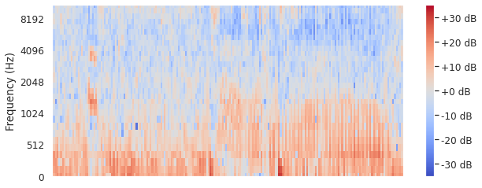


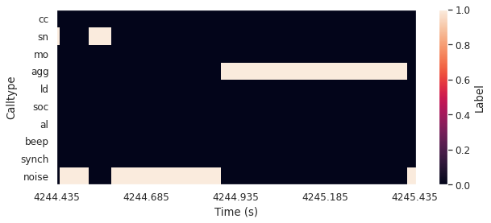


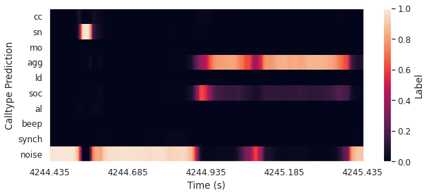


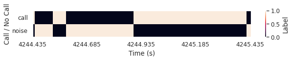


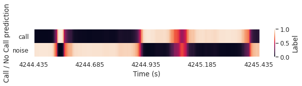


# Plot the confusion matrix


```python
# loop over the threaholds
for low_thr in [0.1,0.2,0.3]:
    for high_thr in [0.3,0.4,0.5,0.6,0.5,0.7,0.8,0.9,0.95]: 
        
        #########################################
        # FORMAT 
        
        low_thr = round(low_thr,2)                               
        high_thr = round(high_thr,2) 
        
        if low_thr >= high_thr:
            continue
        
        confusion_filename = os.path.join(save_metrics_path_eval, "PRED_TABLE_thr_" + str(low_thr) + "-" + str(high_thr) + '_foc_Confusion_Matrix.csv')
        with open(confusion_filename, newline='') as csvfile:
            array = list(csv.reader(csvfile))
    
        df_cm = pd.DataFrame(array)#, range(6), range(6))    
        
        # get rid of the weird indentations and make rows and columns as names
        new_col = df_cm.iloc[0] # grab the first row for the header
        df_cm = df_cm[1:] # take the data less the header row
        df_cm.columns = new_col # set the header row as the df header    
        new_row = df_cm['']
        df_cm = df_cm.drop('', 1)
        df_cm.index = new_row
        df_cm.index.name= None
        df_cm.columns.name= None
        
        # # replace FP and FN with noise
        df_cm['noise'] = df_cm['FN'] 
        #df_cm.loc['noise']=df_cm.loc['FP']
        
        # remove FP and FN
        df_cm = df_cm.drop("FN", axis=1)
        #df_cm = df_cm.drop("FP", axis=0)
        
        df_cm = df_cm.apply(pd.to_numeric)
                
        # Raw confusion matrix
        df_cm = df_cm[list(testing_label_dict.keys())]
        df_cm = df_cm.reindex(list(testing_label_dict.keys()))       
        
        #########################################
        # CALCULATE
        
        # Recall confusion matrix
        df_recall = df_cm.div(df_cm.sum(axis=1), axis=0).round(2)#pd.DataFrame(df_cm.values / df_cm.sum(axis=1).values).round(2)
        
        # Proportion of calls for confusion matrix
        call_len = list()
        for i in testing_label_dict.keys():
            call_len.append(testing_label_dict[i].shape[0])
        # add noise at the end
        call_len[-1] = df_cm.sum(axis=1)[-1]
        
        #proportion of calls
        df_prop = df_cm.div(call_len, axis=0).round(2)#pd.DataFrame(df_cm.values / df_cm.sum(axis=1).values).round(2)
        
        #########################################
        # PLOT
        
        #multi figure parameters
        fig,((ax1,ax2,ax3)) = plt.subplots(1,3, figsize=(20,5))
        fig.suptitle(str(low_thr) + " - " + str(high_thr))
        
        # plot raw
        sn.set(font_scale=1.1) # for label size
        sn.heatmap((df_cm+1), annot=df_cm, fmt='g',norm = LogNorm(), annot_kws={"size": 10}, ax= ax1) # font size
        ax1.set_title("Raw")              
               
        
        # plot recall
        sn.set(font_scale=1.1) # for label size
        sn.heatmap((df_recall), annot=True, fmt='g', annot_kws={"size": 10}, ax= ax2) # font size
        ax2.set_title("Recall" )

        # plot proportion of calls
        sn.set(font_scale=1.1) # for label size
        sn.heatmap((df_prop), annot=True, fmt='g', annot_kws={"size": 10}, ax= ax3) # font size
        ax3.set_title("Call Prop")
        
        # Save 3 panels
        plt.savefig(os.path.join(save_metrics_path, eval_analysis, "Confusion_mat_thr_" + str(low_thr) + "-" + str(high_thr) + '.png'))
        plt.show()
                
        # code to plot just one (if needed)
        #plt.close(fig)
        #fig = plt.figure(figsize=(10, 5))
        #plt.suptitle("")
        #ax = plt.axes()
        #sn.set(font_scale=1.1) # for label size
        #sn.heatmap((df_recall), annot=True, fmt='g', annot_kws={"size": 10}, ax= ax) # font size
        #ax.set_title("Recall: "+str(low_thr) + "-" + str(high_thr) )
        #plt.savefig(os.path.join(save_metrics_path, "Confusion_mat_recall_thr_" + str(low_thr) + "-" + str(high_thr) + '.png'))
        #plt.show()
        
#/media/kiran/D0-P1/animal_data/meerkat/EXAMPLE_NoiseAugmented_0.3_0.8_NotWeighted_MaskedOther_Forked/test_data/metrics/normal/PRED_TABLE_thr_0.1-0.3_foc_Confution_Matrix.csv
```


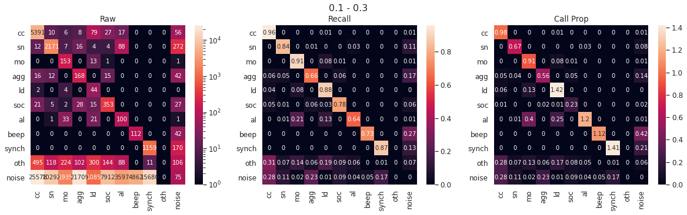


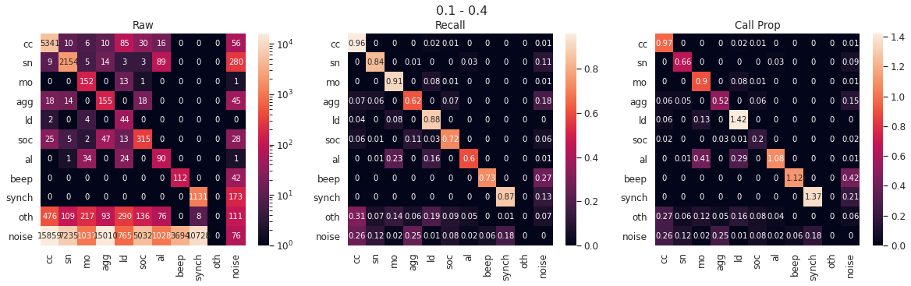


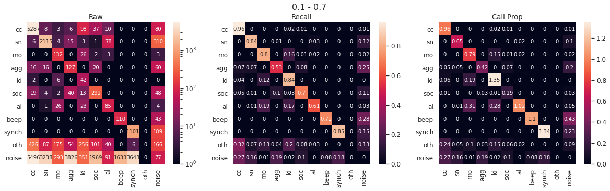


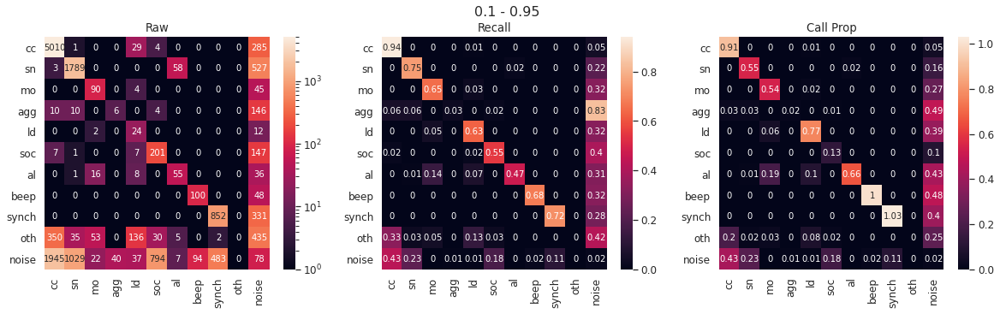


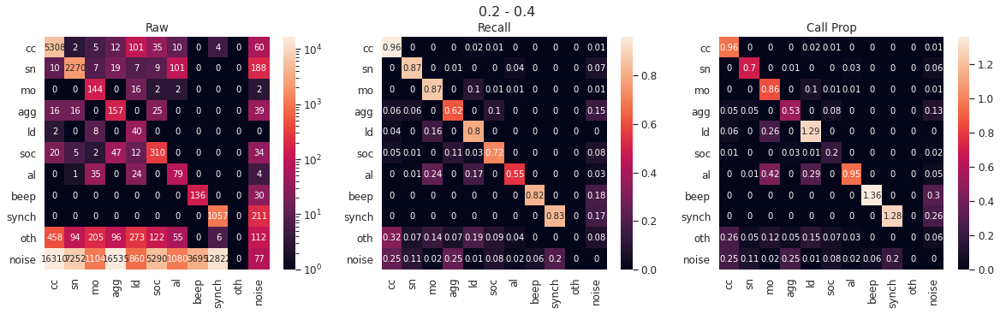


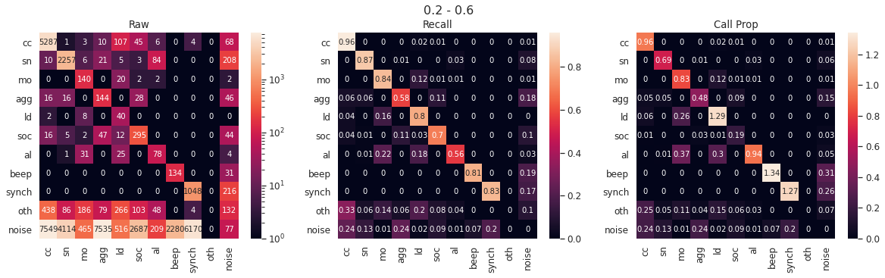


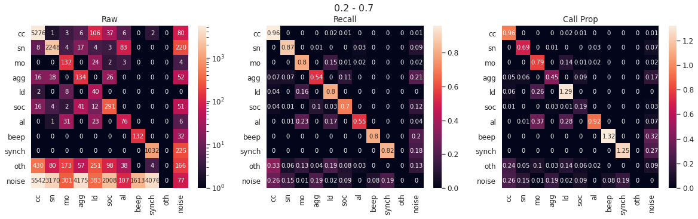


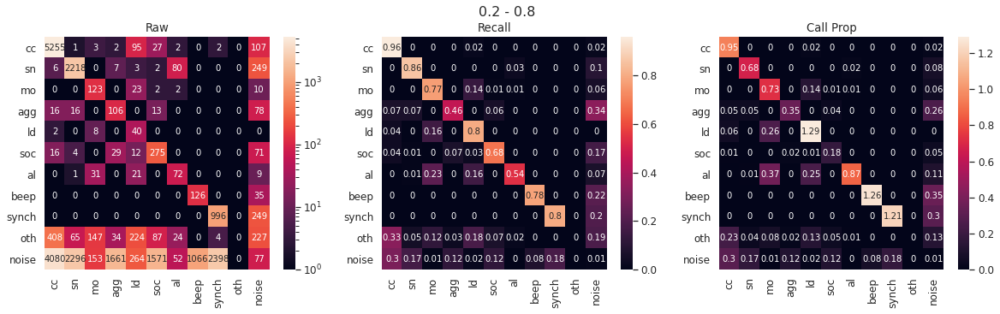


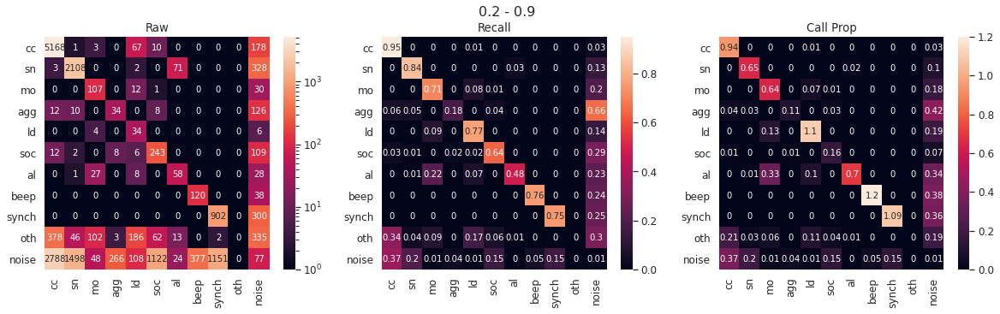


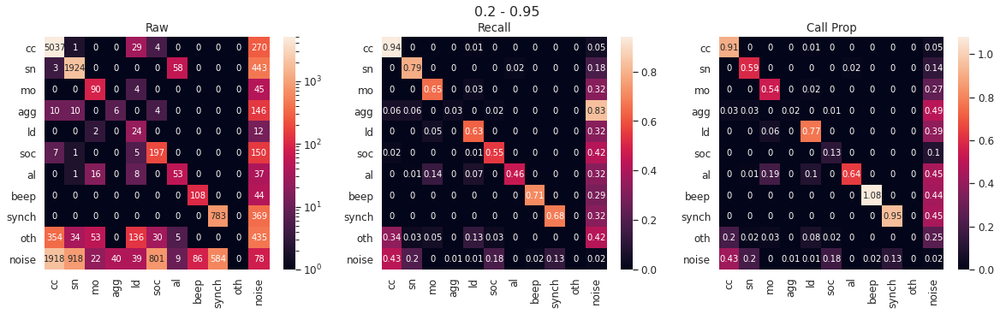


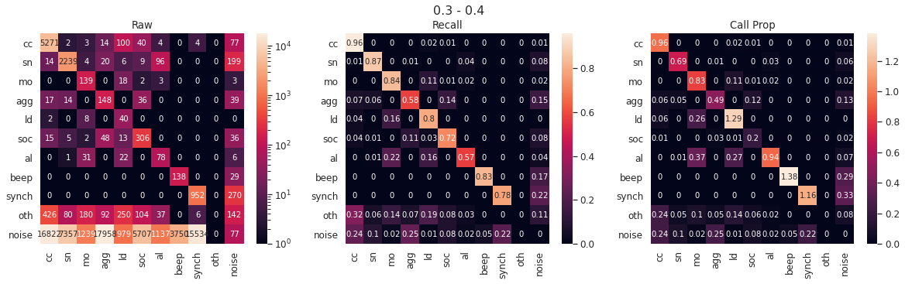


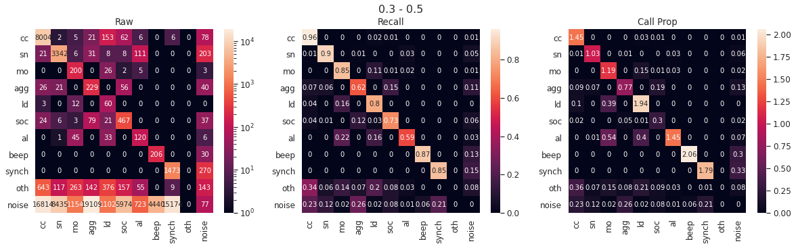


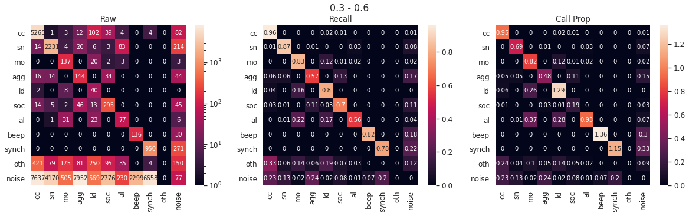


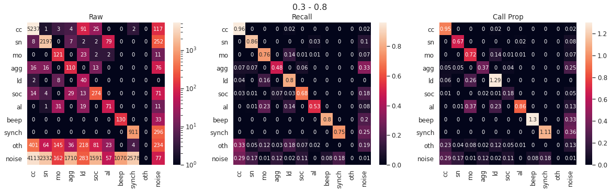


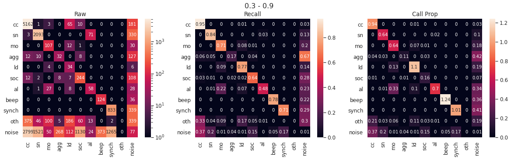


```python

```
