# OVERVIEW AND BACKGROUND

Understanding group decision-making in mobile species is a complex challenge. The integration of both GPS and acoustic sensors into tags deployed on multiple individuals in groups can help us systematically quantify communication between individuals as well as their movement responses - based on who is calling, the context of the call, and how the group reacts. However, the resulting datasets are very large, and the manual identification and classification of calls is both time and labor consuming. 


This code interfaces with a supervised machine learning tool for detecting call presence and/or call type in field recordings. We train a convolutional neural network to extract features from spectrograms. Bidirectional gated recurrent units learned temporal structure from these features, and a final feed-forward network predicted call type. We also used data augmentation to increase the number of training examples for underrepresented call types. We illustrate the method on bio-logging data from meerkat groups, where all individuals in the group were equipped with acoustic loggers. 

# START CODING

The parameter {is_forked} below is used to determine whether or not the model produces only a calltype classification (when False) or a calltype and a call presence classification (when True).


```python
is_forked = True
```

## IMPORT LIBRARIES


```python
github_dir = "/home/kiran/Documents/github/CCAS_ML"

# add path to local functions
import os
os.chdir(github_dir)

# import all the params for this model
from example_params import *

# import own functions
import preprocess.preprocess_functions as pre

```

    /home/kiran/anaconda3/envs/ML1_env/lib/python3.7/site-packages/librosa/util/decorators.py:9: NumbaDeprecationWarning: An import was requested from a module that has moved location.
    Import requested from: 'numba.decorators', please update to use 'numba.core.decorators' or pin to Numba version 0.48.0. This alias will not be present in Numba version 0.50.0.
      from numba.decorators import jit as optional_jit
    /home/kiran/anaconda3/envs/ML1_env/lib/python3.7/site-packages/librosa/util/decorators.py:9: NumbaDeprecationWarning: An import was requested from a module that has moved location.
    Import of 'jit' requested from: 'numba.decorators', please update to use 'numba.core.decorators' or pin to Numba version 0.48.0. This alias will not be present in Numba version 0.50.0.
      from numba.decorators import jit as optional_jit


```python
import postprocess.evaluation_metrics_functions_2 as metrics
import postprocess.merge_predictions_functions as ppm
import model.specgen_batch_generator as bg
import model.network_class as rnn
# import postprocess.visualise_prediction_functions as pp
from model.callback_functions import LossHistory
```

    WARNING:tensorflow:From /home/kiran/Documents/github/CCAS_ML/postprocess/evaluation_metrics_functions_2.py:10: The name tf.ConfigProto is deprecated. Please use tf.compat.v1.ConfigProto instead.
    
    WARNING:tensorflow:From /home/kiran/Documents/github/CCAS_ML/postprocess/evaluation_metrics_functions_2.py:12: The name tf.Session is deprecated. Please use tf.compat.v1.Session instead.
    


    Using TensorFlow backend.


```python
# import normal packages used in pre-processing
import numpy as np
import librosa
import warnings
import ntpath
import os
from itertools import compress  
from random import random, shuffle
from math import floor
import statistics
import glob
```


```python
# plotting
import matplotlib.pyplot as plt

# ML section packages
import datetime
from keras.callbacks import EarlyStopping, ReduceLROnPlateau
from keras import optimizers
from keras.layers import Input, Flatten
from keras.models import Model
from keras.layers import Conv2D, MaxPooling2D, Activation, SeparableConv2D, concatenate
from keras.layers import Reshape, Permute
from keras.layers import TimeDistributed, Dense, Dropout, BatchNormalization
from keras.models import load_model
from keras.layers import GRU, Bidirectional, GlobalAveragePooling2D
from keras.callbacks import TensorBoard
```


```python
# postprocessfrom decimal import Decimal
from decimal import Decimal
import pandas as pd
import pickle
```


```python
# evaluate and plot 
import seaborn as sn
# import pandas as pd
# import matplotlib.pyplot as plt
from matplotlib.colors import LogNorm
import csv
```

----------------------------------------------------------------------
# PREPROCESSING / DATA WRANGLING

Currently, all the meerkat files are found on the server. The labels in particular are divided by year (currently 2017 and 2019) and all file labels are in a single document. This bit of code just takes these and puts them together


```python
# Compile all the synched label files together
labels_all = pd.DataFrame()
for directory in label_dirs:
    for group in group_IDs:
        temp = pd.read_csv(os.path.join(directory, group +"_ALL_CALLS_SYNCHED.csv"), sep=sep,
                       header=0, engine = engine, encoding = encoding) 
        temp["group"] = group
        labels_all = pd.concat([labels_all, temp]) 
        del temp
labels_all = labels_all.reset_index(drop = True)
labels_all = labels_all[~labels_all.wavFileName.str.contains('SOUNDFOC')]
```

## Look at summary data to understand meerkats


```python
labels_all.groupby(['ind','group']).size().reset_index().rename(columns={0:'count'})
```


<div>
<style scoped>
    .dataframe tbody tr th:only-of-type {
        vertical-align: middle;
    }

    .dataframe tbody tr th {
        vertical-align: top;
    }

    .dataframe thead th {
        text-align: right;
    }
</style>
<table border="1" class="dataframe">
  <thead>
    <tr style="text-align: right;">
      <th></th>
      <th>ind</th>
      <th>group</th>
      <th>count</th>
    </tr>
  </thead>
  <tbody>
    <tr>
      <th>0</th>
      <td>VCVM001</td>
      <td>HM2017</td>
      <td>1518</td>
    </tr>
    <tr>
      <th>1</th>
      <td>VHMF001</td>
      <td>HM2017</td>
      <td>3296</td>
    </tr>
    <tr>
      <th>2</th>
      <td>VHMF001</td>
      <td>HM2019</td>
      <td>5738</td>
    </tr>
    <tr>
      <th>3</th>
      <td>VHMF015</td>
      <td>HM2019</td>
      <td>5844</td>
    </tr>
    <tr>
      <th>4</th>
      <td>VHMF019</td>
      <td>HM2019</td>
      <td>2408</td>
    </tr>
    <tr>
      <th>5</th>
      <td>VHMF022</td>
      <td>HM2019</td>
      <td>2377</td>
    </tr>
    <tr>
      <th>6</th>
      <td>VHMM002</td>
      <td>HM2017</td>
      <td>2426</td>
    </tr>
    <tr>
      <th>7</th>
      <td>VHMM003</td>
      <td>HM2017</td>
      <td>333</td>
    </tr>
    <tr>
      <th>8</th>
      <td>VHMM006</td>
      <td>HM2017</td>
      <td>2713</td>
    </tr>
    <tr>
      <th>9</th>
      <td>VHMM007</td>
      <td>HM2017</td>
      <td>5821</td>
    </tr>
    <tr>
      <th>10</th>
      <td>VHMM007</td>
      <td>HM2019</td>
      <td>3078</td>
    </tr>
    <tr>
      <th>11</th>
      <td>VHMM008</td>
      <td>HM2019</td>
      <td>2188</td>
    </tr>
    <tr>
      <th>12</th>
      <td>VHMM014</td>
      <td>HM2019</td>
      <td>2114</td>
    </tr>
    <tr>
      <th>13</th>
      <td>VHMM016</td>
      <td>HM2019</td>
      <td>2523</td>
    </tr>
    <tr>
      <th>14</th>
      <td>VHMM017</td>
      <td>HM2019</td>
      <td>3637</td>
    </tr>
    <tr>
      <th>15</th>
      <td>VHMM021</td>
      <td>HM2019</td>
      <td>2436</td>
    </tr>
    <tr>
      <th>16</th>
      <td>VHMM023</td>
      <td>HM2019</td>
      <td>2888</td>
    </tr>
    <tr>
      <th>17</th>
      <td>VLF235</td>
      <td>L2019</td>
      <td>2424</td>
    </tr>
    <tr>
      <th>18</th>
      <td>VLF241</td>
      <td>L2019</td>
      <td>999</td>
    </tr>
    <tr>
      <th>19</th>
      <td>VLF244</td>
      <td>L2019</td>
      <td>2132</td>
    </tr>
    <tr>
      <th>20</th>
      <td>VLF246</td>
      <td>L2019</td>
      <td>2867</td>
    </tr>
    <tr>
      <th>21</th>
      <td>VLM234</td>
      <td>L2019</td>
      <td>4703</td>
    </tr>
    <tr>
      <th>22</th>
      <td>VLM239</td>
      <td>L2019</td>
      <td>842</td>
    </tr>
    <tr>
      <th>23</th>
      <td>VLM245</td>
      <td>L2019</td>
      <td>1791</td>
    </tr>
    <tr>
      <th>24</th>
      <td>VLM248</td>
      <td>L2019</td>
      <td>2657</td>
    </tr>
  </tbody>
</table>
</div>


```python
labels_all.groupby(['ind','group', 'date']).size().reset_index().rename(columns={0:'count'})
```


<div>
<style scoped>
    .dataframe tbody tr th:only-of-type {
        vertical-align: middle;
    }

    .dataframe tbody tr th {
        vertical-align: top;
    }

    .dataframe thead th {
        text-align: right;
    }
</style>
<table border="1" class="dataframe">
  <thead>
    <tr style="text-align: right;">
      <th></th>
      <th>ind</th>
      <th>group</th>
      <th>date</th>
      <th>count</th>
    </tr>
  </thead>
  <tbody>
    <tr>
      <th>0</th>
      <td>VCVM001</td>
      <td>HM2017</td>
      <td>20170806</td>
      <td>194</td>
    </tr>
    <tr>
      <th>1</th>
      <td>VCVM001</td>
      <td>HM2017</td>
      <td>20170823</td>
      <td>219</td>
    </tr>
    <tr>
      <th>2</th>
      <td>VCVM001</td>
      <td>HM2017</td>
      <td>20170824</td>
      <td>207</td>
    </tr>
    <tr>
      <th>3</th>
      <td>VCVM001</td>
      <td>HM2017</td>
      <td>20170825</td>
      <td>224</td>
    </tr>
    <tr>
      <th>4</th>
      <td>VCVM001</td>
      <td>HM2017</td>
      <td>20170903</td>
      <td>376</td>
    </tr>
    <tr>
      <th>...</th>
      <td>...</td>
      <td>...</td>
      <td>...</td>
      <td>...</td>
    </tr>
    <tr>
      <th>145</th>
      <td>VLM248</td>
      <td>L2019</td>
      <td>20190805</td>
      <td>385</td>
    </tr>
    <tr>
      <th>146</th>
      <td>VLM248</td>
      <td>L2019</td>
      <td>20190806</td>
      <td>426</td>
    </tr>
    <tr>
      <th>147</th>
      <td>VLM248</td>
      <td>L2019</td>
      <td>20190807</td>
      <td>1129</td>
    </tr>
    <tr>
      <th>148</th>
      <td>VLM248</td>
      <td>L2019</td>
      <td>20190808</td>
      <td>287</td>
    </tr>
    <tr>
      <th>149</th>
      <td>VLM248</td>
      <td>L2019</td>
      <td>20190809</td>
      <td>430</td>
    </tr>
  </tbody>
</table>
<p>150 rows × 4 columns</p>
</div>


```python
labels_all.groupby(['ind', 'date']).size().reset_index().rename(columns={0:'count'})
```


<div>
<style scoped>
    .dataframe tbody tr th:only-of-type {
        vertical-align: middle;
    }

    .dataframe tbody tr th {
        vertical-align: top;
    }

    .dataframe thead th {
        text-align: right;
    }
</style>
<table border="1" class="dataframe">
  <thead>
    <tr style="text-align: right;">
      <th></th>
      <th>ind</th>
      <th>date</th>
      <th>count</th>
    </tr>
  </thead>
  <tbody>
    <tr>
      <th>0</th>
      <td>VCVM001</td>
      <td>20170806</td>
      <td>194</td>
    </tr>
    <tr>
      <th>1</th>
      <td>VCVM001</td>
      <td>20170823</td>
      <td>219</td>
    </tr>
    <tr>
      <th>2</th>
      <td>VCVM001</td>
      <td>20170824</td>
      <td>207</td>
    </tr>
    <tr>
      <th>3</th>
      <td>VCVM001</td>
      <td>20170825</td>
      <td>224</td>
    </tr>
    <tr>
      <th>4</th>
      <td>VCVM001</td>
      <td>20170903</td>
      <td>376</td>
    </tr>
    <tr>
      <th>...</th>
      <td>...</td>
      <td>...</td>
      <td>...</td>
    </tr>
    <tr>
      <th>145</th>
      <td>VLM248</td>
      <td>20190805</td>
      <td>385</td>
    </tr>
    <tr>
      <th>146</th>
      <td>VLM248</td>
      <td>20190806</td>
      <td>426</td>
    </tr>
    <tr>
      <th>147</th>
      <td>VLM248</td>
      <td>20190807</td>
      <td>1129</td>
    </tr>
    <tr>
      <th>148</th>
      <td>VLM248</td>
      <td>20190808</td>
      <td>287</td>
    </tr>
    <tr>
      <th>149</th>
      <td>VLM248</td>
      <td>20190809</td>
      <td>430</td>
    </tr>
  </tbody>
</table>
<p>150 rows × 3 columns</p>
</div>


Data also contain focal follows (someone walking around behind the meerkats) and the resultion of this data is different and therefore not anlysed with the collar data


```python
# subset all the audio files that we should use in the analysis (i.e. not focal follow data)
audio_files = list(set(labels_all["wavFileName"]))
audio_filenames = list(compress(audio_files, ["SOUNDFOC" not in filei for filei in audio_files]))

# subset all the audio files that we should use in the analysis (i.e. not focal follow data)
label_files = list(set(labels_all["csvFileName"]))
label_filenames = list(compress(label_files, ["SOUNDFOC" not in filei for filei in label_files]))

# get the file IDS without all the extentions (used later for naming)
all_filenames = [audio_filenames[i].split(".")[0] for i in range(0,len(audio_filenames))]

```

Then we locate all the paths to the files


```python
# find all the labels
EXT = "*.csv"
label_filepaths = []
for PATH in acoustic_data_path :
      label_filepaths.extend( [file for path, subdir, files in os.walk(PATH) for file in glob.glob(os.path.join(path, EXT))])
EXT = "*.CSV"
for PATH in acoustic_data_path :
      label_filepaths.extend( [file for path, subdir, files in os.walk(PATH) for file in glob.glob(os.path.join(path, EXT))])

# find all audio paths (will be longer than label path as not everything is labelled)
audio_filepaths = []
EXT = "*.wav"
for PATH in audio_dirs:
      audio_filepaths.extend( [file for path, subdir, files in os.walk(PATH) for file in glob.glob(os.path.join(path, EXT))])

```

### Create a label table

Currently, the labels are stored in a file generated by audition for the meerkats. We want to these manual labels and put them into a more meaningful categories for for the machine learning. To set categories, I use a pre-defined dictionary called call_types that is defined in the parameters file and which specifies what the different classes are for the call types. Anything strange gets put into a category "oth" for other.


```python
# Create the label table
label_table = pre.create_meerkat_table(labels_all, call_types, sep,
                                       start_column, duration_column, columns_to_keep,
                                       label_column, convert_to_seconds, 
                                       label_for_other, label_for_noise, engine,
                                       multiclass_forbidden)
```

    /home/kiran/Documents/github/CCAS_ML/preprocess/preprocess_functions.py:248: UserWarning: These values will be classed as other : ['c', 'c', 'cn', 'chew', 'sb', 'chew', 'chew', 'chew', 'chew', 'chew', 'chew', 'chew', 'chew', 'chew', 'chew', 'chew', 'chew', 'chew', 'chew', 'chew', 'chew', 'chew', 'chew', 'chew', 'chew', 'chew', '01:48:00', 'c', nan, 'sx', 'pause', 'sc f', 'eating', 'eating', 'eating', 'eating', 'x', 'eating', 'eating', 'x', 'x', 'c nf', 'x', 'x', 'x', 'x', 'x nf', 'x', 'x', 'x nf', 'x nf', 'x', 'x', 'x nf', 'x nf', 'x nf', 'x', 'x nf', 'x nf', '01:25:30', 'na', 'na', 'na', 'na', 'na', 'na', 'na', 'na', 'na', 'na', 'na', 'na', 'na', 'na', 'x', 'x', 'x', 'x', 'x', 'x', 'x', 'x', 'x', 'x', 'x', 'x', 'x', 'x', 'x', 'x', 'x', 'x', 'x', 'x', 'x', 'x', 'x', 'x', 'x', 'c nf', 'x', 'x', 'digging', 'digging', 'chew', 'chew', 'chew', 'x', 'x', 'x', 'x', 'x', 'x', '//', 'x', 'x', 'aynxh 01:28:30', 'x', 'x', 'ñ\x81ñ\x81', 'ñ\x81ñ\x81 x', '×\x91×\x91', 'x', 'x', 'x', 'x', 'x', 'x', 'x', 'x', 'x', 'x', 'x', 'eating', 'x', 'x', 'x', 'x', 'x', 'x', 'eating', 'x', 'x', 'x', 'x', 'm nf', 'x', 'sc x nf', 'x', 'x', 'x', 'x', 'x', 'x', 'x', 'x', 'eating', 'eating', 'eating', 'x', 'eating', 'x', 'ñ\x81ñ\x81', 'x', 'x', 'sycnh 01:36:00', 'ñ\x81ñ\x81 nf', 'ñ\x81ñ\x81 nf', 'x', 'beg nf', 'beg nf', 'beg nf', 'beg nf', 'beg nf', 'beg nf', 'beg nf', 'x', 'x', 'x', 'x', 'x', 'x', 'x', 'x', 'x', 'x', 'x', 'x', 'x', 'x', 'zz', 'x', 'x', 'x', 'x', 'x', 'x', 'x', 'cñ\x81 *', 'cñ\x81 nf', 'ñ\x81ñ\x81 nf', 'ñ\x81ñ\x81 nf', 'ñ\x81ñ\x81 nf', 'x', 'x', 'x', 'x', 'x', 'x', 'x', 'x', 'x', 'x', 'x', 'x', 'x', 'synhch 01:37:30', 'x', 'x', 'x', 'x', 'x', 'x', 'x', 'x', 'x', 'x', 'x', 'x', 'x', 'x', 'x', 'x', 'x', 'x', 'x', 'x', 'x', 'x', '*', 'a %', 'x', 'sic nf %', 'x', 'x', 'x', 'x', 'x', 'x', 'x', 'sic nf', 'x', 'x', 'x', 'x', 'x', 'x', 'x', 'bark', 'x', 'x', 'syn 01:30:30 x', 'x', 'x', 'x', 'x', 'x', 'ñ\x87', 'x', 'x', 'x', 'x', 'x', 'x', 'x', 'x', 'x', 'x', 'x', 'x', 'x', 'x', 'x', 'x', 'x', 'x', 'x', 'x', 'x', 'x', 'x', 'x', 'x', 'x', 'x', '01:57:00', 'x', 'x', 'x', 'x', 'x', 'x', 'ñ\x81ñ\x81 *', 'ñ\x81ñ\x81 *', 'x', 'x', 'x', 'x', 'x', 'x', 'x', 'x', 'x', 'x', 'x', 'x', 'x', 'x', 'x', 'x', 'x', 'x', 'x', 'x', 'x', 'x', 'x', 'x', 'x', 'x', 'x', 'x', 'x', 'x', 'x', 'x']
      warnings.warn("These values will be classed as other : " + str(list(label_table["Label"][list(unclassed)])))


```python
# estimate the average beep length because many of them are not annotated in the data
avg_beep = round(statistics.mean(label_table.loc[label_table["beep"],"Duration"].loc[label_table.loc[label_table["beep"],"Duration"]>0]),3)
label_table.loc[(label_table["beep"].bool and label_table["Duration"] == 0.) ==True, "Duration"] = avg_beep
label_table.loc[(label_table["beep"].bool and label_table["Duration"] == avg_beep) ==True, "End"] += avg_beep

# add wav and audio paths
label_table["wav_path"] = label_table['wavFileName'].apply(lambda x: [pathi for pathi in audio_filepaths if x in pathi][0])
label_table["label_path"] = label_table['csvFileName'].apply(lambda x: [pathi for pathi in label_filepaths if x in pathi][0])

# make sure these paths are added to the noise table too
columns_to_keep.append("wav_path")
columns_to_keep.append("label_path")

# create the matching noise table
noise_table = pre.create_noise_table(label_table, call_types, label_for_noise, label_for_startstop, columns_to_keep)#, '\$'])

# remove rows where the annotated noise is smaller than the window size otherwise the spectrogram we generate will inclue a call
noise_table = noise_table.drop(noise_table[noise_table["Duration"] < spec_window_size].index)

```

# SPLIT DATA INTO TRAINING/VALIDATION AND TEST SETS

Here we split the training and test set based on files (rather than spectrograms). 


```python
# If the training and testing files exists then load them, otherwise create them
if os.path.exists(os.path.join(save_model_path, "training_files_used.txt")):
    # load the saved file
    with open(os.path.join(save_model_path, "training_files_used.txt")) as f:
        content = f.readlines()    
    training_filenames = [x.strip() for x in content] # remove whitespace characters like `\n` at the end of each line
    with open(os.path.join(save_model_path, "testing_files_used.txt")) as f:
        content = f.readlines()    
    testing_filenames = [x.strip() for x in content] # remove whitespace characters like `\n` at the end of each line
    with open(os.path.join(save_model_path, "validation_files_used.txt")) as f:
        content = f.readlines()    
    validation_filenames = [x.strip() for x in content] # remove whitespace characters like `\n` at the end of each line

# otherwiss create the training and testing files
else: 
    # randomise the order of the files
    file_list = audio_filenames #all_filenames
    shuffle(file_list)
    
    # randomly divide the files into those in the training and test datasets
    split_index = floor(len(file_list) * train_test_split)
    training_files = file_list[:split_index]
    testing_filenames = file_list[split_index:]
    
    split_index = floor(len(training_files) * train_val_split )
    training_filenames = training_files[:split_index]
    validation_filenames = training_files[split_index:]

    # save a copy of the training and testing diles
    with open(os.path.join(save_model_path, "training_files_used.txt"), "w") as f:
        for s in training_filenames:
            f.write(str(s) +"\n")
    with open(os.path.join(save_model_path, "testing_files_used.txt"), "w") as f:
        for s in testing_filenames:
            f.write(str(s) +"\n")
    with open(os.path.join(save_model_path, "validation_files_used.txt"), "w") as f:
        for s in validation_filenames:
            f.write(str(s) +"\n")
```

Then we create a dictionary that will be used in the datagenerator. Each key is a calltype and contains the start/stop/duration/filename where that call occurs. This allows the data generator to shuffle them during the training.


```python
# separate out the training and test sets for analysis
training_label_table = label_table[label_table['wavFileName'].isin(training_filenames)]
testing_label_table = label_table[label_table['wavFileName'].isin(testing_filenames)]
validation_label_table = label_table[label_table['wavFileName'].isin(validation_filenames)]

# do the same for the noise
training_noise_table = noise_table[noise_table['wavFileName'].isin(training_filenames)]
testing_noise_table = noise_table[noise_table['wavFileName'].isin(testing_filenames)]
validation_noise_table = noise_table[noise_table['wavFileName'].isin(validation_filenames)]

# Compile training data into a format that the data generator can use
training_label_dict = dict()
for label in call_types: 
    training_label_dict[label] = training_label_table.loc[training_label_table[label] == True, ["Label", "Start", "Duration","End","wav_path","label_path"]]
training_label_dict[label_for_noise] = training_noise_table[["Label", "Start", "Duration","End","wav_path","label_path"]]

# Compile test data into a format that the data generator can use
testing_label_dict = dict()
for label in call_types: 
    testing_label_dict[label] = testing_label_table.loc[testing_label_table[label] == True, ["Label", "Start", "Duration","End","wav_path","label_path"]]
testing_label_dict[label_for_noise] = testing_noise_table[["Label", "Start", "Duration","End","wav_path","label_path"]]

# Compile validation data into a format that the data generator can use
validation_label_dict = dict()
for label in call_types: 
    validation_label_dict[label] = validation_label_table.loc[validation_label_table[label] == True, ["Label", "Start", "Duration","End","wav_path","label_path"]]
validation_label_dict[label_for_noise] = validation_label_table[["Label", "Start", "Duration","End","wav_path","label_path"]]
```

---------------------------------------------------------------
# Plot some of the data to see what the output will be like

### Initialise a data generator to create a sample to plot


```python
if is_forked == True:
    # initiate the data generator
    train_generator = bg.ForkedDataGenerator(training_label_dict,
                                             training_label_table, 
                                             spec_window_size,
                                             n_mels, 
                                             window, 
                                             fft_win , 
                                             fft_hop , 
                                             normalise,
                                             label_for_noise,
                                             label_for_other,
                                             min_scaling_factor,
                                             max_scaling_factor,
                                             n_per_call,
                                             other_ignored_in_training,
                                             mask_value,
                                             mask_vector)
    
        
    # generate an example spectrogram and label  
    spec, label, callmat, mask = train_generator.generate_example("sn", 0, True)
else:
    # initiate the data generator
    train_generator = bg.DataGenerator(training_label_dict,
                                             training_label_table, 
                                             spec_window_size,
                                             n_mels, 
                                             window, 
                                             fft_win , 
                                             fft_hop , 
                                             normalise,
                                             label_for_noise,
                                             label_for_other,
                                             min_scaling_factor,
                                             max_scaling_factor,
                                             n_per_call,
                                             other_ignored_in_training,
                                             mask_value,
                                             mask_vector)
    
        
    # generate an example spectrogram and label  
    spec, label, mask = train_generator.generate_example("sn", 0, True)
```

### Plot the lot


```python
# set the labels
label_list = list(call_types.keys())
if other_ignored_in_training:
    label_list.remove(label_for_other)

if is_forked == True:
    # plot spectrogram
    plt.figure(figsize=(10, 10))
    plt.subplot(411)
    yaxis = range(0, np.flipud(spec).shape[0]+1)
    xaxis = range(0, np.flipud(spec).shape[1]+1)
    librosa.display.specshow(spec,  y_axis='mel', x_coords = label.columns)#, x_axis= "time",sr=sr, x_coords = label.columns)
    plt.ylabel('Frequency (Hz)')
    plt.clim(-35, 35)
    plt.colorbar(format='%+2.0f dB')
    
    # plot LABEL
    plt.subplot(412)
    xaxis = range(0, np.flipud(label).shape[1]+1)
    yaxis = range(0, np.flipud(label).shape[0]+1)
    plt.yticks(np.arange(0.5, len(label_list)+0.5 ,1 ),reversed(label_list))
    plt.xticks(np.arange(0, np.flipud(label).shape[1]+1,50),
               list(label.columns[np.arange(0, np.flipud(label).shape[1]+1,50)]))
    plt.pcolormesh(xaxis, yaxis, np.flipud(label))
    plt.xlabel('Time (s)')
    plt.ylabel('Calltype')
    plt.colorbar(label="Label")
    
    
    # plot call matrix
    plt.subplot(413)
    xaxis = range(0, np.flipud(label).shape[1]+1)
    yaxis = range(0, np.flipud(callmat).shape[0]+1)
    plt.yticks(np.arange(0.5, callmat.shape[0]+0.5 ,1 ), reversed(callmat.index.values))
    plt.xticks(np.arange(0, np.flipud(label).shape[1]+1,50),
               list(label.columns[np.arange(0, np.flipud(label).shape[1]+1,50)]))
    plt.pcolormesh(xaxis, yaxis, np.flipud(callmat))
    plt.xlabel('Time (s)')
    plt.ylabel('Call / No Call')
    plt.colorbar(label="Label")
    # 
    
    plt.subplot(414)
    # plot the mask
    if mask_vector == True:
        test = np.asarray([int(x == True) for x in mask])
        # test = np.hstack(test)
        test = test[np.newaxis, ...]
        # plt.imshow(mask, aspect='auto', cmap=plt.cm.gray)
        xaxis = range(0, np.flipud(label).shape[1]+1)
        yaxis = range(0, np.flipud(test).shape[0]+1)
        # yaxis = range(0, 1)
        # plt.yticks(np.arange(0.5, 1 ,1 ), "oth")
        plt.yticks(np.arange(0.5, test.shape[0]+0.5 ,1 ), reversed(["oth"]))
        plt.xticks(np.arange(0, np.flipud(label).shape[1]+1,50),
                   list(label.columns[np.arange(0, np.flipud(label).shape[1]+1,50)]))
        plt.pcolormesh(xaxis, yaxis, np.flipud(test))
        plt.xlabel('Time (s)')
        plt.ylabel('True/False')
        plt.colorbar(label="Label")
        plt.clim(0, 1)
        plt.show()
    else:
    
        xaxis = range(0, np.flipud(mask).shape[1]+1)
        yaxis = range(0, np.flipud(mask).shape[0]+1)
        # plt.yticks(np.arange(0.5, np.flipud(mask).shape[0]+0.5 ,1 ),reversed(label_list))
        plt.xticks(np.arange(0, np.flipud(mask).shape[1]+1,50),
                   list(label.columns[np.arange(0, np.flipud(mask).shape[1]+1,50)]))
        plt.pcolormesh(xaxis, yaxis, np.flipud(mask))
        plt.xlabel('Time (s)')
        plt.ylabel('Spectrogram Channels')
        plt.colorbar(label="Other or not")
        plt.show()
else:
    # plot spectrogram
    plt.figure(figsize=(10, 10))
    plt.subplot(311)
    yaxis = range(0, np.flipud(spec).shape[0]+1)
    xaxis = range(0, np.flipud(spec).shape[1]+1)
    librosa.display.specshow(spec,  y_axis='mel', x_coords = label.columns)#, x_axis= "time",sr=sr, x_coords = label.columns)
    plt.ylabel('Frequency (Hz)')
    plt.clim(-35, 35)
    plt.colorbar(format='%+2.0f dB')
    
    # plot LABEL
    plt.subplot(312)
    xaxis = range(0, np.flipud(label).shape[1]+1)
    yaxis = range(0, np.flipud(label).shape[0]+1)
    plt.yticks(np.arange(0.5, len(label_list)+0.5 ,1 ),reversed(label_list))
    plt.xticks(np.arange(0, np.flipud(label).shape[1]+1,50),
               list(label.columns[np.arange(0, np.flipud(label).shape[1]+1,50)]))
    plt.pcolormesh(xaxis, yaxis, np.flipud(label))
    plt.xlabel('Time (s)')
    plt.ylabel('Calltype')
    plt.colorbar(label="Label")
    
    
    plt.subplot(313)
    # plot the mask
    if mask_vector == True:
        test = np.asarray([int(x == True) for x in mask])
        # test = np.hstack(test)
        test = test[np.newaxis, ...]
        # plt.imshow(mask, aspect='auto', cmap=plt.cm.gray)
        xaxis = range(0, np.flipud(label).shape[1]+1)
        yaxis = range(0, np.flipud(test).shape[0]+1)
        # yaxis = range(0, 1)
        # plt.yticks(np.arange(0.5, 1 ,1 ), "oth")
        plt.yticks(np.arange(0.5, test.shape[0]+0.5 ,1 ), reversed(["oth"]))
        plt.xticks(np.arange(0, np.flipud(label).shape[1]+1,50),
                   list(label.columns[np.arange(0, np.flipud(label).shape[1]+1,50)]))
        plt.pcolormesh(xaxis, yaxis, np.flipud(test))
        plt.xlabel('Time (s)')
        plt.ylabel('True/False')
        plt.colorbar(label="Label")
        plt.clim(0, 1)
        plt.show()
    else:
        xaxis = range(0, np.flipud(mask).shape[1]+1)
        yaxis = range(0, np.flipud(mask).shape[0]+1)
        # plt.yticks(np.arange(0.5, np.flipud(mask).shape[0]+0.5 ,1 ),reversed(label_list))
        plt.xticks(np.arange(0, np.flipud(mask).shape[1]+1,50),
                   list(label.columns[np.arange(0, np.flipud(mask).shape[1]+1,50)]))
        plt.pcolormesh(xaxis, yaxis, np.flipud(mask))
        plt.xlabel('Time (s)')
        plt.ylabel('Spectrogram Channels')
        plt.colorbar(label="Other or not")
        plt.show()


```


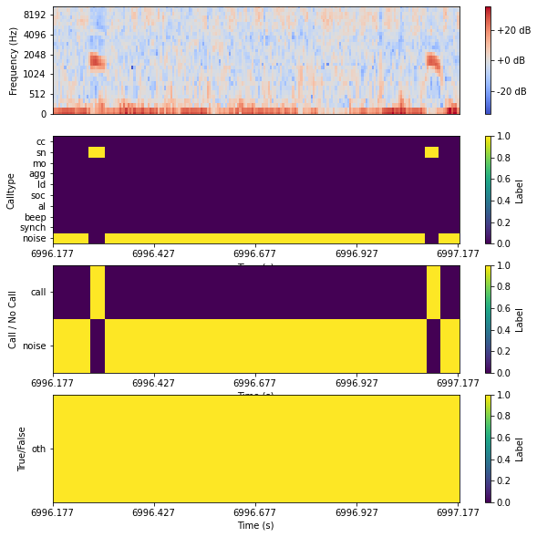


-----------------------------------------
# TRAINING 

## Build the training and validation data generators (for real this time)


```python
if is_forked == True:
    # get a batch to estimate rnn parameters
    x_train, y_train = train_generator.__next__()#__getitem__(0)
    
    # initial parameters
    num_calltypes = y_train[0].shape[2]
    gru_units = y_train[0].shape[1] 


    # initialise the training data generator and validation data generator
    train_generator = bg.ForkedDataGenerator(training_label_dict,
                                             training_label_table, 
                                             spec_window_size,
                                             n_mels, 
                                             window, 
                                             fft_win , 
                                             fft_hop , 
                                             normalise,
                                             label_for_noise,
                                             label_for_other,
                                             min_scaling_factor,
                                             max_scaling_factor,
                                             n_per_call,
                                             other_ignored_in_training,
                                             mask_value,
                                             mask_vector)
    
    val_generator = bg.ForkedDataGenerator(validation_label_dict,
                                           validation_label_table, 
                                           spec_window_size,
                                           n_mels, 
                                           window, 
                                           fft_win , 
                                           fft_hop , 
                                           normalise,
                                           label_for_noise,
                                           label_for_other,
                                           min_scaling_factor,
                                           max_scaling_factor,
                                           n_per_call,
                                           other_ignored_in_training,
                                           mask_value,
                                           mask_vector)
    
else:
    x_train, y_train = train_generator.__next__()#__getitem__(0)
    
    # initial parameters
    num_calltypes = y_train[0].shape[2]
    gru_units = y_train[0].shape[1] 
    
    train_generator = bg.DataGenerator(training_label_dict,
                                             training_label_table, 
                                             spec_window_size,
                                             n_mels, 
                                             window, 
                                             fft_win , 
                                             fft_hop , 
                                             normalise,
                                             label_for_noise,
                                             label_for_other,
                                             min_scaling_factor,
                                             max_scaling_factor,
                                             n_per_call,
                                             other_ignored_in_training,
                                             mask_value,
                                             mask_vector)
    
    val_generator = bg.DataGenerator(validation_label_dict,
                                           validation_label_table, 
                                           spec_window_size,
                                           n_mels, 
                                           window, 
                                           fft_win , 
                                           fft_hop , 
                                           normalise,
                                           label_for_noise,
                                           label_for_other,
                                           min_scaling_factor,
                                           max_scaling_factor,
                                           n_per_call,
                                           other_ignored_in_training,
                                           mask_value,
                                           mask_vector)    


```

## Construct the RNN


```python
# ONly for example in jupyter is epochs set to 16, would recommend higher!
epochs=16

# initialise the model class
model = rnn.BuildNetwork(x_train, num_calltypes, filters, gru_units, dense_neurons, dropout, mask_value)

# build the model
if is_forked == True:
    RNN_model = model.build_forked_masked_rnn()
else:
    RNN_model = model.build_masked_rnn()
    
# Adam optimiser
adam = optimizers.Adam(lr=0.0001, beta_1=0.9, beta_2=0.999, epsilon=None, decay=0.0, amsgrad=False)

# Compile the model
RNN_model.compile(optimizer=adam, loss='binary_crossentropy', metrics=['binary_accuracy'])

# Setup callbycks: learning rate / loss /tensorboard
early_stopping = EarlyStopping(monitor='val_loss', patience=40, restore_best_weights=True, verbose=1)
reduce_lr_plat = ReduceLROnPlateau(monitor='val_loss', factor=0.5, patience=25, verbose=1,
                                   mode='auto', min_delta=0.0001, cooldown=0, min_lr=0.000001)
loss = LossHistory()

# tensorboard
tensorboard = TensorBoard(log_dir = save_tensorboard_path,
                          histogram_freq=0,
                          write_graph=True,  # Show the network
                          write_grads=True   # Show gradients
                          )  
# fit model
RNN_model.fit_generator(train_generator, 
                        steps_per_epoch = train_generator.__len__(),
                        epochs = epochs,
                        callbacks = [early_stopping, reduce_lr_plat, loss, tensorboard],
                        validation_data = val_generator,
                        validation_steps = val_generator.__len__())
```

    WARNING:tensorflow:From /home/kiran/anaconda3/envs/ML1_env/lib/python3.7/site-packages/keras/backend/tensorflow_backend.py:74: The name tf.get_default_graph is deprecated. Please use tf.compat.v1.get_default_graph instead.
    
    WARNING:tensorflow:From /home/kiran/anaconda3/envs/ML1_env/lib/python3.7/site-packages/keras/backend/tensorflow_backend.py:517: The name tf.placeholder is deprecated. Please use tf.compat.v1.placeholder instead.
    
    WARNING:tensorflow:From /home/kiran/anaconda3/envs/ML1_env/lib/python3.7/site-packages/keras/backend/tensorflow_backend.py:4138: The name tf.random_uniform is deprecated. Please use tf.random.uniform instead.
    
    WARNING:tensorflow:From /home/kiran/anaconda3/envs/ML1_env/lib/python3.7/site-packages/keras/backend/tensorflow_backend.py:3976: The name tf.nn.max_pool is deprecated. Please use tf.nn.max_pool2d instead.
    
    WARNING:tensorflow:From /home/kiran/anaconda3/envs/ML1_env/lib/python3.7/site-packages/keras/backend/tensorflow_backend.py:133: The name tf.placeholder_with_default is deprecated. Please use tf.compat.v1.placeholder_with_default instead.
    
    WARNING:tensorflow:From /home/kiran/anaconda3/envs/ML1_env/lib/python3.7/site-packages/keras/backend/tensorflow_backend.py:3445: calling dropout (from tensorflow.python.ops.nn_ops) with keep_prob is deprecated and will be removed in a future version.
    Instructions for updating:
    Please use `rate` instead of `keep_prob`. Rate should be set to `rate = 1 - keep_prob`.
    WARNING:tensorflow:From /home/kiran/anaconda3/envs/ML1_env/lib/python3.7/site-packages/keras/backend/tensorflow_backend.py:2974: where (from tensorflow.python.ops.array_ops) is deprecated and will be removed in a future version.
    Instructions for updating:
    Use tf.where in 2.0, which has the same broadcast rule as np.where
    WARNING:tensorflow:From /home/kiran/anaconda3/envs/ML1_env/lib/python3.7/site-packages/keras/optimizers.py:790: The name tf.train.Optimizer is deprecated. Please use tf.compat.v1.train.Optimizer instead.
    
    WARNING:tensorflow:From /home/kiran/anaconda3/envs/ML1_env/lib/python3.7/site-packages/keras/backend/tensorflow_backend.py:3376: The name tf.log is deprecated. Please use tf.math.log instead.
    
    WARNING:tensorflow:From /home/kiran/anaconda3/envs/ML1_env/lib/python3.7/site-packages/keras/backend/tensorflow_backend.py:986: The name tf.assign_add is deprecated. Please use tf.compat.v1.assign_add instead.
    
    WARNING:tensorflow:From /home/kiran/anaconda3/envs/ML1_env/lib/python3.7/site-packages/keras/backend/tensorflow_backend.py:973: The name tf.assign is deprecated. Please use tf.compat.v1.assign instead.
    
    WARNING:tensorflow:From /home/kiran/anaconda3/envs/ML1_env/lib/python3.7/site-packages/keras/backend/tensorflow_backend.py:174: The name tf.get_default_session is deprecated. Please use tf.compat.v1.get_default_session instead.
    
    WARNING:tensorflow:From /home/kiran/anaconda3/envs/ML1_env/lib/python3.7/site-packages/keras/backend/tensorflow_backend.py:190: The name tf.global_variables is deprecated. Please use tf.compat.v1.global_variables instead.
    
    WARNING:tensorflow:From /home/kiran/anaconda3/envs/ML1_env/lib/python3.7/site-packages/keras/backend/tensorflow_backend.py:199: The name tf.is_variable_initialized is deprecated. Please use tf.compat.v1.is_variable_initialized instead.
    
    WARNING:tensorflow:From /home/kiran/anaconda3/envs/ML1_env/lib/python3.7/site-packages/keras/backend/tensorflow_backend.py:206: The name tf.variables_initializer is deprecated. Please use tf.compat.v1.variables_initializer instead.
    
    WARNING:tensorflow:From /home/kiran/anaconda3/envs/ML1_env/lib/python3.7/site-packages/keras/callbacks.py:850: The name tf.summary.merge_all is deprecated. Please use tf.compat.v1.summary.merge_all instead.
    
    WARNING:tensorflow:From /home/kiran/anaconda3/envs/ML1_env/lib/python3.7/site-packages/keras/callbacks.py:853: The name tf.summary.FileWriter is deprecated. Please use tf.compat.v1.summary.FileWriter instead.
    
    Epoch 1/16
    153/153 [==============================] - 367s 2s/step - loss: 0.8028 - output_calltype_loss: 0.2383 - output_callpresence_loss: 0.5645 - output_calltype_binary_accuracy: 0.9321 - output_callpresence_binary_accuracy: 0.7221 - val_loss: 0.7187 - val_output_calltype_loss: 0.2136 - val_output_callpresence_loss: 0.5052 - val_output_calltype_binary_accuracy: 0.9423 - val_output_callpresence_binary_accuracy: 0.7380
    WARNING:tensorflow:From /home/kiran/anaconda3/envs/ML1_env/lib/python3.7/site-packages/keras/callbacks.py:995: The name tf.Summary is deprecated. Please use tf.compat.v1.Summary instead.
    
    Epoch 2/16
    153/153 [==============================] - 290s 2s/step - loss: 0.6156 - output_calltype_loss: 0.1624 - output_callpresence_loss: 0.4531 - output_calltype_binary_accuracy: 0.9505 - output_callpresence_binary_accuracy: 0.8033 - val_loss: 0.6534 - val_output_calltype_loss: 0.1709 - val_output_callpresence_loss: 0.4825 - val_output_calltype_binary_accuracy: 0.9505 - val_output_callpresence_binary_accuracy: 0.8031
    Epoch 3/16
    153/153 [==============================] - 266s 2s/step - loss: 0.5662 - output_calltype_loss: 0.1511 - output_callpresence_loss: 0.4151 - output_calltype_binary_accuracy: 0.9543 - output_callpresence_binary_accuracy: 0.8326 - val_loss: 0.6445 - val_output_calltype_loss: 0.1640 - val_output_callpresence_loss: 0.4805 - val_output_calltype_binary_accuracy: 0.9518 - val_output_callpresence_binary_accuracy: 0.8108
    Epoch 4/16
    153/153 [==============================] - 260s 2s/step - loss: 0.5303 - output_calltype_loss: 0.1437 - output_callpresence_loss: 0.3865 - output_calltype_binary_accuracy: 0.9562 - output_callpresence_binary_accuracy: 0.8454 - val_loss: 0.6521 - val_output_calltype_loss: 0.1645 - val_output_callpresence_loss: 0.4876 - val_output_calltype_binary_accuracy: 0.9511 - val_output_callpresence_binary_accuracy: 0.8114
    Epoch 5/16
    153/153 [==============================] - 244s 2s/step - loss: 0.5276 - output_calltype_loss: 0.1436 - output_callpresence_loss: 0.3840 - output_calltype_binary_accuracy: 0.9562 - output_callpresence_binary_accuracy: 0.8492 - val_loss: 0.6372 - val_output_calltype_loss: 0.1604 - val_output_callpresence_loss: 0.4768 - val_output_calltype_binary_accuracy: 0.9520 - val_output_callpresence_binary_accuracy: 0.8195
    Epoch 6/16
    153/153 [==============================] - 227s 1s/step - loss: 0.5204 - output_calltype_loss: 0.1418 - output_callpresence_loss: 0.3786 - output_calltype_binary_accuracy: 0.9564 - output_callpresence_binary_accuracy: 0.8508 - val_loss: 0.6160 - val_output_calltype_loss: 0.1576 - val_output_callpresence_loss: 0.4583 - val_output_calltype_binary_accuracy: 0.9532 - val_output_callpresence_binary_accuracy: 0.8280
    Epoch 7/16
    153/153 [==============================] - 214s 1s/step - loss: 0.5272 - output_calltype_loss: 0.1419 - output_callpresence_loss: 0.3854 - output_calltype_binary_accuracy: 0.9561 - output_callpresence_binary_accuracy: 0.8477 - val_loss: 0.6330 - val_output_calltype_loss: 0.1615 - val_output_callpresence_loss: 0.4715 - val_output_calltype_binary_accuracy: 0.9538 - val_output_callpresence_binary_accuracy: 0.8274
    Epoch 8/16
    153/153 [==============================] - 215s 1s/step - loss: 0.5206 - output_calltype_loss: 0.1405 - output_callpresence_loss: 0.3801 - output_calltype_binary_accuracy: 0.9564 - output_callpresence_binary_accuracy: 0.8497 - val_loss: 0.6280 - val_output_calltype_loss: 0.1594 - val_output_callpresence_loss: 0.4686 - val_output_calltype_binary_accuracy: 0.9536 - val_output_callpresence_binary_accuracy: 0.8228
    Epoch 9/16
    153/153 [==============================] - 207s 1s/step - loss: 0.5084 - output_calltype_loss: 0.1380 - output_callpresence_loss: 0.3704 - output_calltype_binary_accuracy: 0.9569 - output_callpresence_binary_accuracy: 0.8530 - val_loss: 0.5990 - val_output_calltype_loss: 0.1589 - val_output_callpresence_loss: 0.4401 - val_output_calltype_binary_accuracy: 0.9530 - val_output_callpresence_binary_accuracy: 0.8309
    Epoch 10/16
    153/153 [==============================] - 207s 1s/step - loss: 0.4949 - output_calltype_loss: 0.1353 - output_callpresence_loss: 0.3596 - output_calltype_binary_accuracy: 0.9574 - output_callpresence_binary_accuracy: 0.8565 - val_loss: 0.6216 - val_output_calltype_loss: 0.1621 - val_output_callpresence_loss: 0.4596 - val_output_calltype_binary_accuracy: 0.9535 - val_output_callpresence_binary_accuracy: 0.8265
    Epoch 11/16
    153/153 [==============================] - 205s 1s/step - loss: 0.4920 - output_calltype_loss: 0.1340 - output_callpresence_loss: 0.3580 - output_calltype_binary_accuracy: 0.9573 - output_callpresence_binary_accuracy: 0.8574 - val_loss: 0.5436 - val_output_calltype_loss: 0.1465 - val_output_callpresence_loss: 0.3971 - val_output_calltype_binary_accuracy: 0.9553 - val_output_callpresence_binary_accuracy: 0.8407
    Epoch 12/16
    153/153 [==============================] - 204s 1s/step - loss: 0.4779 - output_calltype_loss: 0.1317 - output_callpresence_loss: 0.3462 - output_calltype_binary_accuracy: 0.9576 - output_callpresence_binary_accuracy: 0.8610 - val_loss: 0.5885 - val_output_calltype_loss: 0.1506 - val_output_callpresence_loss: 0.4378 - val_output_calltype_binary_accuracy: 0.9540 - val_output_callpresence_binary_accuracy: 0.8261
    Epoch 13/16
    153/153 [==============================] - 201s 1s/step - loss: 0.4610 - output_calltype_loss: 0.1286 - output_callpresence_loss: 0.3324 - output_calltype_binary_accuracy: 0.9585 - output_callpresence_binary_accuracy: 0.8665 - val_loss: 0.5276 - val_output_calltype_loss: 0.1401 - val_output_callpresence_loss: 0.3875 - val_output_calltype_binary_accuracy: 0.9559 - val_output_callpresence_binary_accuracy: 0.8379
    Epoch 14/16
    153/153 [==============================] - 203s 1s/step - loss: 0.4489 - output_calltype_loss: 0.1252 - output_callpresence_loss: 0.3237 - output_calltype_binary_accuracy: 0.9596 - output_callpresence_binary_accuracy: 0.8713 - val_loss: 0.5564 - val_output_calltype_loss: 0.1454 - val_output_callpresence_loss: 0.4110 - val_output_calltype_binary_accuracy: 0.9551 - val_output_callpresence_binary_accuracy: 0.8343
    Epoch 15/16
    153/153 [==============================] - 200s 1s/step - loss: 0.4520 - output_calltype_loss: 0.1258 - output_callpresence_loss: 0.3262 - output_calltype_binary_accuracy: 0.9592 - output_callpresence_binary_accuracy: 0.8679 - val_loss: 0.5534 - val_output_calltype_loss: 0.1419 - val_output_callpresence_loss: 0.4114 - val_output_calltype_binary_accuracy: 0.9563 - val_output_callpresence_binary_accuracy: 0.8372
    Epoch 16/16
    153/153 [==============================] - 197s 1s/step - loss: 0.4482 - output_calltype_loss: 0.1235 - output_callpresence_loss: 0.3247 - output_calltype_binary_accuracy: 0.9598 - output_callpresence_binary_accuracy: 0.8686 - val_loss: 0.5778 - val_output_calltype_loss: 0.1460 - val_output_callpresence_loss: 0.4317 - val_output_calltype_binary_accuracy: 0.9550 - val_output_callpresence_binary_accuracy: 0.8246


    <keras.callbacks.History at 0x7f852c0faf50>


## Save the model


```python
# save the model
date_time = datetime.datetime.now()
date_now = str(date_time.date())
time_now = str(date_time.time())
sf = os.path.join(save_model_path, run_name+ "_" + date_now + "_" + time_now)
if not os.path.isdir(sf):
        os.makedirs(sf)

RNN_model.save(sf + '/savedmodel' + '.h5')

print(sf)
```

    /home/kiran/anaconda3/envs/ML1_env/lib/python3.7/site-packages/keras/engine/network.py:877: UserWarning: Layer bidirectional_1 was passed non-serializable keyword arguments: {'mask': <tf.Tensor 'input_2:0' shape=(?, 201) dtype=float32>}. They will not be included in the serialized model (and thus will be missing at deserialization time).
      '. They will not be included '


    /media/kiran/D0-P1/animal_data/meerkat/EXAMPLE_NoiseAugmented_0.3_0.8_NotWeighted_MaskedOther_Forked/trained_model/EXAMPLE_NoiseAugmented_0.3_0.8_NotWeighted_MaskedOther_Forked_2021-05-10_12:01:20.938313


-------------------------------------------
# TESTING

This is probably the longest part of the code. We are finding the test files and finding the start and end of the labelling in that file and generating a spectrogram and predicting call types and shifting the window 30s and generating the next spectrogram. Once these predictions are created, they are then thresholded, and these thresholds used to decide whether there is a call or not.

## Predict over the test files


```python
file_ID = testing_filenames[0]
# subset the label table to only use that one file
label_table = testing_label_table[testing_label_table['wavFileName'].isin([file_ID])].reset_index()

# Find the file ID name i.e. remove the extention
file_ID = file_ID.split(".")[0] 

# find the matching audio for the label data
audio_path = label_table["wav_path"][0]  

testing_filenames[0:2]
```


    ['HM_VHMM021_MBLT_R01_20190707-20190719_file_12_(2019_07_18-11_44_59)_185944.wav',
     'HM_VHMF022_MBRS_R22_20190707-20190719_file_8_(2019_07_14-11_44_59)_145944.wav']


```python
skipped_files = []

# we only do one file in this example to avoid it running too long
for file_ID in testing_filenames[0:2]:
    # file_ID = testing_filenames[0] # for testing purposes only
    
    # subset the label table to only use that one file
    label_table = testing_label_table[testing_label_table['wavFileName'].isin([file_ID])].reset_index()
    # Find the file ID name i.e. remove the extention
    file_ID = file_ID.split(".")[0] 
    # find the matching audio for the label data
    audio_path = label_table["wav_path"][0]   
    
    print("*****************************************************************")   
    print("*****************************************************************") 
    print ("File being processed : " + audio_path)    
    
    # find the start and stop  of the labelling periods (also using skipon/skipoff)
    loop_table = label_table.loc[label_table["Label"].str.contains('|'.join(label_for_startstop), regex=True, case = False), ["Label","Start"]]
    loop_times = list(loop_table["Start"])
    
    # Make sure that the file contains the right number of start and stops, otherwise go to the next file
    if len(loop_times)%2 != 0:
        print("!!!!!!!!!!!!!!!!")
        warnings.warn("There is a missing start or stop in this file and it has been skipped: " + audio_path)
        skipped_files.append(file_ID)
        continue 
    
    if len(loop_times) == 0:
        print("!!!!!!!!!!!!!!!!")
        warnings.warn("There is a missing start or stop in this file and it has been skipped: " + audio_path)
        skipped_files.append(file_ID)
        continue 
    
    # save the label_table
    save_label_table_filename = file_ID + "_LABEL_TABLE.txt"
    label_table.to_csv(os.path.join(save_label_table_test_path, save_label_table_filename), 
                        header=True, index=None, sep=';')
    
    # load the audio data
    y, sr = librosa.load(audio_path, sr=None, mono=False)
    
    # # Reshaping the Audio file (mono) to deal with all wav files similarly
    # if y.ndim == 1:
    #     y = y.reshape(1, -1)
    
    # # Implement this for acc data
    # for ch in range(y.shape[0]):
    # ch=0
    # y_sub = y[:,ch]
    y_sub = y
    
    # loop through every labelling start based on skipon/off within this loop_table
    for loopi in range(0, int(len(loop_times)), 2):
        # loopi = 0
        fromi =  loop_times[loopi]
        #toi = fromi + 5
        toi = loop_times[int(loopi + 1)] # define the end of the labelling periods
        
        # if the file exists, load it
        if os.path.exists(os.path.join(save_pred_stack_test_path, file_ID + '_CALLTYPE_PRED_STACK_' + str(fromi) + '-' + str(toi) + '.npy')): 
            calltype_pred_list = np.load( os.path.join(save_pred_stack_test_path, file_ID + '_CALLTYPE_PRED_STACK_' + str(fromi) + '-' + str(toi) + '.npy')) 
            callpresence_pred_list = np.load( os.path.join(save_pred_stack_test_path, file_ID + '_CALLPRESENCE_PRED_STACK_' + str(fromi) + '-' + str(toi) + '.npy'))
       
        # if not, generate it
        else:
        
            calltype_pred_list = []
            callpresence_pred_list = []
    
            for spectro_slide in np.arange(fromi, toi, slide):
                
                # spectro_slide = fromi
                start = round(spectro_slide,3)
                stop = round(spectro_slide + spec_window_size, 3)
                
                # ignore cases where the window is larger than what is labelled (e.g. at the end)
                if stop <= toi:
                    
                    #generate the spectrogram
                    spectro = pre.generate_mel_spectrogram(y=y_sub, sr=sr, start=start, stop=stop, 
                                                            n_mels = n_mels, window='hann', 
                                                            fft_win= fft_win, fft_hop = fft_hop, 
                                                            normalise = True)
                    
                    # transpose it and put it in a format that works with the NN
                    spec = spectro.T
                    spec = spec[np.newaxis, ..., np.newaxis]  
                    
                    # generate a mask (as a placeholder) but don't mask anything as we are predicting and want to include other
                    mask = np.asarray([True for i in range(spectro.shape[1])])
                    mask = mask[np.newaxis,...]
                    
                    # generate the prediction
                    pred = RNN_model.predict([spec,mask])
                                       
                    # add this prediction to the stack that will be used to generate the predictions table
                    calltype_pred_list.append(np.squeeze(pred[0]))
                    callpresence_pred_list.append(np.squeeze(pred[1]))
                    
            # save the prediction stacks
            np.save( os.path.join(save_pred_stack_test_path, file_ID + '_CALLTYPE_PRED_STACK_' + str(fromi) + '-' + str(toi) + '.npy'), calltype_pred_list)
            with open(os.path.join(save_pred_stack_test_path, file_ID + '_CALLTYPE_PRED_STACK_' + str(fromi) + '-' + str(toi) + '.txt'), "w") as f:
                for row in calltype_pred_list:
                    f.write(str(row) +"\n")
                    
            np.save( os.path.join(save_pred_stack_test_path, file_ID + '_CALLPRESENCE_PRED_STACK_' + str(fromi) + '-' + str(toi) + '.npy'), callpresence_pred_list)
            with open(os.path.join(save_pred_stack_test_path, file_ID + '_CALLPRESENCE_PRED_STACK_' + str(fromi) + '-' + str(toi) + '.txt'), "w") as f:
                for row in callpresence_pred_list:
                    f.write(str(row) +"\n")
                
        # Loop through different sets of thresholds
        for low_thr in [0.1,0.2, 0.3]:
            for high_thr in [0.3,0.4,0.5,0.6,0.5,0.7,0.8,0.9,0.95]: 
                
                # make sure it doesnt generate a 0.00098982374957839486 type number
                low_thr = round(low_thr,2)                               
                high_thr = round(high_thr,2)
                
                # stop the loop if the low threshold is bigger than the high threshold
                if low_thr >= high_thr:
                    continue

                save_pred_table_filename = file_ID + "_CALLTYPE_PRED_TABLE_thr_" + str(low_thr) + "-" + str(high_thr) + ".txt"
                
                # if the file exists, pass to the next iteration of the loop
                if os.path.exists(os.path.join(save_pred_table_test_path, save_pred_table_filename)):
                    continue
                
                print("*****************************************************************") 
                print ("Low Threshold: " + str(low_thr))    
                print ("High Threshold: " + str(high_thr))  
                
                #----------------------------------------------------------------------------
                # Compile the predictions for each on/off labelling chunk
                detections = ppm.merge_p(probabilities = calltype_pred_list, 
                                          labels=list(call_types.keys()),
                                          starttime = 0, 
                                          frameadv_s = fft_hop, 
                                          specadv_s = slide,
                                          low_thr=low_thr, 
                                          high_thr=high_thr, 
                                          debug=1)
                
                #in case the dataset was just noise, still create an empty placeholder to merge
                if len(detections) == 0:  
                    detections = pd.DataFrame(columns = ['category', 'start', 'end', 'scores'])
                
                # create an empty dataset
                pred_table = pd.DataFrame() 
                
                #convert these detections to a predictions table                
                table = pd.DataFrame(detections)
                table["Label"] = table["category"]
                table["Start"] = round(table["start"]*fft_hop + fromi, 3) #table["start"].apply(Decimal)*Decimal(fft_hop) + Decimal(fromi)
                table["Duration"] = round( (table["end"]-table["start"])*fft_hop, 3) #(table["end"].apply(Decimal)-table["start"].apply(Decimal))*Decimal(fft_hop)
                table["End"] = round(table["end"]*fft_hop + fromi, 3) #table["Start"].apply(Decimal) + table["Duration"].apply(Decimal)
                
                # keep only the useful columns    
                table = table[["Label","Start","Duration", "End", "scores"]]  
                
                # Add a row which stores the start of the labelling period
                row_start = pd.DataFrame()
                row_start.loc[0,'Label'] = list(loop_table["Label"])[loopi]
                row_start.loc[0,'Start'] = fromi
                row_start.loc[0,'Duration'] = 0
                row_start.loc[0,'End'] = fromi 
                row_start.loc[0,'scores'] = None
                
                # Add a row which stores the end of the labelling period
                row_stop = pd.DataFrame()
                row_stop.loc[0,'Label'] = list(loop_table["Label"])[int(loopi + 1)]
                row_stop.loc[0,'Start'] = toi
                row_stop.loc[0,'Duration'] = 0
                row_stop.loc[0,'End'] = toi 
                row_start.loc[0,'scores'] = None
                
                # put these rows to the label table
                table = pd.concat([row_start, table, row_stop]) 
                
                # add the true false columns based on the call types dictionary
                for true_label in call_types:
                    table[true_label] = False
                    for old_label in call_types[true_label]:
                        table.loc[table["Label"].str.contains(old_label, regex=True, case = False), true_label] = True
                
                # add this table to the overall predictions table for that collar
                pred_table = pd.concat([pred_table, table ])
                
                # for each on/off labelling chunk, we can save the prediction and append it to the previous chunk
                if loopi == 0:                    
                    # for the first chunck keep the header, but not when appending later
                    pred_table.to_csv(os.path.join(save_pred_table_test_path, save_pred_table_filename), 
                                      header=True, index=None, sep=';', mode = 'a')
                else:
                    pred_table.to_csv(os.path.join(save_pred_table_test_path, save_pred_table_filename), 
                                      header=None, index=None, sep=';', mode = 'a')
 
'''
# # load the saved file
# with open(os.path.join(save_pred_stack_test_path, file_ID + '_PRED_STACK.txt')) as f:
#     content = f.readlines()
# # remove whitespace characters like `\n` at the end of each line
# pred_list = [x.strip() for x in content] 


# #or
# pred_list = np.load( os.path.join(save_pred_stack_test_path, file_ID + '_PRED_STACK.npy'))
# '''
        
# save the files that were skipped
print(skipped_files)

# save a copy of the training and testing diles
with open(os.path.join(save_model_path, "skipped_testing_files.txt"), "w") as f:
    for s in skipped_files:
        f.write(str(s) +"\n")
       
##############################################################################################
# Loop through tables and remove duplicates of rows (bevause files are created through appending)

pred_tables = glob.glob(save_pred_table_test_path + "/*CALLTYPE_PRED_TABLE*.txt")
for file in pred_tables:
    df = pd.read_csv(file, delimiter=';') 
    # df = df.drop_duplicates(keep=False)
    df = df.loc[df['Label'] != 'Label']
    df.to_csv(file, header=True, index=None, sep=';', mode = 'w')
     
```

    *****************************************************************
    *****************************************************************
    File being processed : /home/kiran/Documents/MPI-Server/EAS_shared/meerkat/archive/rawdata/MEERKAT_RAW_DATA/2019/HM_2019_2/COLLAR/AUDIO/HM_VHMM021_MBLT_R01_20190707-20190719/HM_VHMM021_MBLT_R01_20190707-20190719_file_12_(2019_07_18-11_44_59)_185944.wav
    *****************************************************************
    Low Threshold: 0.1
    High Threshold: 0.3
    Detecting calls in probability streams:  0 / 1021
    Detecting calls in probability streams:  1000 / 1021
    *****************************************************************
    Low Threshold: 0.1
    High Threshold: 0.4
    Detecting calls in probability streams:  0 / 1021
    Detecting calls in probability streams:  1000 / 1021
    *****************************************************************
    Low Threshold: 0.1
    High Threshold: 0.5
    Detecting calls in probability streams:  0 / 1021
    Detecting calls in probability streams:  1000 / 1021
    *****************************************************************
    Low Threshold: 0.1
    High Threshold: 0.6
    Detecting calls in probability streams:  0 / 1021
    Detecting calls in probability streams:  1000 / 1021
    *****************************************************************
    Low Threshold: 0.1
    High Threshold: 0.7
    Detecting calls in probability streams:  0 / 1021
    Detecting calls in probability streams:  1000 / 1021
    *****************************************************************
    Low Threshold: 0.1
    High Threshold: 0.8
    Detecting calls in probability streams:  0 / 1021
    Detecting calls in probability streams:  1000 / 1021
    *****************************************************************
    Low Threshold: 0.1
    High Threshold: 0.9
    Detecting calls in probability streams:  0 / 1021
    Detecting calls in probability streams:  1000 / 1021
    *****************************************************************
    Low Threshold: 0.1
    High Threshold: 0.95
    Detecting calls in probability streams:  0 / 1021
    Detecting calls in probability streams:  1000 / 1021
    *****************************************************************
    Low Threshold: 0.2
    High Threshold: 0.3
    Detecting calls in probability streams:  0 / 1021
    Detecting calls in probability streams:  1000 / 1021
    *****************************************************************
    Low Threshold: 0.2
    High Threshold: 0.4
    Detecting calls in probability streams:  0 / 1021
    Detecting calls in probability streams:  1000 / 1021
    *****************************************************************
    Low Threshold: 0.2
    High Threshold: 0.5
    Detecting calls in probability streams:  0 / 1021
    Detecting calls in probability streams:  1000 / 1021
    *****************************************************************
    Low Threshold: 0.2
    High Threshold: 0.6
    Detecting calls in probability streams:  0 / 1021
    Detecting calls in probability streams:  1000 / 1021
    *****************************************************************
    Low Threshold: 0.2
    High Threshold: 0.7
    Detecting calls in probability streams:  0 / 1021
    Detecting calls in probability streams:  1000 / 1021
    *****************************************************************
    Low Threshold: 0.2
    High Threshold: 0.8
    Detecting calls in probability streams:  0 / 1021
    Detecting calls in probability streams:  1000 / 1021
    *****************************************************************
    Low Threshold: 0.2
    High Threshold: 0.9
    Detecting calls in probability streams:  0 / 1021
    Detecting calls in probability streams:  1000 / 1021
    *****************************************************************
    Low Threshold: 0.2
    High Threshold: 0.95
    Detecting calls in probability streams:  0 / 1021
    Detecting calls in probability streams:  1000 / 1021
    *****************************************************************
    Low Threshold: 0.3
    High Threshold: 0.4
    Detecting calls in probability streams:  0 / 1021
    Detecting calls in probability streams:  1000 / 1021
    *****************************************************************
    Low Threshold: 0.3
    High Threshold: 0.5
    Detecting calls in probability streams:  0 / 1021
    Detecting calls in probability streams:  1000 / 1021
    *****************************************************************
    Low Threshold: 0.3
    High Threshold: 0.6
    Detecting calls in probability streams:  0 / 1021
    Detecting calls in probability streams:  1000 / 1021
    *****************************************************************
    Low Threshold: 0.3
    High Threshold: 0.7
    Detecting calls in probability streams:  0 / 1021
    Detecting calls in probability streams:  1000 / 1021
    *****************************************************************
    Low Threshold: 0.3
    High Threshold: 0.8
    Detecting calls in probability streams:  0 / 1021
    Detecting calls in probability streams:  1000 / 1021
    *****************************************************************
    Low Threshold: 0.3
    High Threshold: 0.9
    Detecting calls in probability streams:  0 / 1021
    Detecting calls in probability streams:  1000 / 1021
    *****************************************************************
    Low Threshold: 0.3
    High Threshold: 0.95
    Detecting calls in probability streams:  0 / 1021
    Detecting calls in probability streams:  1000 / 1021
    *****************************************************************
    *****************************************************************
    File being processed : /home/kiran/Documents/MPI-Server/EAS_shared/meerkat/archive/rawdata/MEERKAT_RAW_DATA/2019/HM_2019_2/COLLAR/AUDIO/HM_VHMF022_MBRS_R22_20190707-20190719/HM_VHMF022_MBRS_R22_20190707-20190719_file_8_(2019_07_14-11_44_59)_145944.wav
    *****************************************************************
    Low Threshold: 0.1
    High Threshold: 0.3
    Detecting calls in probability streams:  0 / 7199
    Detecting calls in probability streams:  1000 / 7199
    Detecting calls in probability streams:  2000 / 7199
    Detecting calls in probability streams:  3000 / 7199
    Detecting calls in probability streams:  4000 / 7199
    Detecting calls in probability streams:  5000 / 7199
    Detecting calls in probability streams:  6000 / 7199
    Detecting calls in probability streams:  7000 / 7199
    *****************************************************************
    Low Threshold: 0.1
    High Threshold: 0.4
    Detecting calls in probability streams:  0 / 7199
    Detecting calls in probability streams:  1000 / 7199
    Detecting calls in probability streams:  2000 / 7199
    Detecting calls in probability streams:  3000 / 7199
    Detecting calls in probability streams:  4000 / 7199
    Detecting calls in probability streams:  5000 / 7199
    Detecting calls in probability streams:  6000 / 7199
    Detecting calls in probability streams:  7000 / 7199
    *****************************************************************
    Low Threshold: 0.1
    High Threshold: 0.5
    Detecting calls in probability streams:  0 / 7199
    Detecting calls in probability streams:  1000 / 7199
    Detecting calls in probability streams:  2000 / 7199
    Detecting calls in probability streams:  3000 / 7199
    Detecting calls in probability streams:  4000 / 7199
    Detecting calls in probability streams:  5000 / 7199
    Detecting calls in probability streams:  6000 / 7199
    Detecting calls in probability streams:  7000 / 7199
    *****************************************************************
    Low Threshold: 0.1
    High Threshold: 0.6
    Detecting calls in probability streams:  0 / 7199
    Detecting calls in probability streams:  1000 / 7199
    Detecting calls in probability streams:  2000 / 7199
    Detecting calls in probability streams:  3000 / 7199
    Detecting calls in probability streams:  4000 / 7199
    Detecting calls in probability streams:  5000 / 7199
    Detecting calls in probability streams:  6000 / 7199
    Detecting calls in probability streams:  7000 / 7199
    *****************************************************************
    Low Threshold: 0.1
    High Threshold: 0.7
    Detecting calls in probability streams:  0 / 7199
    Detecting calls in probability streams:  1000 / 7199
    Detecting calls in probability streams:  2000 / 7199
    Detecting calls in probability streams:  3000 / 7199
    Detecting calls in probability streams:  4000 / 7199
    Detecting calls in probability streams:  5000 / 7199
    Detecting calls in probability streams:  6000 / 7199
    Detecting calls in probability streams:  7000 / 7199
    *****************************************************************
    Low Threshold: 0.1
    High Threshold: 0.8
    Detecting calls in probability streams:  0 / 7199
    Detecting calls in probability streams:  1000 / 7199
    Detecting calls in probability streams:  2000 / 7199
    Detecting calls in probability streams:  3000 / 7199
    Detecting calls in probability streams:  4000 / 7199
    Detecting calls in probability streams:  5000 / 7199
    Detecting calls in probability streams:  6000 / 7199
    Detecting calls in probability streams:  7000 / 7199
    *****************************************************************
    Low Threshold: 0.1
    High Threshold: 0.9
    Detecting calls in probability streams:  0 / 7199
    Detecting calls in probability streams:  1000 / 7199
    Detecting calls in probability streams:  2000 / 7199
    Detecting calls in probability streams:  3000 / 7199
    Detecting calls in probability streams:  4000 / 7199
    Detecting calls in probability streams:  5000 / 7199
    Detecting calls in probability streams:  6000 / 7199
    Detecting calls in probability streams:  7000 / 7199
    *****************************************************************
    Low Threshold: 0.1
    High Threshold: 0.95
    Detecting calls in probability streams:  0 / 7199
    Detecting calls in probability streams:  1000 / 7199
    Detecting calls in probability streams:  2000 / 7199
    Detecting calls in probability streams:  3000 / 7199
    Detecting calls in probability streams:  4000 / 7199
    Detecting calls in probability streams:  5000 / 7199
    Detecting calls in probability streams:  6000 / 7199
    Detecting calls in probability streams:  7000 / 7199
    *****************************************************************
    Low Threshold: 0.2
    High Threshold: 0.3
    Detecting calls in probability streams:  0 / 7199
    Detecting calls in probability streams:  1000 / 7199
    Detecting calls in probability streams:  2000 / 7199
    Detecting calls in probability streams:  3000 / 7199
    Detecting calls in probability streams:  4000 / 7199
    Detecting calls in probability streams:  5000 / 7199
    Detecting calls in probability streams:  6000 / 7199
    Detecting calls in probability streams:  7000 / 7199
    *****************************************************************
    Low Threshold: 0.2
    High Threshold: 0.4
    Detecting calls in probability streams:  0 / 7199
    Detecting calls in probability streams:  1000 / 7199
    Detecting calls in probability streams:  2000 / 7199
    Detecting calls in probability streams:  3000 / 7199
    Detecting calls in probability streams:  4000 / 7199
    Detecting calls in probability streams:  5000 / 7199
    Detecting calls in probability streams:  6000 / 7199
    Detecting calls in probability streams:  7000 / 7199
    *****************************************************************
    Low Threshold: 0.2
    High Threshold: 0.5
    Detecting calls in probability streams:  0 / 7199
    Detecting calls in probability streams:  1000 / 7199
    Detecting calls in probability streams:  2000 / 7199
    Detecting calls in probability streams:  3000 / 7199
    Detecting calls in probability streams:  4000 / 7199
    Detecting calls in probability streams:  5000 / 7199
    Detecting calls in probability streams:  6000 / 7199
    Detecting calls in probability streams:  7000 / 7199
    *****************************************************************
    Low Threshold: 0.2
    High Threshold: 0.6
    Detecting calls in probability streams:  0 / 7199
    Detecting calls in probability streams:  1000 / 7199
    Detecting calls in probability streams:  2000 / 7199
    Detecting calls in probability streams:  3000 / 7199
    Detecting calls in probability streams:  4000 / 7199
    Detecting calls in probability streams:  5000 / 7199
    Detecting calls in probability streams:  6000 / 7199
    Detecting calls in probability streams:  7000 / 7199
    *****************************************************************
    Low Threshold: 0.2
    High Threshold: 0.7
    Detecting calls in probability streams:  0 / 7199
    Detecting calls in probability streams:  1000 / 7199
    Detecting calls in probability streams:  2000 / 7199
    Detecting calls in probability streams:  3000 / 7199
    Detecting calls in probability streams:  4000 / 7199
    Detecting calls in probability streams:  5000 / 7199
    Detecting calls in probability streams:  6000 / 7199
    Detecting calls in probability streams:  7000 / 7199
    *****************************************************************
    Low Threshold: 0.2
    High Threshold: 0.8
    Detecting calls in probability streams:  0 / 7199
    Detecting calls in probability streams:  1000 / 7199
    Detecting calls in probability streams:  2000 / 7199
    Detecting calls in probability streams:  3000 / 7199
    Detecting calls in probability streams:  4000 / 7199
    Detecting calls in probability streams:  5000 / 7199
    Detecting calls in probability streams:  6000 / 7199
    Detecting calls in probability streams:  7000 / 7199
    *****************************************************************
    Low Threshold: 0.2
    High Threshold: 0.9
    Detecting calls in probability streams:  0 / 7199
    Detecting calls in probability streams:  1000 / 7199
    Detecting calls in probability streams:  2000 / 7199
    Detecting calls in probability streams:  3000 / 7199
    Detecting calls in probability streams:  4000 / 7199
    Detecting calls in probability streams:  5000 / 7199
    Detecting calls in probability streams:  6000 / 7199
    Detecting calls in probability streams:  7000 / 7199
    *****************************************************************
    Low Threshold: 0.2
    High Threshold: 0.95
    Detecting calls in probability streams:  0 / 7199
    Detecting calls in probability streams:  1000 / 7199
    Detecting calls in probability streams:  2000 / 7199
    Detecting calls in probability streams:  3000 / 7199
    Detecting calls in probability streams:  4000 / 7199
    Detecting calls in probability streams:  5000 / 7199
    Detecting calls in probability streams:  6000 / 7199
    Detecting calls in probability streams:  7000 / 7199
    *****************************************************************
    Low Threshold: 0.3
    High Threshold: 0.4
    Detecting calls in probability streams:  0 / 7199
    Detecting calls in probability streams:  1000 / 7199
    Detecting calls in probability streams:  2000 / 7199
    Detecting calls in probability streams:  3000 / 7199
    Detecting calls in probability streams:  4000 / 7199
    Detecting calls in probability streams:  5000 / 7199
    Detecting calls in probability streams:  6000 / 7199
    Detecting calls in probability streams:  7000 / 7199
    *****************************************************************
    Low Threshold: 0.3
    High Threshold: 0.5
    Detecting calls in probability streams:  0 / 7199
    Detecting calls in probability streams:  1000 / 7199
    Detecting calls in probability streams:  2000 / 7199
    Detecting calls in probability streams:  3000 / 7199
    Detecting calls in probability streams:  4000 / 7199
    Detecting calls in probability streams:  5000 / 7199
    Detecting calls in probability streams:  6000 / 7199
    Detecting calls in probability streams:  7000 / 7199
    *****************************************************************
    Low Threshold: 0.3
    High Threshold: 0.6
    Detecting calls in probability streams:  0 / 7199
    Detecting calls in probability streams:  1000 / 7199
    Detecting calls in probability streams:  2000 / 7199
    Detecting calls in probability streams:  3000 / 7199
    Detecting calls in probability streams:  4000 / 7199
    Detecting calls in probability streams:  5000 / 7199
    Detecting calls in probability streams:  6000 / 7199
    Detecting calls in probability streams:  7000 / 7199
    *****************************************************************
    Low Threshold: 0.3
    High Threshold: 0.7
    Detecting calls in probability streams:  0 / 7199
    Detecting calls in probability streams:  1000 / 7199
    Detecting calls in probability streams:  2000 / 7199
    Detecting calls in probability streams:  3000 / 7199
    Detecting calls in probability streams:  4000 / 7199
    Detecting calls in probability streams:  5000 / 7199
    Detecting calls in probability streams:  6000 / 7199
    Detecting calls in probability streams:  7000 / 7199
    *****************************************************************
    Low Threshold: 0.3
    High Threshold: 0.8
    Detecting calls in probability streams:  0 / 7199
    Detecting calls in probability streams:  1000 / 7199
    Detecting calls in probability streams:  2000 / 7199
    Detecting calls in probability streams:  3000 / 7199
    Detecting calls in probability streams:  4000 / 7199
    Detecting calls in probability streams:  5000 / 7199
    Detecting calls in probability streams:  6000 / 7199
    Detecting calls in probability streams:  7000 / 7199
    *****************************************************************
    Low Threshold: 0.3
    High Threshold: 0.9
    Detecting calls in probability streams:  0 / 7199
    Detecting calls in probability streams:  1000 / 7199
    Detecting calls in probability streams:  2000 / 7199
    Detecting calls in probability streams:  3000 / 7199
    Detecting calls in probability streams:  4000 / 7199
    Detecting calls in probability streams:  5000 / 7199
    Detecting calls in probability streams:  6000 / 7199
    Detecting calls in probability streams:  7000 / 7199
    *****************************************************************
    Low Threshold: 0.3
    High Threshold: 0.95
    Detecting calls in probability streams:  0 / 7199
    Detecting calls in probability streams:  1000 / 7199
    Detecting calls in probability streams:  2000 / 7199
    Detecting calls in probability streams:  3000 / 7199
    Detecting calls in probability streams:  4000 / 7199
    Detecting calls in probability streams:  5000 / 7199
    Detecting calls in probability streams:  6000 / 7199
    Detecting calls in probability streams:  7000 / 7199
    []


# Evaluate


```python
import importlib
importlib.reload(metrics)
```


    <module 'postprocess.evaluation_metrics_functions_2' from '/home/kiran/Documents/github/CCAS_ML/postprocess/evaluation_metrics_functions_2.py'>


```python
no_call = set(["noise", "beep", "synch"])
true_call= set(set(call_types.keys()).difference(no_call))
file_ID_list = [file_ID.split(".")[0] for file_ID in testing_filenames[0:2] if file_ID not in skipped_files]
label_list =  [os.path.join(save_label_table_test_path,file_ID.split(".")[0]  + "_LABEL_TABLE.txt" ) for file_ID in file_ID_list]

# will go in params
eval_analysis = "call_type_by_call_type"
#true_call= set(list(call_types.keys()).difference(no_call))
save_metrics_path_eval = os.path.join(save_metrics_path, eval_analysis)
if not os.path.isdir(save_metrics_path_eval):
    os.makedirs(save_metrics_path_eval)


# because of new file format, need to only keep certain columns
column_names = ["Label","Start","Duration","End"]
column_names.extend(list(testing_label_dict.keys()))
for file in label_list :
    df = pd.read_csv(file, delimiter=';') 
    # df = df.drop_duplicates(keep=False)
    df = df[column_names]
    df.to_csv(file, header=True, index=None, sep=';', mode = 'w')


for low_thr in [0.1,0.2,0.3]:
    for high_thr in [0.3,0.4,0.5,0.6,0.5,0.7,0.8,0.9,0.95]: 
        
        low_thr = round(low_thr,2)                               
        high_thr = round(high_thr,2) 
        
        if low_thr >= high_thr:
            continue
        
        pred_list = [os.path.join(save_pred_table_test_path,file_ID.split(".")[0]  + "_CALLTYPE_PRED_TABLE_thr_" + str(low_thr) + "-" + str(high_thr) + ".txt" ) for file_ID in file_ID_list ]
        evaluation = metrics.Evaluate(label_list = label_list, prediction_list = pred_list, noise_label = "noise", IoU_threshold = 0.5, 
                                      call_analysis = eval_analysis, GT_proportion_cut=0.03, no_call = set(["noise", "beep", "synch"])) # 0.99 is 0.5
        output = evaluation.main()        
        
        
        # specify file names
        precision_filename = "Overall_PRED_TABLE_thr_" + str(low_thr) + "-" + str(high_thr) + '_Precision.csv'
        recall_filename = "Overall_PRED_TABLE_thr_" + str(low_thr) + "-" + str(high_thr) + '_Recall.csv'
        cat_frag_filename = "Overall_PRED_TABLE_thr_" + str(low_thr) + "-" + str(high_thr) + '_Category_fragmentation.csv'
        time_frag_filename = "Overall_PRED_TABLE_thr_" + str(low_thr) + "-" + str(high_thr) + '_Time_fragmentation.csv'
        confusion_filename = "Overall_PRED_TABLE_thr_" + str(low_thr) + "-" + str(high_thr) + '_Confusion_matrix.csv'
        gt_filename = "Overall_PRED_TABLE_thr_" + str(low_thr) + "-" + str(high_thr) + "_Label_indices.p"
        pred_filename = "Overall_PRED_TABLE_thr_" + str(low_thr) + "-" + str(high_thr) + "_Prediction_indices.p"
        match_filename = "Overall_PRED_TABLE_thr_" + str(low_thr) + "-" + str(high_thr) + "_Matching_table.txt"
        timediff_filename = "Overall_PRED_TABLE_thr_" + str(low_thr) + "-" + str(high_thr) + "_Time_difference.txt"    
        
        # NEW METRICS
        lenient_Prec_filename  = "Overall_PRED_TABLE_thr_" + str(low_thr) + "-" + str(high_thr) + '_Lenient_Precision.csv'
        lenient_Rec_filename = "Overall_PRED_TABLE_thr_" + str(low_thr) + "-" + str(high_thr) + '_Lenient_Recall.csv'
        call_match_filename = "Overall_PRED_TABLE_thr_" + str(low_thr) + "-" + str(high_thr) + "_Call_Match.p"
        pred_match_filename = "Overall_PRED_TABLE_thr_" + str(low_thr) + "-" + str(high_thr) + "_Prediction_Match.p"
        match2_filename = "Overall_PRED_TABLE_thr_" + str(low_thr) + "-" + str(high_thr) + "_Match.csv"
        
        # save files
        output["Precision"].to_csv( os.path.join(save_metrics_path_eval, precision_filename))
        output["Recall"].to_csv( os.path.join(save_metrics_path_eval, recall_filename))
        output["Category_Fragmentation"].to_csv( os.path.join(save_metrics_path_eval, cat_frag_filename))
        output["Time_Fragmentation"].to_csv(os.path.join(save_metrics_path_eval, time_frag_filename))
        output["Confution_Matrix"].to_csv(os.path.join(save_metrics_path_eval, confusion_filename))
        with open(os.path.join(save_metrics_path_eval, gt_filename), 'wb') as fp:
            pickle.dump(output["Label_Indices"], fp)
        with open(os.path.join(save_metrics_path_eval, pred_filename), 'wb') as fp:
            pickle.dump(output["Prediction_Indices"], fp)
        with open(os.path.join(save_metrics_path_eval, match_filename), "wb") as fp:   #Picklin
            pickle.dump(output["Matching_Table"], fp)
        with open(os.path.join(save_metrics_path_eval, timediff_filename), "wb") as fp:   #Pickling
            pickle.dump( output["Time_Difference"], fp)
        
        #save new metrics
        output["Lenient_Precision"].to_csv(os.path.join(save_metrics_path_eval, lenient_Prec_filename))        
        output["Lenient_Recall"].to_csv(os.path.join(save_metrics_path_eval, lenient_Rec_filename))
        if eval_analysis == "call_type_by_call_type":
            with open(os.path.join(save_metrics_path_eval, call_match_filename), 'wb') as fp:
                pickle.dump(output["Call_Match"], fp)  
            with open(os.path.join(save_metrics_path_eval, pred_match_filename), 'wb') as fp:
                pickle.dump(output["Prediction_Match"], fp)  
        if eval_analysis in true_call:
            with open(os.path.join(save_metrics_path_eval, match2_filename), 'wb') as fp:
                pickle.dump(output["Match"], fp)  
```

    1 out of 610 entries were skipped.
    0 out of 326 entries were skipped.
    0 out of 235 entries were skipped.
    1 out of 36 entries were skipped.
    0
    1
    0
    1
    1 out of 610 entries were skipped.
    0 out of 326 entries were skipped.
    0 out of 152 entries were skipped.
    1 out of 21 entries were skipped.
    0
    1
    0
    1
    1 out of 610 entries were skipped.
    0 out of 326 entries were skipped.
    0 out of 112 entries were skipped.
    1 out of 17 entries were skipped.
    0
    1
    0
    1
    1 out of 610 entries were skipped.
    0 out of 326 entries were skipped.
    0 out of 80 entries were skipped.
    1 out of 9 entries were skipped.
    0
    1
    0
    1
    1 out of 610 entries were skipped.
    0 out of 326 entries were skipped.
    0 out of 112 entries were skipped.
    1 out of 17 entries were skipped.
    0
    1
    0
    1
    1 out of 610 entries were skipped.
    0 out of 326 entries were skipped.
    0 out of 57 entries were skipped.
    1 out of 7 entries were skipped.
    0
    1
    0
    1
    1 out of 610 entries were skipped.
    0 out of 326 entries were skipped.
    0 out of 35 entries were skipped.
    1 out of 4 entries were skipped.
    0
    1
    0
    1
    1 out of 610 entries were skipped.
    0 out of 326 entries were skipped.
    0 out of 10 entries were skipped.
    1 out of 2 entries were skipped.
    0
    1
    0
    1
    1 out of 610 entries were skipped.
    0 out of 326 entries were skipped.
    0 out of 3 entries were skipped.
    1 out of 2 entries were skipped.
    0
    1
    0
    1
    1 out of 610 entries were skipped.
    0 out of 326 entries were skipped.
    0 out of 358 entries were skipped.
    1 out of 46 entries were skipped.
    0
    1
    0
    1
    1 out of 610 entries were skipped.
    0 out of 326 entries were skipped.
    0 out of 180 entries were skipped.
    1 out of 21 entries were skipped.
    0
    1
    0
    1
    1 out of 610 entries were skipped.
    0 out of 326 entries were skipped.
    0 out of 126 entries were skipped.
    1 out of 17 entries were skipped.
    0
    1
    0
    1
    1 out of 610 entries were skipped.
    0 out of 326 entries were skipped.
    0 out of 89 entries were skipped.
    1 out of 9 entries were skipped.
    0
    1
    0
    1
    1 out of 610 entries were skipped.
    0 out of 326 entries were skipped.
    0 out of 126 entries were skipped.
    1 out of 17 entries were skipped.
    0
    1
    0
    1
    1 out of 610 entries were skipped.
    0 out of 326 entries were skipped.
    0 out of 59 entries were skipped.
    1 out of 7 entries were skipped.
    0
    1
    0
    1
    1 out of 610 entries were skipped.
    0 out of 326 entries were skipped.
    0 out of 35 entries were skipped.
    1 out of 4 entries were skipped.
    0
    1
    0
    1
    1 out of 610 entries were skipped.
    0 out of 326 entries were skipped.
    0 out of 10 entries were skipped.
    1 out of 2 entries were skipped.
    0
    1
    0
    1
    1 out of 610 entries were skipped.
    0 out of 326 entries were skipped.
    0 out of 3 entries were skipped.
    1 out of 2 entries were skipped.
    0
    1
    0
    1
    1 out of 610 entries were skipped.
    0 out of 326 entries were skipped.
    0 out of 218 entries were skipped.
    1 out of 25 entries were skipped.
    0
    1
    0
    1
    1 out of 610 entries were skipped.
    0 out of 326 entries were skipped.
    0 out of 137 entries were skipped.
    1 out of 18 entries were skipped.
    0
    1
    0
    1
    1 out of 610 entries were skipped.
    0 out of 326 entries were skipped.
    0 out of 97 entries were skipped.
    1 out of 10 entries were skipped.
    0
    1
    0
    1
    1 out of 610 entries were skipped.
    0 out of 326 entries were skipped.
    0 out of 137 entries were skipped.
    1 out of 18 entries were skipped.
    0
    1
    0
    1
    1 out of 610 entries were skipped.
    0 out of 326 entries were skipped.
    0 out of 63 entries were skipped.
    1 out of 7 entries were skipped.
    0
    1
    0
    1
    1 out of 610 entries were skipped.
    0 out of 326 entries were skipped.
    0 out of 36 entries were skipped.
    1 out of 4 entries were skipped.
    0
    1
    0
    1
    1 out of 610 entries were skipped.
    0 out of 326 entries were skipped.
    0 out of 11 entries were skipped.
    1 out of 2 entries were skipped.
    0
    1
    0
    1
    1 out of 610 entries were skipped.
    0 out of 326 entries were skipped.
    0 out of 3 entries were skipped.
    1 out of 2 entries were skipped.
    0
    1
    0
    1


# Plot the confusion matrix


```python
# loop over the threaholds
for low_thr in [0.1,0.2,0.3]:
    for high_thr in [0.3,0.4,0.5,0.6,0.5,0.7,0.8,0.9,0.95]: 
        
        low_thr = round(low_thr,2)                               
        high_thr = round(high_thr,2) 
        
        if low_thr >= high_thr:
            continue

        confusion_filename = os.path.join(save_metrics_path_eval, "Overall_PRED_TABLE_thr_" + str(low_thr) + "-" + str(high_thr) + '_Confusion_matrix.csv')
        with open(confusion_filename, newline='') as csvfile:
            array = list(csv.reader(csvfile))
    
        df_cm = pd.DataFrame(array)#, range(6), range(6))    
        
        # get rid of the weird indentations and make rows and columns as names
        new_col = df_cm.iloc[0] # grab the first row for the header
        df_cm = df_cm[1:] # take the data less the header row
        df_cm.columns = new_col # set the header row as the df header    
        new_row = df_cm['']
        df_cm = df_cm.drop('', 1)
        df_cm.index = new_row
        df_cm.index.name= None
        df_cm.columns.name= None
        
        # # replace FP and FN with noise
        df_cm['noise'] = df_cm['FN'] 
        #df_cm.loc['noise']=df_cm.loc['FP']
        
        # remove FP and FN
        df_cm = df_cm.drop("FN", axis=1)
        #df_cm = df_cm.drop("FP", axis=0)
        
        df_cm = df_cm.apply(pd.to_numeric)
                
        # Raw confusion matrix
        df_cm = df_cm[list(testing_label_dict.keys())]
        df_cm = df_cm.reindex(list(testing_label_dict.keys()))
        
        # plot raw
        ax = plt.axes()
        sn.set(font_scale=1.1) # for label size
        sn.heatmap((df_cm+1), annot=df_cm, fmt='g',norm = LogNorm(), annot_kws={"size": 10}, ax= ax) # font size
        ax.set_title("Raw: "+str(low_thr) + "-" + str(high_thr) )
        plt.savefig(os.path.join(save_metrics_path, "Confusion_mat_thr_" + str(low_thr) + "-" + str(high_thr) + '.png'))
        plt.show()

        # Recall confusion matrix
        df_recall = df_cm.div(df_cm.sum(axis=1), axis=0).round(2)#pd.DataFrame(df_cm.values / df_cm.sum(axis=1).values).round(2)
        
        # plot recall
        ax = plt.axes()
        sn.set(font_scale=1.1) # for label size
        sn.heatmap((df_recall), annot=True, fmt='g', annot_kws={"size": 10}, ax= ax) # font size
        ax.set_title("Recall: "+str(low_thr) + "-" + str(high_thr) )
        plt.savefig(os.path.join(save_metrics_path, "Confusion_mat_recall_thr_" + str(low_thr) + "-" + str(high_thr) + '.png'))
        plt.show()        
        
        # Proportion of calls for confusion matrix
        call_len = list()
        for i in testing_label_dict.keys():
            call_len.append(testing_label_dict[i].shape[0])
        # add noise at the end
        call_len[-1] = df_cm.sum(axis=1)[-1]
        
        # plot proportion of calls
        df_prop = df_cm.div(call_len, axis=0).round(2)#pd.DataFrame(df_cm.values / df_cm.sum(axis=1).values).round(2)
        ax = plt.axes()
        sn.set(font_scale=1.1) # for label size
        sn.heatmap((df_prop), annot=True, fmt='g', annot_kws={"size": 10}, ax= ax) # font size
        ax.set_title("Call Prop: "+str(low_thr) + "-" + str(high_thr) )
        plt.savefig(os.path.join(save_metrics_path, "Confusion_mat_prop_thr_" + str(low_thr) + "-" + str(high_thr) + '.png'))
        plt.show()
```


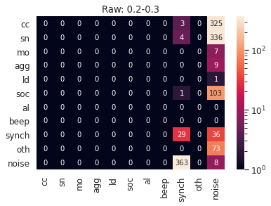


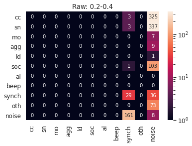


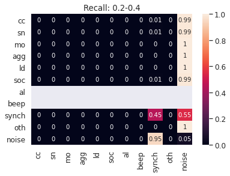


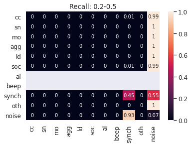


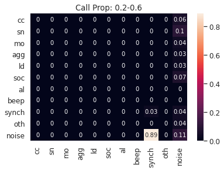


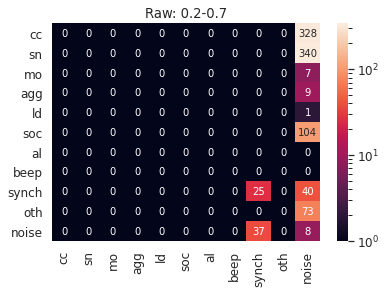


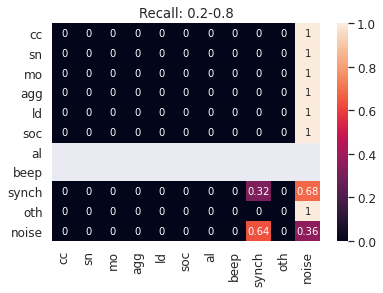


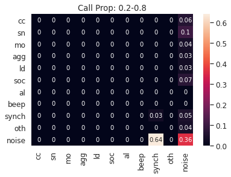


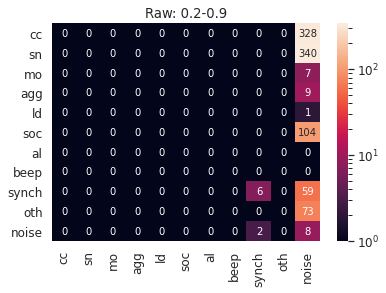


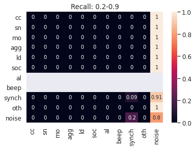


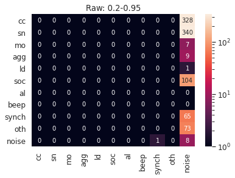


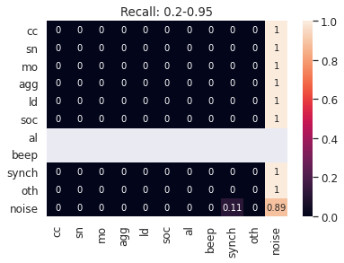


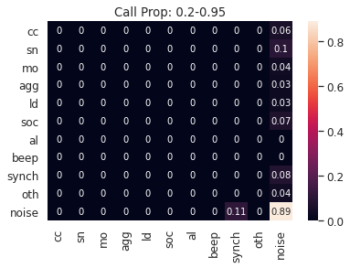


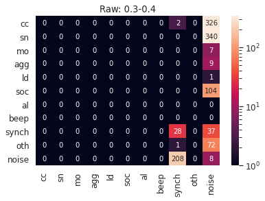


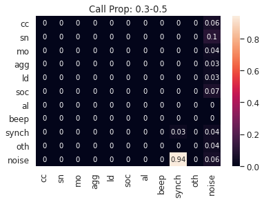


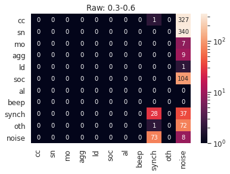


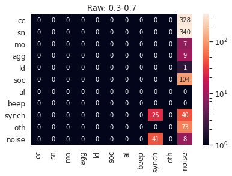


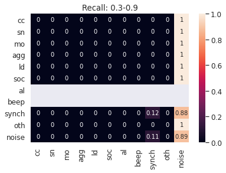


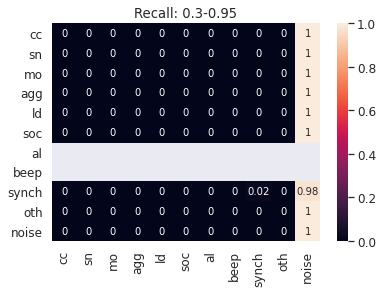


```python

```
